# Create the Object Storage and ADW Data Assets

## Introduction

Learn how to create **Data assets** for your source and target data sources used in _Create an OCI Data Integration Workspace_. You will be using **Object Storage** as the source and **Autonomous Data Warehouse** as the target. Data assets can be databases, flat files, and so on.

**Estimated Time**: 25 minutes

### Objectives
* Copy the Workspace OCID for further use in policies
* Create policies for ADW and Object Storage
* Copy the Tenancy OCID for further use to create Object Storage data asset
* Create Object Storage data asset
* Create Autonomous Data Warehouse data asset

## Task 1: Get the Workspace OCID

1. In the Oracle Cloud Infrastructure Console navigation menu, navigate to **Analytics & AI**. Under Big Data, click **Data Integration**.

  

2. From the **Workspaces** page, make sure that you are in the compartment for data integration (`DI-compartment`). The Workspace you created in _Create an OCI Data Integration Workspace_ should be displayed (`DI-workspace`).

  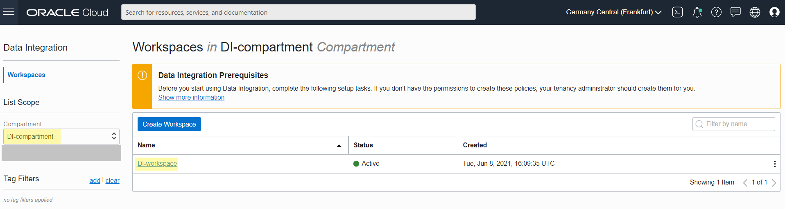

3. Click the **Actions menu** (the three dots) for your Data Integration workspace and then select **Copy OCID**.

  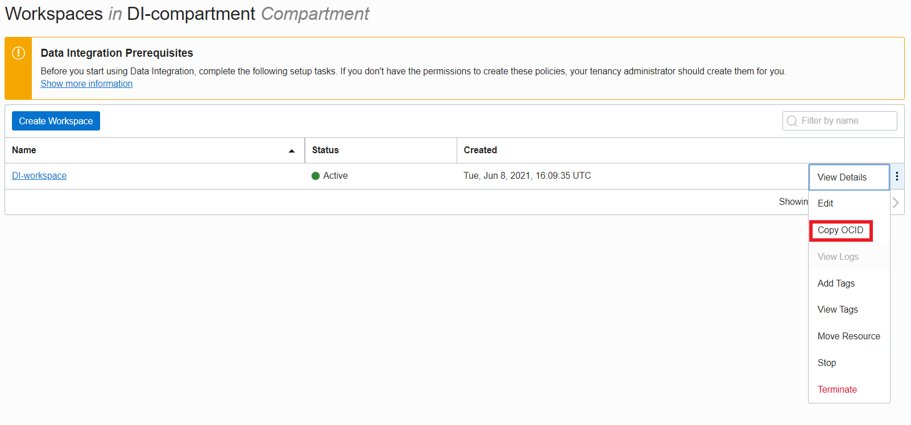

4. A notification saying `Workspace OCID copied` should be displayed at the top right of your screen. Paste your workspace OCID in a notepad, you will need it for later use in policies, as described in the next step.

  

## Task 2: Create policies for ADW and Object Storage

Data Integration needs specific permissions to **Oracle Object Storage** to access metadata, and read and write data. Also working with **Autonomous Databases** in Data Integration uses Object Storage. You must create all the required Object Storage **policies** and an additional one. This step will guide you through the necessary policy statements that you need to add in order to perform the data integration tasks in this workshop.

1. In the Oracle Cloud Infrastructure Console navigation menu, navigate to **Identity & Security**, and then select **Policies** under Identity section.

  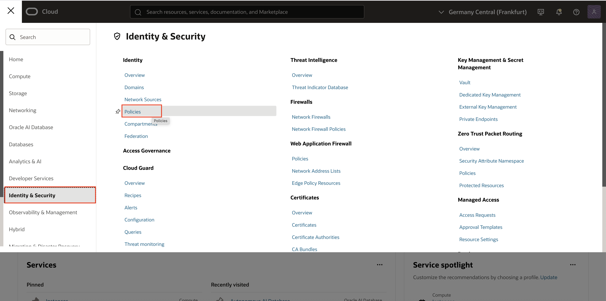

2. Make sure that you are in your compartment for data integration (`DI-compartment`). In the list of policies, click on the **Policies-OCI-DI** that you created in _Create an OCI Data Integration Workspace_. You will add here the necessary policies for the Object Storage connection from OCI Data Integration.

  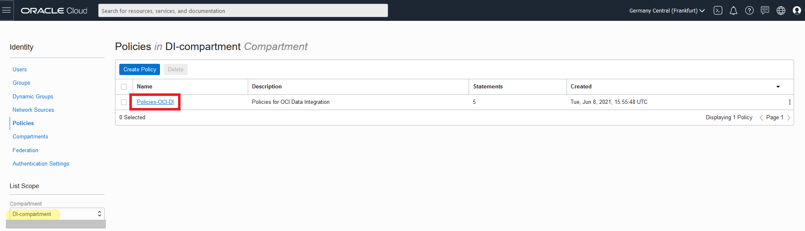

3. Your policy details will be displayed. Click on **Edit Policy Statements**.

  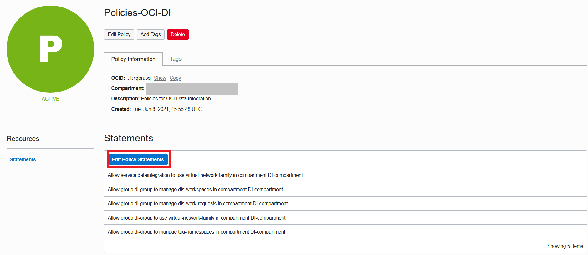

4. The **Edit Policy Statements** screen is displayed and you can see your current policy statements. Check **Advanced** for Policy Builder.

  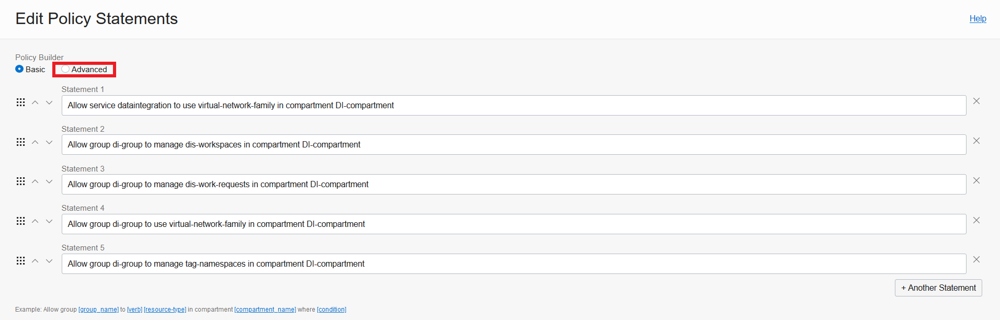

5. You will add the necessary policy statements to **enable access to Oracle Object Storage** and **to use Autonomous Data Warehouse** as target for _Create an OCI Data Integration Workspace_. In this workshop, the Data Integration workspace and Object Storage data asset belong to the same tenancy so the following statements are needed. Copy the following statements and paste them in the **Policy Builder** box, each statement as a new line:

    - For **Object Storage**:

    ```
    <copy>Allow group <group-name> to use object-family in compartment <compartment-name></copy>
    ```

    ```
    <copy>Allow any-user to use buckets in compartment <compartment-name> where ALL {request.principal.type = 'disworkspace', request.principal.id = '<workspace-ocid>'}</copy>
    ```

    ```
    <copy>Allow any-user to manage objects in compartment <compartment-name> where ALL {request.principal.type = 'disworkspace', request.principal.id = '<workspace-ocid>'}</copy>
    ```

    - For **Autonomous Data Warehouse**:

    ```
    <copy>Allow any-user to manage buckets in compartment <compartment-name> where ALL {request.principal.type = 'disworkspace', request.principal.id = '<workspace-ocid>', request.permission = 'PAR_MANAGE'}</copy>
    ```

  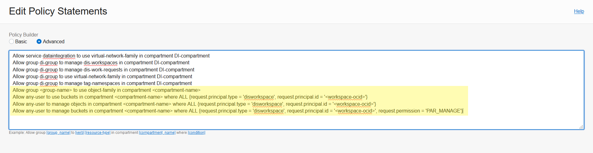

6. **Replace** in the new policy statements:

    - **"compartment-name"** with the name of your data integration Compartment (`DI-compartment)`.
    - **"group-name"** with the name of the OCI group that your user belongs to (`di-group`).
    - **"workspace-ocid"** with the workspace OCID you copied in _Get the Workspace OCID_.

  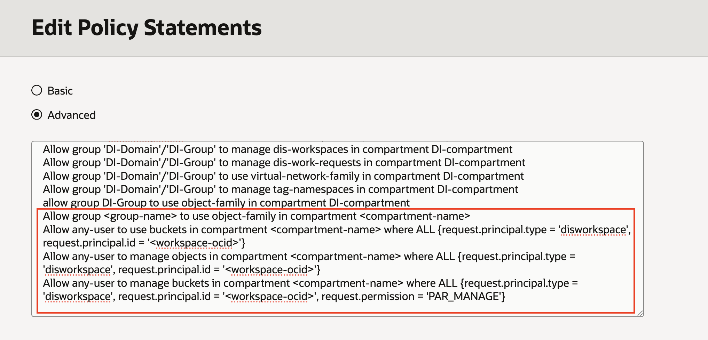

7. Click **Save Changes**.

  

8. You can now see the list with all the **policy statements** you have defined.

  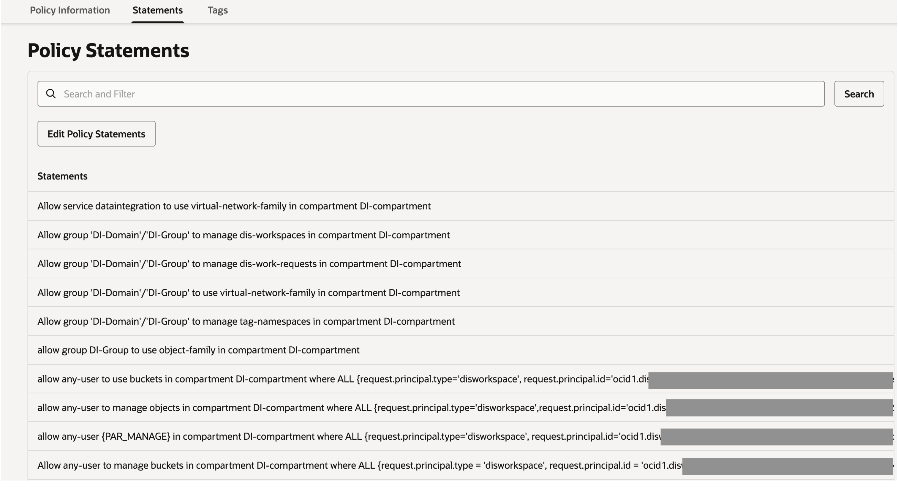

## Task 3: Get the Tenancy OCID

Most types of Oracle Cloud Infrastructure resources have an Oracle-assigned unique ID called an Oracle Cloud Identifier (OCID). To create the Oracle Object Storage Data Asset in OCI Data Integration, you will need the **OCID for you tenancy**, which you will get from the OCI Console.

1. In the Oracle Cloud Infrastructure Console, open the **Profile** menu and click **Tenancy:**`<your_tenancy_name>`.

  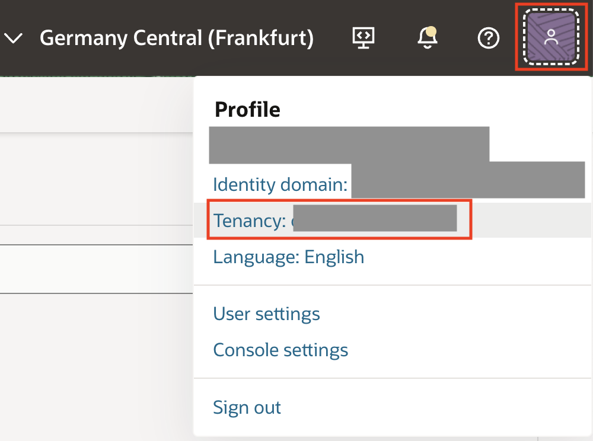

2. The tenancy OCID is shown under **Tenancy Information**. Click **Copy** to copy it to your clipboard.

  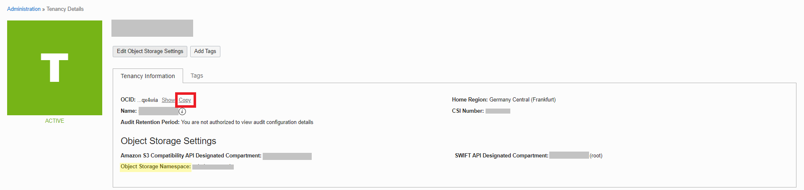

3. Paste your tenancy OCID to a local notepad, you will need it for the next step to create the Object Storage data asset in OCI Data Integration.

## Task 4: Create Object Storage data asset

In this workshop, **Oracle Object Storage** serves as the **source data asset** for our data integration tasks. In this step you will create the Object Storage data asset in the Data integration workspace.

1. In the Oracle Cloud Infrastructure Console navigation menu, navigate to **Analytics & AI**. Under Data Lake, click **Data Integration**.

  

2. From the Workspaces page, make sure that you are in the compartment you created for data integration (`DI-compartment`). Click on your **Workspace** (`DI-workspace`).

  

3. On your workspace Home page, click **Create Data Asset** from the **Quick Actions tile**.

  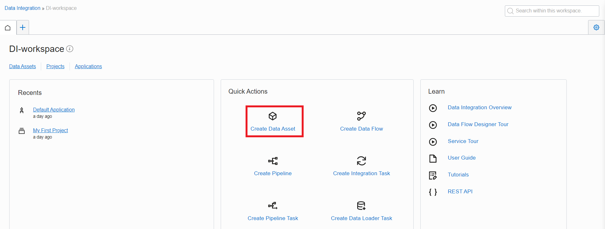

4. The Create Data Asset dialog box appears. Fill in the following:

    - **Name**: `Object_Storage`.
    - **Description**: you can optionally enter a description about your data asset.
    - From the **Type** dropdown, select `Oracle Object Storage`.
    - For **URL**, enter the URL for your Oracle Object Storage resource in the following format:

    ```
    <copy>https://objectstorage.<region-identifier>.oraclecloud.com</copy>
    ```

   *Note*: Replace the **"region-identifier"** with the one corresponding to the region where your Object Storage bucket is located. You can find the list of region identifiers at the following [link](https://docs.oracle.com/en-us/iaas/Content/General/Concepts/regions.htm). For example, if you have your Object Storage in Frankfurt region, use `https://objectstorage.eu-frankfurt-1.oraclecloud.com`

    - For **Tenant OCID**, paste the one you copied in _Get the Tenancy OCID_.
    - For **Namespace**, the value should be auto-populated after completing the preceding step.

   *Note*: If the values do not get auto-populated, enter the namespace for the Object Storage bucket that you can find as in the picture from step 3.2 of this lab, section highlighted in yellow.

    - Under **Default Connection** Information, you can optionally enter a name and description for the connection or leave the default one.

  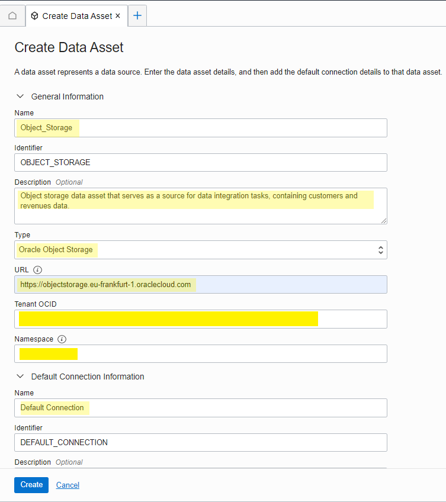

5. After you complete all the required fields, you can click on **Test Connection** to ensure you've entered the data asset details correctly.
A success or failure message displays, indicating whether the test was successful or not. If the test fails, review your connection settings and try again.

  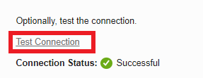

6. Click **Create**.

  


## Task 5: Create Autonomous Data Warehouse data asset

1. In the Oracle Cloud Infrastructure Console navigation menu, navigate to **Analytics & AI**. Under Data Lake, click **Data Integration**.

  

2. From the Workspaces page, make sure that you are in the compartment for data integration (`DI-compartment`). Click on your **Workspace** (`DI-workspace`).

  

3. From the workspace home landing page, click **Data Assets**.

  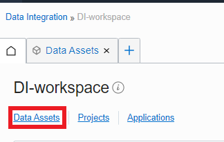

4. You can see your current existing Data Assets, more specifically the Object Storage. To create a new Data Asset for ADW, click on **Create Data Asset**.

  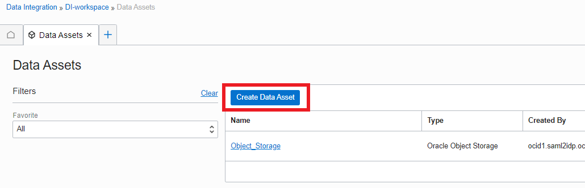

5. On the **Create Data Asset** page, for **General Information**, set the following:

    - **Name**: `Data_Warehouse`.
    - **Identifier**: Auto-generated based on the value you enter for Name.
    - **Description**: It is optional to give a description for your data asset.
    - **Type**: Oracle Autonomous Data Warehouse.
    - Choose the **Upload Wallet** option to provide the login credentials for the ADW
    - **Wallet File**: Drag and drop or browse to select your wallet file. See the process to download the wallet in _Provision an Autonomous Data Warehouse and download Wallet_ under _Setting up the Data Integration prerequisites in OCI_.
    - Enter your **wallet password**.
    - **Service Name**: Choose the **low** service of Autonomous Data Warehouse.
   *Note*: For more information on predefined Database Service Names for Autonomous Data Warehouse, please see the following [link](https://docs.oracle.com/en/cloud/paas/autonomous-data-warehouse-cloud/cswgs/autonomous-connect-database-service-names.html#GUID-9747539B-FD46-44F1-8FF8-F5AC650F15BE).

   

6. In the **Connection** section, enter the following:
    - **Name**: `BETA connection`
    - **Description**: Optional (For example, `Connect with BETA user`)
    - **User Name**: `BETA`
    - **Password**: The password you added for BETA user in _Setting up the Data Integration prerequisites in OCI_.

  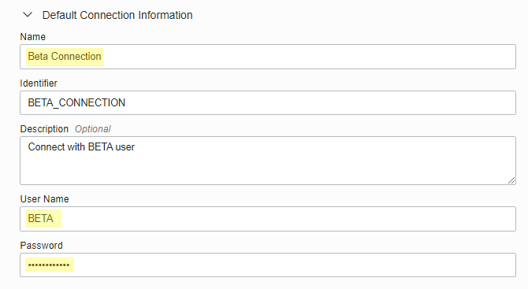

7. After you complete all the required fields, you can click **Test Connection** to ensure you've entered the data asset details correctly.
A success or failure message displays, indicating whether the test was successful or not. If the test fails, review your connection settings and try again.

  

8. Click **Create**.

  

   **Congratulations!**  Now you have created the Data Assets for Autonomous Data Warehouse and Object Storage, in OCI Data Integration.

## Learn More

* [Data Assets in OCI Data Integration](https://docs.oracle.com/en-us/iaas/data-integration/using/data-assets.htm)


## Acknowledgements

* **Author** - Theodora Cristea
* **Contributors** -  Aditya Duvuri, Rohit Saha
* **Last Updated By/Date** - Theodora Cristea, July 2021
