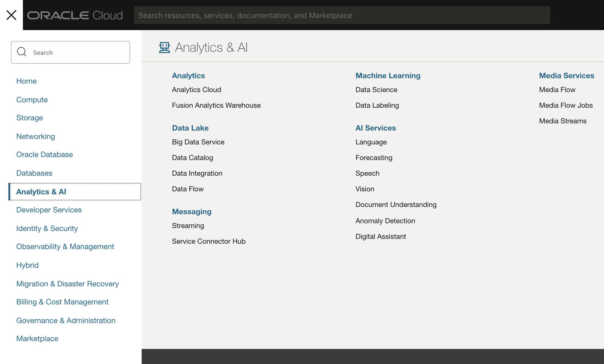
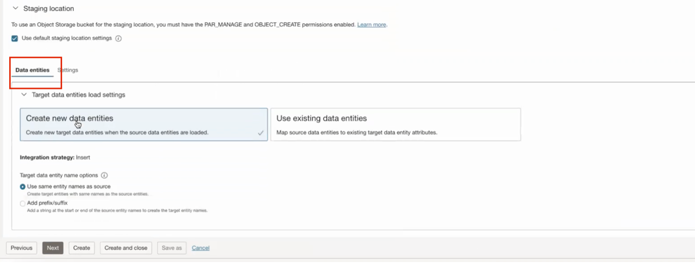

# Create a Data Loader task

## Introduction

Learn how to create a **Data Loader task** in OCI Data Integration. The use-case for each of these data integration tasks is detailed in the associated workshop task.

**Estimated Time**: 30 minutes

### Objectives
* Create an OCI Data Integration project
* Create a Data Loader task

## Task 1: Create an OCI Data Integration project

In OCI Data Integration, a **project** is the container for design-time resources, such as tasks or data flows and pipelines.

1. In the OCI Console navigation menu, navigate to **Analytics & AI**. Under Data Lake, click **Data Integration**.

  

2. From the Workspaces page, make sure that you are in the compartment for data integration (`DI-compartment`). Click on your **Workspace** (`DI-workspace`).

  

3. On your workspace home page, click **Open tab** (plus icon) in the tab bar and then select **Projects**.

  

4. On the Projects page, click **Create Project** and in the sub menu select **Create new**.

  

5. On the Create Project page, enter `DI_WorkshopNN` (replace NN with your user number ie. DI_Workshop01) for **Name** and an optional **Description**, and then click **Create**.

  

6. You are now in the **Project Details** page for `DI_WorkshopNN` project. You can create dataflows, pipelines and tasks from the project, we will create a data loader task from the home page on the next step.

  

## Task 2: Create a Data Loader task

A **Data Loader task** helps you load diverse data set into data lakes, data marts, and data warehouses. A data loader task takes a source data entity, applies transformations (optional), and then loads the transformed data into a new target data entity, or updates an existing data entity. A data loader task supports transformations at the metadata and data levels.

In this step of the Workshop, you will create a Data Loader task that will load Orders data from many **REVENUE csv** source files. You will then fill up the null values for the Source Order Number and rename the Order Time zone field, and finally load data to **REVENUE_TARGET** table in Autonomous Data Warehouse. The Data Loader task will also create the target table on the Autonomous Data Warehouse.

1. From your home screen of OCI-DI, click on Create data loader task on Quick actions.

  

2. On the Create data loader task screen you will select multiple categories of source types that we support on OCI-DI. Go ahead and select File Storage since we will us Object Storage as our use case.

  

3. Similarly, select Database as the target type as we will use ADW as a target in this example.
4. Data Loader Task allows users to choose different load types, the first one is multiple data entities i.e. at one go we can migrate data in bulk; alternatively, users can also select single entity depending on their requirements. Here, you will select Multiple data entities as load type.
5. Next, we can specify the name and Identifier of the task that we want to keep, let’s rename our task to Load Revenue Data into Data Warehouse
6. Then we are going to select the Project or folder where we want to save our task. After clicking on select, type in your Project name which you created earlier and select that folder. For example, it should be DI_ProjectXX where XX will be your user ID.

  

7. You will click on Next and in this panel, we will specify the different configurations i.e., required to select the source data.
8. Now, in the panel select the following:
a. Data Asset: Object_Storage.
b. Connection: Default Connection.
c. Compartment: DI-compartment (the Compartment in which you have the bucket where the REVENUE.CSV file resides).
d. Bucket: DI-bucket (the Object Storage bucket where REVENUE.CSV file resides).
e. We can easily parameterize everything by clicking on Parameterize option. Later we will see how we can reuse the same flow for different sources and targets during run time.

  

f. File Type: Set to CSV and select the Compression type set to the default value.
g. Since the csv file has a header, we will check Data has header option mentioned just below the Compression type.
h. Let’s keep the other things as default until we go down and select our entities in the Data entities section.

  

i. Now we will select multiple files that we want to use as a source using a pattern. In the search box type in \*/\*/REVENUE*.csv and press enter. Click on Add to source button.

  

j. We can even add this pattern as a group by selecting Add as a group using a file pattern as shown in the image. We can also specify the group name and click on **Add** button. This will add all the input files in the group which you will use as a source for our data loader task. You can also click on the group name once it’s added to see the list of entities that you are going to use it as a source.

  

  

k. Now click on Next button.

9. Here, we are going to select the configurations for the target data type for the data loader task. Now, select the following:
a. Data Asset: Data_Warehouse
b. Connection: Beta Connection
c. Schema: BETA
d. We can easily parameterize everything by clicking on Parameterize option. Later we will see how we can reuse the same flow for different sources and targets during run time.
e. Ensure the “Use default staging location settings.” is selected.

  

f. In the Data Entities tab:
i. Click on Create new data entities.
ii. Select Integration Strategy as Insert
iii. Select same entity names as source for our example.

  

10. Click on Next and click on the Data tab.

  

11. Here, we are going to apply two powerful and yet, simple transformations:
a. NULL FILLUP transformation
b. RENAME transformation.

12. Once, the data is loaded then we scroll to the right until we see the src_order_number column.

13. Click on the three dots (“hamburger”) right next to the column name and select Null fill up.

  

14. A new Null fill up transformation box will appear where you will type “Not available” in the Replace by text box and keep the remaining things as is.

  

  

15. Next, we move further towards right until we see the order_dtime2_timezone column and we again click on the three dots (“hamburger”) right next to the column name but this time we select Rename.

  

16. Enter the new name as Order_timezone in the Name text box.

  

  

  

17. Click on Next and click on Save.

18. Then we will go back to our DI_WorkspaceXX (where XX will be your user ID) and click on Tasks tab.

19. Here, we are going to see the task that we saved.

   **Congratulations!**  You created the Data Loader task.

## Learn More

* [Data Flow in OCI Data Integration](https://docs.oracle.com/en-us/iaas/data-integration/using/data-flows.htm)
* [Integration Task in OCI Data Integration](https://docs.oracle.com/en-us/iaas/data-integration/using/integration-tasks.htm)
* [Data Loader Task in OCI Data Integration](https://docs.oracle.com/en-us/iaas/data-integration/using/data-loader-tasks.htm)
* [SQL Task in OCI Data Integration](https://docs.oracle.com/en-us/iaas/data-integration/using/sql-tasks.htm)

## Acknowledgements

* **Contributors** -  Theodora Cristea, Priyesh Lakar
* **Last Updated By/Date** - David Allan, June 2023
