# Create a Data Loader task, two Data Flows, Integration tasks and a SQL task

## Introduction

Learn how to create a **Data Loader task**, **two Data Flows** along with **Integration tasks** and a **SQL task** in OCI Data Integration. The use-case for each of these data integration tasks is detailed in the associated workshop task.

**Estimated Time**: 30 minutes

### Objectives
* Create an OCI Data Integration project
* Create a Data Loader task
* Create two Data Flows
* Create Integration tasks
* Create a SQL task

## Task 1: Create an OCI Data Integration project

In Oracle Cloud Infrastructure Data Integration, a **project** is the container for design-time resources, such as tasks or data flows and pipelines.

1. In the Oracle Cloud Infrastructure Console navigation menu, navigate to **Analytics & AI**. Under Data Lake, click **Data Integration**.

  

2. From the Workspaces page, make sure that you are in the compartment for data integration (`DI-compartment`). Click on your **Workspace** (`DI-workspace`).

   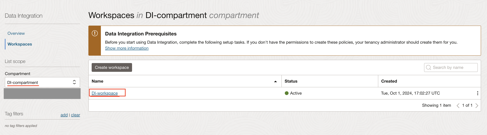

3. On your workspace home page, click **Open tab** (plus icon) in the tab bar and then select **Projects**.

   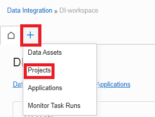

4. On the Projects page, click **Create Project**.

   

5. On the Create Project page, enter `DI_WorkshopNN` (replace NN with your user number ie. DI_Workshop01) for **Name** and an optional **Description**, and then click **Create**.

   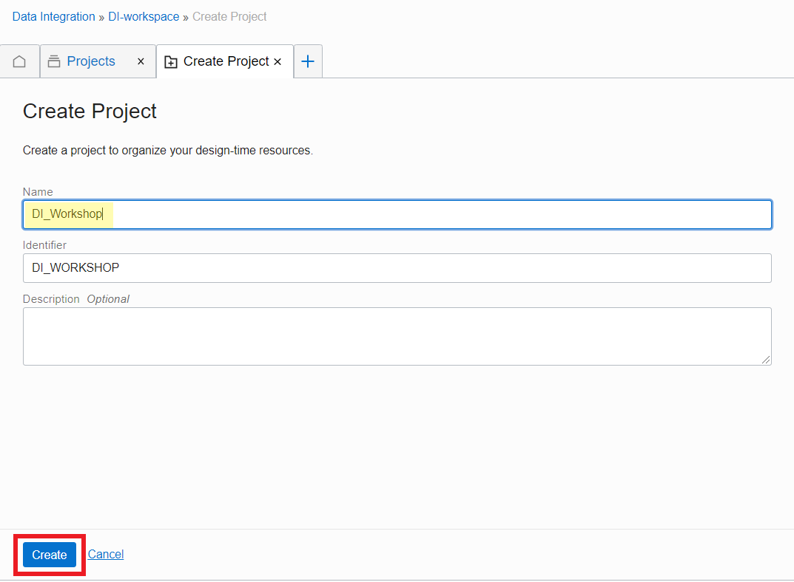

6. You are now in the **Project Details** page for `DI_WorkshopNN` project.

   


## Task 2: Create a Data Loader task

A **Data Loader task** helps you load diverse data set into data lakes, data marts, and data warehouses. A data loader task takes a source data entity, applies transformations (optional), and then loads the transformed data into a new target data entity, or updates an existing data entity. A data loader task supports transformations at the metadata and data levels.

In this step of the Workshop, you will create a Data Loader task that will load Orders data from **REVENUE.csv** source file. You will then fill up the null values for the Source Order Number and rename the Order Time zone field, and finally load data to **REVENUE_TARGET** table in Autonomous Data Warehouse. The Data Loader task will also create the target table on the Autonomous Data Warehouse.

1. From your Workspace home page of OCI Data Integration, click **Open tab** (plus icon), and then select **Projects**.

  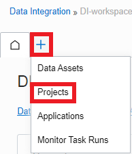

2. On the **Projects** page, select the project you have been working on for this workshop, `DI_WorkshopNN`.

  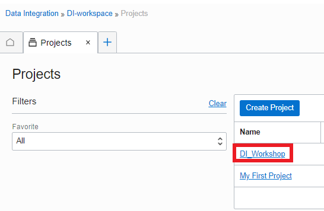

3. On the `DI_WorkshopNN` **Project Details** page, from the submenu, click **Tasks**.

  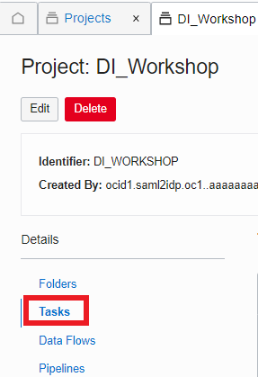

4. Click **Create Task**, and then select **Data Loader**.

  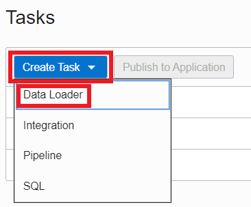

5. On the **Create Data Loader Task** page that pops up, for **Name**, enter `Load Revenue Data into Data Warehouse`.

  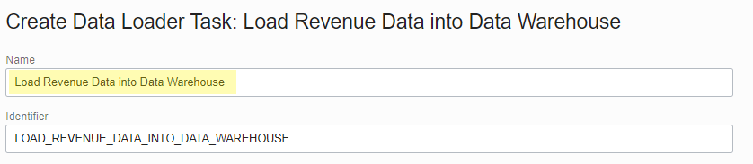

6. In the **Source** section, click **Select**.

  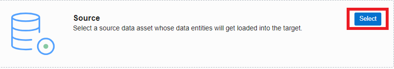

7. In the **Select Source** page that pops up, select the following values:

    - **Data Asset**: `Object_Storage`.
    - **Connection**: `Default Connection`.
    - **Compartment**: `DI-compartment` (the Compartment in which you have the bucket where you uploaded your REVENUE.CSV file in _Setting up the Data Integration prerequisites in OCI_).
    - **Schema**: `DI-bucket` (the Object Storage bucket where you uploaded your REVENUE.CSV file in _Setting up the Data Integration prerequisites in OCI_).
    - **Data Entity**: Click `Browse by Name` and then select **REVENUE.csv**.
    - **File Type**: Set to **CSV**. Then leave the default settings as-is in all the remaining fields.
    - Click **Select**.

    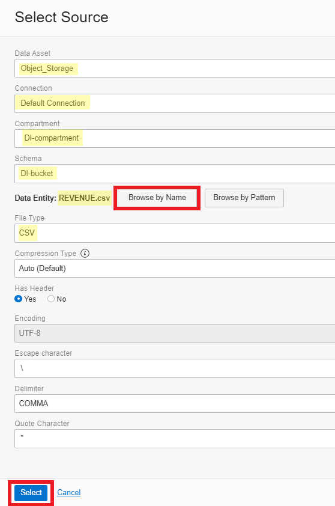

8. In the **Configure Transformations** section, click **Configure**.

  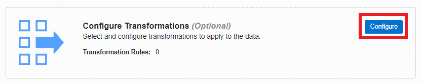

9. The Configure Transformations panel opens, showing the metadata information of the data entity and its attributes. You can also view sample data in the **Data** tab.

  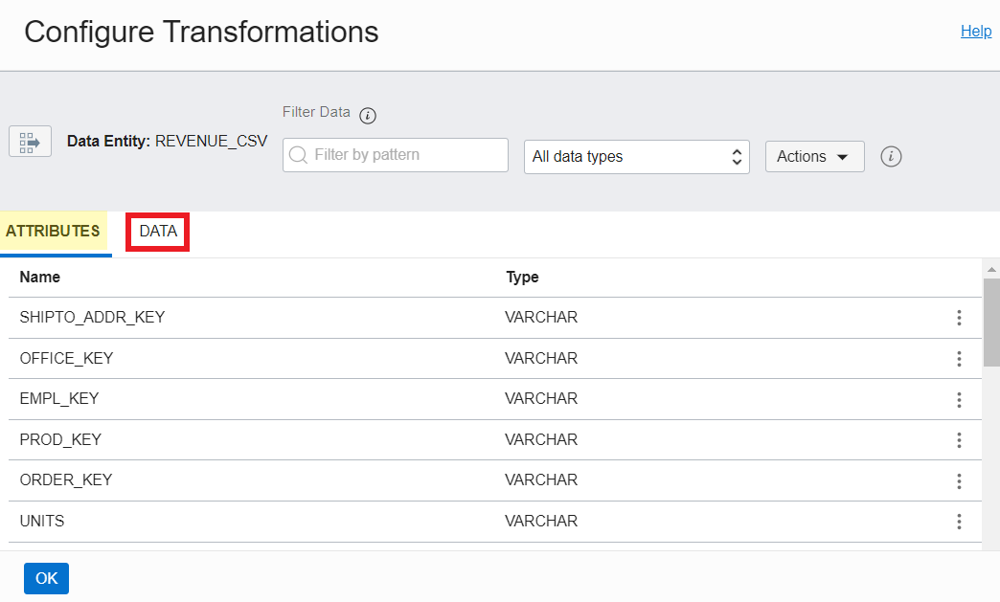

10. Click **Data** to navigate to the Data tab, then locate and select **SRC\_ORDER\_NUMBER**.
A panel displays, showing the **Data Profile** and the **Attribute Profile** for SRC\_ORDER\_NUMBER. Null Data Percent for SRC\_ORDER\_NUMBER is at 100%.

  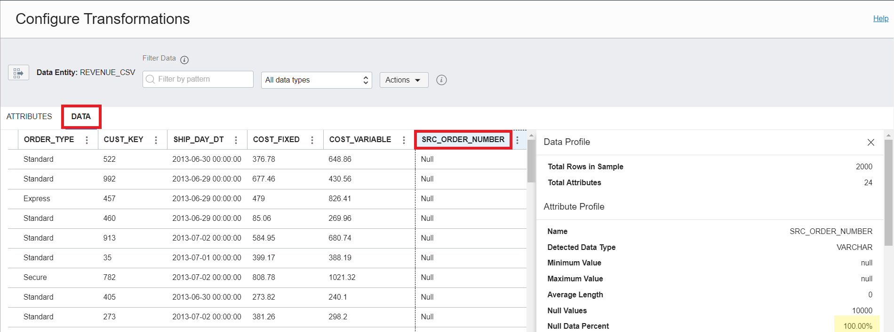

11. From the **transformations icon** (three dots) for SRC\_ORDER\_NUMBER, select **Null Fill Up**.

  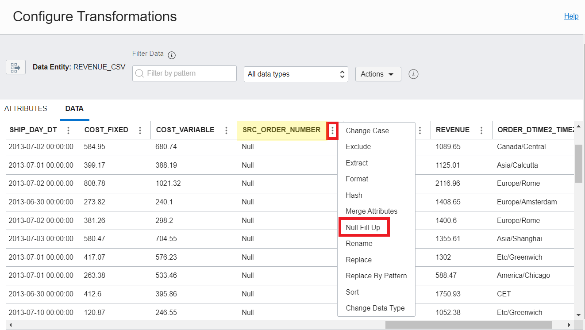

12. In the **Null Fill Up dialog**, do the following:

    - Enter `Not Available` in the **Replace by String** field.
    - Do **not** select Keep Source Attributes.
    - Leave the **Name** and **Data Type** as-is.
    - Click **Apply**.

    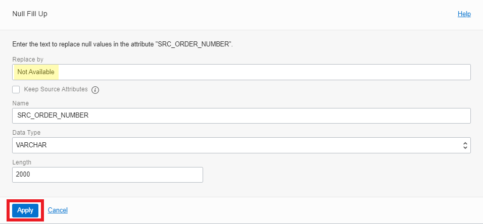

13. After the **Data** tab refreshes, use the horizontal scrollbar to scroll to the end of the dataset where the updated **SRC\_ORDER\_NUMBER** column is. Notice the values for SRC\_ORDER\_NUMBER have been replaced by the `Not Available` string.

  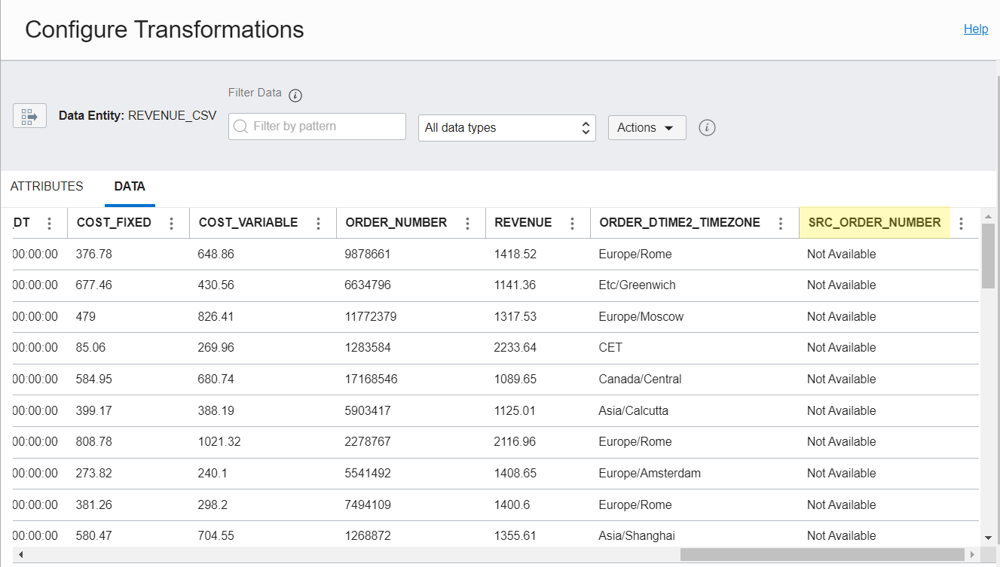

14. In the Data tab, look for attribute **ORDER\_DTIME2\_TIMEZONE** by scrolling to the right. Click on the **transformation icon** (three dots) for ORDER\_DTIME2\_TIMEZONE, and then select **Rename**.

  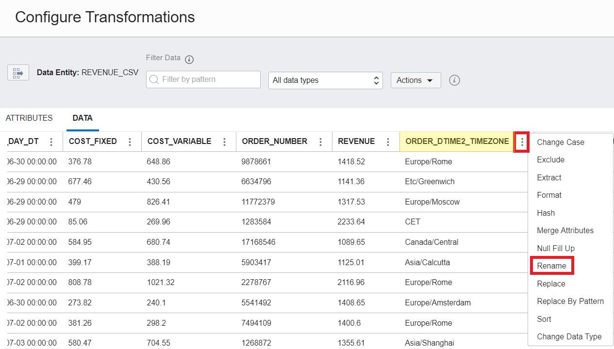

15. In the **Rename** dialog box, enter a new name for the attribute ORDER\_DTIME2\_TIMEZONE. For this workshop, enter **ORDER\_TIMEZONE** then click **Apply**.

  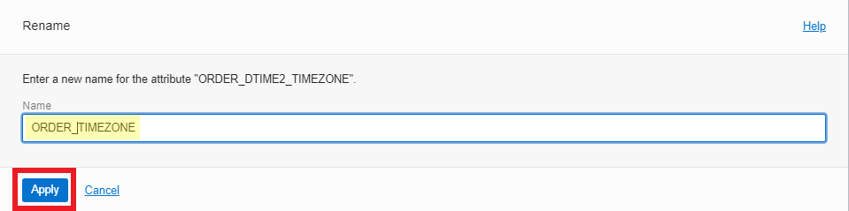

16. Click the **Transformations** icon next to the data entity name.

  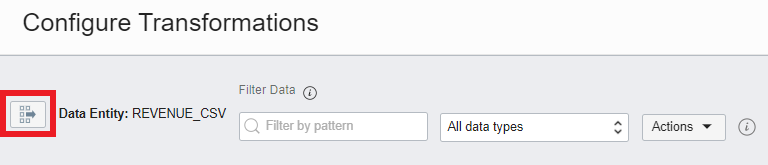

17. You can **review the list of transformations** that are applied to the source dataset. If you would want to remove a transformation, you could click the X icon next to a transformed attribute name. For now close the Configure Transformations panel, click **OK**.

  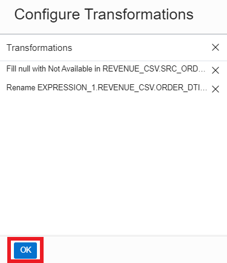

18. The number of transformation rules applied is shown in the **Configure Transformations** section.

  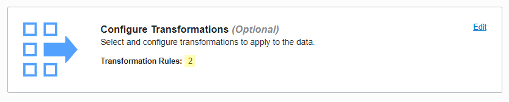

19. In the **Target section**, select the **Create New Entity** check box, and then click Select.

  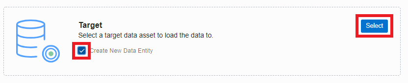

20. In the **Select Target** page, select the following values:

    - **Data Asset**: `Data_Warehouse`
    - **Connection**: `Beta Connection`
    - **Schema**: `BETA`
    - **Data Entity**: Enter `REVENUE_TARGET` for the new entity you're going to create
    - Under **Staging Location**, select the `Object_Storage` data asset
    - Select the `Default connection` for Object Storage
    - Select the `DI-compartment` name
    - Select the `DI-bucket`
    - Click **Select** to complete selecting the target.

    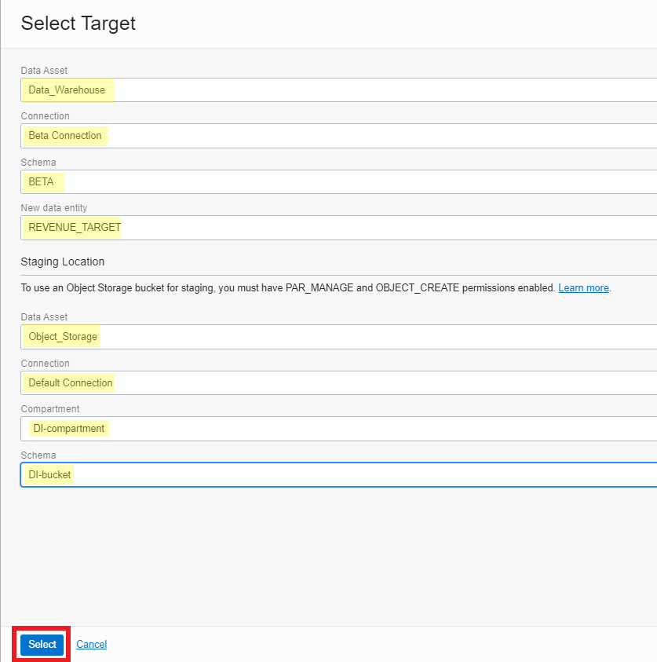

21. The Target section in the Data Loader Task now displays your selections for the target. Click **Save and Close**.

  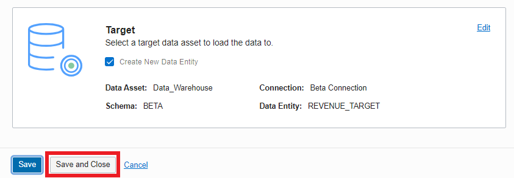

## Task 3: Create a Data Flow - 1

A **data flow** is a logical diagram representing the flow of data from source data assets, such as a database or flat file, to target data assets, such as a data lake or data warehouse.
The flow of data from source to target can undergo a series of transformations to aggregate, cleanse, and shape the data. Data engineers and ETL developers can then analyze or gather insights and use that data to make impactful business decisions.

You will create a data flow to ingest data from **two source files**, containing Customers (`CUSTOMERS.json`) and Orders (`REVENUE.csv`) information. The data from the files will go through a process of transformations and filtering based on the order status and country code of the customers, and in the end will be loaded to `CUSTOMERS_TARGET` table in Autonomous Data Warehouse.

1. From the **Project Details** page for `DI_WorkshopNN` project, click on **Data Flows** from the submenu.

  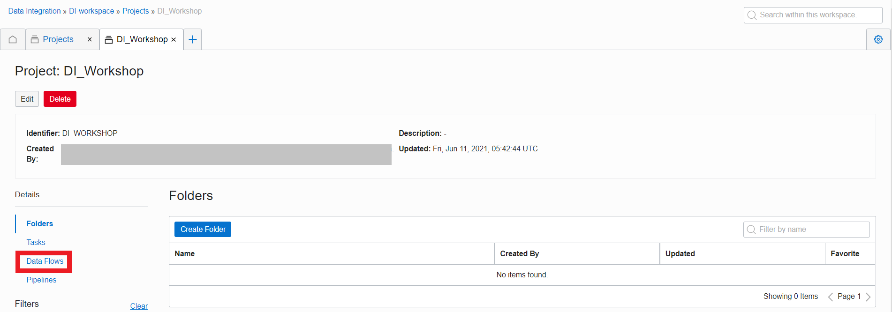

2. Click **Create Data Flow**.

  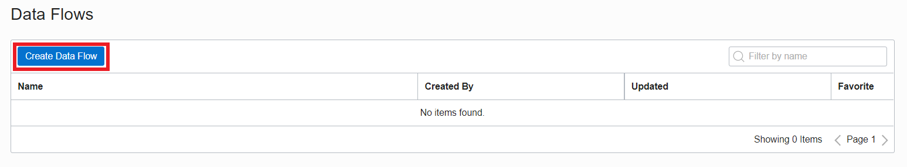

3. The data flow designer opens in a new tab. In the Properties panel, for **Name** enter `Load Customers and Revenue Data`, then click **Save**. *Note*: Be sure to save often during design time!

   On the left side of the canvas, you can find the data flow operators which represent input sources, output targets, and transformations that can be used. The Shaping Operators currently available are Filter, Join, Expression, Aggregate, Distinct, Sort, Union, Minus, Intersect, Split and Lookup Operator. From the Operators panel, you can drag and drop operators onto the canvas to design a data flow. Then use the Properties panel to configure the properties for each operator. For more details on Data Flow Operators, please see the following [link](https://docs.oracle.com/en-us/iaas/data-integration/using/using-operators.htm).

   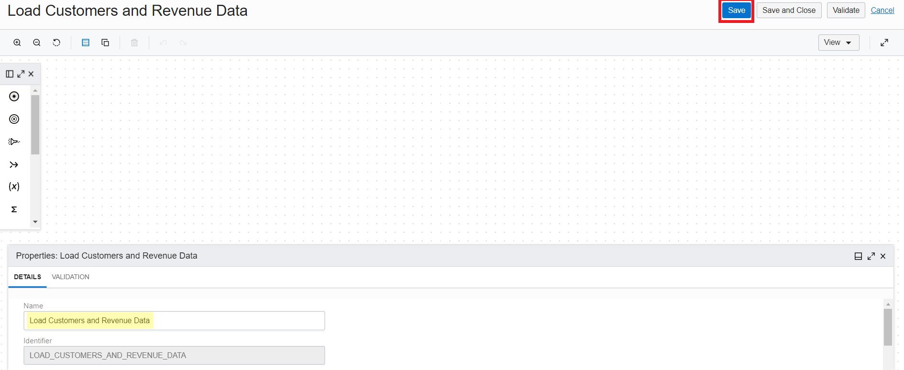

4. You will add the **Source operator**. You add source operators to identify the data entities to use for the data flow. From the Operators panel on the left, **drag and drop a Source operator** onto the canvas.

  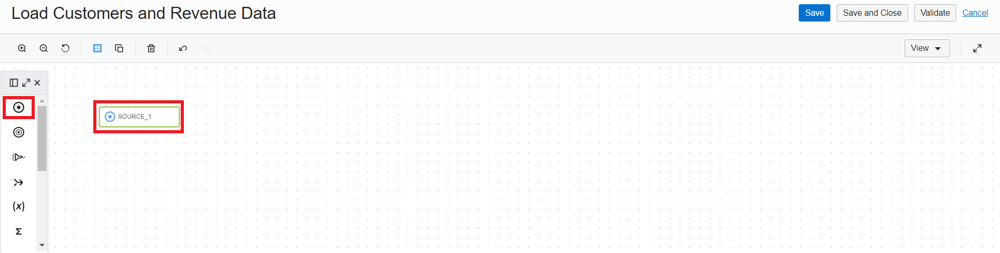

5. On the canvas, select **SOURCE_1 operator**. The Properties panel now displays the details for this operator.

  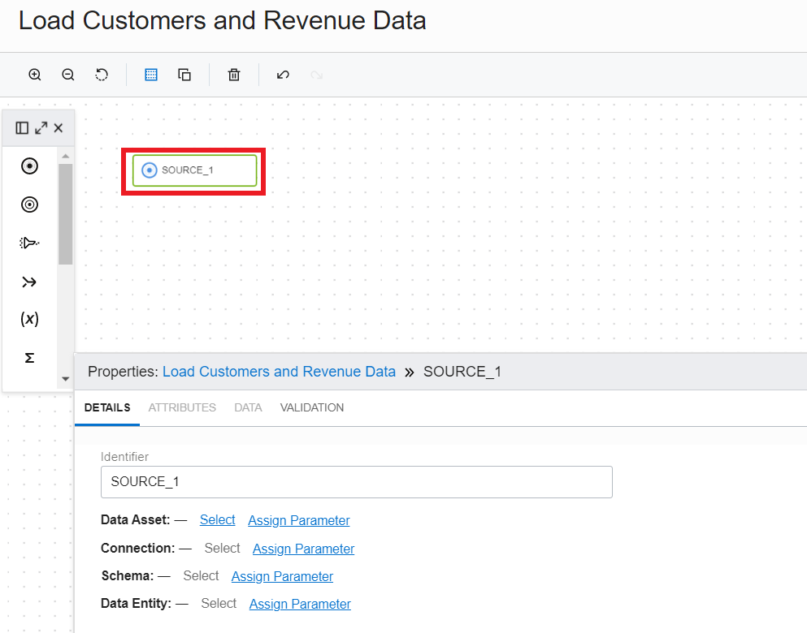

6. In the **Details** tab from Properties panel, click Select next to each of the following options to make your selections:

    - For **Data Asset**, select `Object_Storage`.
    - For **Connection**, select `Default Connection`.
    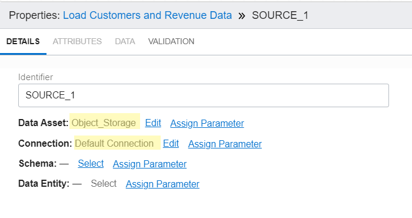
    - For **Schema**, select your **compartment** and then your **bucket**. For the purposes of this workshop, Object Storage serves as the source data asset, this is why you select your bucket here.
    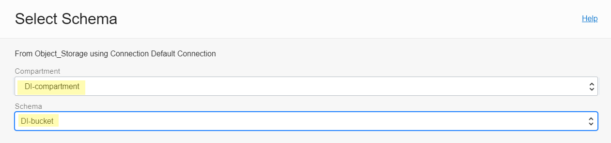
    - For **Data Entity**, click on **Browse by name**. Select `CUSTOMERS.json` and then choose **JSON** for the file type.
    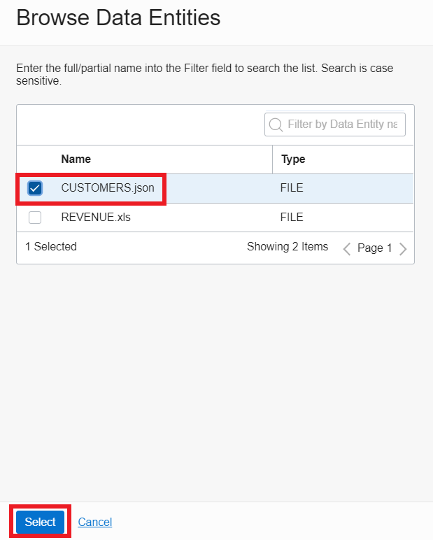
    

   In the end, the details for the source operator should look like this:

   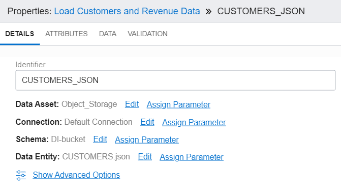

7. When you complete your selections for **SOURCE\_1**, the operator name becomes **CUSTOMERS\_JSON**, reflecting your data entity selection. In the Identifier field, rename the source operator to **CUSTOMERS**.

  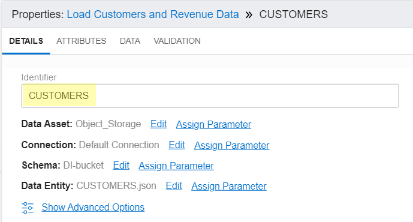

8. You will now drag and drop onto the data flow canvas another **source operator**.

  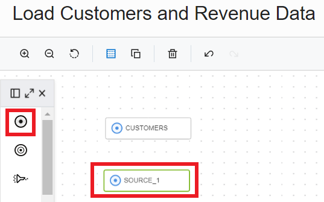

9.  On the canvas, select the **new source operator**. The Properties panel now displays the details for this operator.

  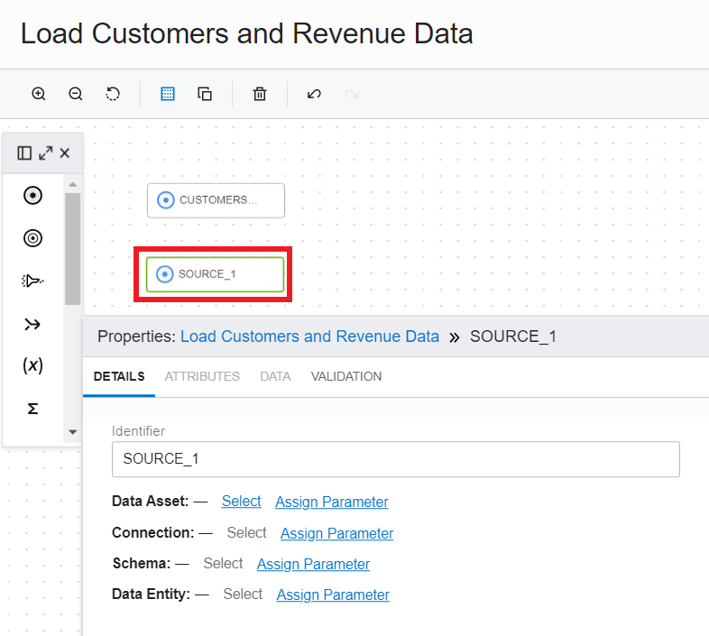

10. You will now fill in the details for this source, in **Properties** panel:

    - For **Data Asset**, select `Object_Storage`.
    - For **Connection**, select `Default Connection`.
    
    - For **Schema**, select your **compartment** and then your **bucket**. For the purposes of this workshop, Object Storage serves as the source data asset, this is why you select your bucket here.
    - For **Data Entity**, click on **Browse by name**. Select `REVENUE.csv` and then choose **CSV**  for the file type. Accept the default values for the remaining items.
    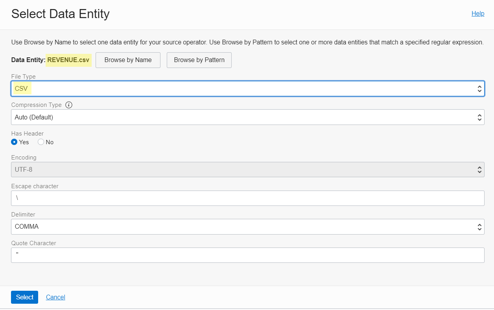

   In the end, your details for this new source operator should look like this:
   

11. When you complete your selections for **SOURCE\_1**, the operator name becomes **REVENUE\_CSV**, reflecting your data entity selection. In the Identifier field, rename the source operator to **REVENUE**.
   *Note*: Be sure to save often during design time!

   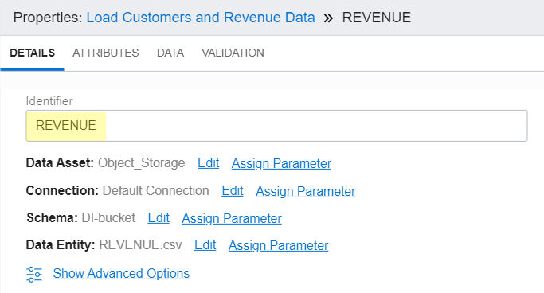

12. While you still have the **REVENUE** operator selected, click on **Attributes** tab in Properties panel.
In the Attributes tab, you can view the data entity's attributes and apply **exclude** or **rename** rules to the attributes from their respective **actions icon** (three dots). You can also use the **filter** icon on the Name or Type column to apply one or more filters on the attributes to be excluded.

  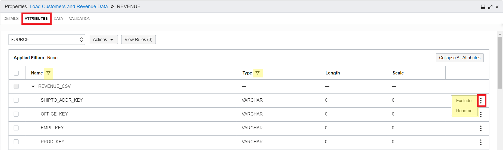

13. While you still have the **REVENUE** operator selected, click on **Data** tab in Properties panel. In the Data tab, you can view a sampling of data from the source data entity. Scroll to the right and click on field REVENUE_CSV.CURRENCY to view the **data profile**.

  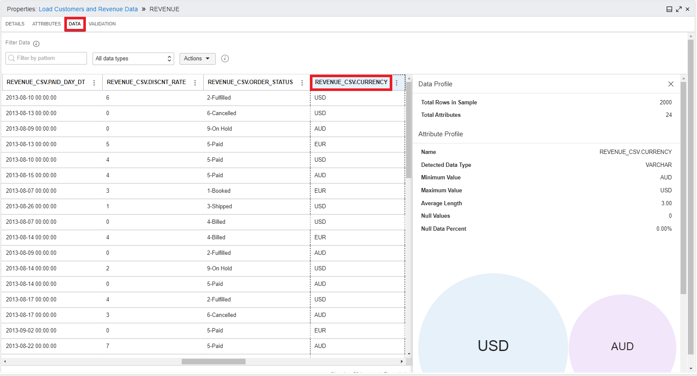

14. Click on the  **Validation** tab from the Properties bar. Here you can check for warnings or errors with the configuration of the source operators. The warning with the message "Complete your data flow by connecting the operators input and output ports. Remove any unused operators from the canvas." will appear, to warn us that the operators in the data flow should be connected to other operators, for the data to flow from one node to the other. Also, the data flow must include at least one source operator and one target operator to be valid.

  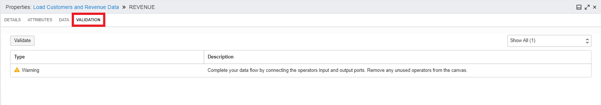

15. You will now **filter your source data**. The **Filter operator** produces a subset of data from an upstream operator based on a condition. From the Operators panel, drag and drop a Filter operator onto the canvas.

  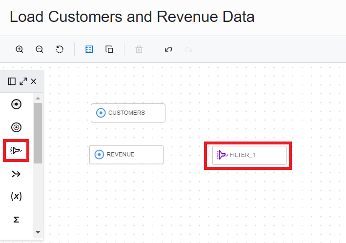

16. Connect **REVENUE** source operator to **FILTER_1** operator:
    - Place your cursor on REVENUE.
    - Click the connector circle at the side of REVENUE.
    
    - Drag and drop the connector to FILTER_1.
    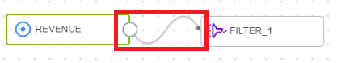

17. Click on **FILTER_1** on the Data Flow canvas.

  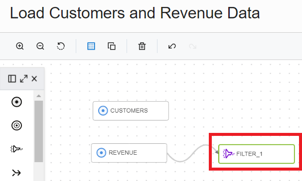

18. In the Properties panel of FILTER_1, click **Create** for **Filter Condition**.

  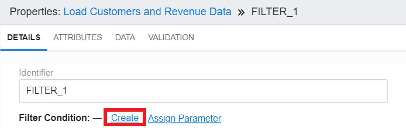

19. You will now add your **filter condition**:

    - In the Create Filter Condition panel, enter `STA` in the Incoming attributes search field.
    - Double-click or drag and drop **ORDER\_STATUS** to add it to the filter condition editor.
    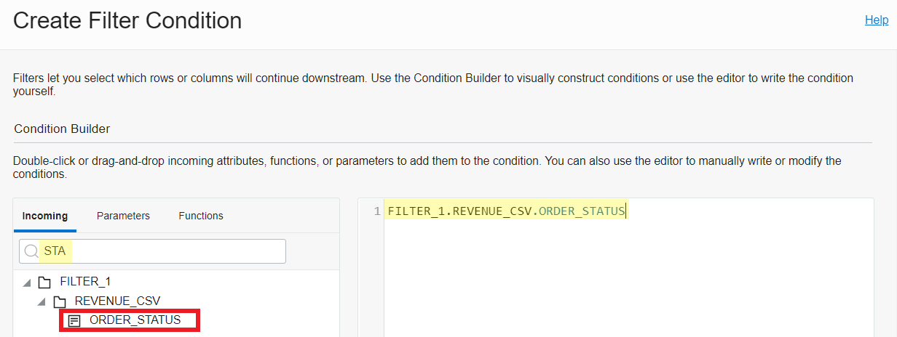
    - In the condition editor, enter `='1-Booked'`, so your condition looks like the following: `FILTER_1.REVENUE_CSV.ORDER_STATUS='1-Booked'`
    - Click **Create**.
    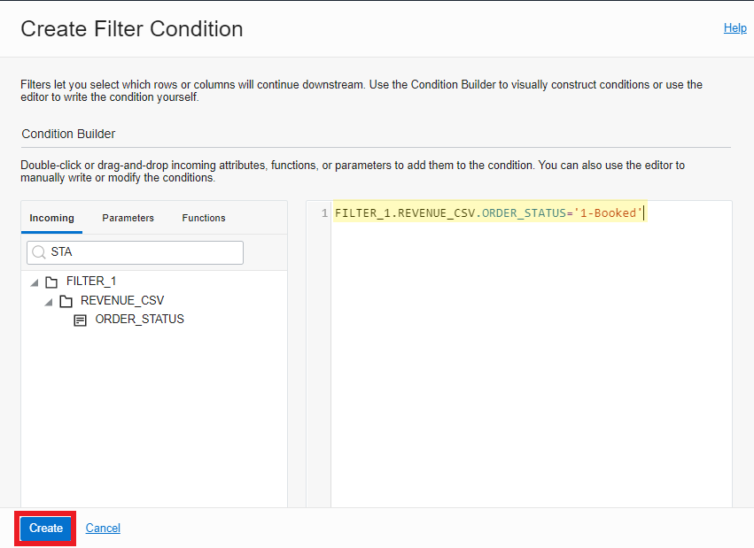

20. The details for **FILTER_1 operator** should now look like this: *Note*: Be sure to save often during design time!

  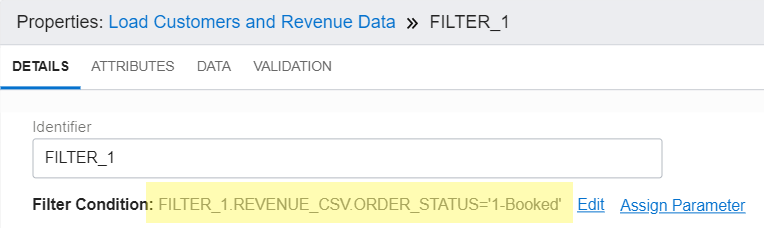

21. From the Operators panel, drag and drop a new **Filter operator** onto the canvas after CUSTOMERS. **Connect CUSTOMERS to FILTER_2**.

  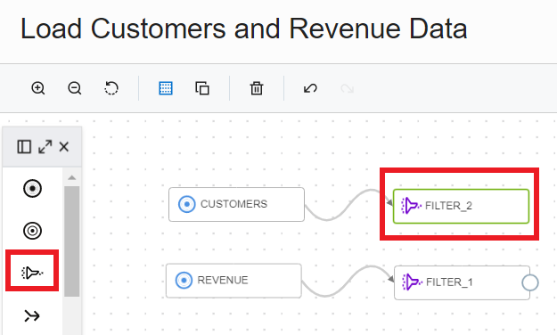

22. In the Properties panel of FILTER_2, click **Create** for **Filter Condition**.

  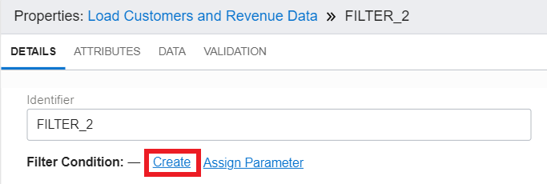

23. You will now add your **filter condition** for **FILTER_2**:

    - In the Create Filter Condition panel, enter `COU` in the Incoming attributes search field.
    - Double-click **COUNTRY_CODE** to add it to the Filter condition editor.
    - Enter `='US'`, so your condition looks like the following: `FILTER_2.CUSTOMERS_JSON.COUNTRY_CODE='US'`
    - Click **Create**.

    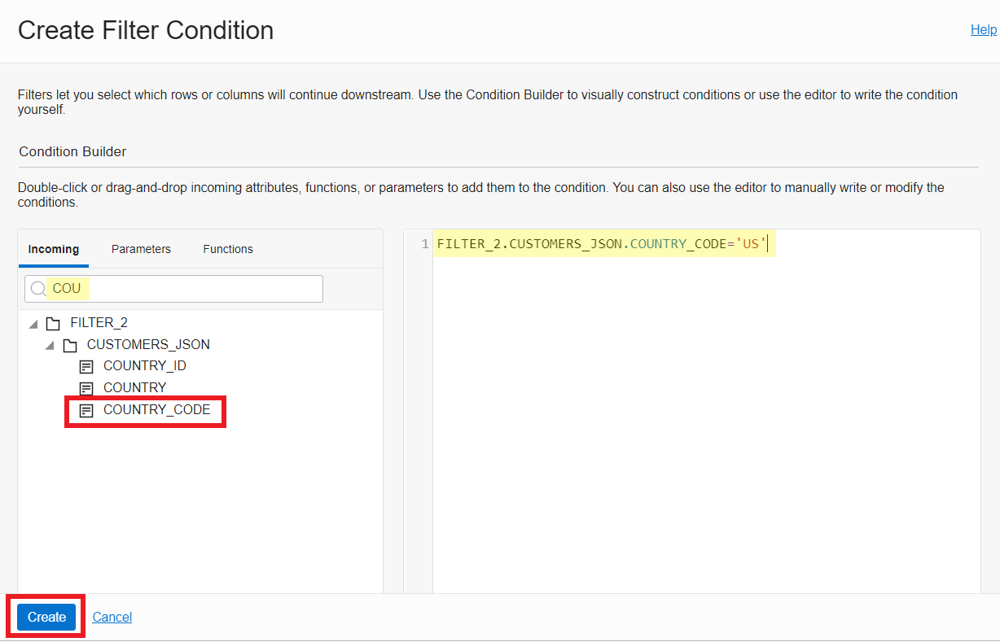

24. The details for **FILTER_2 operator** should now look like this:

  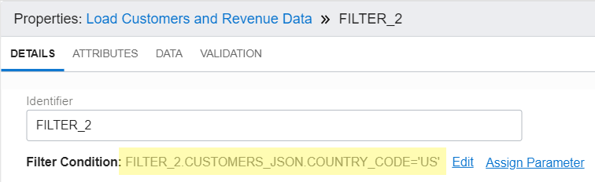

25. You will now work on the **Data Transformation** part of your Data Flow. In the **Properties** panel for FILTER_2, click the **Data** tab.
All data rows and attributes are displayed. You can use the vertical scrollbar to scroll the rows, and the horizontal scrollbar to scroll the attributes.

  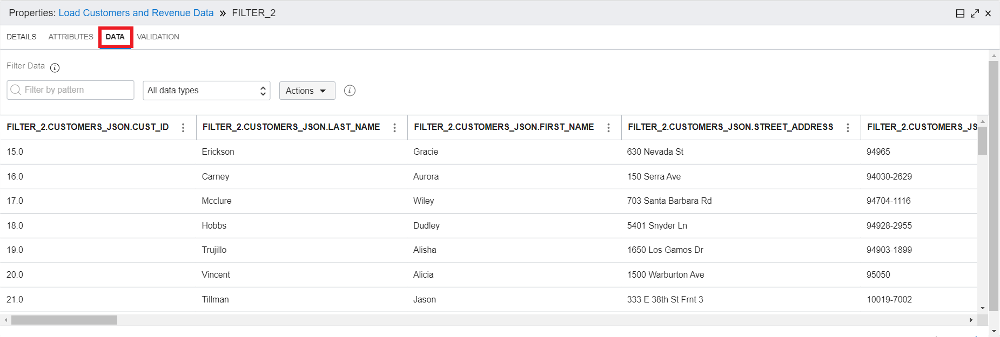

26. In the **Filter by pattern** search field, enter `STATE*`.
The number of attributes in the table are filtered. Only those attributes that match the pattern are displayed.

  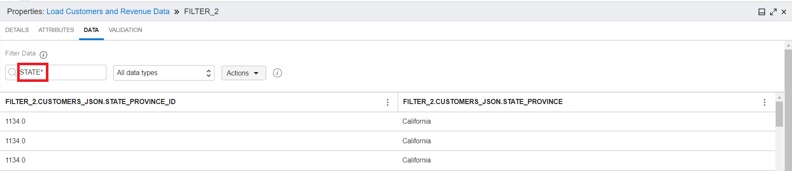

27. Click the **transformations icon** (three dots) for `FILTER_2.CUSTOMERS_JSON.STATE_PROVINCE`, and then select **Change Case**.

  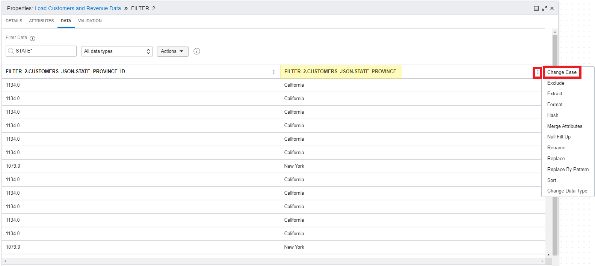

28. In the **Change Case** dialog:

    - From the **Type** drop-down, select **UPPER**.
    - Do **not** select the check box Keep Source Attributes
    - Leave the **Name** as-is.
    - Click **Apply**.

    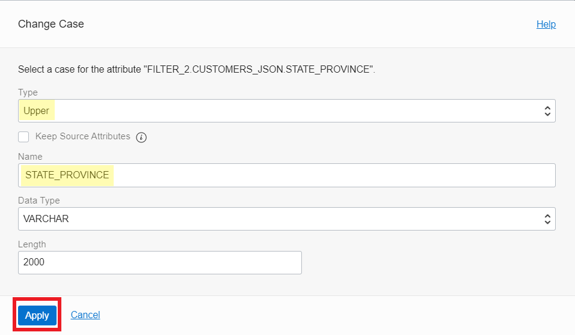

29. An **Expression operator** is added to the data flow. In the Properties panel, the Details tab is now in focus, showing the expression details. You can see the generated expression, `UPPER(EXPRESSION_1.CUSTOMERS_JSON.STATE_PROVINCE)`, in the Expressions table.

  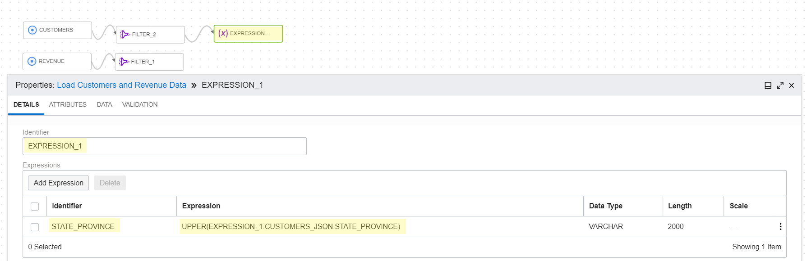

30. With the new **EXPRESSION\_1** operator selected in the data flow, in the Properties panel, change the name in Identifier to **CHANGE\_CASE**. *Note*: Be sure to save often during design time!

  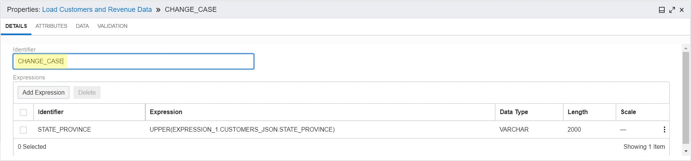

31. Click the **Data** tab, and then use the horizontal scrollbar to scroll to the end. **EXPRESSION\_1.STATE\_PROVINCE** is added to the end of the dataset. You can preview the transformed data for EXPRESSION\_1.STATE\_PROVINCE in the Data tab.

  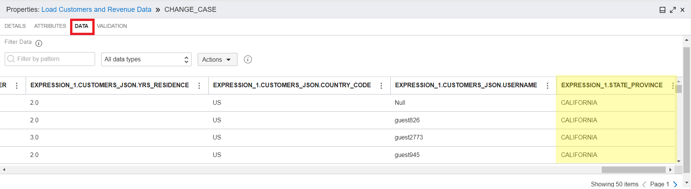

32. From the Operators panel, drag and drop a **new Expression** operator onto the canvas after **CHANGE_CASE** operator. **Connect CHANGE\_CASE to the new Expression**.

  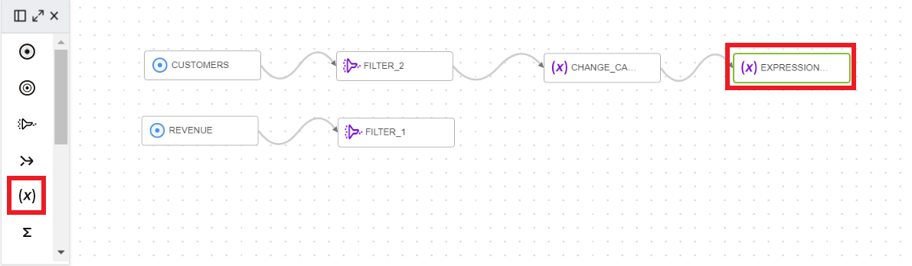

33. With **EXPRESSION\_1** selected, in the Properties panel, change the **Identifier** to **CONCAT\_FULL\_NAME** and then click **Add Expression** button in the Expressions table.

  

34. In the **Add Expression** panel:

    - Rename the expression to `FULLNAME` in the **Identifier** field.
    - Keep **Data Type** as `VARCHAR`.
    - Set **Length** to `200`.
    - Under Expression Builder, switch from the Incoming list to the **Functions list**.
    - In the **filter by name search field**, enter `CON`. Then locate `CONCAT` under String. You can either search for CONCAT in the functions list yourself, or enter CON to use the auto-complete functionality
    - Enter

    ```
    CONCAT(CONCAT(EXPRESSION_1.CUSTOMERS_JSON.FIRST_NAME, ' '),EXPRESSION_1.CUSTOMERS_JSON.LAST_NAME)
    ```

   in the **expression box**.
   You can also highlight a function's placeholders and then double-click or drag and drop attributes from the Incoming list to create an expression.

    - Click **Add**.

  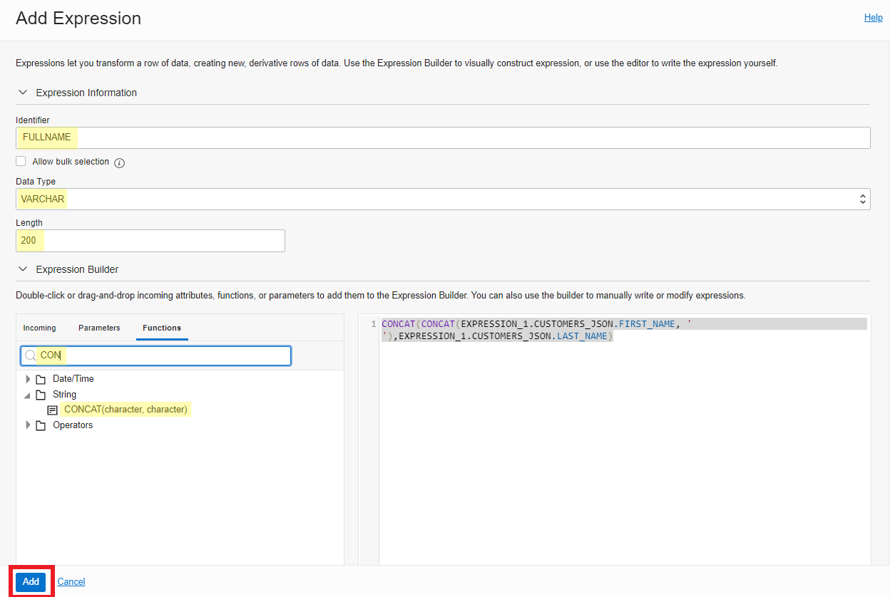

35. The new expression is now listed in the **Expression operator**. You can add as many expressions as you want. *Note*: Be sure to save often during design time!

  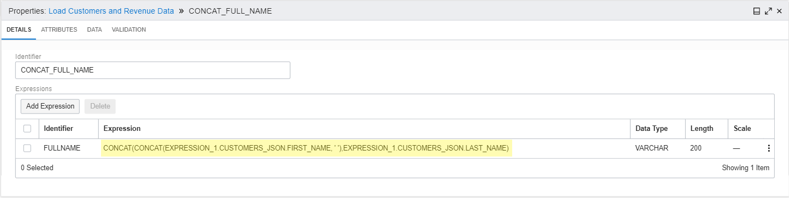

36. After you apply filters and transformations, you can join the source data entities using a unique customer identifier, and then load the data into a target data entity.
To join the data from expression **CONCAT\_FULL\_NAME** with the data from **FILTER\_1**, drag and drop a **Join operator** from the Operators panel onto the canvas next to CONCAT\_FULL\_NAME and FILTER\_1. Connect CONCAT\_FULL\_NAME to JOIN\_1 and then connect FILTER\_1 to JOIN\_1.

  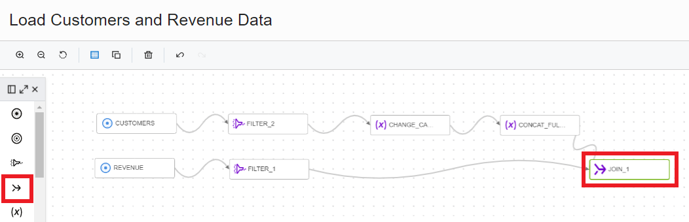

37. Select the **JOIN\_1** operator. **Inner Join** as the join type is selected by default. In the Details tab of the Properties panel, click **Create** next to **Join Condition**.

  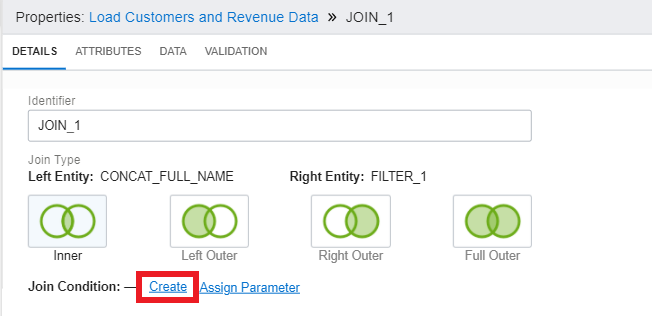

38. In the **Create Join Condition panel**:

    - Enter `CUST` in the filter by name search field.
    - You want to join the entities using CUST\_ID and CUST\_KEY. In the editor, enter
    ```
    JOIN_1_1.CUSTOMERS_JSON.CUST_ID=JOIN_1_2.REVENUE_CSV.CUST_KEY
    ```
    - Click **Create**.

    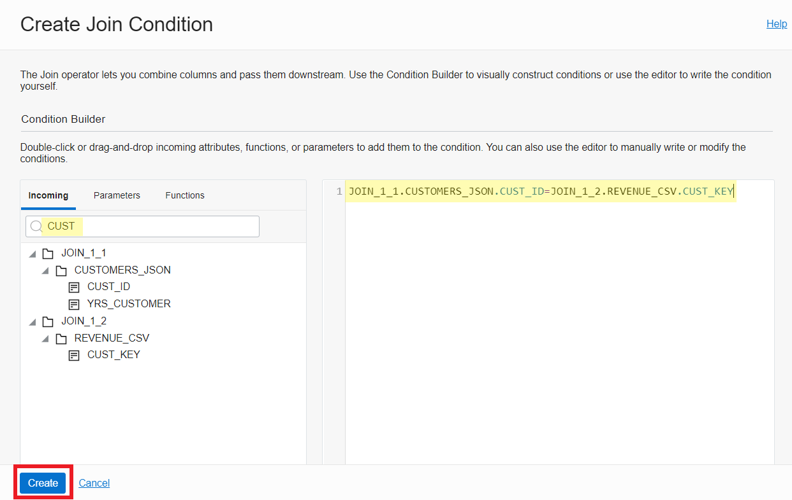

39. Your **Join operator properties** should now look like this:

  

40. From the Operators panel, drag and drop a **Target operator** onto the canvas. Connect JOIN\_1 to TARGET\_1. *Note*: Be sure to save often during design time!

  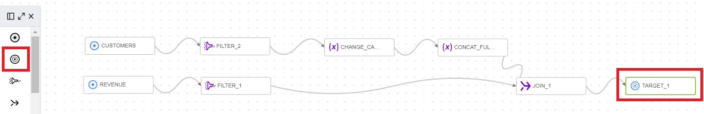

41. Select **TARGET_1** operator on the canvas. The details for this operator are now displayed in the **Properties** bar.

  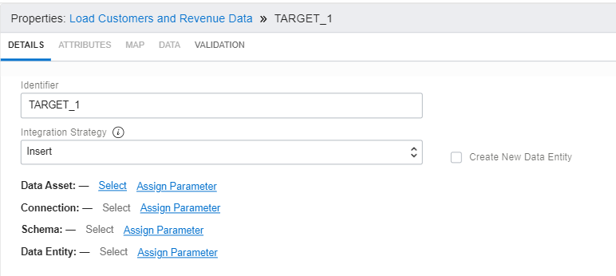

42. In the **Details** tab of the Properties panel complete the fields accordingly:

    - Leave the default value for **Integration Strategy** as **Insert**.
    - For **Data Asset**, select `Data_Warehouse`.
    - For **Connection**, select `Beta Connection`.
    - For **Schema**, select `BETA`.
    - For **Data Entity**, select `CUSTOMERS_TARGET`.
    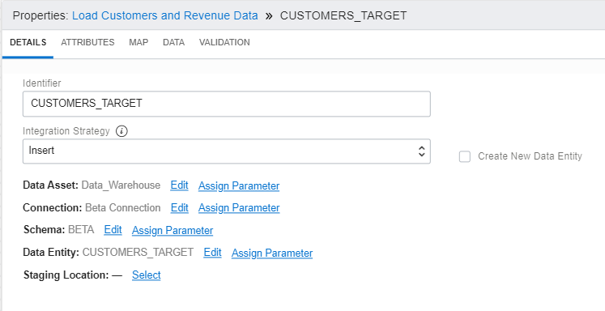
    - For **Staging Location**, select the **Object Storage data asset**, its **default connection** and your **compartment**. Then for **Schema**, select the **Object Storage bucket** that you created before importing the sample data in _Setting up the Data Integration prerequisites in OCI_. Click **Select**.
    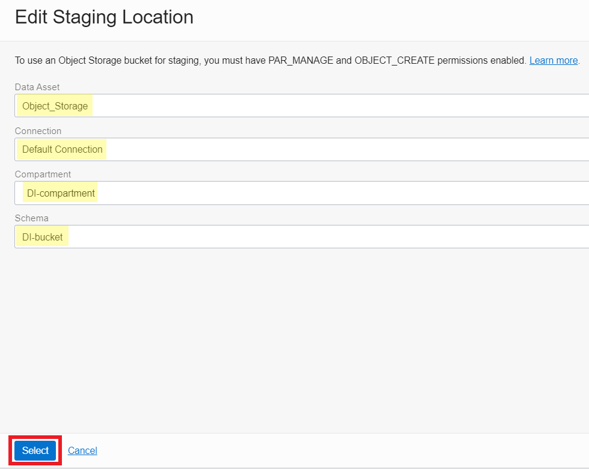

43. The properties details for **CUSTOMERS_TARGET operator** should now look like this:

  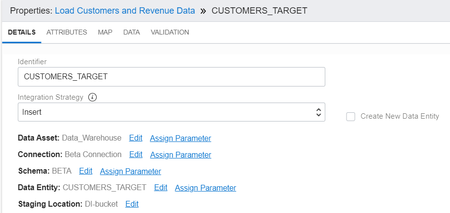

44. To review the Attributes mapping, click the **Map tab**. By default, all attributes are **mapped by name**. For example, CUST\_ID from JOIN\_1 maps to CUST\_ID in the target data entity.

  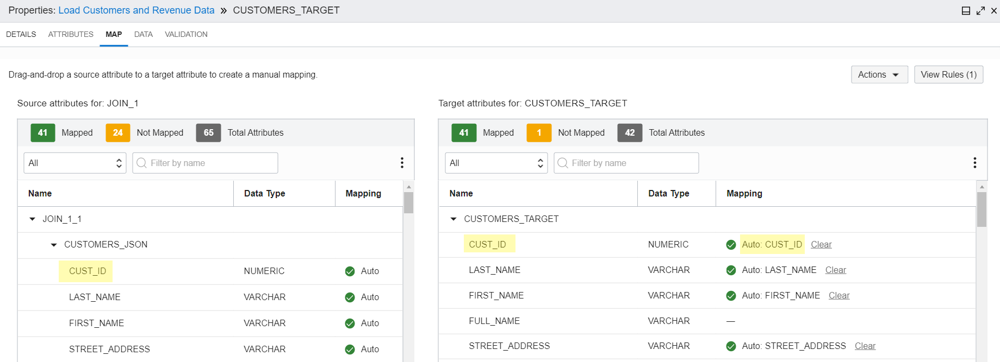

45. To manually map attributes that are not yet mapped, click the **All** drop-down in the Target attributes table, and then select **Attributes not mapped**. You can do the same in the Source attributes table (for the incoming fields). You can see that there is one attribute that is not mapped, more specifically attribute FULL_NAME from target.

  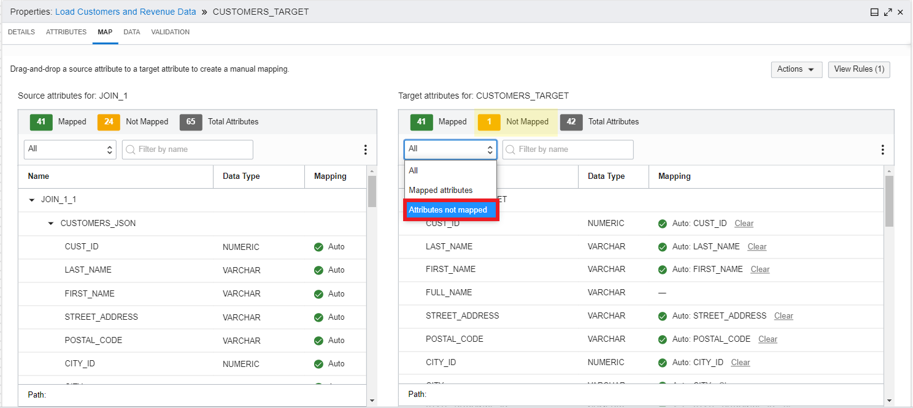

46. Now drag and drop **FULLNAME** under Source attributes to **FULL_NAME** under Target attributes. All attributes from target are now mapped.

  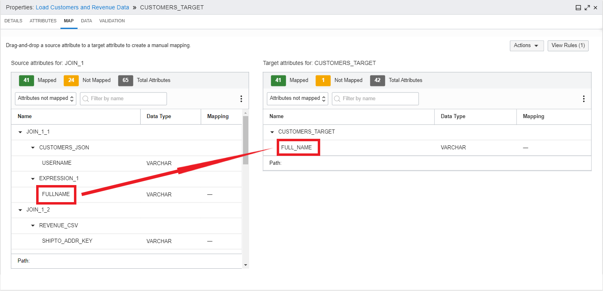

47. Click **View Rules** to filter and view the applied Rules.

  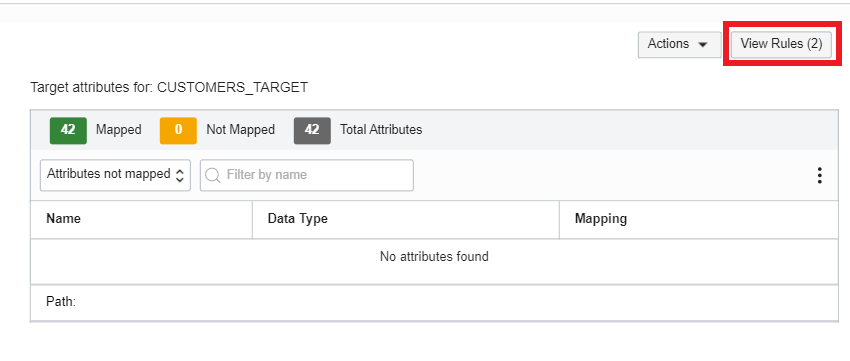
  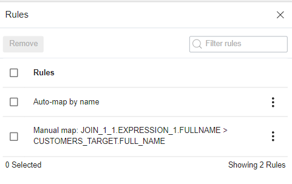

48. You have now completed the data flow. Click on **Validate** to see the validation output. There shouldn't be any warnings or errors.

  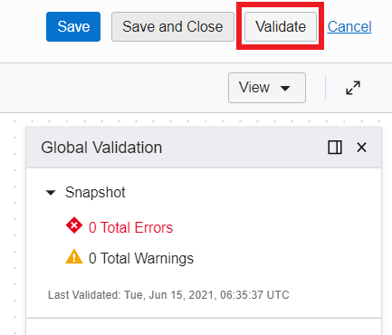

49. To save the data flow, click **Save**.

  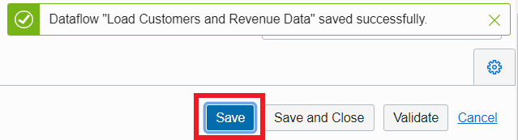

## Task 4: Create a Data Flow - 2

To further explore the capabilities of Data Flows in OCI Data Integration, you will now create **a new Data Flow** with different transformation rules.

This Data Flow will load data from **multiple source files** containing Employees data using File Patterns functionality in OCI Data Integration. After, you will do transformations on the Employees data and later load the data in **multiple target tables**, based on the region of the employees. Two target tables will be loaded: one for employees from **West and Midwest region** and one for employees from **Northeast and South region**. We will take advantage of the **Split operator** in OCI Data Integration Data Flows.

1. From the Project Details page for `DI_WorkshopNN` project, click on **Data Flows** from the submenu.

  

2. Click **Create Data Flow**.

  

3. The data flow designer opens in a new tab. In the **Properties panel**, for **Name**, enter `Load Employees by Region`, and click **Save**.

  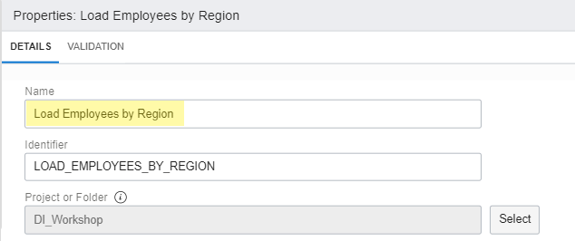
  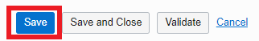

4. You will add your **Source operator**. You add source operators to identify the data entities to use for the data flow. From the Operators panel on the left, drag and drop a Source operator onto the canvas.

  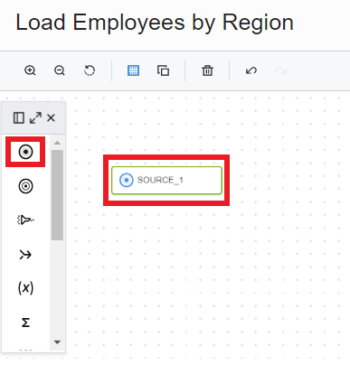

5.  On the canvas, select **SOURCE\_1** operator. The Properties panel now displays the details for this operator.

  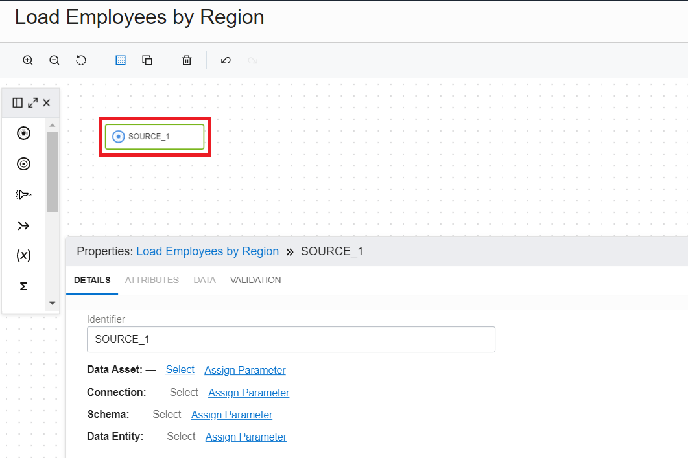

6. In the **Details** tab, click Select next to each of the following options to make your selections:

    - For **Identifier**, rename to `EMPLOYEES_SOURCE_FILES`.
    - For **Data Asset**, select `Object_Storage`.
    - For **Connection**, select `Default Connection`.
    - For **Schema**, select your **compartment** and then your **bucket**. For the purposes of this tutorial, **Object Storage** serves as the source data asset, this is why you select your bucket here.
    
    - For **Data Entity**, click on **Select** and then on **Browse by Pattern**.
    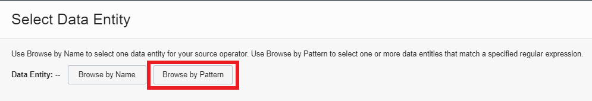

   Write the file pattern `EMPLOYEES_*` and click **Search**. All files from your Object Storage bucket that are found which match this pattern are now displayed: there are three files for employees. Click on **Select Pattern**.
   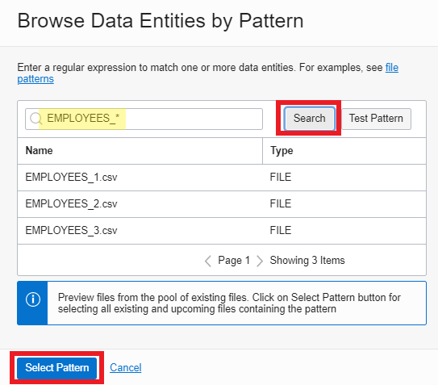

   For **File Type**, choose **CSV** and leave the defaults for the other fields that appear. Click **Select**.
   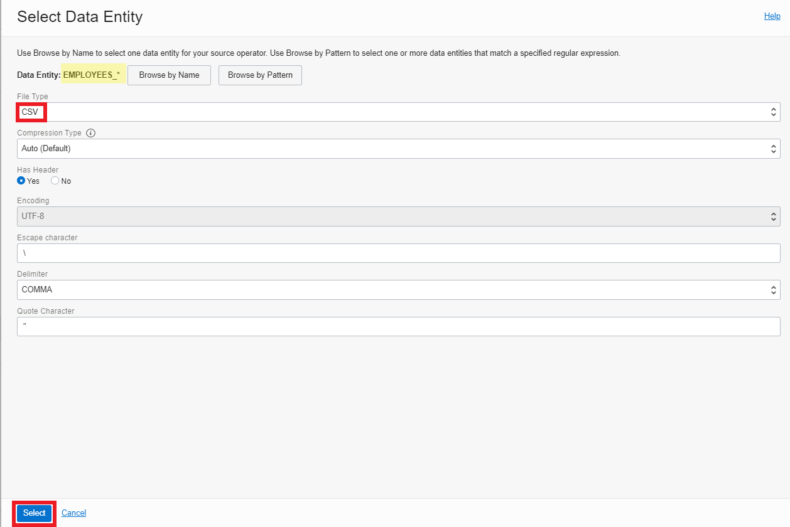

   In the end, your details for the source operator should look like this.
   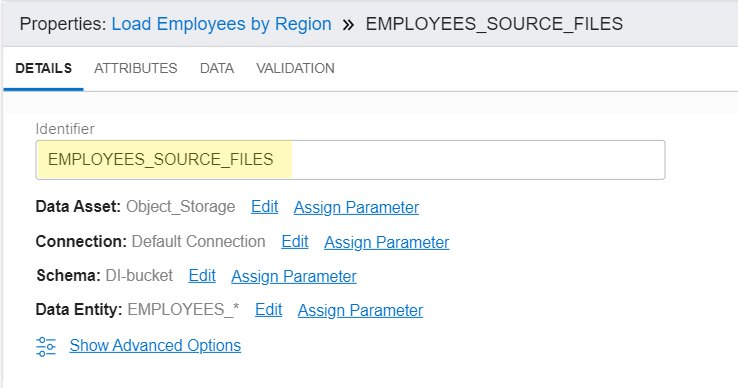

7. Drag and drop a **Distinct operator** on the data flow canvas. We use the distinct operator to return distinct rows with unique values. Connect **EMPLOYEES\_SOURCE\_FILES** source to the **DISTINCT\_1** operator.  *Note*: Be sure to save often during design time!

  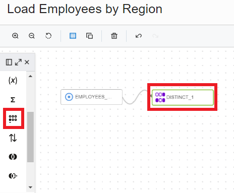

8. Drag and drop an **Expression operator** on the data flow canvas. Connect the **DISTINCT\_1** operator to the new **Expression** operator.

  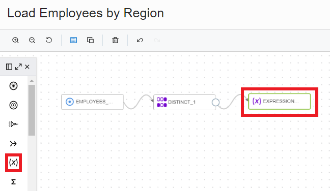

9. In the Properties panel for **EXPRESSION\_1** operator, rename the Identifier to **TRANSFORM\_DATAYPES**.

  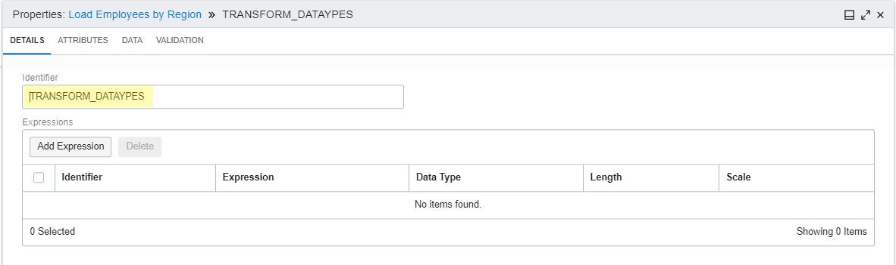

10. You will now add a **new expression**. Still in the Properties panel, click on **Add Expression**.

  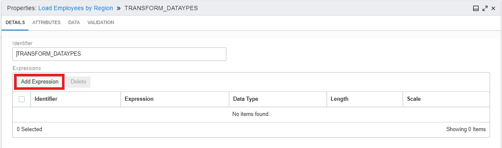

11. In the **Add Expression** panel:

    - **Rename** the expression to `BIRTH_DATE` in the Identifier field.
    - Change **Data Type** to `DATE`.
    - Enter
    ```
    TO_DATE(EXPRESSION_1.EMPLOYEES_SOURCE_FILES.Date_of_Birth, 'MM/dd/yyyy')
    ```
   in the **expression** box.

   This function will covert the **STRING** value of birth date from the source files to a **DATE** data type value, in the specified format. You can also find this function in **Functions** tab, under **Date/Time** section and select it from there. Attributes can be added from **Incoming** tab, by highlighting a function's placeholders and then double-click or drag and drop attributes from the Incoming list to create an expression.
    - Click **Add**.

  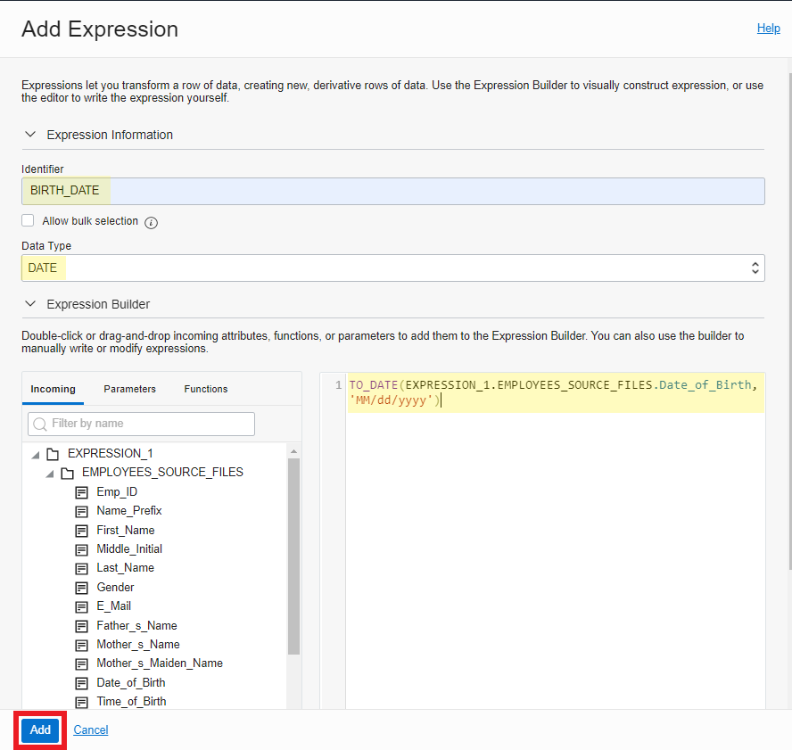

12. Your expression for **BIRTH\_DATE** is now displayed. Click again on **Add Expression** to add a new one.

  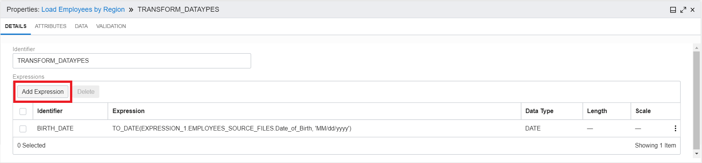

13. In the **Add Expression** panel:

    - **Rename** the expression to `YEAR_OF_JOINING` in the Identifier field.
    - Change **Data Type** to `NUMERIC`.
    - Enter   
    ```
    TO_NUMBER(EXPRESSION_1.EMPLOYEES_SOURCE_FILES.Year_of_Joining)
    ```
   in the **expression** box. This function will transform your string value of year of joining from the files to a number value.
    - Click **Add**.

  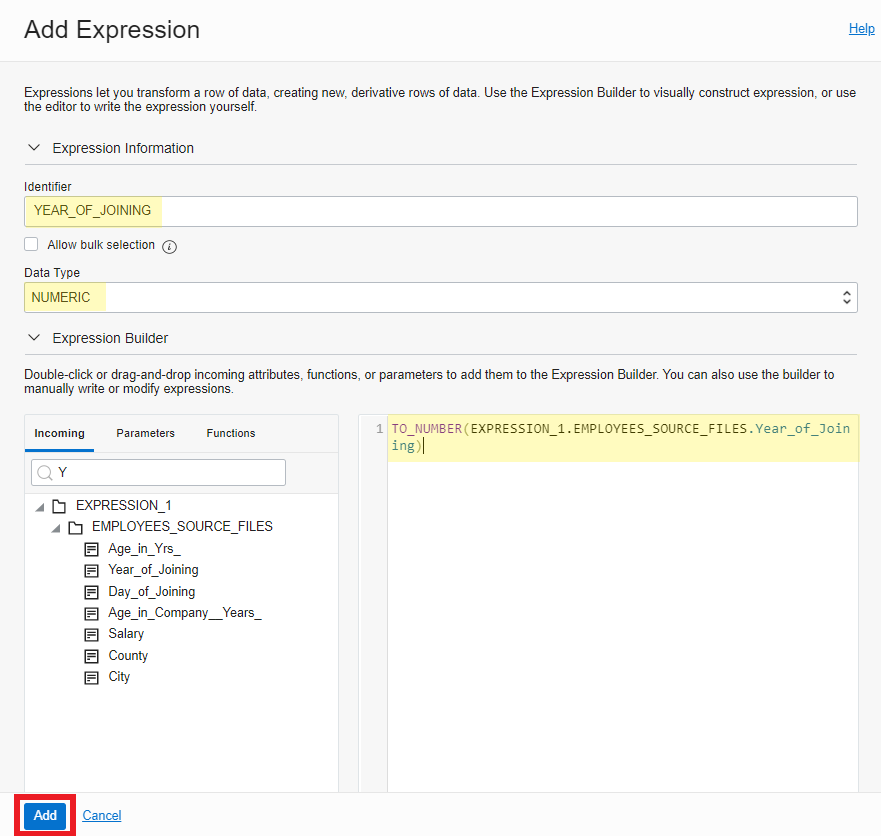

14. The expressions for the **TRANSFORM\_DATAYPES** operator should now look like this:

  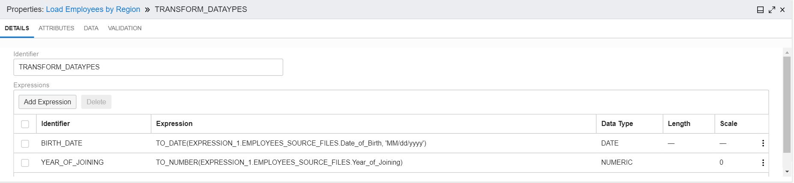

15. Drag and drop an **Expression operator** on the data flow canvas. Connect the **TRANSFORM\_DATAYPES** operator to the new **Expression** operator.  *Note*: Be sure to save often during design time!

  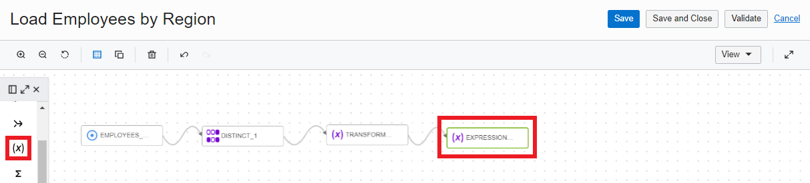

16. In the Properties panel for the new **EXPRESSION\_1 operator**, change the Identifier to **EMPLOYEE\_AGE\_AND\_PHONE**.

  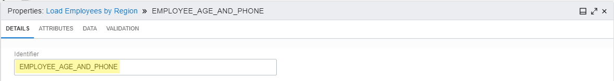

17. You will now add a new expression. Still in the Properties panel, click on **Add Expression**.

  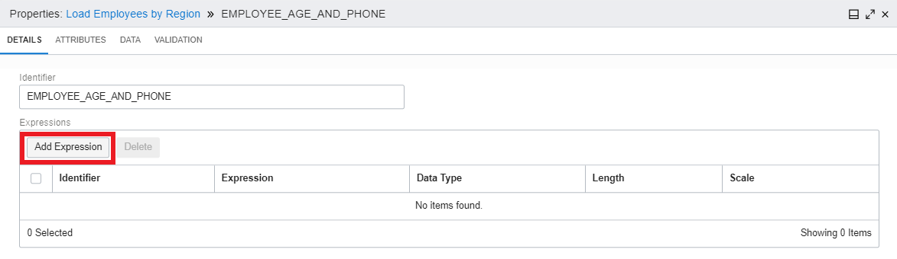

18. In the **Add Expression** panel:

    - **Rename** the expression to `EMPLOYEE_AGE` in the Identifier field.
    - Change **Data Type** to `NUMERIC`.
    - Enter

    ```
    CASE WHEN DAYOFYEAR(CURRENT_DATE)>=DAYOFYEAR(EXPRESSION_1.TRANSFORM_DATAYPES.BIRTH_DATE) THEN TRUNC(YEAR(CURRENT_DATE)-YEAR(EXPRESSION_1.TRANSFORM_DATAYPES.BIRTH_DATE)) ELSE TRUNC(YEAR(CURRENT_DATE)-YEAR(EXPRESSION_1.TRANSFORM_DATAYPES.BIRTH_DATE)-1) END
    ```
   in the **expression** box.
   This function will calculate the age of the employee, by doing a minus between the current date and his birth date. CASE WHEN function returns the value for which a condition is met.

   *Note*: In case the attributes in the expression don't get automatically highlighted, please replace them, by highlighting in the expression's placeholders and then double-click or drag and drop attributes from the Incoming list.
    - Click **Add**.

  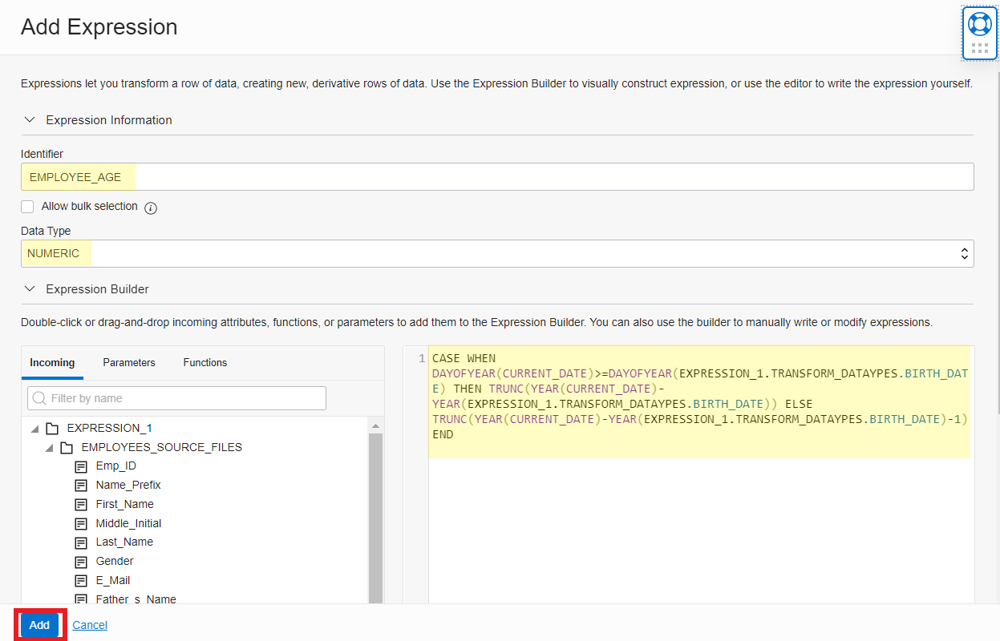

19. You will now add a new expression in the same operator. Still in the Properties panel, click on **Add Expression**.

  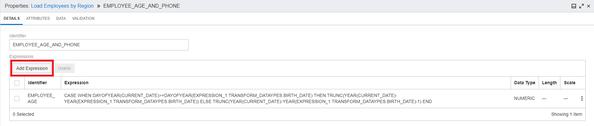

20. In the **Add Expression** panel:

    - **Rename** the expression to `PHONE_NO` in the Identifier field.
    - Leave **Data Type** as `VARCHAR`.
    - Enter   
    ```
    COALESCE(EXPRESSION_1.EMPLOYEES_SOURCE_FILES.Phone_No,'Phone Number Not Available')
    ```
   in the **expression** box
   This function will fill in the null values for phone number with string `Phone Number Not Available`.
    - Click **Add**.

  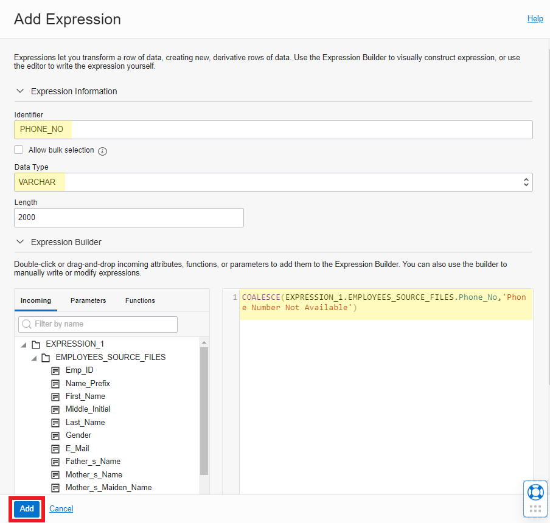

21. The two expressions you defined for this operator are now displayed. Click on **Attributes** tab.  *Note*: Be sure to save often during design time!

  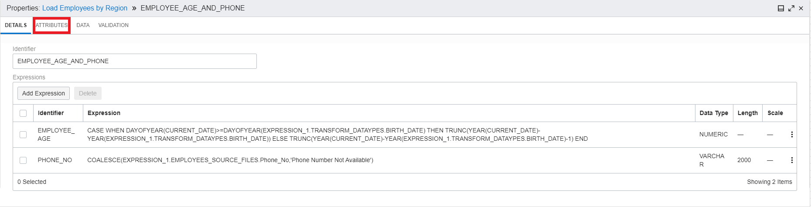

22. Check the following two fields: **EMPLOYEES\_SOURCE\_FILES.Age\_in\_Yrs**, **EMPLOYEES\_SOURCE\_FILES.Year\_of\_Joining**. We will exclude these fields from this operator.

  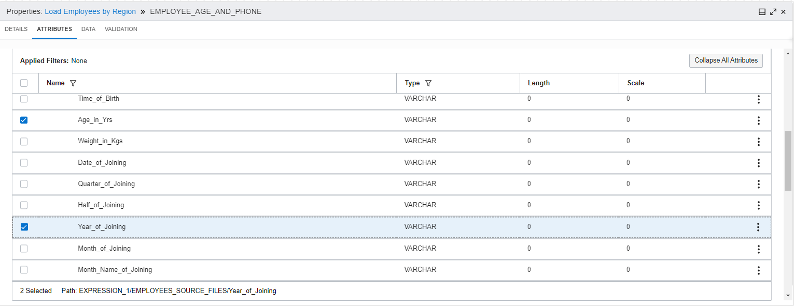

23. Click on **Actions** and then on **Exclude by selection**.

  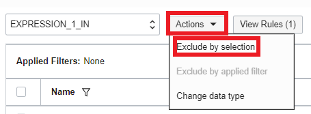

24. The fields are now excluded. Click on **View Rules** to see the rules you defined.

  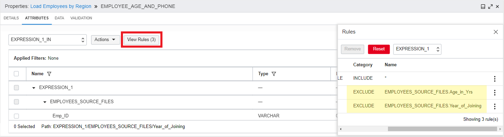

25. Click on **Data** tab of the **EMPLOYEE\_AGE\_AND\_PHONE** operator.

  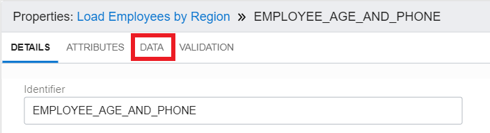

26. Scroll to the right until you get to the attribute **EMPLOYEE\_AGE\_AND\_PHONE.EMPLOYEES\_SOURCE\_FILES.Region**. Click on it and a **Data Profile** window will appear. You can observe that there is employee data from four regions: Northeast, West, South, Midwest. In this data flow you will split the employee data into two target tables based on the **region**: one target table for employees from **Northeast and South** region (table named `EMPLOYEES_NORTHEAST_SOUTH`) and one target table for employees from **West and Midwest** region (table named `EMPLOYEES_WEST_MIDWEST`).

  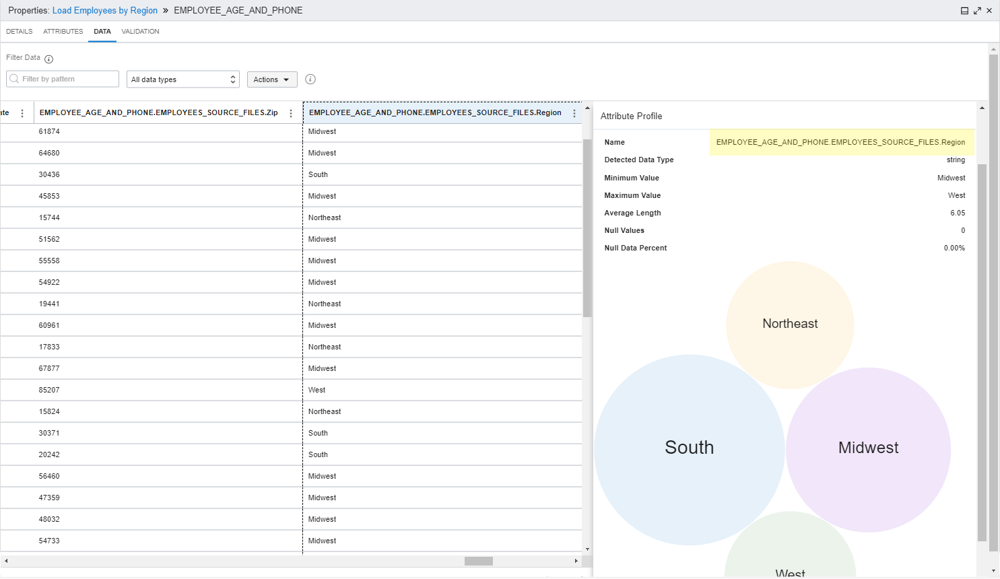

27. Drag and drop a **Split operator** on the data flow canvas. Connect the **EMPLOYEE\_AGE\_AND\_PHONE operator** to the new **Split operator**. Use the split operator to divide one source of input data into two or more output ports based on split conditions that are evaluated in a sequence. Each split condition has an output port. Data that satisfies a condition is directed to the corresponding output port.  *Note*: Be sure to save often during design time!

  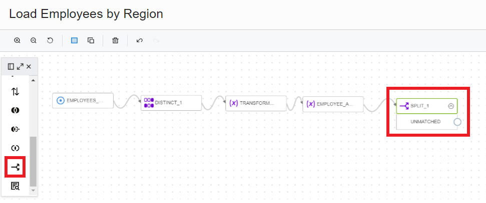

28. In the **Properties** bar of the Split Operator, we will leave the default **Identifier** (**SPLIT\_1**) and **Match** option (**First matching condition** means that data that matches the first condition should be removed from further processing by other conditions).

  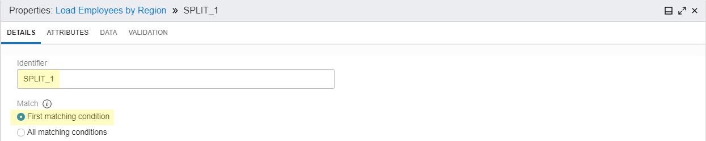

29. Still in Properties bar of the Split Operator, click on **Add Condition** in **Split Conditions section**.

  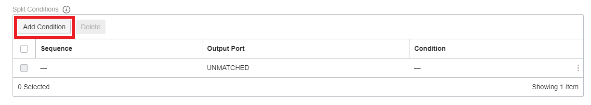

30. In **Add Split Condition** page:

    - Enter **Identifier** `WEST_MIDWEST_REGION`.
    - For **Condition** enter
    ```
    SPLIT_1.EMPLOYEES_SOURCE_FILES.Region IN ('Midwest','West')
    ```
    - Click **Add**.

    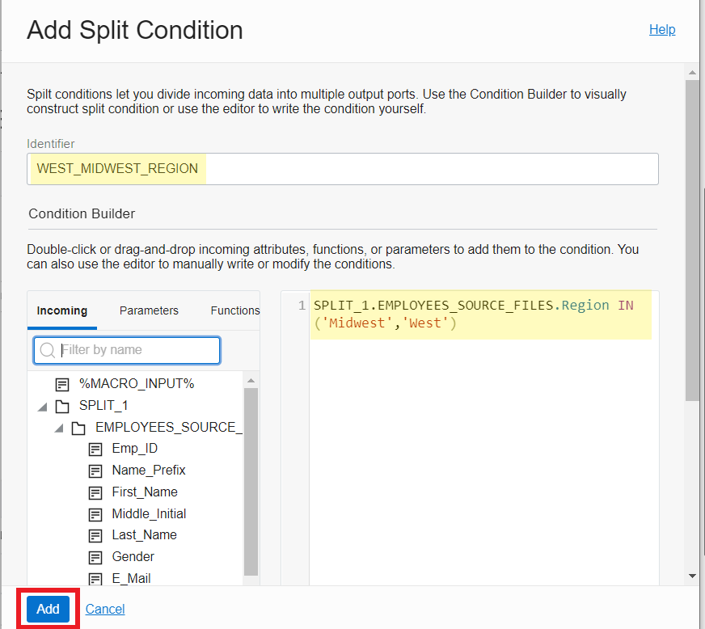

31. The first split condition you defined is now displayed. The Split operator properties should look like this:

  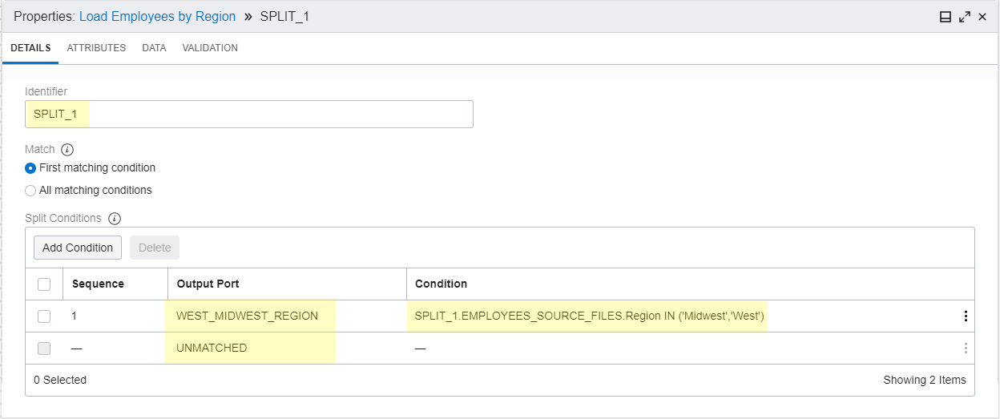

32. Still in Properties bar of the Split Operator, click on **Add Condition** in **Split Conditions section** to add a new split condition.

  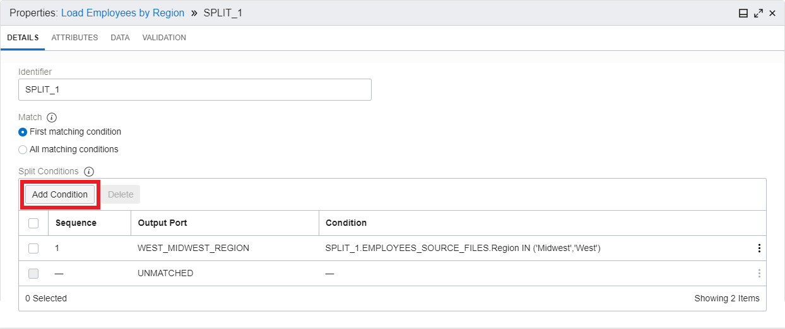


33. In **Add Split Condition** page:

    - Enter **Identifier** `NORTHEAST_SOUTH_REGION`.
    - For **Condition** enter
    ```
    SPLIT_1.EMPLOYEES_SOURCE_FILES.Region IN ('Northeast','South')
    ```
    - Click **Add**.

    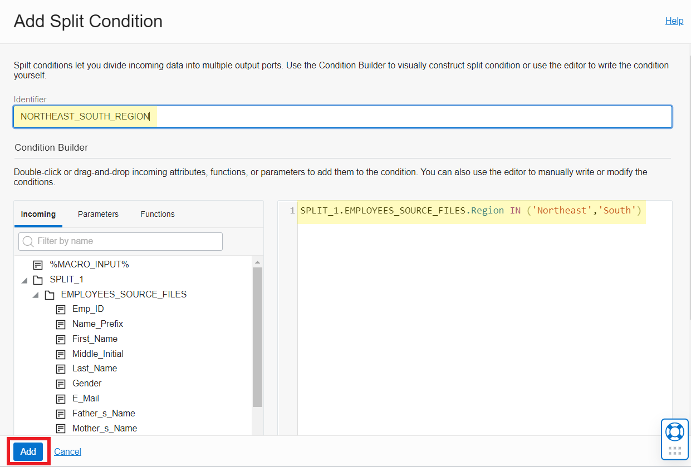

34. The split conditions that you defined are now displayed. After the conditions in the split operator are evaluated during run-time, data that does not meet the condition is directed to the **Unmatched** output port.

  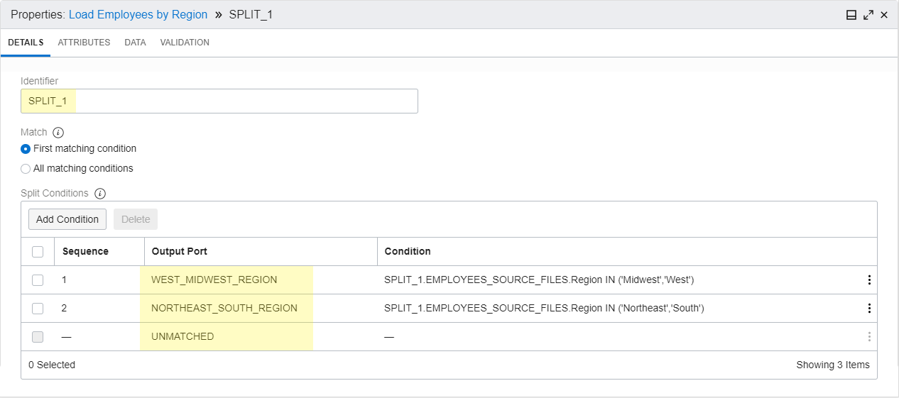

35. Drag and drop a **target operator**. Connect the **WEST\_MIDWEST\_REGION** output of the Split operator to the **TARGET\_1** operator.  *Note*: Be sure to save often during design time!

  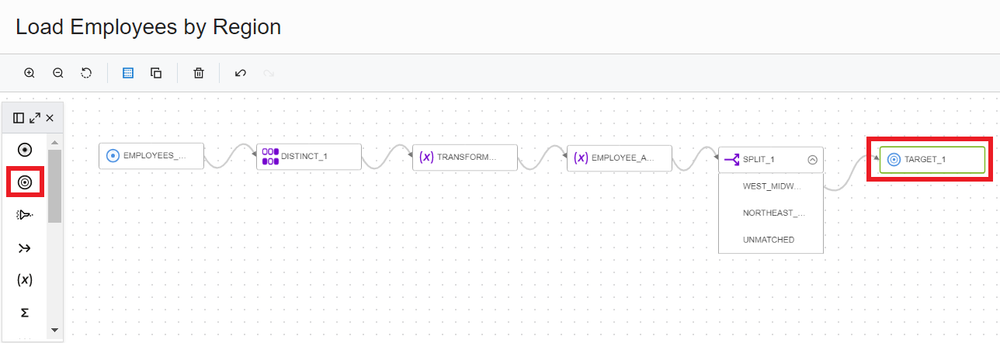

36. In the properties for **TARGET\_1** operator:

    - Change to **Merge Integration Strategy**.
    - For **Data Asset**, select `Data_Warehouse`.
    - For **Connection**, select `Beta connection`.
    - For **Schema**, select `Beta`.
    - For **Data Entity**, select `EMPLOYEES_WEST_MIDWEST` (this target table was created with the SQL script from _Setting up the Data Integration prerequisites in Oracle Cloud Infrastructure_ that you ran on the Autonomous Data Warehouse).
    - For **Staging Location**, select your **Object Storage bucket** (`DI-bucket`).
    - **Merge Key** will automatically get populated with the primary key name of the table, from the database.

    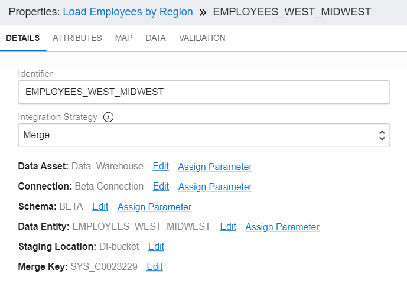

37. Go to **Map** tab of the **EMPLOYEES\_WEST\_MIDWEST** target operator. There are 3 attributes that were not mapped automatically in the target.

  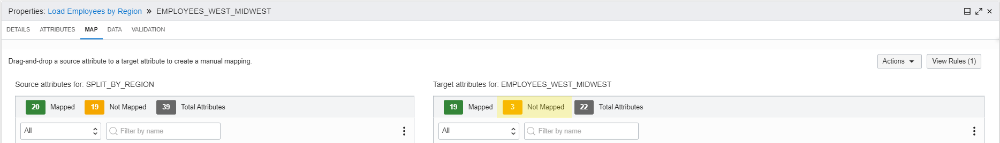

38. **Manually map** the **E\_Mail** attribute from source  to **EMAIL** attribute from target, with drag and drop.

  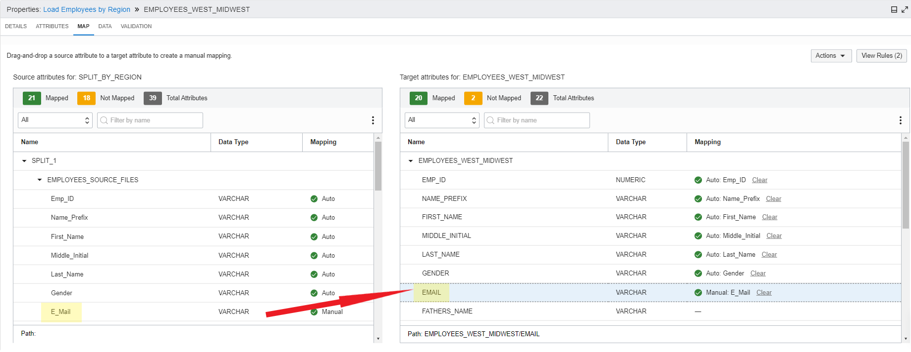

39. You will use **mapping by pattern** to map the two remaining unmapped attributes. This maps inbound attributes to target attributes based on simple, user-defined regex rules. Click on **Actions** button and then on **Map by pattern**.

  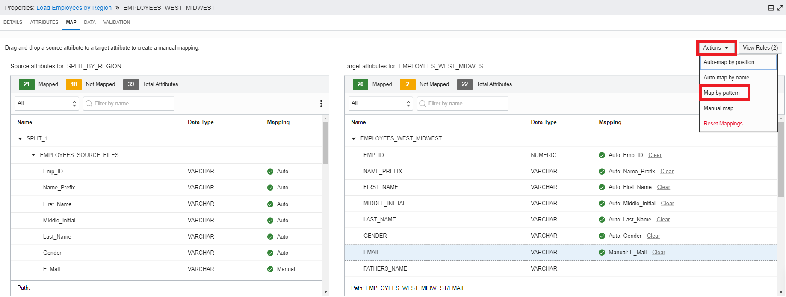

40. In the **Map by pattern** page that pops up:

    - For **Source Pattern**, use `*_S_NAME`.
    - For **Target Pattern**, use `$1S_NAME`.
    - Click on **Preview Mapping**. In the table, the mapping for FATHERS\_NAME and MOTHERS\_NAME attributes is now displayed.
    - Click on **Map**.

   *Note:* For more information on how to use **Mapping by pattern**, please see the following [link](https://docs.oracle.com/en-us/iaas/data-integration/using/using-operators.htm#operator-target), section Target Operator, **Mapping attributes**.

   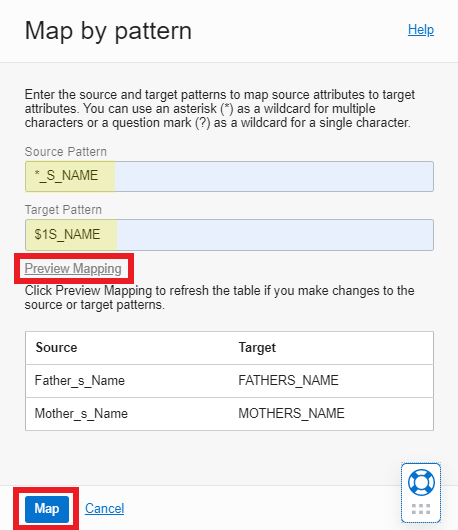

41. The attribute mapping for the **EMPLOYEES\_WEST\_MIDWEST target table** is now complete.  *Note*: Be sure to save often during design time!

  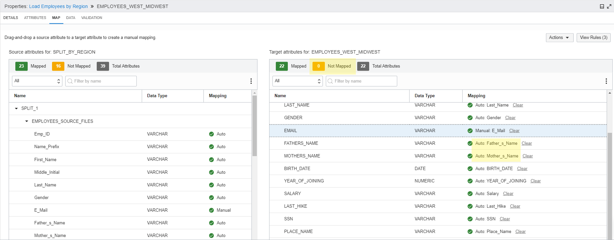

42. Drag and drop **another target operator**. Connect the **NORTHEAST\_SOUTH\_REGION output port** of the Split operator to the **TARGET\_1 operator**. In Properties tab of the new target operator:

    - Change to **Merge Integration Strategy**.
    - For **Data Asset**, select `Data_Warehouse`.
    - For **Connection**, select `Beta connection`.
    - For **Schema**, select `Beta`.
    - For **Data Entity**, select `EMPLOYEES_NORTHEAST_SOUTH` (this target table was created with the SQL script from _Setting up the Data Integration prerequisites in OCI_ that you ran on the Autonomous Data Warehouse).
    - For **Staging Location**, select your **Object Storage bucket** (`DI-bucket`)
    - **Merge Key** will automatically get populated with the primary key name of the table, from the database.

   **Make sure you also map all of the columns, same as in steps 38, 39 and 40.**

  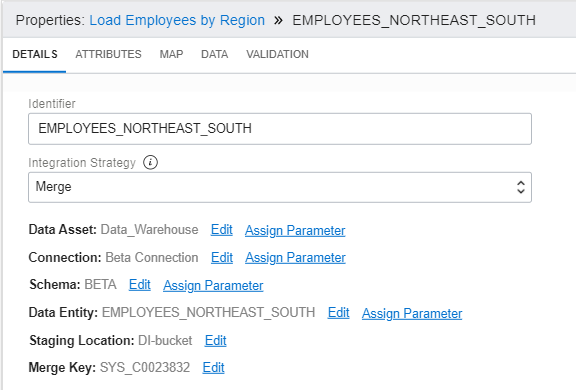

43. The design of the Data Flow is now ready. Click on **Validate**. The Validation panel lets you know if any warnings or errors were detected.  *Note*: If any warnings or errors are found, select an issue and it'll take you to the operator that caused it, to investigate further. Warnings that might be displayed should not cause the task to fail.

  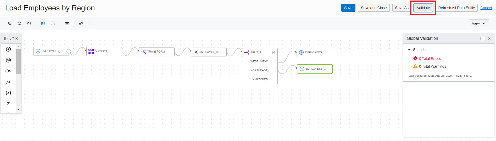

44. Click on **Save and Close**.

  

## Task 5: Create Integration Tasks

**Integration tasks** in OCI Data Integration let you take your data flow design and choose the parameter values you want to use at runtime. With the help of Integration Tasks, you can create multiple Tasks with distinct configurations for the same Data Flow. You will create Integration tasks for the two Data Flows you created in the previous steps.

1. From your Workspace home page of OCI Data Integration, click **Open tab** (plus icon), and then select **Projects**.

  

2. On the **Projects** page, select the project you have been working on for this workshop, `DI_WorkshopNN`.

  

3. On the `DI_WorkshopNN` **Project Details** page, from the submenu, click **Tasks**.

  

4. Click **Create Task**, and then select **Integration**.

  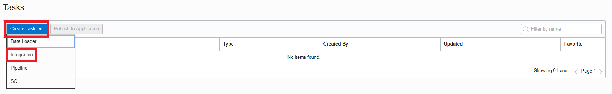

5. The **Create Integration Task** page opens in a new tab. On this page:

    - Change the **Name** to `Load Customers Lab` and enter an optional **Description**. The value in the **Identifier** field is auto-generated based on the value you enter for Name.
    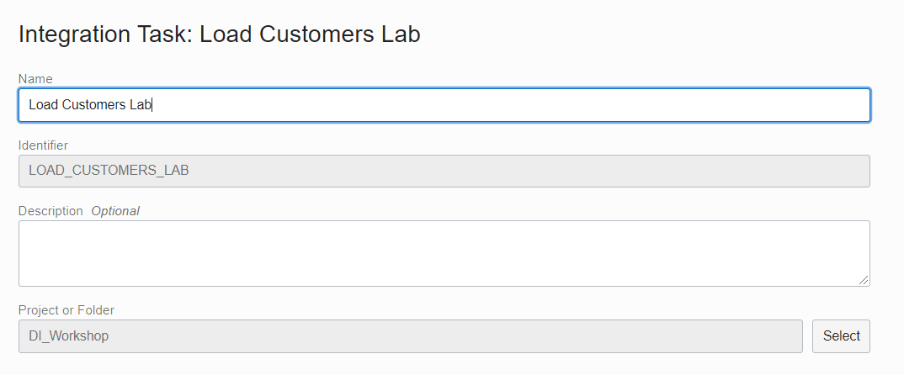
    - In the Data Flow section, click Select.
    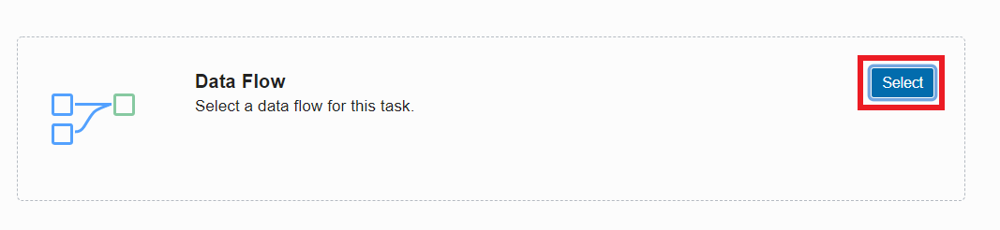
    - In the **Select a Data Flow** panel, select `Load Customers and Revenue Data`, and then click Select.
    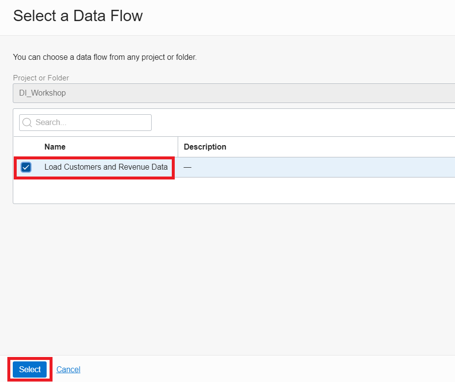
    - The Data Flow will be **validated** after the selection and the result should be displayed as **Successful**.
    - Click **Create and Close**.

    

6. From the `DI_WorkshopNN` project section **Tasks**, you will now create an Integration Task for your second Data Flow. Click **Create Task** and then select **Integration**.

  

7. The **Create Integration Task** page opens in a new tab. On this page:

    - Change the **Name** to `Load Employees by Regions` and enter the optional **Description**. The value in the **Identifier** field is auto-generated based on the value you enter for Name.
    - In the Data Flow section, click Select. In the **Select a Data Flow** panel, select `Load Employees by Region`, and then click Select.
    - The Data Flow will be **validated**.
    - Click **Create and Close**.

    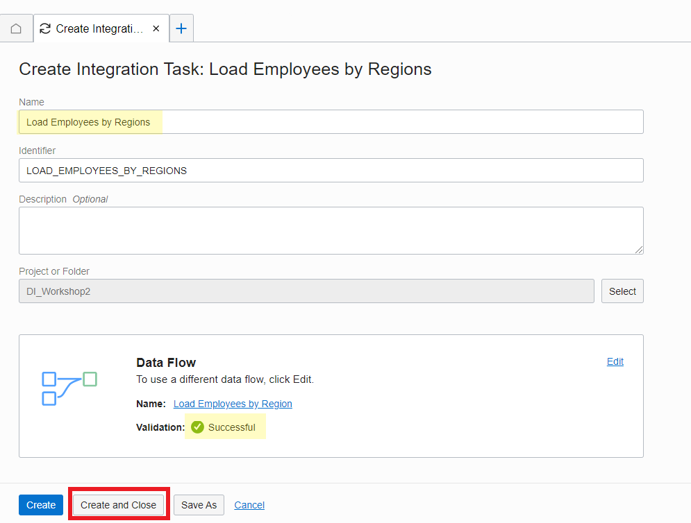

## Task 6: Create a SQL task

A **SQL task** lets you run a SQL stored procedure in pipeline. You create a SQL task by selecting a stored procedure that exists in the data source that's associated with a data asset already created in your workspace. The variables defined in a stored procedure are exposed as input, output, and in-out parameters in a SQL task.

When you create a SQL task, you can configure values for **input parameters** only. If input parameters are configured in a SQL task, you can **override the default values** when you configure the SQL task in a pipeline, and when you run a pipeline that includes the SQL task.

The SQL task that you create will write inside a statistics table on the Autonomous Data Warehouse (`DWH_LOAD_STATS`) the successful/ unsuccessful result of a Pipeline task run based on input parameter from the pipeline, but also the pipeline name and task run key. This SQL task will be included in a Pipeline in _Create an Application, a Pipeline and publish tasks_. To understand better the SQL stored procedure, please check the `OCIDI_RESULT` procedure statement from the SQL script you downloaded and ran on Autonomous Data Warehouse in _Setting up the Data Integration prerequisites in OCI_.
Any user interested in seeing the successful/ unsuccessful result of the Data Integration Pipeline along with the pipeline name and task run key will be able to either do it in the database by querying the `DWH_LOAD_STATS` table, or by checking the result in the Data Integration Application from OCI Console.

1. From your Workspace home page in OCI Data Integration, click **Open tab** (plus icon), and then select **Projects**.

  

2. On the **Projects** page, select the project you have been working on for this workshop, `DI_WorkshopNN`.

  

3. On the `DI_WorkshopNN` **project details** page, from the submenu, click **Tasks**.

  

4. Click **Create Task**, and then select **SQL**.

  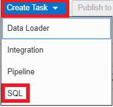

5. On the **Create SQL Task** page, enter:

    - Name: Use `Procedure DWH Load Stats`.
    *Note*: The Identifier field is a system-generated value based on what you enter for Name. You can change the value, but after you save the task, you cannot change the value again.
    - **Description** (optional).
    - Project **DI_Workshop** is auto-populated because we're creating this task from project details page.

    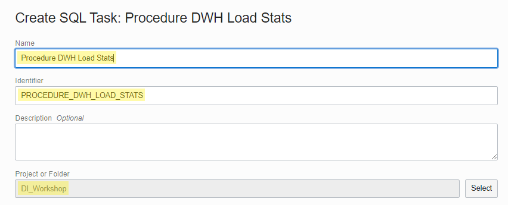

6. In the **SQL** section, click **Select**.

  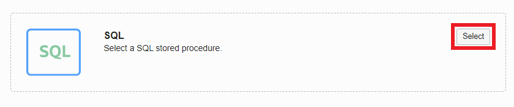

7. In the **Select SQL** page:

    - **Data Asset**: `Data_Warehouse`.
    - **Connection**: Choose the `Beta Connection`.
    - **Schema**: `BETA` schema on your ADW.
    - **Stored Procedure**: Choose the `OCIDI_RESULT` procedure.
    *Note*: The `OCIDI_RESULT` procedure was created in the Autonomous Data Warehouse during "Setting up the Data Integration prerequisites in OCI." It writes into DWH\_LOAD\_STATS target table a new entry in case of success or failure.

    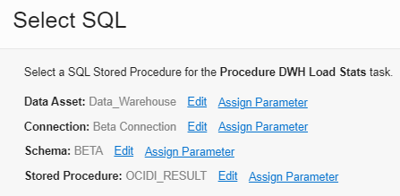

8. **Review** the list selections for the SQL task, then click **Done**.

  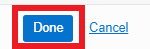

9. In the **Configure Parameters** section, click **Configure** to view or configure values for the stored procedure parameters.

  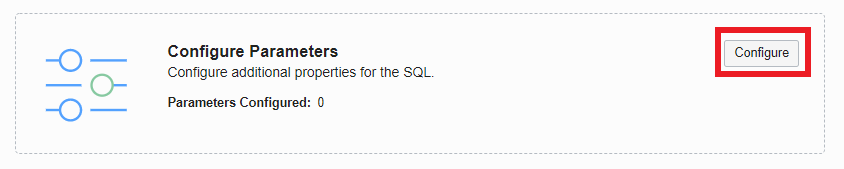

10. In the **Configure Stored Procedure Parameters** page, review the list of parameters in the stored procedure. Only **input parameters** can be configured. You can see here the input parameters **IN\_DI\_RESULT** and **PIPELINE\_NAME\_TASK\_RUN** from the procedure you're using.

    - In the row of the input parameter value for IN\_DI\_RESULT, click **Configure**.
    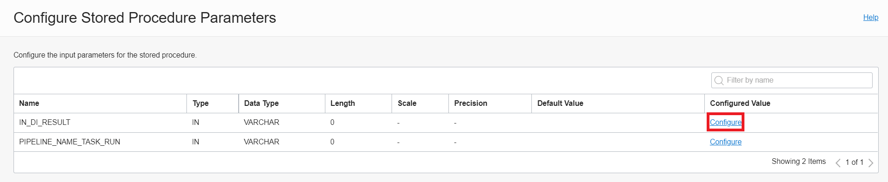
    - In the Edit Parameter panel, enter value **SUCCESS** (without any apostrophes) for that input parameter and click Save Changes.
    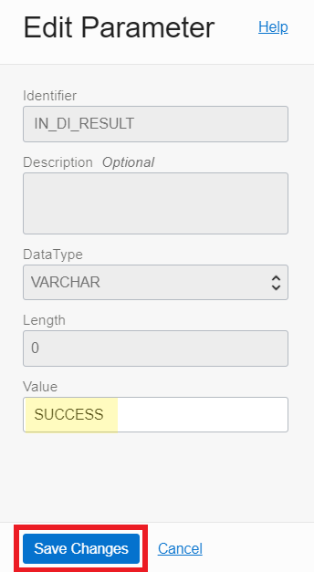
    - In the row of the input parameter value for PIPELINE\_NAME\_TASK\_RUN, click **Configure**.
    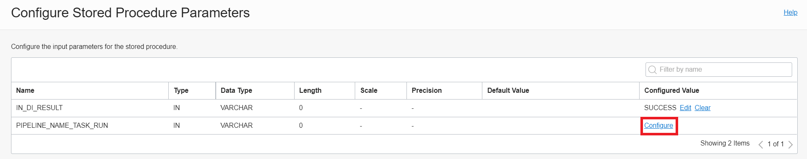
    - In the Edit Parameter panel, enter value **DEFAULT** (without any apostrophes) for that input parameter and click Save Changes.
    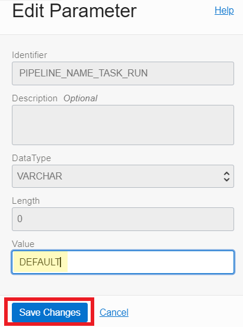
    - Click **Done**.
    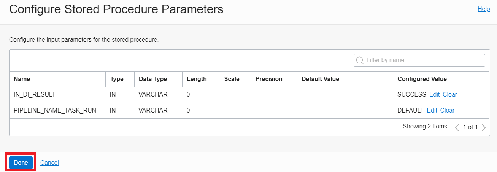

11. In the **Validate Task** section, click **Validate** to check for errors and warnings in the configured parameter values. When validation is completed, a **Successful** message should appear near Validation.

  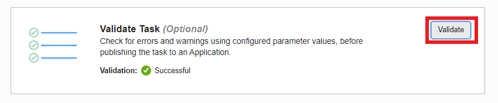

12. Click **Save and Close**.

  


   **Congratulations!**  You created the Data Flows, Integration tasks, Data Loader task and SQL tasks in OCI Data Integration.

## Learn More

* [Data Flow in OCI Data Integration](https://docs.oracle.com/en-us/iaas/data-integration/using/data-flows.htm)
* [Integration Task in OCI Data Integration](https://docs.oracle.com/en-us/iaas/data-integration/using/integration-tasks.htm)
* [Data Loader Task in OCI Data Integration](https://docs.oracle.com/en-us/iaas/data-integration/using/data-loader-tasks.htm)
* [SQL Task in OCI Data Integration](https://docs.oracle.com/en-us/iaas/data-integration/using/sql-tasks.htm)

## Acknowledgements

* **Author** - Theodora Cristea
* **Contributors** -  Aditya Duvuri, Rohit Saha
* **Last Updated By/Date** - Theodora Cristea, August 2021
