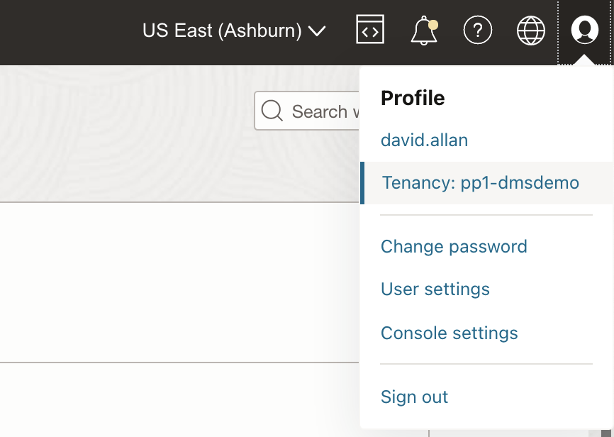
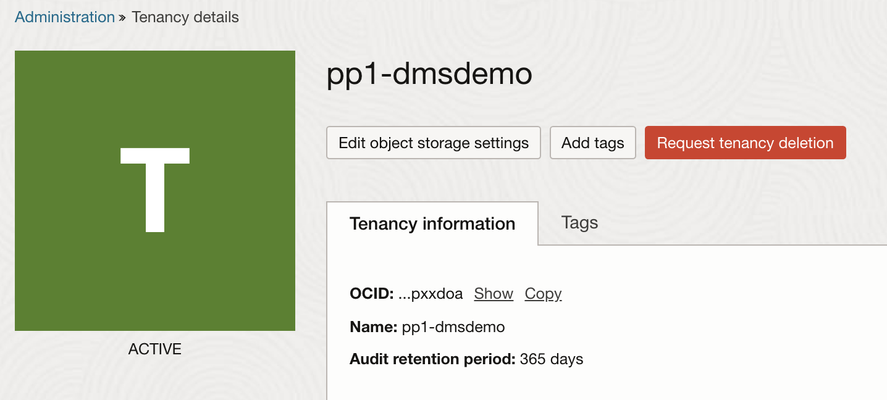


## Create the Object Storage and ADW Data Assets

## **Introduction**
Learn how to create **Data assets** for your source and target data sources used in *Create an OCI Data Integration Workspace*. You will be using **Object Storage** as the source and **Autonomous Data Warehouse** as the target. Data assets can be databases, flat files, and so on.

**Estimated Time**: 10 minutes
### **Objectives**
- Create Object Storage data asset
- Create Autonomous Data Warehouse data asset
##
## Task 1: Create Object Storage data asset
In this workshop, **Oracle Object Storage** serves as the **source data asset** for our data integration tasks. In this step you will create the Object Storage data asset in the Data integration workspace.

1. In the Oracle Cloud Infrastructure Console navigation menu, navigate to **Analytics & AI**. Under Data Lake, click **Data Integration**.

  

2. From the Workspaces page, make sure that you are in the compartment you created for data integration (DI-compartment). Click on your **Workspace** (DI-workspace).

  

3. On your workspace Home page, click **Create Data Asset** from the **Quick Actions tile**.

  

4. The Create Data Asset dialog box appears. Fill in the following:
   1. **Name**: Object_StorageNN replace NN with your user number ie. ObjectStorage01
   2. **Description**: you can optionally enter a description about your data asset.
   3. From the **Type** dropdown, select Oracle Object Storage.
   4. Under **Default Connection** Information, you can optionally enter a name and description for the connection or leave the default one.

5. After you complete all the required fields, you can click on **Test Connection** to ensure you've entered the data asset details correctly. A success or failure message displays, indicating whether the test was successful or not. If the test fails, review your connection settings and try again.

  

6. Click **Create**.

  

##
## Task 2: Create Autonomous Data Warehouse data asset
7. In the Oracle Cloud Infrastructure Console topright menu, navigate to the tenancy and click.

8. In the console page copy the OCID and paste into a notepad on your laptop.

8. In the Oracle Cloud Infrastructure Console navigation menu, navigate to **Analytics & AI**. Under Data Lake, click **Data Integration**.

  

9. From the Workspaces page, make sure that you are in the compartment for data integration (DI-compartment). Click on your **Workspace** (DI-workspace).

  

10. From the workspace home landing page, click **Data Assets**.

  

11. You can see your current existing Data Assets, more specifically the Object Storage. To create a new Data Asset for ADW, click on **Create Data Asset**.

  

12. On the **Create Data Asset** page, for **General Information**, set the following:
   1. **Name**: Data_WarehouseNN replace NN with your user number ie. Data_Warehouse01
   2. **Identifier**: Auto-generated based on the value you enter for Name.
   3. **Description**: It is optional to give a description for your data asset.
   4. **Type**: Oracle Autonomous Data Warehouse.
   5. Choose the **Select database** option to provide the login credentials for the ADW
   6. **Tenant OCID**: Paste the tenanct OCID. See the process to copy the tenant OCID in *Copying the tenant OCID* above.
   7. Change to compartment DISWorkspaces.
   8. Select database iad-test.

  

13. In the **Connection** section, enter the following:
   1. **Name**: BETA connection
   2. **Description**: Optional (For example, Connect with BETA user)
   3. **User Name**: BETA
   4. **Password**: The password you added for BETA user in *Setting up the Data Integration prerequisites in OCI*.
   5. **TNS alias**: Choose the **low** service of Autonomous Data Warehouse. *Note*: For more information on predefined Database Service Names for Autonomous Data Warehouse, please see the following [link](https://docs.oracle.com/en/cloud/paas/autonomous-data-warehouse-cloud/cswgs/autonomous-connect-database-service-names.html#GUID-9747539B-FD46-44F1-8FF8-F5AC650F15BE).

  

14. After you complete all the required fields, you can click **Test Connection** to ensure you've entered the data asset details correctly. A success or failure message displays, indicating whether the test was successful or not. If the test fails, review your connection settings and try again.

  

15. Click **Create**.

  

**Congratulations!** Now you have created the Data Assets for Autonomous Data Warehouse and Object Storage, in OCI Data Integration.

