# Create an Application, a Pipeline and publish tasks

## Introduction

Learn how to create an OCI Data Integration **application**, **publish tasks** into the application and create a Data Integration **pipeline** which calls the published tasks.

The Pipeline you will create will orchestrate the execution of all of the tasks you created and published in _Create a Data Loader task, two Data Flows, Integration tasks and a SQL task_. It will load and transform Customers, Revenues and Employees data and populate a statistics table in the Autonomous Data Warehouse with the success/error result of the Pipeline, along with the pipeline name and task run key.

**Estimated Time**: 20 minutes

### Objectives
* Create an Application
* Publish tasks to Application
* Creating a Pipeline which calls the published tasks
* Creating a Pipeline Task
* Publish the Pipeline Task

## Task 1: Create an Application

In OCI Data Integration, an **Application** is a container for published tasks, data flows, and their dependencies. You can run published tasks in an Application for testing, or roll them out into production.

1. In the Oracle Cloud Infrastructure Console navigation menu, navigate to **Analytics & AI**. Under Data Lake, click **Data Integration**.

  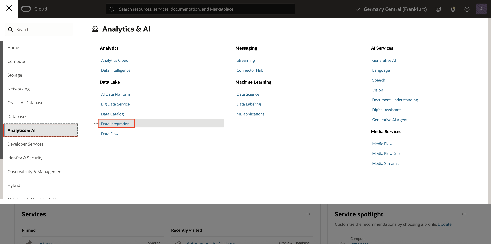

2. From the Workspaces page, make sure that you are in the compartment you created for data integration (DI-compartment). Click on your **Workspace** (DI-workspace).

  

3. On the workspace Home page, in the **Quick Actions tile**, click **Create Application**.

  

4. On the Applications page, enter `Workshop ApplicationNN`  (replace NN with your user number) for **Name**. You can optionally give a short **Description** for your application, then click **Create**.

  

5. The **Application Details page** for `Workshop ApplicationNN` opens in a new tab.

  

## Task 2: Publish tasks to Application

In Oracle Cloud Infrastructure Data Integration, a **Task** is a design-time resource that specifies a set of actions to perform on data. You create tasks from a project details or folder details page. You then publish the tasks into an Application to test or roll out into production.

You will publish into the Workshop Application all of the tasks that you have created in _Create a Data Loader task, two Data Flows, Integration tasks and a SQL task_.

1. From the Application Details you are currently in, click on **Open tab** (plus icon) in the tab bar and select **Projects**.

  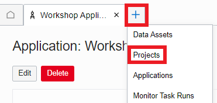

2. Select your `DI_WorkshopNN` project from the projects list.

  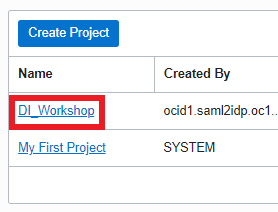

3. In the **Tasks** list, **check all of the four tasks** you created in _Create a Data Loader task, two Data Flows, Integration tasks and a SQL task_.

  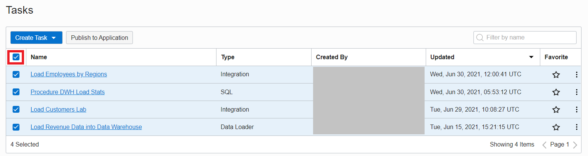

4. Click on **Publish to Application** button.

  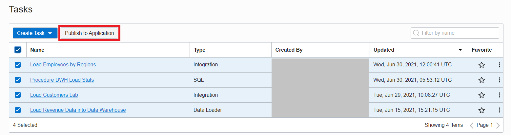

5. In the Publish to Application dialog, select `Workshop ApplicationNN` and then click **Publish**.

   *Note*: You can modify the tasks or edit the data flow without impacting the published task. This enables you to test a version of your data flow, while working on some new changes.

  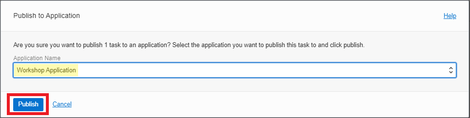

6. You can now go to your `Workshop ApplicationNN` to see your published task. On your workspace Home page, click **Open tab** (plus icon) in the tab bar, select **Applications**.

  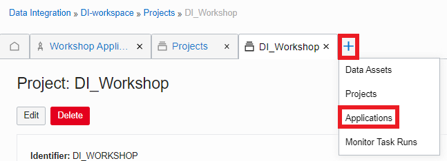

7. Select you `Workshop ApplicationNN` from the list of applications.

  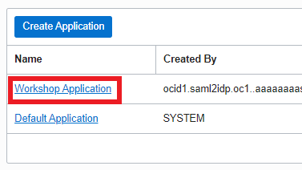

8. From the landing page of `Workshop ApplicationNN`, click on **Patches**. A patch contains updates to published tasks in an Application. When you publish a task to an Application or unpublish a task, a patch is created in the Application. If you publish a group of tasks at the same time, only one patch is created. You should now see the patch that was created for the tasks you are publishing, with the status **In Progress**.

  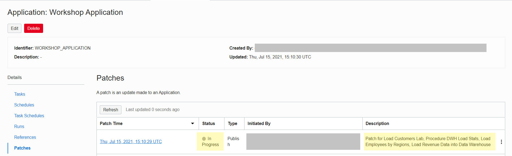

9. Click on the **Refresh** button for Patches. After a short time, the status of the patch should be displayed as **Success**.

  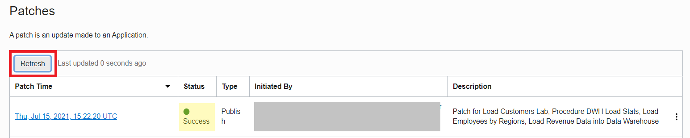

10. Click on **Tasks** tab under Details. You can now see the **list of published tasks** inside your `Workshop ApplicationNN`.

  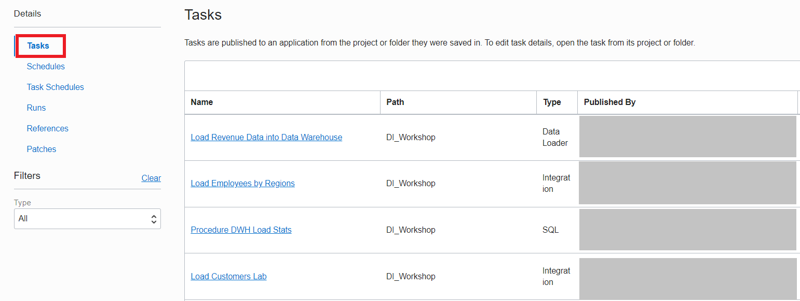

## Task 3: Create a Pipeline

A **pipeline** is a set of tasks connected **in a sequence** or **in parallel** to facilitate data processing. It manages and orchestrates the execution of a set of related tasks and processes. The pipeline functionality in Oracle Cloud Infrastructure Data Integration helps write complex data pipelines using published tasks from any application, and you can add data loader, integration or SQL tasks. You can create pipelines quickly using a designer similar to the Data Flow designer.

The Pipeline you will create in this step will orchestrate the execution of all of the tasks you created and published in this Workshop until now. The pipeline will begin with the **parallel execution** of the `LOAD_CUSTOMERS_LAB` **Integration Task** and `LOAD_REVENUE_DATA_INTO_DATA_WAREHOUSE` **Data Loader task**. After the successful execution of these two tasks, the `LOAD_EMPLOYEES_BY_REGIONS` **Integration Task** will be executed in sequence.
Then, an **Expression operator** will add a new field that is populated with the Pipeline name and Task run key **system parameters of the pipeline**.
The following **SQL task** step will get success/error input configured in the pipeline and the system parameters expression as the **Input parameters**. It will load this information in the Autonomous Data Warehouse, according to the SQL stored procedure logic.

Any user interested in seeing the successful/ unsuccessful result of the Data Integration Pipeline along with the pipeline name and task run key will be able to either do it in the database by querying the `DWH_LOAD_STATS` table, or by checking the result in the Data Integration Application from OCI Console.


1. From the OCI Data Integration Workspace home page, click on **Open tab** (plus icon) in the tab bar and select **Projects**.

  

2. Select your `DI_WorkshopNN` project from the projects list.

  

3. Select **Pipelines** section under project Details tab.

  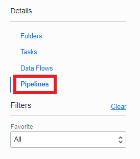

4. Click on **Create Pipeline**.

  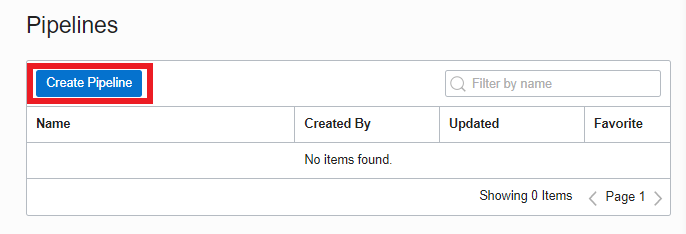

5. The **canvas for designing the Pipeline** is now displayed. The **start and end operators** are already added by default to the canvas. You will start by renaming the Pipeline. Under Properties for the Pipeline, on Details section, currently the name is `New Pipeline`. **Rename** to `Load DWH Pipeline`.

  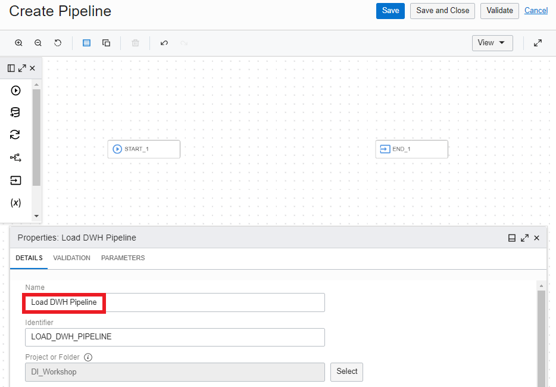

6. Click on **Save** button. The title of the pipeline will change to the pipeline name you have just added.

  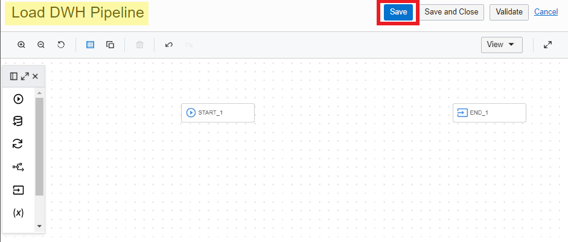

7. To add a task, you will drag and drop a task operator from the Operators Panel. Start with the drag and drop of an **Integration task**. Connect **START\_1** operator to the **Integration task** you added.

  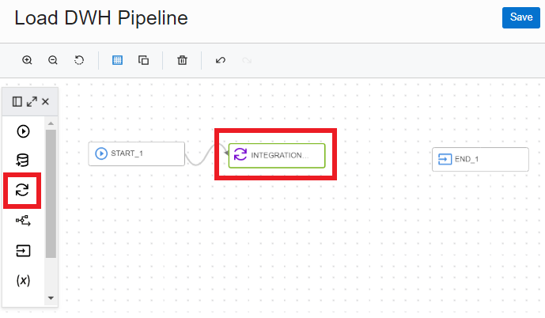

8. In the Properties tab for **INTEGRATION\_TASK\_1**, Details section, click on Select to choose a published Integration task from your Application.

  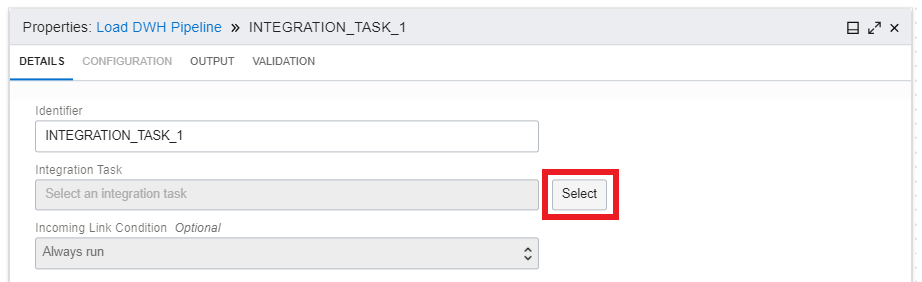

9. A page pops up with the selections for the **Integration Task**:

    - The **Compartment** with your OCI Data Integration resources is already selected.
    - The **Workspace** you are currently working in is already selected.
    - For **Application**, make sure you select the `Workshop ApplicationNN`.
    - Under **Integration Task**, check the `Load Customers Lab` task.
    - Click **Select**.

    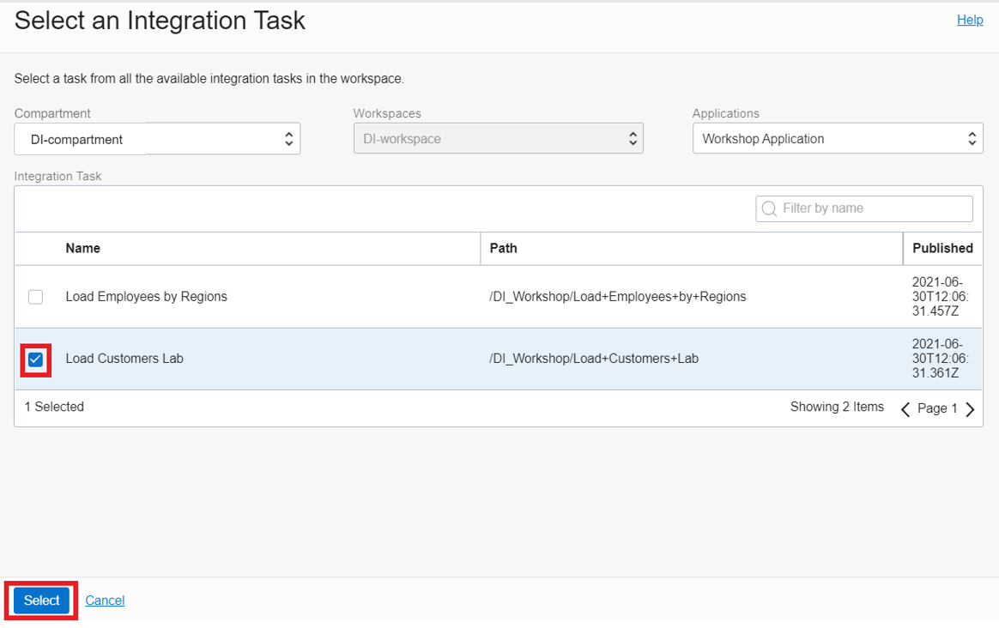

10. In the properties bar, the **Integration Task** `Load Customers Lab` is now selected. The Identifier has automatically changed with the name of Integration Task you selected. For Incoming Link Condition, leave the default option of **Always run**.  *Note*: Be sure to save often during design time!

  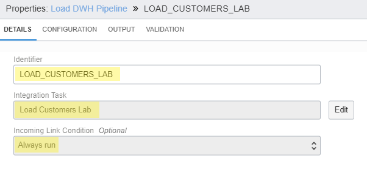

11. Drag and drop a **Data Loader** component into the Pipeline canvas. We want this task to be run **in parallel** with the Integration task we have just defined, so connect **START\_1** operator with the **Data Loader task operator**.

  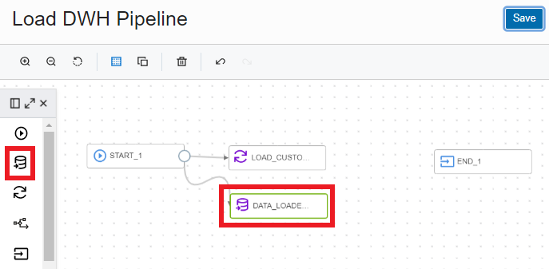

12. On the Properties tab for **DATA\_LOADER\_TASK\_1**, Details section, click on Select to choose a **published Data Loader task from your Application**.

  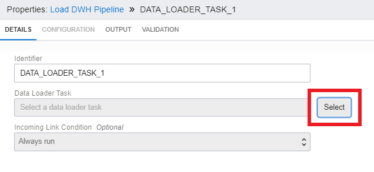

13. A page pops up with the selections for the **Data Loader Task**:

    - The **Compartment** with your OCI Data Integration resources is already selected.
    - The **Workspace** you are currently working in is already selected.
    - For **Application**, make sure you select the `Workshop ApplicationNN`.
    - Under **Data Loader Task**, check the `Load Revenue Data into Data Warehouse` task.
    - Click **Select**.

    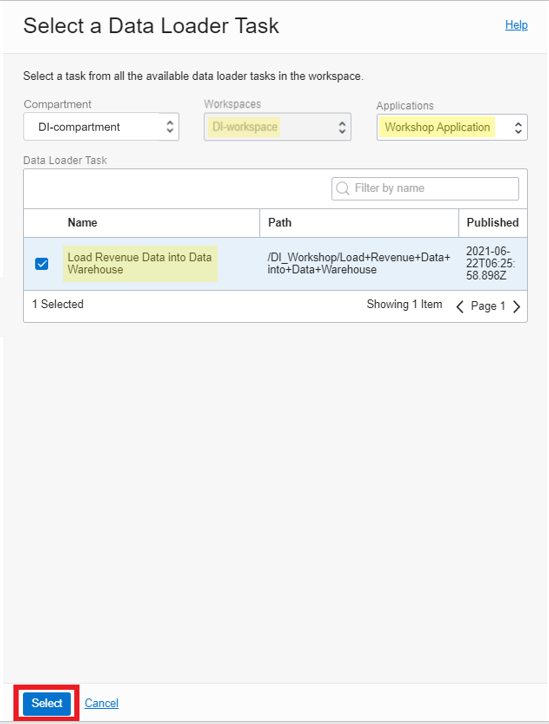

14. In the properties bar, the **Data Loader Task** `Load Revenue Data into Data Warehouse` is now selected. The Identifier has automatically changed with the name of Data Loader Task you selected. For Incoming Link Condition, leave the default option of **Always run**.

  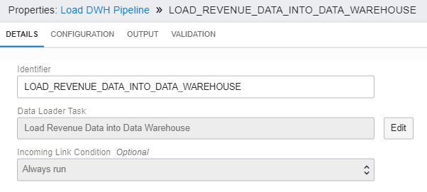

15. For these two tasks to run **in parallel**, you will now add a **merge operator**. Drag and drop the Merge operator on the canvas, then connect the two tasks (LOAD\_CUSTOMERS\_LAB and LOAD\_REVENUE\_DATA\_INTO_DATA\_WAREHOUSE) to the MERGE\_1 operator.

  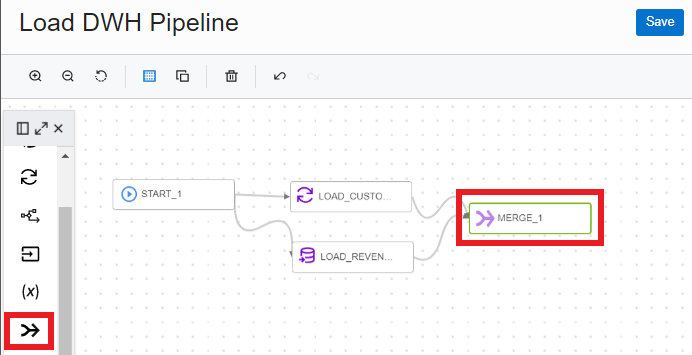

16. Under the Details tab of the **Properties** panel of the **MERGE\_1** operator, you can enter a name and optional description. Change the name to MERGE\_SUCCESS. For Merge Condition select the **All Success** option, which means that all parallel operations that are linked upstream must complete and succeed before the next downstream operation can proceed.  *Note*: Be sure to save often during design time!

  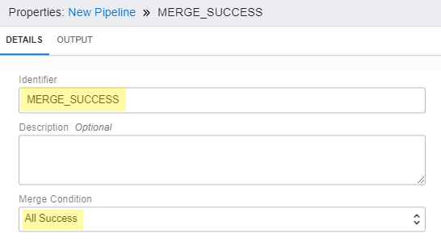

17. Drag and drop an **Integration task** to the pipeline canvas. Connect **MERGE\_1** operator to the Integration task you added.

  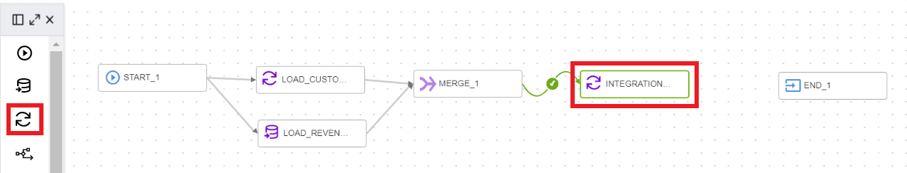

18. On the Properties tab for **INTEGRATION\_TASK\_1**, Details section, click on Select to choose a published Integration task from your Application. This integration task will run **in sequence** after the successful run of the previous parallel tasks.

  

19. A page pops up with the selections for the **Integration Task**:

    - The **Compartment** with your OCI Data Integration resources is already selected.
    - The **Workspace** you are currently working in is already selected.
    - For **Application**, make sure you select the `Workshop ApplicationNN`.
    - Under **Integration Task**, check the `Load Employees by Regions` task.
    - Click **Select**.

    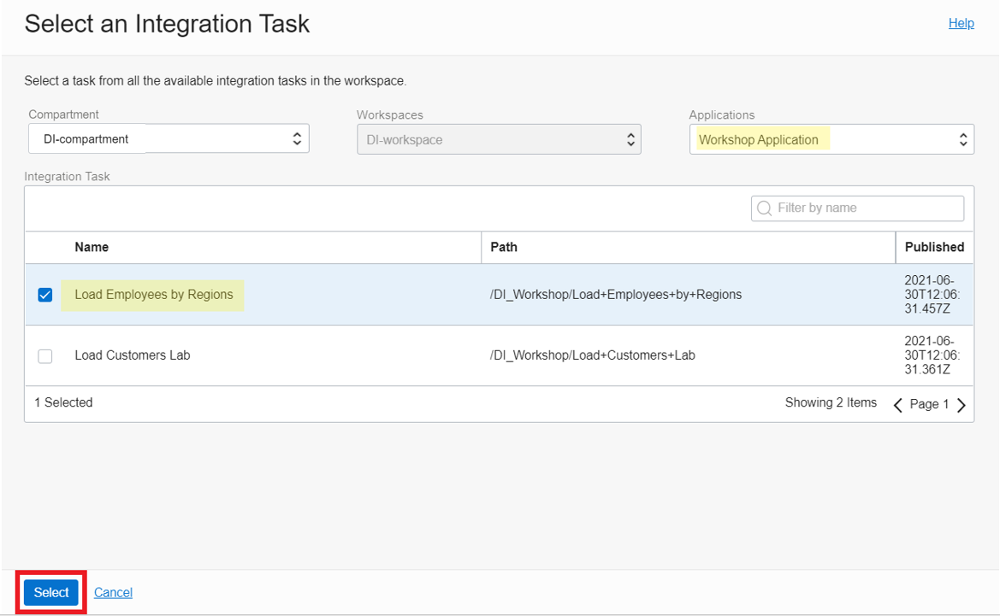

20. In the properties bar, the **Integration Task** `Load Employees by Regions` is now selected. The Identifier has automatically changed with the name of Integration Task you selected. For Incoming Link Condition, leave the default option of **Run on success of previous operator**.

  

21. Drag and drop an **Expression** operator to the pipeline canvas. A pipeline expression operator lets you create new, derivative fields in a pipeline, similar to an expression operator in a data flow. **Connect the Expression operator** to the **LOAD\_EMPLOYEES\_BY\_REGIONS** integration task.

  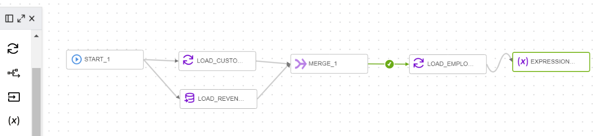

22. In the **Properties** bar of **EXPRESSION\_1** operator, change the Identifier to **PIPELINE\_NAME\_TASK\_RUN** and click on **Add** under Expression.  *Note*: Be sure to save often during design time!

  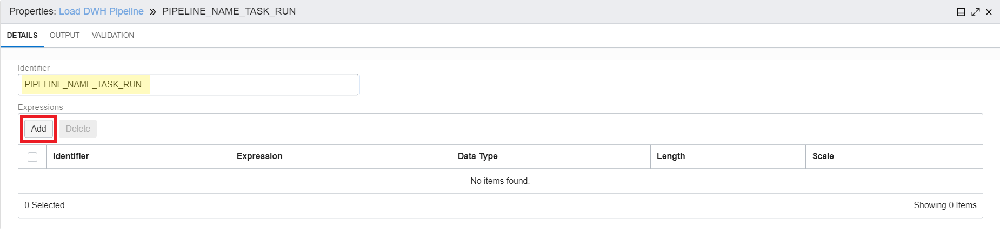

23. This **Expression** will create a new field based on the **System Defined Parameters** of the pipeline. Generated system parameter values can be used in expressions but the values cannot be modified. For more information on System parameters in OCI Data Integration pipeline, please see this [link](https://docs.oracle.com/en-us/iaas/data-integration/using/pipeline-parameters.htm#parameter-types-pipeline__system-defined-parameters).
The expression will concatenate the **PIPELINE\_NAME** system parameter with the **TASK\_RUN\_KEY** system parameter,  and the new field will later on be used in the pipeline as input parameter for SQL task.

   In the **Add Expression** panel:

    - Enter name `PIPELINE_NAME_RUN` in the **Identifier** field.
    - Leave the default `VARCHAR` **Data Type** and default **Length**.
    - Copy the following expression and paste it in the **Expression Builder** box. This expression concatenates the PIPELINE\_NAME system parameter with a space character and the TASK\_RUN\_KEY system parameter.
    ```
    CONCAT(CONCAT(${SYS.PIPELINE_NAME}, ' '),${SYS.TASK_RUN_KEY})
    ```
   *Note*: You can also manually create the expression in the Expression Builder, by double-click or drag an drop of the System defined parameters and CONCAT function.
    - Click **Add**.

  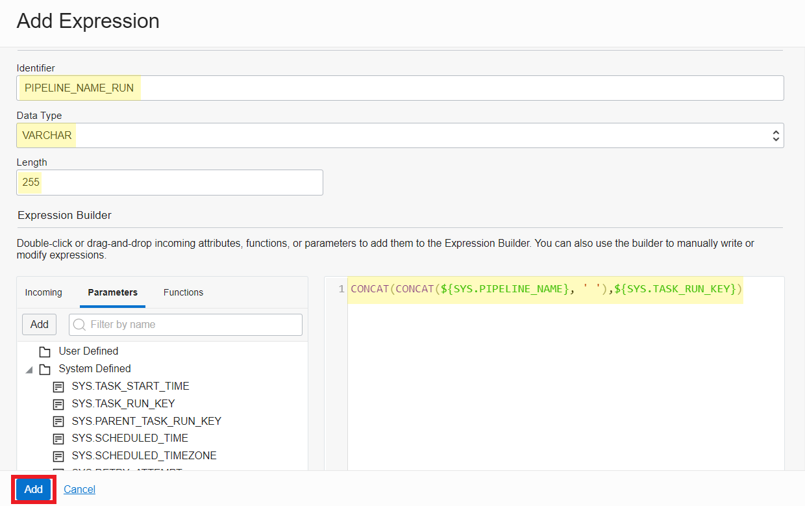

24. Drag and drop a **SQL task** operator to the pipeline canvas. Connect the SQL task operator to the **PIPELINE\_NAME\_TASK\_RUN** expression operator.

  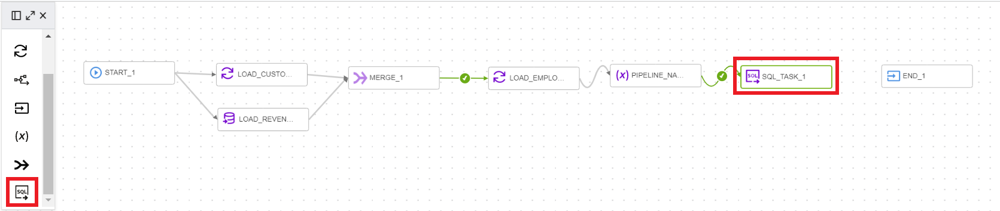

25. On the Properties tab for **SQL\_TASK\_1**, Details section, click on Select to choose a **published SQL task from your Application**.

  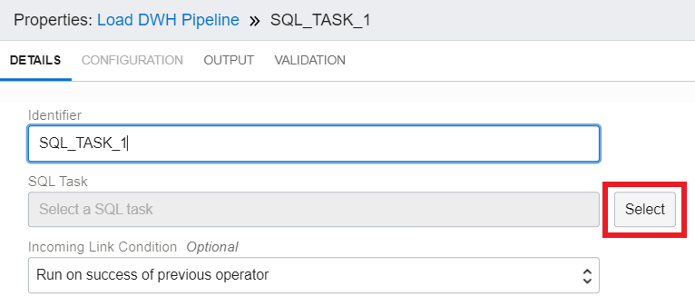

26. A page pops up with the selections for the **SQL Task**:

    - The **Compartment** with your OCI Data Integration resources is already selected.
    - The **Workspace** you are currently working in is already selected.
    - For **Application**, make sure you select the `Workshop ApplicationNN`.
    - Under **SQL Task**, check the `Procedure DWH Load Stats` task.
    - Click **Select**.

  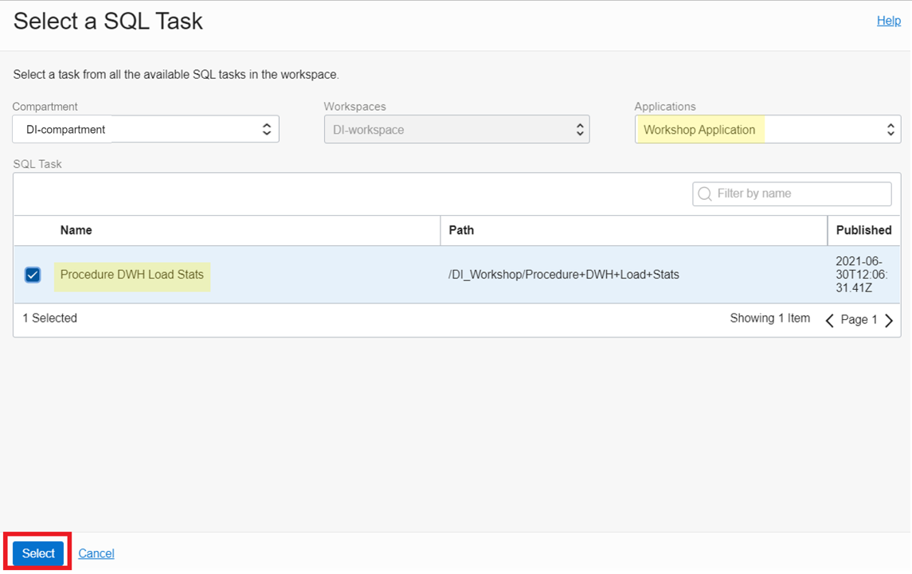

27. In the properties bar, the **SQL Task** `Procedure DWH Load Stats` is now selected. The Identifier has automatically changed with the name of SQL Task you selected. For Incoming Link Condition, leave the default option of **Run on success of previous operator**.  *Note*: Be sure to save often during design time!

  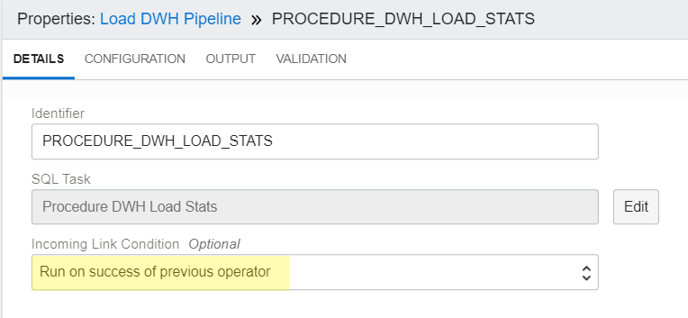

28. In the properties bar, click on **Configuration** tab and then on Configure where you have **Incoming Parameters Configured: 0/2**.

  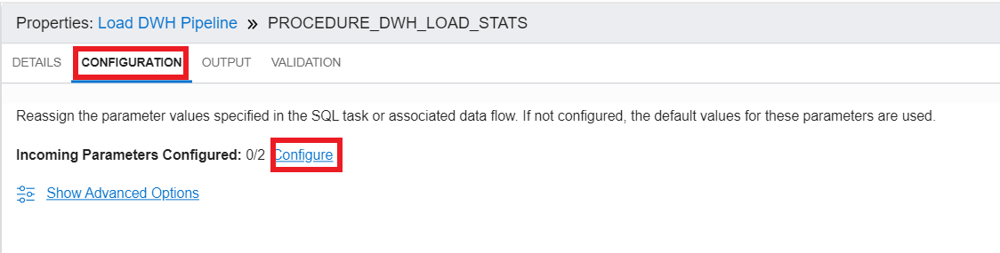

29. A window to **Configure Incoming Parameters** pops up. OCI Data Integration identified the **input parameters of your procedure** (OCIDI\_RESULT and PIPELINE\_NAME\_TASK\_RUN) from the SQL task. Click on **Configure** for the **IN\_DI\_RESULT** parameter.

  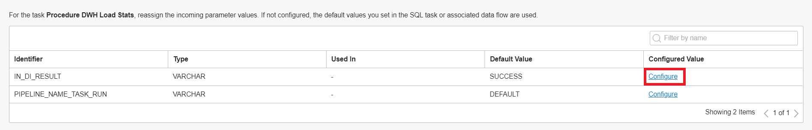

30. In the new windows that is displayed:

    - Leave the **Assign a value** option checked. This means you will override the default value of this parameter.
    - In Default value box, write **SUCCESS**.
    - Click **Done**.

  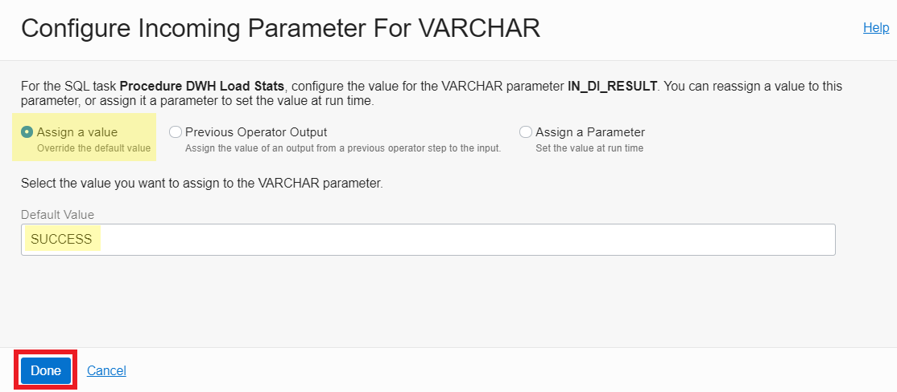

31. In the Configure Incoming Parameters window, click on **Configure** for the **PIPELINE\_NAME\_TASK\_RUN** parameter.

  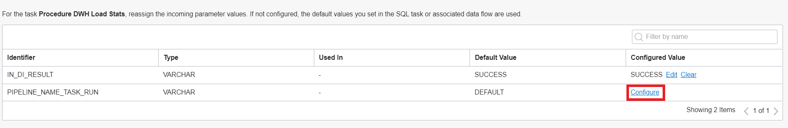

32. In the new windows that is displayed:

    - Select **Previous Operator Output** option, to assign the value of an output from a previous operator step to the input.
    - Check the box to select the `PIPELINE_NAME_TASK_RUN.PIPELINE_NAME_RUN` field from the previous Expression operator. The SQL task will use the value from the Expression as the input parameter for the SQL task.
    - Click **Done**.

   *Note*: Be sure to save often during design time!
   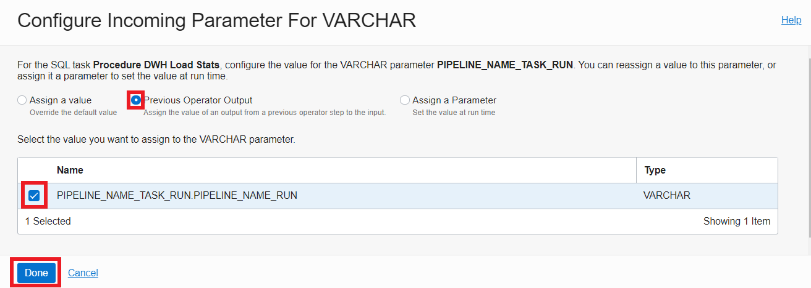

33. The two input parameters of the SQL task now have Configured values . Click **Configure**.

  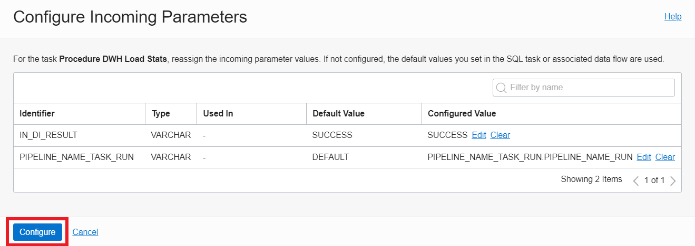

34. In **Configuration tab**, the **Incoming Parameters** are now displayed as configured **(2/2)**.

  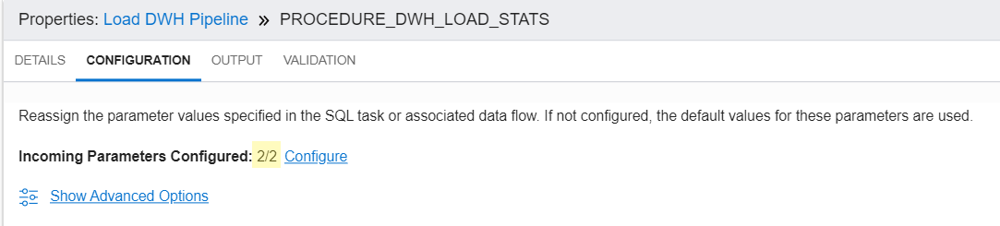

35.  Drag and drop another **SQL task operator** to the pipeline canvas. Connect the SQL task operator to the **PIPELINE\_NAME\_TASK\_RUN** expression operator.

  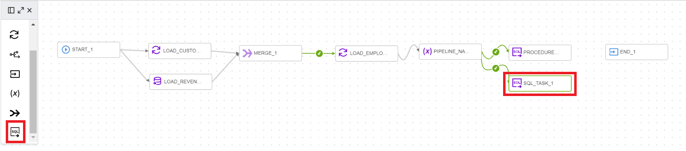

36. On the Properties tab for **SQL\_TASK\_1**, Details section, click on Select to choose a **published SQL task from your Application**.

  

37. A page pops up with the selections for the **SQL Task**:

    - The **Compartment** with your OCI Data Integration resources is already selected.
    - The **Workspace** you are currently working in is already selected.
    - For **Application**, make sure you select the `Workshop ApplicationNN`.
    - Under **Integration Task**, check the `Procedure DWH Load Stats` task.
    - Click **Select**.

  

38. In the properties bar, the **SQL Task** `Procedure DWH Load Stats` is now selected. The Identifier has automatically changed with the name of SQL Task you selected. For Incoming Link Condition, leave the default option of **Run on failure of previous operator**. The arrow from the previous operator to the new SQL task operator will turn **red**.  *Note*: Be sure to save often during design time!

  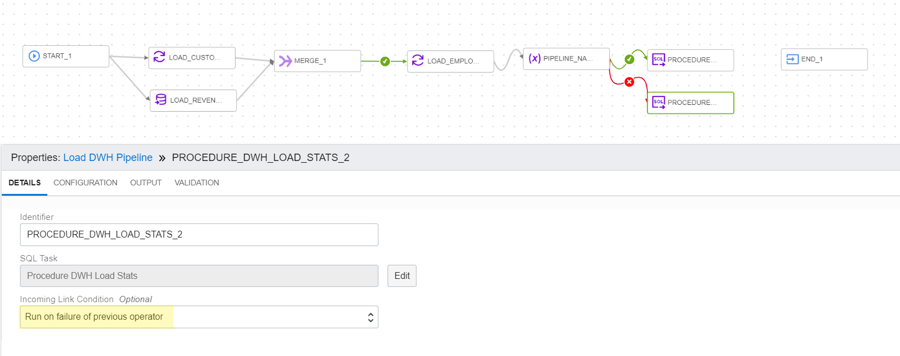

39. In the properties bar, click on **Configuration** tab and then on Configure where you have **Incoming Parameters Configured: 0/2**.

  

40. A window to **Configure Incoming Parameters** pops up. OCI Data Integration identified the **input parameters of your procedure** (OCIDI\_RESULT and PIPELINE\_NAME\_TASK\_RUN) from the SQL task. Click on **Configure** for the **IN\_DI\_RESULT** parameter.

  

41. In the new windows that is displayed:

    - Leave the **Assign a value** option checked. This means you will **override the default value of this parameter**
    - In Default value box, write **ERROR**
    - Click **Done**.

    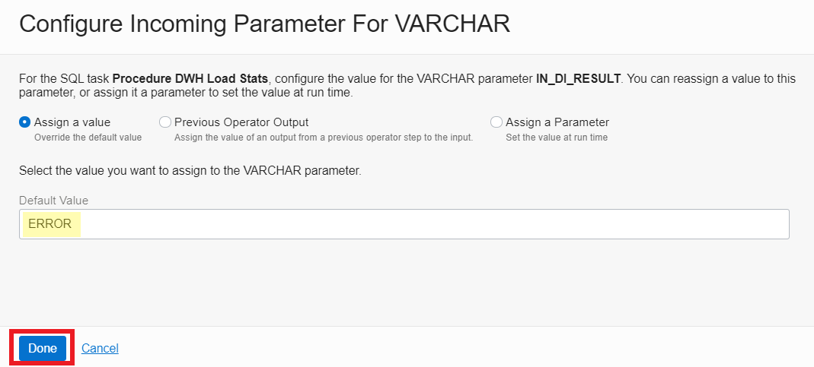

42. In the Configure Incoming Parameters window, click on **Configure** for the **PIPELINE\_NAME\_TASK\_RUN** parameter. Click **Configure.**

  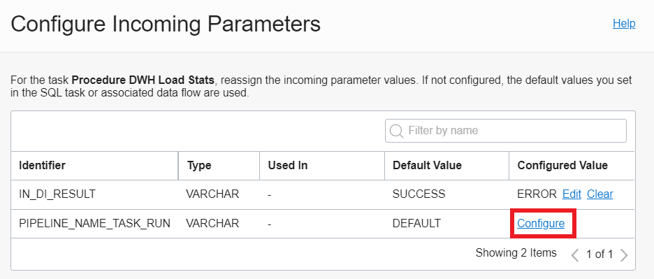

43. In the new windows that is displayed:

    - Select **Previous Operator Output** option, to assign the value of an output from a previous operator step to the input.
    - Check the box to select the `PIPELINE_NAME_TASK_RUN.PIPELINE_NAME_RUN` field from the previous Expression operator. The SQL task will use the value from the Expression as the input parameter for the SQL task.
    - Click **Done**.

    

44. The two input parameters of the SQL task now have Configured values . Click **Configure**.

  

45. In **Configuration tab**, the **Incoming Parameters** are now displayed as configured **(2/2)**.

  

46. Connect the **two SQL tasks** to the **END\_1** operator. The final Pipeline should look like this:

  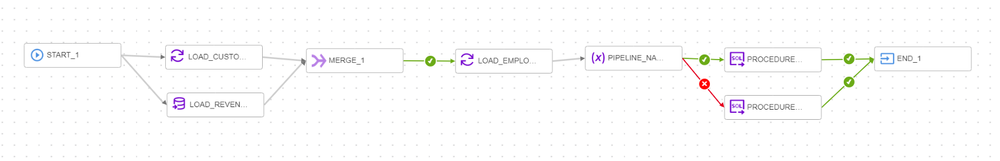

47. Click **Validate**. The result of the Global Validation should display no warnings and no errors.

  

48. Click on **Save and Close**.

  

## Task 4: Create a Pipeline task

Pipeline tasks let you take your pipeline design and choose the parameter values you want to use at runtime.
You will create a Pipeline task for the pipeline you created in the above step.

1. On the `DI_WorkshopNN` Project Details page, from the submenu, click **Tasks**.

  

2. Click **Create Task**, and then select **Pipeline**.

  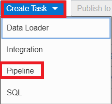

3. On the **Create Pipeline Task** page, enter:

    - For **Name** enter `Load DWH Pipeline Task`
    - **Description** (optional)
    - **Project** `DI_WorkshopNN` is auto-populated because we're creating this task from project details page.

    

4. In the **Pipeline** section, click **Select**.

  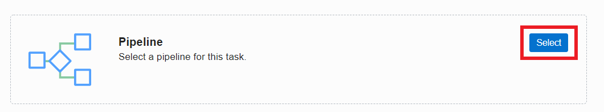

5. In the **Select a Pipeline** panel, select the `Load DWH Pipeline`	that this task will run. Then, click Select.

  

6. After selecting the pipeline, it will automatically be validated. When you see the Validation message as **Successful**, click on **Save and Close**.

  

## Task 5: Publish the Pipeline task

1. On the `DI_WorkshopNN` Project Details page, from the submenu, click **Tasks**.

  

2. All tasks from the `DI_WorkshopNN` project will be displayed. Click on the **Actions menu** (three dots) for the `Load DWH Pipeline Task`. Then, click on **Publish to Application**.

  

3. In the Publish to Application dialog, select the `Workshop ApplicationNN` to publish to from the drop-down list. Then, click **Publish**.

  

   **Congratulations!**  

## Learn More

* [Applications in OCI Data Integration](https://docs.oracle.com/en-us/iaas/data-integration/using/applications.htm)
* [Pipelines in OCI Data Integration](https://docs.oracle.com/en-us/iaas/data-integration/using/pipeline.htm)
* [Pipeline Tasks in OCI Data Integration](https://docs.oracle.com/en-us/iaas/data-integration/using/pipeline-tasks.htm)
* [Using Parameters in Pipelines](https://docs.oracle.com/en-us/iaas/data-integration/using/pipeline-parameters.htm#parameter-types-pipeline__system-defined-parameters)
* [Publishing Design Tasks in OCI Data Integration](https://docs.oracle.com/en-us/iaas/data-integration/using/publish-design-tasks.htm)
* [Patches in OCI Data Integration Applications](https://docs.oracle.com/en-us/iaas/data-integration/using/patches.htm#patches)

## Acknowledgements

* **Author** - Theodora Cristea
* **Contributors** -  Aditya Duvuri, Rohit Saha
* **Last Updated By/Date** - Theodora Cristea, July 2021
