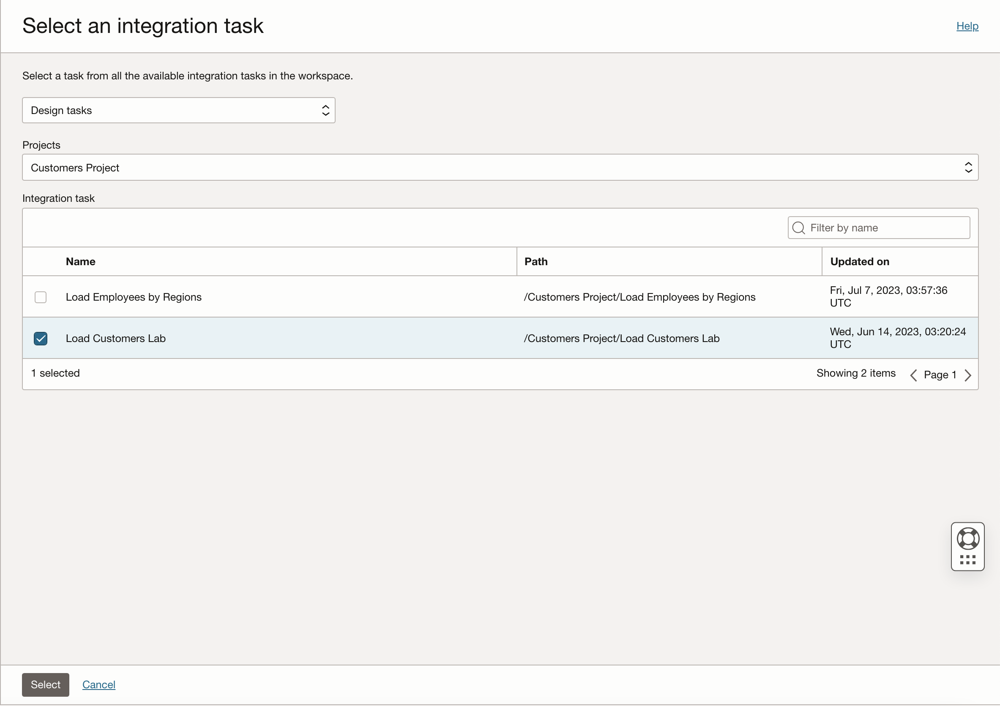

# Create an Application, a Pipeline and publish tasks

## Introduction

Learn how to create an OCI Data Integration **application**, **publish tasks** into the application and create a Data Integration **pipeline** which calls the published tasks.

The Pipeline you will create will orchestrate the execution of all of the tasks you created and published in _Create a Data Loader task, Create a Data Flows and Integration tasks_. It will load and transform Customers, Revenues and Employees data and populate a statistics table in the Autonomous Data Warehouse with the success/error result of the Pipeline, along with the pipeline name and task run key.

**Estimated Time**: 20 minutes

### Objectives
* Creating a Pipeline
* Creating a Pipeline Task
* Create an Application
* Publish the Pipeline Task

## Task 1: Create a Pipeline

A **pipeline** is a set of tasks connected **in a sequence** or **in parallel** to facilitate data processing. It manages and orchestrates the execution of a set of related tasks and processes. The pipeline functionality in OCI Data Integration helps write complex data pipelines using published tasks from any application, and you can add data loader, integration REST, Pipeline or SQL tasks. You can create pipelines quickly using a designer similar to the Data Flow designer.

The Pipeline you will create in this step will orchestrate the execution of all of the tasks you created and published in this Workshop until now. The pipeline will begin with the **parallel execution** of the `LOAD_CUSTOMERS_LAB` **Integration Task** and `LOAD_REVENUE_DATA_INTO_DATA_WAREHOUSE` **Data Loader task**. After the successful execution of these two tasks, the `LOAD_EMPLOYEES_BY_REGIONS` **Integration Task** will be executed in sequence.
You can also reference Pipeline name and Task run key **system parameters of the pipeline** and pass them as parameters into your own tasks.

Any user interested in seeing the successful/ unsuccessful result of the Data Integration Pipeline along with the pipeline name and task run key will be able to either do it in the Data Integration Application from OCI Console or whevever you want to persist in your own custom tasks.

1. From the OCI Data Integration Workspace home page, click on **Open tab** (plus icon) in the tab bar and select **Projects**.

  

2. Select your `DI_WorkshopNN` project from the projects list.

  

3. Select **Pipelines** section under project Details tab.

  

4. Click on **Create Pipeline**.

  

5. The **canvas for designing the Pipeline** is now displayed. The **start and end operators** are already added by default to the canvas. You will start by renaming the Pipeline. Under Properties for the Pipeline, on Details section, currently the name is `New Pipeline`. **Rename** to `Load DWH Pipeline`.

  

6. Click on **Create** button. The title of the pipeline will change to the pipeline name you have just added.

  

7. To add a task, you will drag and drop a task operator from the Operators Panel. Start with the drag and drop of an **Integration task**. Connect **START\_1** operator to the **Integration task** you added.

  

8. In the Properties tab for **INTEGRATION\_TASK\_1**, Details section, click on Select to choose a published Integration task from your Application.

  

9. A page pops up with the selections for the **Integration Task**:

    - Select **Design tasks** and select the name **Customers Project**.
    - Under **Integration Task**, check the `Load Customers Lab` task.
    - Click **Select**.

    

10. Drag and drop a **Data Loader** component into the Pipeline canvas. We want this task to be run **in parallel** with the Integration task we have just defined, so connect **START\_1** operator with the **Data Loader task operator**.

  

11. On the Properties tab for **DATA\_LOADER\_TASK\_1**, Details section, click on Select to choose a **published Data Loader task from your Application**.

  

12. A page pops up with the selections for the **Data Loader Task**:

    - Select **Design tasks** and your project name **DI_WorkshopNN**.
    - Under **Data Loader Task**, check the `Load Revenue Data into Data Warehouse` task.
    - Click **Select**.

    

13. In the properties bar, the **Data Loader Task** `Load Revenue Data into Data Warehouse` is now selected. The Identifier has automatically changed with the name of Data Loader Task you selected. For Incoming Link Condition, leave the default option of **Always run**.

  

14. For these two tasks to run **in parallel**, you will now add a **merge operator**. Drag and drop the Merge operator on the canvas, then connect the two tasks (LOAD\_CUSTOMERS\_LAB and LOAD\_REVENUE\_DATA\_INTO_DATA\_WAREHOUSE) to the MERGE\_1 operator.

  

15. Under the Details tab of the **Properties** panel of the **MERGE\_1** operator, you can enter a name and optional description. Change the name to MERGE\_SUCCESS. For Merge Condition select the **All Success** option, which means that all parallel operations that are linked upstream must complete and succeed before the next downstream operation can proceed.  *Note*: Be sure to save often during design time!

  

16. Drag and drop an **Integration task** to the pipeline canvas. Connect **MERGE\_SUCCESS** operator to the Integration task you added.

  

17. On the Properties tab for **INTEGRATION\_TASK\_1**, Details section, click on Select to choose a published Integration task from your Application. This integration task will run **in sequence** after the successful run of the previous parallel tasks.

  

18. A page pops up with the selections for the **Integration Task**:

    - Select **Design tasks** and your project name **Customers Project**.
    - Under **Integration Task**, check the `Load Employees by Regions` task.
    - Click **Select**.

    

19. In the properties bar, the **Integration Task** `Load Employees by Regions` is now selected. The Identifier has automatically changed with the name of Integration Task you selected. For Incoming Link Condition, leave the default option of **Run on success of previous operator**.

  

20. Connect the **integration task** to the **END\_1** operator. The final Pipeline should look like this:

  

21. Click **Validate**. The result of the Global Validation should display no warnings and no errors.

  

22. Click on **Save and Close**.

  

## Task 2: Create a Pipeline task

Pipeline tasks let you take your pipeline design and choose the parameter values you want to use at runtime.
You will create a Pipeline task for the pipeline you created in the above step.

1. On the `DI_WorkshopNN` Project Details page, from the submenu, click **Tasks**.

  

2. Click **Create Task**, and then select **Pipeline**.

  

3. On the **Create Pipeline Task** page, enter:

    - For **Name** enter `Load DWH Pipeline Task`
    - **Description** (optional)
    - **Project** `DI_WorkshopNN` is auto-populated because we're creating this task from project details page.

    

4. In the **Pipeline** section, click **Select**.

  

5. In the **Select a Pipeline** panel, select the `Load DWH Pipeline`	that this task will run. Then, click Select.

  

6. After selecting the pipeline, it will automatically be validated. When you see the Validation message as **Successful**, click on **Save and Close**.

  

## Task 3: Create an Application

In OCI Data Integration, an **Application** is a container for published tasks, data flows, and their dependencies. You can run published tasks in an Application for testing, or roll them out into production.

1. On the workspace Home page, in the **Quick Actions tile**, click **Create Application**.

  

2. On the Applications page, click on `Create Blank Application` (its also possible to copy existing applications and create applications based on templates), then enter `Workshop ApplicationNN`  (replace NN with your user number) for **Name**. You can optionally give a short **Description** for your application, then click **Create**.

  

3. The **Application Details page** for `Workshop ApplicationNN` opens in a new tab.

  

In OCI Data Integration, a **Task** is a design-time resource that specifies a set of actions to perform on data. You create tasks from a project details or folder details page. You then publish the tasks into an Application to test or roll out into production.

## Task 4: Publish the Pipeline task

1. On the `DI_WorkshopNN` Project Details page, from the submenu, click **Tasks**.

  

2. All tasks from the `DI_WorkshopNN` project will be displayed. Click on the **Actions menu** (three dots) for the `Load DWH Pipeline Task`. Then, click on **Publish to Application**.

  

3. In the Publish to Application dialog, select the `Workshop ApplicationNN` to publish to from the drop-down list. Then, click **Publish**.

  

   **Congratulations!**  

## Learn More

* [Applications in OCI Data Integration](https://docs.oracle.com/en-us/iaas/data-integration/using/applications.htm)
* [Pipelines in OCI Data Integration](https://docs.oracle.com/en-us/iaas/data-integration/using/pipeline.htm)
* [Pipeline Tasks in OCI Data Integration](https://docs.oracle.com/en-us/iaas/data-integration/using/pipeline-tasks.htm)
* [Using Parameters in Pipelines](https://docs.oracle.com/en-us/iaas/data-integration/using/pipeline-parameters.htm#parameter-types-pipeline__system-defined-parameters)
* [Publishing Design Tasks in OCI Data Integration](https://docs.oracle.com/en-us/iaas/data-integration/using/publish-design-tasks.htm)
* [Patches in OCI Data Integration Applications](https://docs.oracle.com/en-us/iaas/data-integration/using/patches.htm#patches)

## Acknowledgements

* **Contributors** -  David Allan, Theodora Cristea
* **Last Updated By/Date** - David Allan, June 2023
