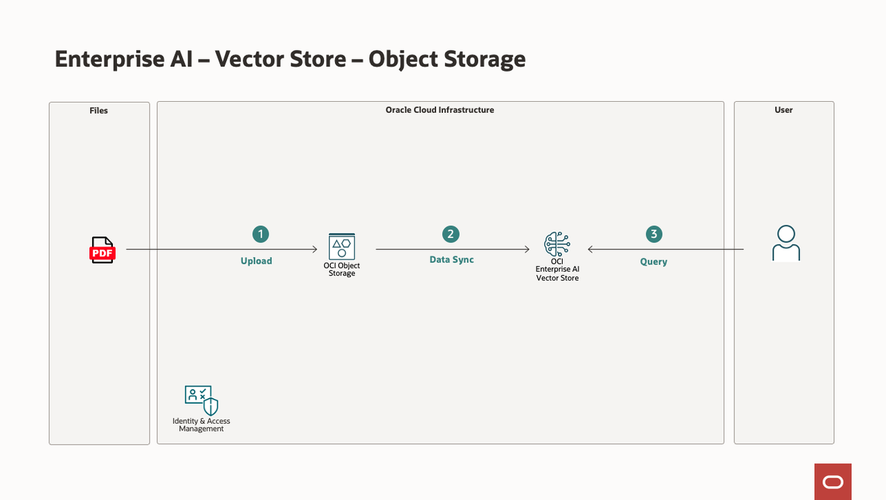
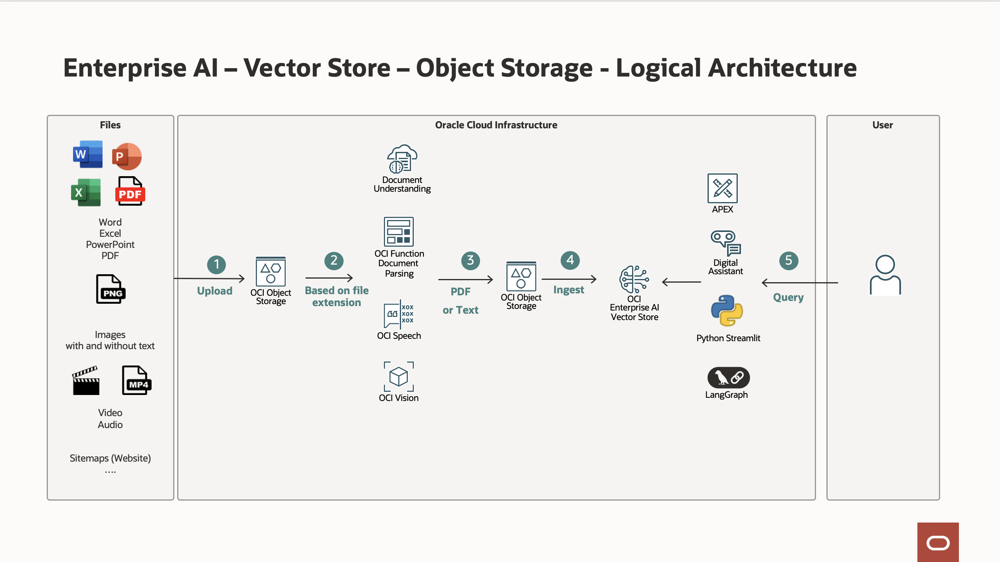
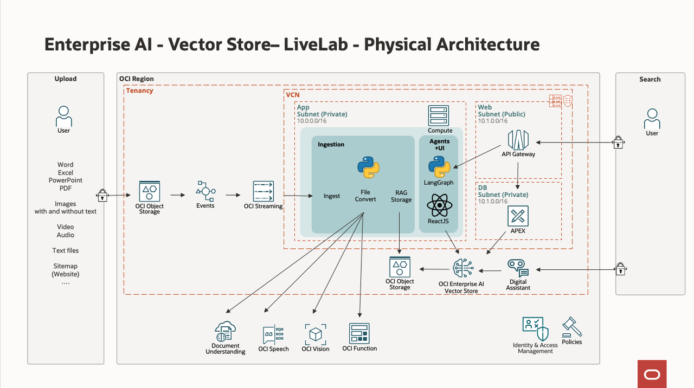

# Introduction

## About This Workshop
We will install OCI Enterprise AI - Vector Store. The goal is to be able to search in documents.
- First, we will install Vector Store manually and test it.
- Then, install all other components using Terraform that we will use in later labs. 
- Build several user interfaces using:
    - APEX
    - LangGraph   
    - Oracle Digital Assistant

We’ll be able to search documents like:
- Video and Audio files using OCI Speech
- Images using OCI Vision
- TIF files (FAX) using OCI Document Understanding
- Word, Excel, Powerpoint, ... using OCI Functions
- Websites using 
  - a Crawler (for all pages of a websites, based on Sitemap or not) 
  - or Selenium (for a fixed number of URLs)   

From the lab 3/4/5, we will create 3 user interfaces for the above using the following tools:
- APEX
- LangGraph  
- Oracle Digital Assistant
    
Lab 6 explain how to customize the demo to your needs.

Estimated Workshop Time: 90 minutes

## Vector Store

First, we will install vector-store manually, upload files to object storage, synchronize and test.

## Logical Architecture

Then from lab 2, we will install a terraform stack that pre-process files in different format to insert them in the Vector Store.

This picture shows the processing flow.

It works like this:
1. A document is uploaded to Object Storage "UPLOAD" by the user
1. An event is raised and queued. The event is processed by a Python program running on a VM. Based on the file type, it will send the file to one or more AI services to enrich them and provide searchable text
1. The searchable text is the result is uploaded to Object Storage "CONVERTED"
1. The Vector Store ingests the new files
1. The user query the Generative AI Agent

Here's how various file types are processed.

- If the file has the extension **.pdf**, **.txt**, **.csv**, **.md**, the file is copied to the CONVERTED Object Storage.
- If the file has the extension **.png**, **.jpg**, **.jpeg**, or **.gif**, it is processed by OCI Vision. The output is stored in the CONVERTED Object storage 
- If the file has the extension **.mp4**, **.avi**, **.mp3**, **.wav**, or **.m4a**, it is processed by OCI Speech.
- If the file has the extension **.tif**, it is processed by OCI Document Understanding.
- If the file has the extension **.json**, this is an output of the asynchronous AI services such as OCI Speech or OCI Document Understanding. 
- If the file has the extension **.doc**, **.docx**, **.ppt**, **.pptx**, first convert it to PDF 
- All other file types like are sent to an OCI Function with a generic document parser.

## Physical Architecture

We will install the following architecture using Terraform.

## Objectives

- Provision the services needed for the system
    - Compartment, Object Storage Bucket, Stream, Event, Vector Store, Enterprise AI, and a Virtual Machine
- Integrate the components into a working system
- Search for files through several types of user interfaces

**Please proceed to the [next lab.](#next)**

## Acknowledgements 

- **Author**
    - Marc Gueury, Generative AI Specialist
    - Anshuman Panda, Generative AI Specialist
    - Maurits Dijkens, Generative AI Specialist