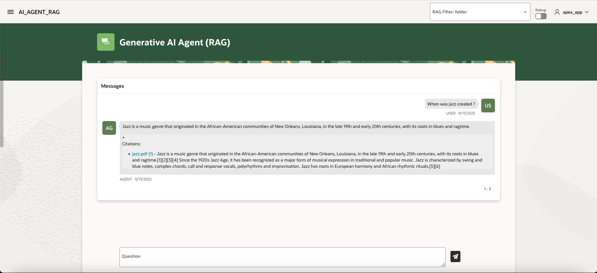
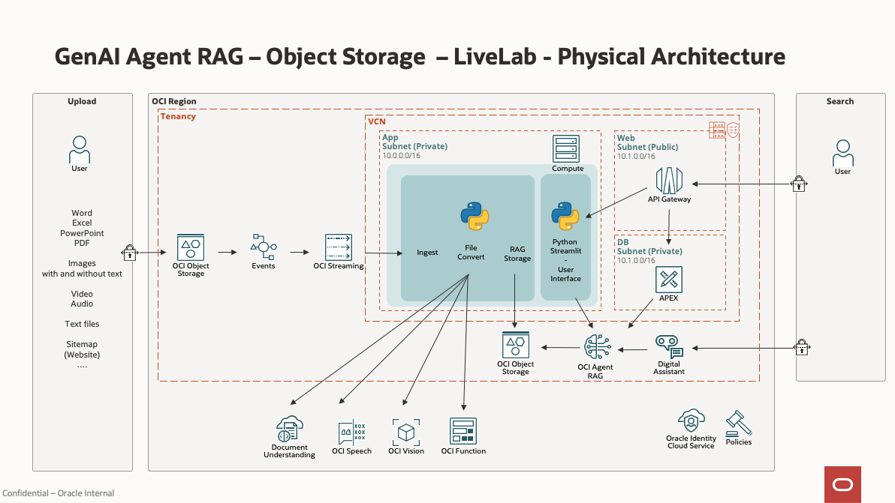

# Introduction

## About This Workshop
We will extend the features of Oracle Generative AI Agent RAG. The sample will allow to:
- Search documents like Word/Excel, Images, Video, Audio or Websites (using sitemaps)
- Build a custom User Interface (UI) with: 
    - Oracle Digital Assistant
    - APEX
    - A python library Streamlit  
- Run ingestion automatically

We’ll be able to search documents like:
- Video and Audio files using OCI Speech
- Images using OCI Vision
- TIF files (FAX) using OCI Document Understanding
- Word, Excel, Powerpoint, ... using OCI Functions
- Websites using Sitemap 

The installation uses Terraform.

From the lab 2/3/4, we will create 3 user interfaces for the above using the following tools:
- APEX
- A Python library Streamlit  
- Oracle Digital Assistant
  
Estimated Workshop Time: 90 minutes

### Logical Architecture

This picture shows the processing flow.

It works like this:
1. A document is uploaded to Object Storage by the user
1. An event is raised and queued. The event is processed by a Python program running on a VM. Based on the file type, it will send the file to one or more AI services to enrich them and provide searchable text
1. The searchable text is the result is uploaded to Object Storage "AGENT"
1. The Generative AI AGENT ingests the new files
1. The user query the Generative AI Agent

Here's how various file types are processed.

- If the file has the extension **.pdf**, **.txt**, **.csv**, **.md**, the file is copied to the AGENT Object Storage.
- If the file has the extension **.png**, **.jpg**, **.jpeg**, or **.gif**, it is processed by OCI Vision. The output is stored in the AGENT Object storage 
- If the file has the extension **.mp4**, **.avi**, **.mp3**, **.wav**, or **.m4a**, it is processed by OCI Speech.
- If the file has the extension **.tif**, it is processed by OCI Document Understanding.
- If the file has the extension **.json**, this is an output of the asynchronous AI services such as OCI Speech or OCI Document Understanding. 
- All other file types like **.doc**, **.docx**, **,xlsx**, **.pptx** are sent to OCI Function with a document parser.

### Physical Architecture

We will install the following architecture using Terraform.

### Objectives

- Provision the services needed for the system
    - Compartment, Object Storage Bucket, Stream, Event, GenAI Agent, AI services and a Virtual Machine
- Create an OCI Function to convert binary documents (like Word/Excel)
- Integrate the components into a working system
- Search for files through several types of user interfaces

**Please proceed to the [next lab.](#next)**

## Acknowledgements 

- **Author**
    - Marc Gueury, Generative AI Specialist
    - Anshuman Panda, Generative AI Specialist
    - Maurits Dijkens, Generative AI Specialist