# Vector Store

## Introduction
In this lab, we will install "OCI Enterprise AI - Vector Store" manually, upload documents and test it by searching into the documents.

Estimated time: 45 min

### Objectives

- Provision the cloud components and Test

### Prerequisites

- An OCI Account with sufficient credits where you will perform the lab. (Some of the services used in this lab are not part of the *Always Free* program.)
- Check that your tenancy has access to one of the Generative AI regions. Like **Frankfurt, London or Chicago Region**. See the full list here: https://docs.oracle.com/en-us/iaas/Content/generative-ai/regions.htm
    - For Paid Tenancy
        - Click on region on top of the screen
        - Check that the Frankfurt or London or Chicago Region is there
        - If not, Click on Manage Regions to add it to your regions list. You need Tenancy Admin right for this.
        - For ex, click on the US MidWest (Chicago)
        - Click Subscribe

    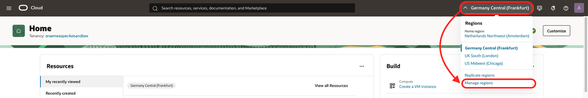

    - For Free Trial, the HOME region should be in one of the region where Generative AI On Demand is available.
- The lab is using Cloud Shell with Public Network.

    The lab assume that you have access to **OCI Cloud Shell with Public Network access**.
    To check if you have it, start Cloud Shell and you should see **Network: Public** on the top. If not, try to change to **Public Network**. If it works, there is nothing to do.
    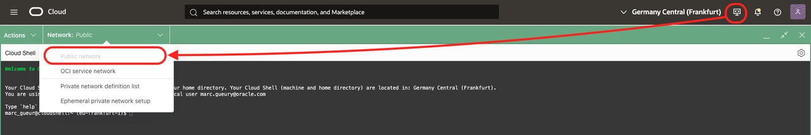

    OCI Administrator have that right automatically. Or your administrator has maybe already added the required policy.
    - **Solution:**

        If not, please ask your Administrator to follow this document:
        
        https://docs.oracle.com/en-us/iaas/Content/API/Concepts/cloudshellintro_topic-Cloud_Shell_Networking.htm#cloudshellintro_topic-Cloud_Shell_Public_Network

        He/She just need to add a Policy to your tenancy :

        ```
        <copy>
        allow group <GROUP-NAME> to use cloud-shell-public-network in tenancy
        </copy>        
        ```

## Task 1: Prepare to save configuration settings

1. Open a text editor and copy & paste this text into a text file on your local computer. These will be the variables that will be used during the lab.

    ```
    <copy>
    List of ##VARIABLES##
    =====================
    COMPARTMENT_OCID=(SAMPLE) ocid1.compartment.oc1.xxxxxxx
    TF_VAR_auth_token=(SAMPLE) ABCDEF&é!12345
    TF_VAR_db_password=(SAMPLE) YOUR_PASSWORD
    ODA_OCID= (SAMPLE) ocid1.odainstance.oc1.xxxxxxx
    PROJECT_OCID= (SAMPLE) ocid1.generativeaiproject.oc1.xxxxxxx

    Terraform Output
    ================
    
    -----------------------------------------------------------------------
    APEX login:

    APEX Workspace
    https://abcdefghijklmnop.apigateway.eu-frankfurt-1.oci.customer-oci.com/ords/_/landing
    Workspace: APEX_APP
    User: APEX_APP
    Password: YOUR_PASSWORD

    APEX APP
    https://abcdefghijklmnop.apigateway.eu-frankfurt-1.oci.customer-oci.com/ords/r/apex_app/apex_app/
    User: APEX_APP / YOUR_PASSWORD

    -----------------------------------------------------------------------
    LangGraph Agent Chat:
    https://abcdefghijklmnop.apigateway.eu-frankfurt-1.oci.customer-oci.com/prefix/index.html

    -----------------------------------------------------------------------
    Oracle Digital Assistant (Web Channel)
    https://abcdefghijklmnop.apigateway.eu-frankfurt-1.oci.customer-oci.com/prefix/oda.html
    </copy>
    ```  

## Task 2: Create a Compartment

The compartment will be used to contain all the components of the lab.

You can
- Use an existing compartment to run the lab 
- Or create a new one (recommended)

1. Login to your OCI account/tenancy
2. Double-check that you are in a region with GenAI available.
3. Go the 3-bar/hamburger menu of the console, go to Identity & Security / Compartments
    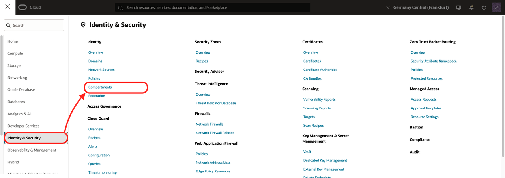
4. Click ***Create Compartment***
    - Give a name: ex: ***genai-agent***
    - Then again: ***Create Compartment***
    
5. When the compartment is created copy the compartment ocid ##COMPARTMENT_OCID## and put it in your notes


## Task 3: Create an Object Storage

1. Click the hamburger menu / Storage / Buckets
    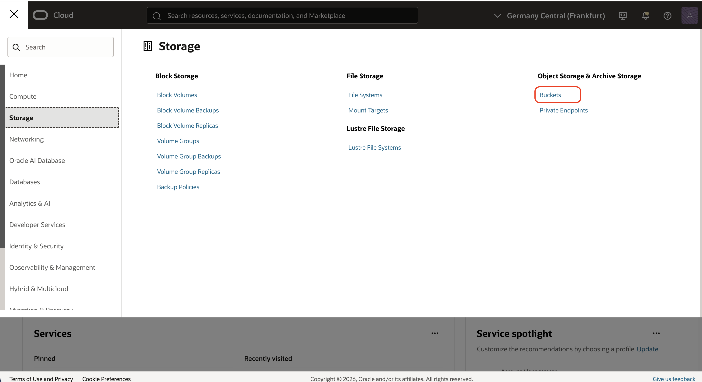
2. Double-check that you are in the compartment that you created above. 
3. Click **Create Bucket** 
    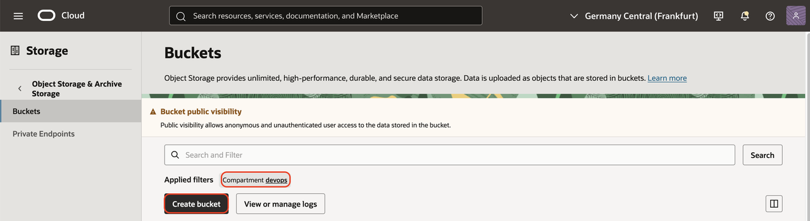
3. In the "Create bucket" dialog:
     - Bucket Name: **vs-bucket**
     - Click **Create Bucket**
4. On your laptop, let's download some sample files
    ````
    <copy>
    git clone https://github.com/mgueury/oci-genai-agent-ext.git
    </copy>
    ````
4. Back in your browser. Open the created bucket  
    - Click on the **Objects** tab
    - Click **Upload objects**
        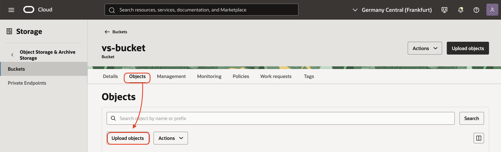
5. In the dialog, "Upload Objects"
    - Click **Drop the files or select them** 
    - Upload oci-genai-agent-ext/sample_files/music/* 
    - Click **Next** 
    - Click **Upload Objects** 
    - Click **Close**     

## Task 4: Create a Policy

1. Click the hamburger menu / Identity & Security / Policies
    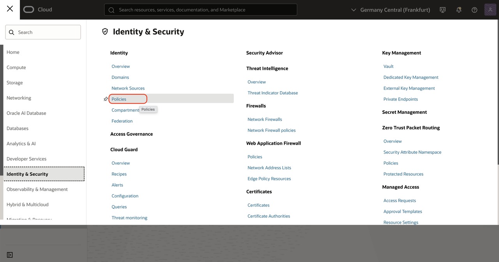
2. Click **Create Policy**
3. In the dialog, "Create Policy"
    - Name: vs-policy
    - Click **Show Manual Editor**
    - In the editor paste this content. And use your compartment OCID

```
allow any-user to read object-family in compartment YOUR_COMPARMENT where ALL{request.principal.type='generativeaivectorconnector'}
```

## Task 5: Create a Vector Store

1. Click the hamburger menu / AI & Analytics / Generative AI
    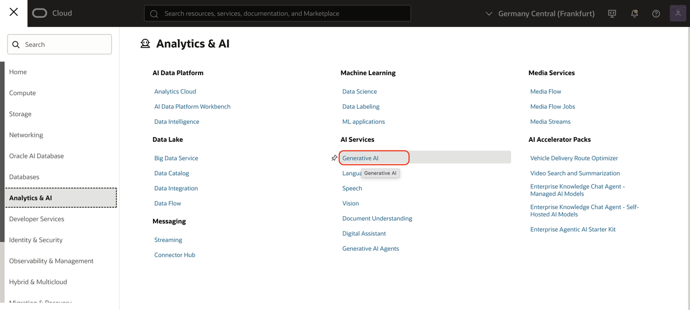
2. On the side, choose **Vector Stores**
    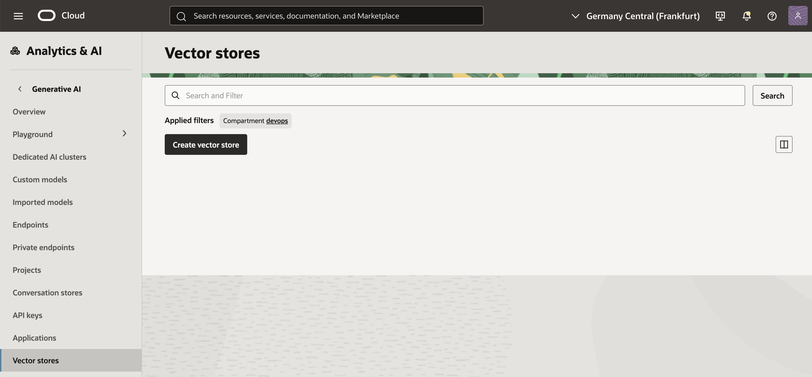
3. Click **Create Vector Store**
    - Name: **vs-vector-store**
    - Type: Keep Unstructured data
    - Click **Create**
    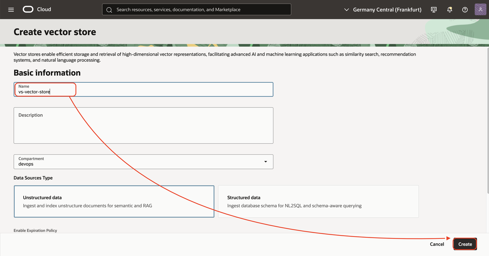
4. Wait 1 mins. Then refresh the page.
5. Click on the **vs-vector-store**
6. Then go to tab Data sync connectors
7. Click **Create data sync connector**
8. In the dialog "Create data sync connector"
    - Name: **vs-data-sync**
    - Bucket: **vs-bucket**
    - Checkbox **Select all in bucket**
    - Click **Create**
    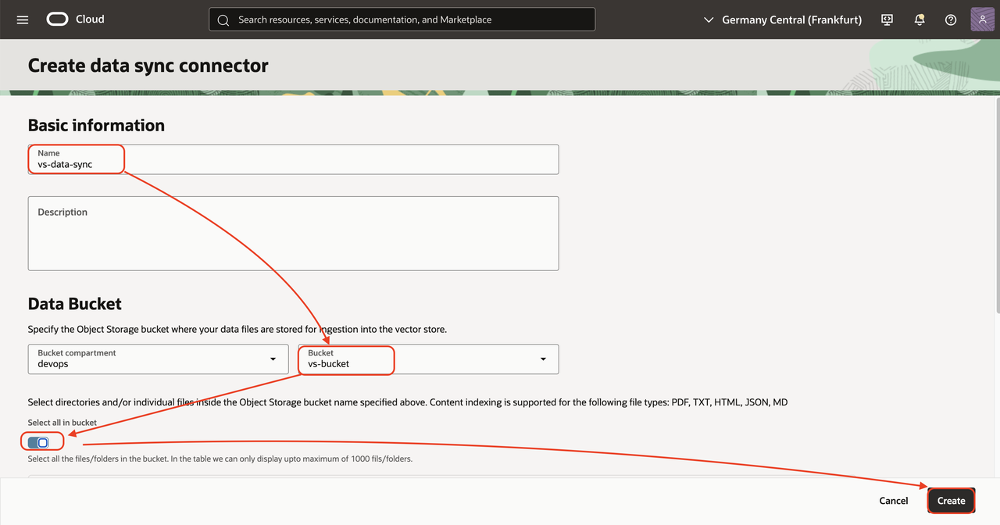
9. Click on **vs-data-sync**
10. Go to tab **Data sync**
11. Click the button **Perform Data sync**
12. In the dialog "Perform Data Sync"
    - Name: **vs-sync1**
    - Click **Perform**
    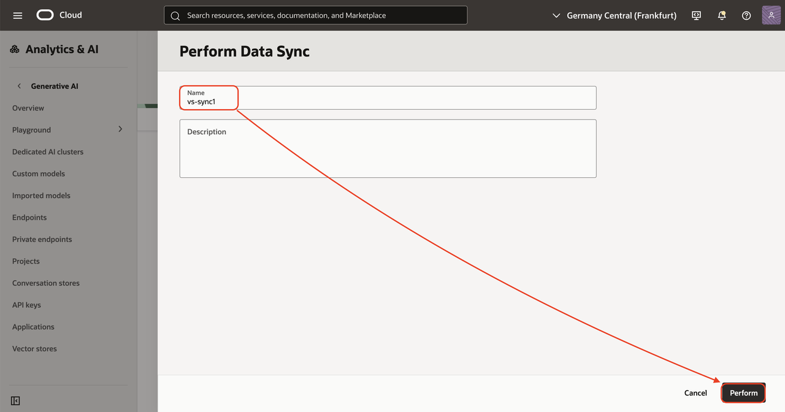    
13. Wait 1 or 2 mins. vs-sync1 will first change to **In Progress**. Then the Total files synced will change to 5. (number of PDF uploaded) 
    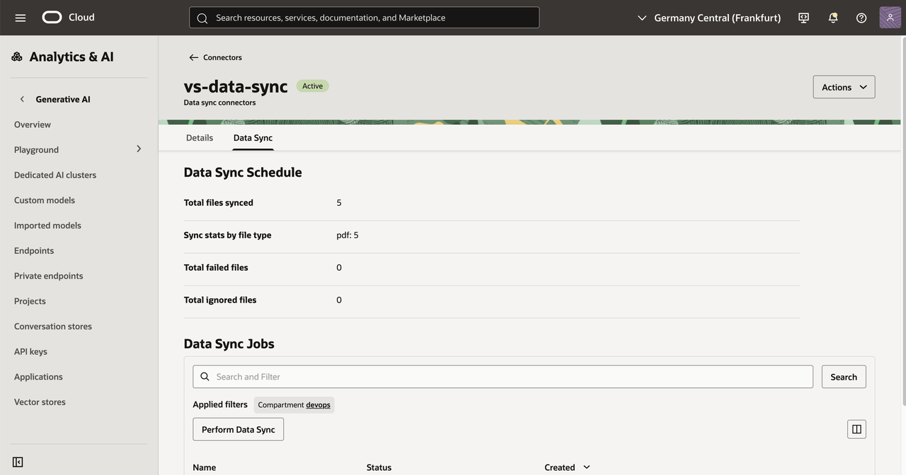    

## Task 6: Test

1. Go back to the Vector Store **vs-vector-store**. Go to the tab Details.
2. Click **Try semantic search**  
3. In the dialog "Semantic Search",
    - Search Input: **What is jazz ?** 
    - Click **Search**
    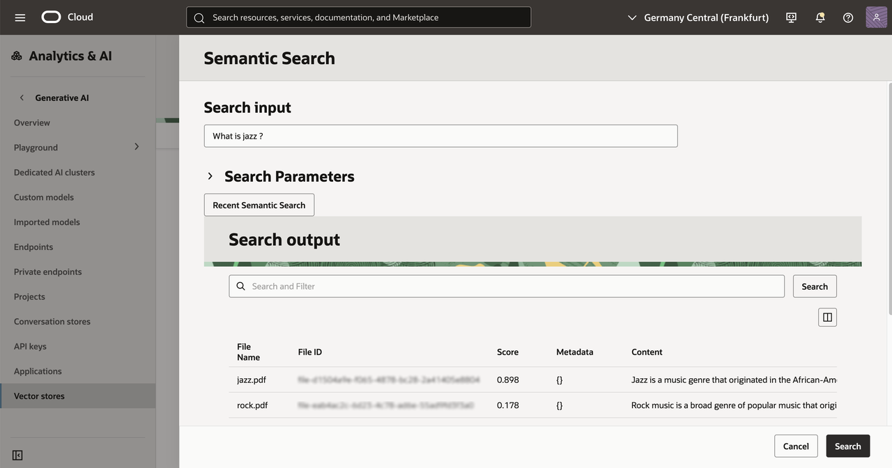  

## Acknowledgements

- **Author**
    - Marc Gueury, Generative AI Specialist
    - Maurits Dijkens, Generative AI Specialist

