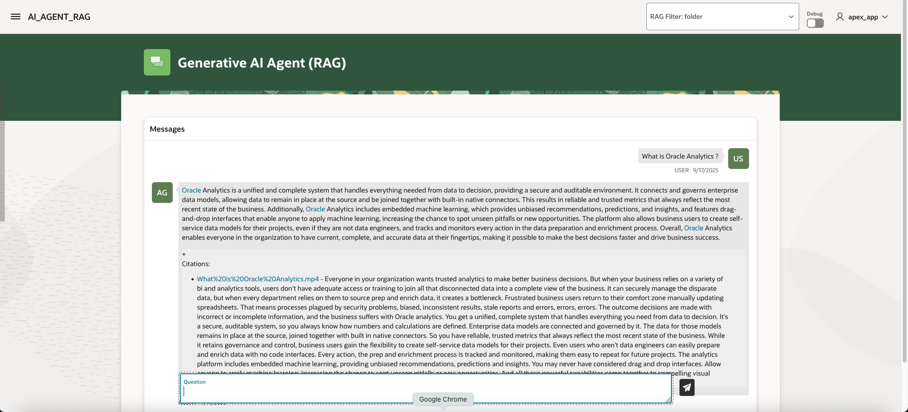

# Test with APEX

## Introduction
In this lab, we will test the installation using APEX
Estimated time: 10 min

### Objectives

- Test the program

### Prerequisites
- The lab 1 must have been completed.

## Task 1: Test

1. Check the APEX URL and the User/Password at the end of the build log.
    
1. Go to the url of the application (ex: https://abcdefghijklmnop.apigateway.eu-frankfurt-1.oci.customer-oci.com/ords/r/apex_app/apex_app/)

    Login as APEX\_APP / YOUR\_PASSWORD
    
1. Type "when was jazz created", then *Enter*

    Hover on the citation. Note that you can see the page number. Click on the link.
        

1. Type "what is Oracle Analytics", then *Enter*

      

1. Try more questions:

    | File type | Extension | Question                                          |
    | ----------| --------- | ------------------------------------------------- |
    | PDF       | .pdf      | When was jazz created ?                           |
    |           |           | What is Document Understanding                    |
    | Word      | .docx     | What is OCI ?                                     |
    | Image     | .png      | List the countries in the map of brazil           |
    | Website   | .sitemap  | What is Digital Assistant ?                       |
    | FAX       | .tif      | Is there an invoice for Optika ?                  | 
    |           |           | What does the file invoice.tif contains ?         |
    | Video     | .mp4      | What is Oracle Analytics                          | 
    | Audio     | .mp3      | Summarize the audio file Voice_SupportRobot.mp3   |

**You may now proceed to the [next lab.](#next)**

## Task 2. Filter

One additional step is needed to use the RAG filter. We need to add a RAG tool.

### 1. Rag Tool ###

- In the hamburger menu, go to **Analytics and AI / Generative AI Agents**
- Click on **Agents**
- Choose your compartment
- Open the agent created in Lab 1
- Choose Tools / Create Tool
- Choose **RAG** 
   
- Enter:
    - **Name** = rag-tool
    - **Description** = Use this tool for any question that are not covered by the other tools. It contains generic documentation.
- Select the knowledge base - agext-agent-kb
- Click **Create Tool**

### 2. Test again ###
- Go back to the APEX app. 
- Refresh the browser to start a new session. 
- Set the filter to */oracle*.
- Ask again the same questions. You will see that based on the metadata, you can filter files. 

## Known issues

1. Conversation history 
    Notice, do not change the filter in the middle of the conversation, or you can have funny effect. Ex:
    - Ask "what is jazz ?" without filter -> you get the answer from the RAG (with a citation)
    - Stay in the same conversation: 
    - Ask "what is jazz ?" with filter "/music" -> you get the answer from the RAG (with a citation) 
    - Ask "what is jazz ?" with filter "/oracle" -> you get an answer... from the conversation history... 
    - The correct way was to reset the conversation to get another chat session.  

## Acknowledgements

- **Author**
    - Marc Gueury, Generative AI Specialist
    - Anshuman Panda, Generative AI Specialist
    - Maurits Dijkens, Generative AI Specialist

