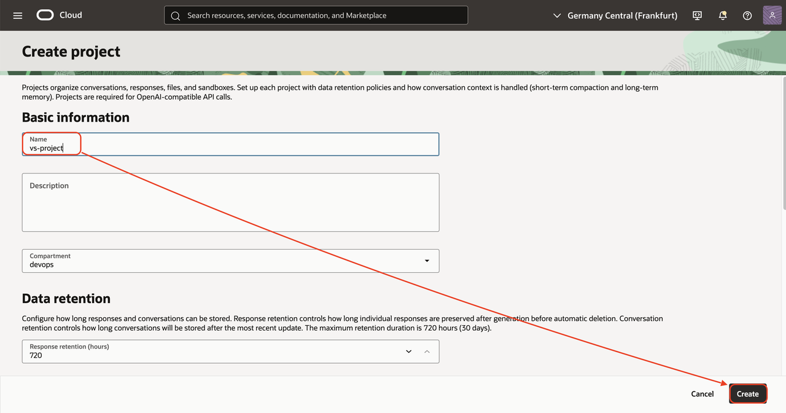
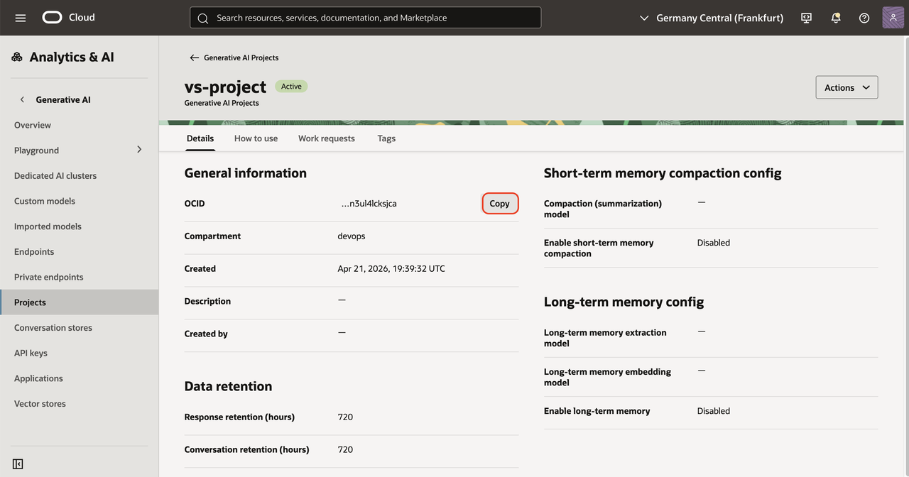

# Install the Components

## Introduction
In this lab, you will install all the components needed for this workshop. Oracle Digital Assistant will be provisioned manually. The rest will be provisioned automatically using a provided Terraform script.

Estimated time: 15 min

### Objectives

- Provision all the cloud components

### Prerequisites

- See Prerequisites in Lab1        
- Task 1 in Lab (List of ##VARIABLES##)
- In this lab, we will install this architecture. It is mostly a API Gateway, a compute and a database calling OCI Services.


## Task 1: Create a Project 

1. Click the hamburger menu / AI & Analytics / Generative AI
    
2. On the side, choose **Projects**
3. Click **Create Project**
    - Name: **vs-project**
    - Click **Create**
    
4. Click on **vs-project**
6. Click on the **vs-vector-store**.
7. Next to OCID, click **Copy**.
    
8. Put it in your "List of ##VARIABLES##".

## Task 2: Run a Terraform script to create the other components.

1. Go to the OCI console homepage
2. Click the *Developer Tools* icon in the upper right of the page and select *Code Editor*. Wait for it to load.
3. Check that the Network used is Public. (see requirements)
4. Check that the Code Editor architecture is x86_64.
    - Go to Actions / Architecture
    - Check that the current architecture is x86_64.
    - If not, change it to x86_64 and confirm. It will restart.

        

5. In the code editor menu, click *Terminal* then *New Terminal*
6. Run the command below in the terminal
    
    ````
    <copy>
    git clone https://github.com/mgueury/oci-vector-store-ext.git
    </copy>
    ````
7. Check if you have an authorization token (associated with your profile).

    For more info, see here: https://docs.oracle.com/en-us/iaas/Content/Registry/Tasks/registrygettingauthtoken.htm

    If yes, note it in your notepad. If not, the script below will create it.

7. Run each of the three commands below in the Terminal, one at a time. It will run Terraform to create the rest of the components.
    ```
    <copy>
    cd oci-vector-store-ext/starter/
    </copy>
    ```
   
    ````
    <copy>
    ./starter.sh build
    </copy>
    ````

    Answer the questions about 
    - Prefix (ex: vector)
    - Compartment OCID (See your notes)
    - Project OCID (See your notes)
    - Database password
    - Public IP Filter. The setup will have an Internet gateway with port 80/443 open to the internet. What is the IP Range of the machine who can access these ports:
        1. All the machines on the internet -> 0.0.0.0/0
        2. Just my laptop (recommended)
        3. Other (your own IP range)
    - To get your laptop IP, use, by example, https://whatismyipaddress.com or https://ifconfig.me 

    In case of errors, check **Known Issues** below.

9. If after the setup, you want to add more IP addresses to access the installaiton. For ex, 
    - a colleague who want to access the setup,
    - Your laptop that is in another place, ...
    
    Please do this:
    - Open the OCI Console
    - Go to Networking / Virtual Cloud Networks
    - Choose the *YOUR_PREFIX-vcn* Network
    - Open the tab *Security*
    - Open the Security List *YOUR_PREFIX-security-list*
    - Open the tab *Security Rules*
    - Click *Add Ingress Rule*
    - Fill the following field
        - Source CIDR: 12.34.56.78/32 (=the ip that you want to add/32)
        - Destination Port: 443
        - Click *Add Ingress Rule*     
    - Retry

8. **Please proceed to the [next lab](#next) while Terraform is running.** 
    Do not wait for the Terraform script to finish because it takes about 45 minutes and you can check the steps in the next labs while it's running. However, you will need to come back to this lab when it is done and complete the next step.
9. When Terraform finishes, you will see settings that you need in the next lab. Save these to your text file. It will look something like:

    ```
    <copy>    
    -----------------------------------------------------------------------
    APEX login:

    APEX Workspace
    https://abcdefghijklmnop.apigateway.eu-frankfurt-1.oci.customer-oci.com/ords/_/landing
    Workspace: APEX_APP
    User: APEX_APP
    Password: YOUR_PASSWORD

    APEX APP
    https://abcdefghijklmnop.apigateway.eu-frankfurt-1.oci.customer-oci.com/ords/r/apex_app/apex_app/
    User: APEX_APP / YOUR_PASSWORD

    -----------------------------------------------------------------------
    LangGraph Agent Chat:
    https://abcdefghijklmnop.apigateway.eu-frankfurt-1.oci.customer-oci.com/prefix/chat.html

    -----------------------------------------------------------------------
    Next.js Chat:
    https://abcdefghijklmnop.apigateway.eu-frankfurt-1.oci.customer-oci.com/

    -----------------------------------------------------------------------
    Oracle Digital Assistant (Web Channel)
    https://abcdefghijklmnop.apigateway.eu-frankfurt-1.oci.customer-oci.com/prefix/oda.html
    </copy>    
    ```
**You may now proceed to the [next lab](#next)**

## Known issues

1. During the terraform run, there might be an error resulting from the compute shapes supported by your tenancy:

    ```
    <copy>    
    oci_core_instance.starter_instance: Creating..
    - Error: 500-InternalError, Out of host capacity.
    Suggestion: The service for this resource encountered an error. Please contact support for help with service: Core Instance
    </copy>
    ```

    Solution:  edit the file *starter/src/terraform/variable.tf* and replace the *availability domain* with one where there is still capacity
    ```
    <copy>    
    OLD: variable availability_domain_number { default = 1 }
    NEW: variable availability_domain_number { default = 2 }
    </copy>    
    ```

    Then rerun the following command in the code editor

    ```
    <copy>
    ./starter.sh build
    </copy>
    ```

    If it still does not work, to find an availability domain or shape where there are still capacity, try to create a compute manually with the OCI console.

2. During the terraform run, there might be an error resulting from the compute shapes supported by your tenancy:

    ```
    <copy>    
    - Error: 404-NotAuthorizedOrNotFound, shape VM.Standard.x86.Generic not found
    </copy>    
    ```

    Solution:  edit the file *starter/src/terraform/variable.tf* and replace the *instance_shape* to one where there are still capacity in your tenancy/region
    ```
    <copy>    
    OLD: variable instance_shape { default = "VM.Standard.x86.Generic" }
    NEW: variable instance_shape { default = "VM.Standard.E4.Flex" }
    </copy>    
    ```

    Then rerun the following command in the code editor

    ```
    <copy>
    ./starter.sh build
    </copy>
    ```

    If it still does not work, to find an availability domain or shape where there are still capacity, try to create a compute manually with the OCI console.    

3. It happened on new tenancy that the terraform script failed with this error:

    ```
    <copy>    
    Error: 403-Forbidden, Permission denied: Cluster creation failed. Ensure required policies are created for your tenancy. If the error persists, contact support.
    Suggestion: Please retry or contact support for help with service: xxxx
    </copy>    
    ```

    In such case, just rerunning ./starter.sh build fixed the issue.

4. 409 - XXXXXAlreadyExists
    ```
    <copy>    
    Error: 409-PolicyAlreadyExists, Policy 'agent-fn-policy' already exists
    or
    Error: 409-BucketAlreadyExists, Either the bucket "agext-upload-bucket' in namespace "xxxxxx" already exists or you are not authorized to create it
    </copy>    
    ```

    Several persons are probably trying to install this tutorial on the same tenancy.
    Solution:  edit the file *terraform.tfvars* and use a unique *prefix*
    ```
    <copy>    
    OLD: prefix="agent"
    NEW: prefix="agent2"
    </copy>    
    ```

 5. BadErrorResponse - CreateDynamicResourceGroup 
 
    If your user does has no right to create Dynamic Group in the Default Identity Domain, you will get this error:
     
    ```
    Error: 400-BadErrorResponse,
    Suggestion: Please retry or contact support for help with service: Identity Domains Dynamic Resource Group
    Documentation: https://registry.terraform.io/providers/oracle/oci/latest/docs/resources/identity_domains_dynamic_resource_group
    API Reference:
    Request Target: POST https://idcs-xxxxxx.identity.oraclecloud.com:443/admin/v1/DynamicResourceGroups
    Provider version: 6.21.0, released on 2024-12-22. This provider is 8 Update(s) behind to current.
    Service: Identity Domains Dynamic Resource Group
    Operation Name: CreateDynamicResourceGroup
    OPC request ID: xxxxxx
    with oci_identity_domains_dynamic_resource_group.search-fn-dyngroup,
    on search_dyngroup_identity_domain.tf line 1, in resource “oci_identity_domains_dynamic_resource_group” “search-fn-dyngroup”:
    1: resource “oci_identity_domains_dynamic_resource_group” “search-fn-dyngroup” {
    ```
    Solution:
    1. If the Default Domain exists, it is probably a privilege right. Ask to your tenancy administrator.
    2. If your Identity Domain is “OracleIdentityCloudService” (for tenancy upgraded from IDCS)
        - edit the file starter/terraform.tfvars 
        - add the line
        ```
        idcs_domain_name="OracleIdentityCloudService"
        ```

6. Error: 400-LimitExceeded, The following service limits were exceeded: xxxxxxx
   
    Solution:
    - Ask your administrator to increase your quota or the limits of the tenancy.
   
7. Error: Attempt to index null value

  ```
  on datasource.tf line 64, in locals:
  64:   idcs_url = (var.idcs_url!="")?var.idcs_url:data.oci_identity_domains.starter_domains.domains[0].url
    ├────────────────
    │ data.oci_identity_domains.starter_domains.domains is null
  ```

  Work-around:
  - This is due to a lack of privilege to access the list of domains in your tenancy.
  - edit file terraform.tfvars and add this line:
    ```
    idcs_url=https://idcs-xxxxxx.identity.oraclecloud.com:443
    ````
    You can find this URL by 
    - going to OCI Console / Hamburger menu / Identity and Security / Domains 
    - go to the root compartment
    - choose the default Domain
    - look for the Domain URL. It will look like this: https://idcs-xxxxxx.identity.oraclecloud.com:443
  - Rerun ./starter.sh build


## Acknowledgements

- **Author**
    - Marc Gueury, Generative AI Specialist
    - Maurits Dijkens, Generative AI Specialist
    - Ras Alungei, Generative AI Specialist
