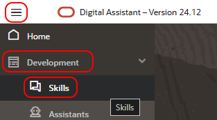
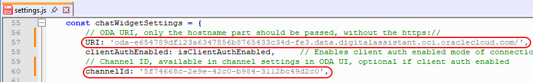

# Test with Oracle Digital Assistant (ODA)

## Introduction
In this lab, we will install Digital Assistant and configure it to work with the previous installation
Estimated time: 30 min

### Objectives

- Test the program

### Prerequisites
- The lab 1 must have been completed.

## Task 1: Install Oracle Digital Assistant

1. Login to your OCI account/tenancy
2. Follow the steps in 'Recipe for Quick Setup and Provisioning'
    - https://docs.oracle.com/en/cloud/paas/digital-assistant/use-chatbot/order-the-service-and-provision-an-instance.html#GUID-D5C6B0FE-5B54-487A-B130-843BCBEC7886
    - You can use the same compartment used for your AI Agent
    - In the end,
        - Bookmark the Base web url to go quickly to the ODA console in the future
        - Copy the OCID of the ODA instance and save it for use in the next step (##ODA_OCID##)
        
3. Create policy for ODA to access AI Agent
    - Go the 3-bar/hamburger menu of the console and select 'Identity & Security' > 'Compartments'
    - Select the compartment AI Agent is installed in
	- Create new policy agext_oda:

        ```
        <copy>
		allow any-user to manage genai-agent-family in compartment id ##COMPARTMENT_OCID## where request.principal.id='##ODA_OCID##'
        </copy>
        ```
        - Replace ##COMPARTMENT\_OCID## with the OCID you saved when installing the AI Agent (in Task 2, step 4)
        - Replace ##ODA\_OCID## with the OCID you saved when installing ODA
		- It will now look like:
		```
        <copy>
        allow any-user to manage genai-agent-family in compartment id ocid1.compartment.oc1..aaaaaaaafgdfsg8976sdfg79sdfggsdfg987sdfsdfgsdf9g87sdfgs98zzz where request.principal.id='ocid1.odainstance.oc1.eu-frankfurt-1.amaaaaaa8sdfjkhsdfjfg8fdg8df8gdf8g8dfg8d8fg8d8fgdf8gfxxxxxxx'
        </copy>
        ```

## Task 2: Import & Test the API Services in ODA

1. Login to the ODA console with the Base web url you bookmarked during ODA install
2. Go the 3-bar/hamburger menu of the console and select 'Settings' > 'API Services'
    
3. Import the 'RESTServices.yaml' provided in the zip-file
4. On the left side click the 'labAgentConnect' service
    - and edit the agentEndpointId to your Agent endpoint OCID (@MarcGueury)
    
5. Press 'Test Request' to see if all is good

    
6. Copy the session 'id' from the response and press 'Save as Static Response'
7. Now on the left side click the 'labAgentAsk' service
    - Edit the agentEndpointId to your Agent endpoint OCID (@MarcGueury)
    - Edit the sessionId to the session id you copied in step 6
    
8. Press 'Test Request' to see if all is good
    
9. Press 'Save as Static Response'


## Task 3: Import & Train the skill in ODA

1. Go the 3-bar/hamburger menu of the console and select 'Development' > 'Skills'
   
2. Click 'Import skill' in the top-right and import 'agext_livelab(1.0).zip'
   
3. Open the imported skill by clicking its tile
   
4. Click 'Train' in the top-right
   
5. Select 'Trainer Tm' and press 'Submit'
   
6. During training we can have familiarize ourselves with the flow that calls AI Agent
   
7. When training is finished we can click 'Preview' in the top-right
   
8. In the tester we can ask a question about the content in our AI Agent
   
9. Beside the answer coming from AI Agent, we can also see how the flow executed on the right
   

## Task 4: Creating the web channel

1. Go the 3-bar/hamburger menu of the console and select 'Development' > 'Channels'
    
2. Press 'Add Channel' to add a new channel with the following settings:
    - Channel Type: 'Oracle Web'
    - Allowed Domains: '*'
    - Client Authentication: Disabled  
    - And press 'Create'
    
3. Complete your channel definition with:
    - Route To: your skill
    - Channel Enabled: ON
    - Copy the Channel Id and save for later
    
4. Go back to the OCI cloud shell where you installed the previous lab and edit the settings.js as follows:
    ```
    <copy>
    ./starter.sh ssh bastion
    sudo su -
    cd /usr/share/nginx/html/scripts
    nano settings.js
    or
    vi settings.js
    </copy>
    ```
    - The hostname part of your ODA console (without https://)
    - The Channel ID copied in the previous step
    
5. In your browser, open the web-widget with http://##BASTION\_IP##
    


## Known issues

None

## Acknowledgements

- **Author**
    - Marc Gueury, Generative AI Specialist
    - Anshuman Panda, Generative AI Specialist
    - Maurits Dijkens, Generative AI Specialist


