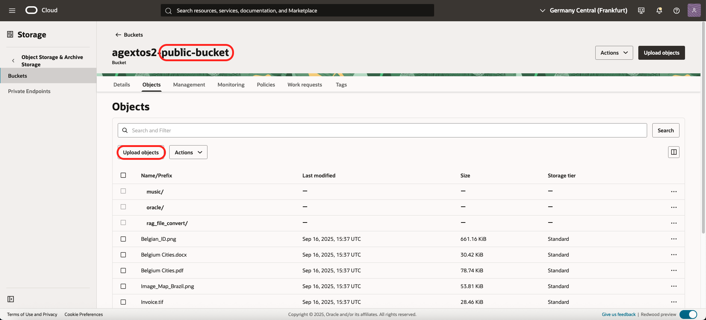
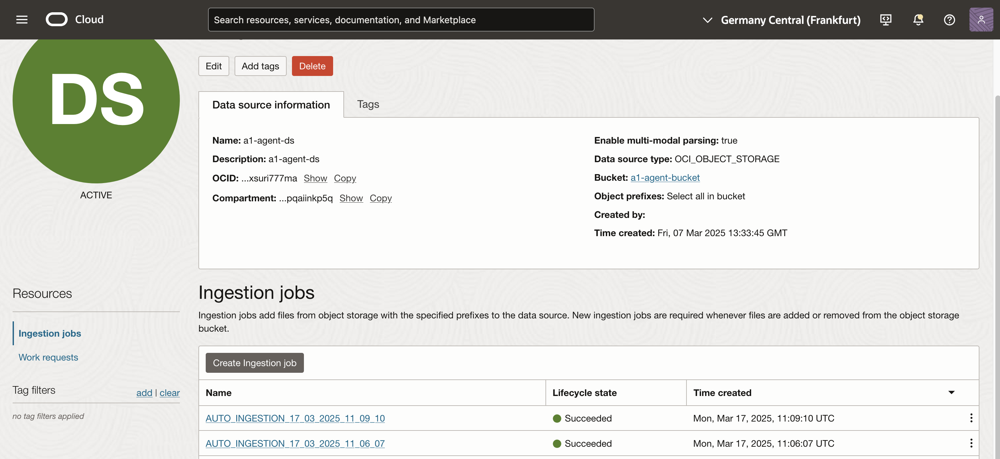

# Customize (Adding new files...)

## Introduction
In this lab, we add our own files to the RAG Agent

Estimated time: 10 min

### Objectives

- Customize the demo

### Prerequisites
- The lab 1 must have been completed.

## Task 1: Recap

When the installation is done, it has created a several resources.


## Task 2: Components

Let's assume that the prefix of the installation is "agext" 

**Virtual Machine**

In OCI Console, click on the Hamburger menu:
- Compute/Instance
- There is a VM "agext-bastion"

**Object storage**

In OCI Console, click on the Hamburger menu:
- Storage/Buckets

There are 2 buckets:
- agext-public-bucket: where you upload your own files
- agext-agent-bucket: used by the RAG agent for searching. Containing only PDF or text files.

The files from the agext-public-bucket are copied or transformed to PDF or text files automatically and stored in the "agent-bucket"

## Task 3 - Upload new files
In OCI Console, click on the Hamburger menu:
- Storage/Buckets
- agext-public-bucket

Upload a new file.
        

- Wait 4/5 mins before to ask a question to the chat.

In the meanwhile,
- Bucket:
    - After 1/2 mins check that it is copied in the Agent Bucket.
- AI Agent Ingestion
    - In OCI Console, click on the Hamburger menu
    - Analytics & AI/ Generative AI Agents
    - Knowledge Base - agent-agent-kb
    - In datasources - agent-agent-ds
    - Check the ingestion jobs.
  
          

What will happen internally, depending of the file type, it will be processed in different ways:
- If the file has the extension **.pdf**, **.txt**, **.csv**, **.md**, the file is copied to the AGENT Object Storage.
- If the file has the extension **.png**, **.jpg**, **.jpeg**, or **.gif**, it is processed by OCI Vision. The output is stored in the AGENT Object storage 
- If the file has the extension **.mp4**, **.avi**, **.mp3**, **.wav**, or **.m4a**, it is processed by OCI Speech.
- If the file has the extension **.tif**, it is processed by OCI Document Understanding.
....

## Known issues

- For debugging purpose if you want to login on the VM and see why it could fail

```
In OCI Cloud Shell
cd oci-genai-agent-ext/starter

See commands available
./starter.sh 
Navigate to Advanced/SSH

SSH Key
cat target/ssh_key_starter

SSH to Bastion
./starter.sh ssh bastion

# Check the log
cd app
cat ingest.log

# Check the choice of the program by extension
cd src
vi document.py

...
```

## Acknowledgements

- **Author**
    - Marc Gueury, Generative AI Specialist
    - Anshuman Panda, Generative AI Specialist
    - Maurits Dijkens, Generative AI Specialist

