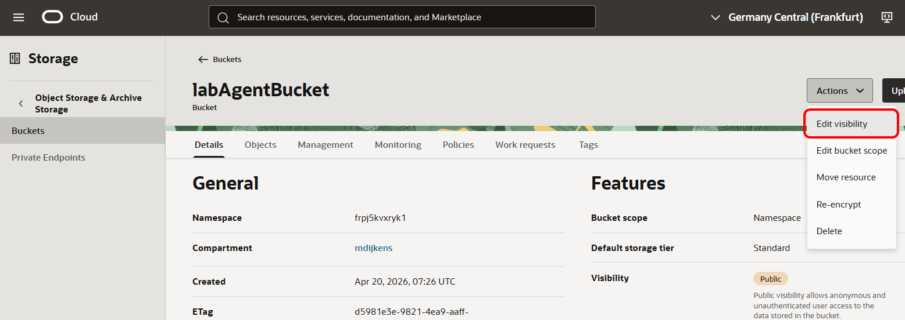
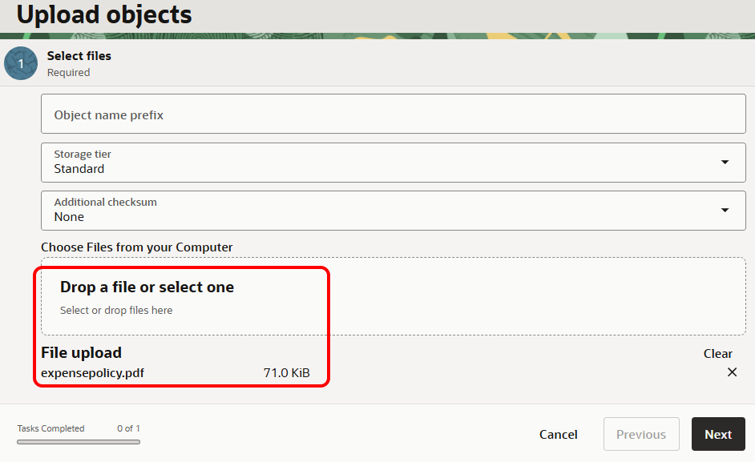
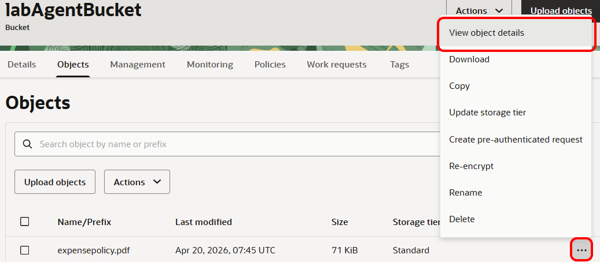
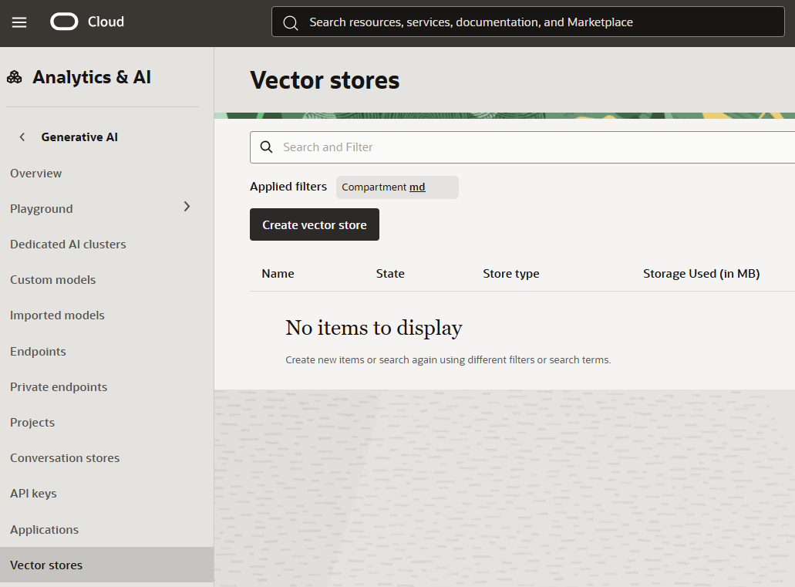
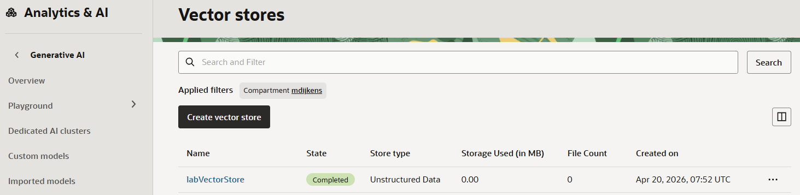
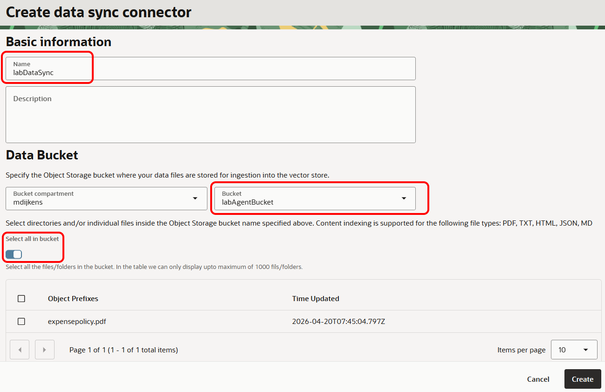
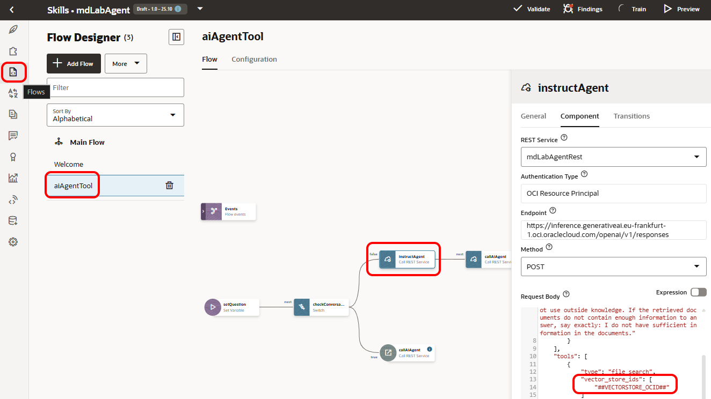
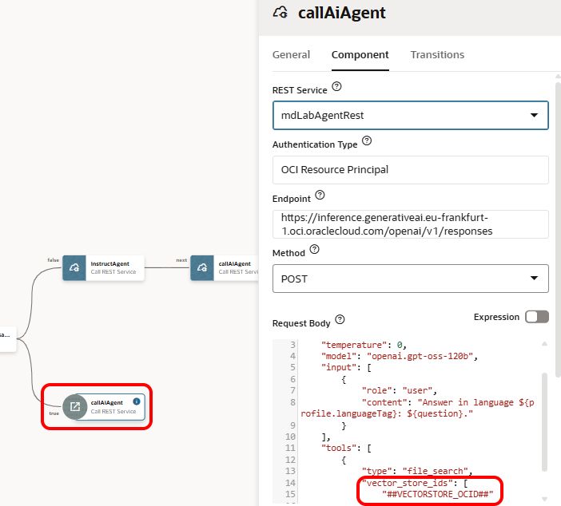
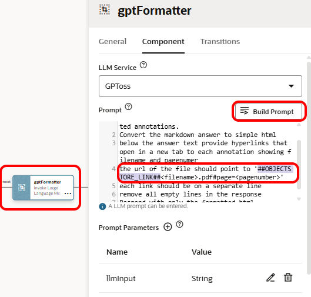

# Test with Oracle Digital Assistant (ODA)

## Introduction
In this lab, we will install Digital Assistant and configure it to work with the previous installation
Estimated time: 30 min

### Objectives

- Test the program

### Prerequisites
- The lab 1 must have been completed.
- Download the [zip file@@](https://github.com/mgueury/oci-genai-agent-ext/archive/refs/heads/main.zip).
    In the subdirectory "oda", you will find the files needed below.

## Task 1: Create a bucket

1. Login to your OCI account/tenancy
2. Go to Hamburger>Storage>Buckets and create Bucket with name labAgentBucket
3. Under Actions>Edit visibility set Visibility to Public (to show links to the user)
   
4. Select Objects tab and click Upload objects
    - Select the expensepolicy.pdf from the download zip and click Next, Upload objects, Close
      
    - at the end of the expensepolicy.pdf line press ... > View object details and save the link for later (##OBJECTSTORE_LINK##) like:
	https://objectstorage.eu-frankfurt-1.oraclecloud.com/n/frpd9ierrwe1/b/labAgentBucket/o/
      

## Task 2: Create a Vector Store

1. Go to Hamburger>Analytics&AI>Generative AI and select Vector stores
   
2. Create vector store with name labVectorStore (Unstructured Data)
    - Now wait a couple of minutes for it to appear
   
3. Select labVectorStore
    - Copy the Vector Store ID and save it for later (##VECTORSTORE_OCID##)
4. Select Datas sync connectors and click Create Datas sync connector
    - with name labDataSync
    - select bucket labAgentBucket
    - turn on Select all in bucket
   
    - Create
5. Now wait a for it to appear and open it by clicking the name
6. Select the Data Sync tab and click Perform Data Sync button
    - give it a name (sync1) and click Perform
7. Wait for status to be Succeeded

## Task 3: Install Oracle Digital Assistant

1. Login to your OCI account/tenancy
2. Follow the steps in 'Recipe for Quick Setup and Provisioning'
    - https://docs.oracle.com/en-us/iaas/digital-assistant/doc/order-service-and-provision-instance.html
    - You can use the same compartment used for your AI Agent
    - In the end,
        - Bookmark the Base web url to go quickly to the ODA console in the future
        - Copy the OCID of the ODA instance and save it for use in the next step (##ODA_OCID##)
        
3. Create policy for ODA to access AI Agent
    - Go the 3-bar/hamburger menu of the console and select 'Identity & Security' > 'Compartments'
    - Select the compartment AI Agent is installed in
	- Create new policy agext_oda:

        ```
        <copy>
		allow any-user to manage genai-agent-family in compartment id ##COMPARTMENT_OCID## where request.principal.id='##ODA_OCID##'
        </copy>
        ```
        - Replace ##COMPARTMENT\_OCID## with the OCID you saved when installing the AI Agent (in Task 2, step 4)
        - Replace ##ODA\_OCID## with the OCID you saved when installing ODA
		- It will now look like:
		```
        <copy>
        allow any-user to manage genai-agent-family in compartment id ocid1.compartment.oc1..aaaaaaaafgdfsg8976sdfg79sdfggsdfg987sdfsdfgsdf9g87sdfgs98zzz where request.principal.id='ocid1.odainstance.oc1.eu-frankfurt-1.amaaaaaa8sdfjkhsdfjfg8fdg8df8gdf8g8dfg8d8fg8d8fgdf8gfxxxxxxx'
        </copy>
        ```

## Task 4: Import & Test the API Services in ODA

1. Login to the ODA console with the Base web url you bookmarked during ODA install
2. Go the 3-bar/hamburger menu of the console and select 'Settings' > 'API Services'
    
3. Import the 'RESTService-mdLabAgentRest1.0.yaml' provided in the zip-file
    - Set Endpoint correct region
    - In POST test-body Replace ##VECTORSTORE_OCID## with your saved id.
    - In Headers change OpenAI-Project to your saved ##COMPARTMENT_OCID##
    
    - Click Test Request button and wait for 200 Success status
    
    - Press 'Save as Static Response'
4. Go to LLM Services tab and click Import LLM Services button
    
5. Import the 'LLMService-mdGptOss1.0.yaml' provided in the zip-file
    - Set Endpoint correct region
    - In POST test-body Replace ##COMPARTMENT_OCID## with your saved id.
    - Click Test Request button and wait for 200 Success status
    
    - Press 'Save as Static Response'

## Task 5: Import & Train the skill in ODA

1. Go the 3-bar/hamburger menu of the console and select 'Development' > 'Skills'

   
2. Click 'Import skill' in the top-right and import 'import mdLabAgent(1.0).zip'
   
3. Open the imported skill by clicking its tile
4. Go to Flows (3th icon from top on left side)
    - Select aiAgentTool flow
   
    - Select instructAgent state and in the component request body replace ##VECTORSTORE_OCID## you save in Task 2.3
    - Select callAIAgent state and in the component request body replace ##VECTORSTORE_OCID## you save in Task 2.3
   
    - Select gptFormatter state and in the component prompt replace ##OBJECTSTORE_LINK## you save in Task 1.4
   
5. Click 'Train' in the top-right

   

    - Select 'Trainer Tm' and press 'Submit'
    - When training is finished we can click 'Preview' in the top-right
6. In the tester we can ask a question about the content in our AI Agent
   

## Task 6: Creating the web channel

1. Go the 3-bar/hamburger menu of the console and select 'Development' > 'Channels'
    
2. Press 'Add Channel' to add a new channel with the following settings:
    - Channel Type: 'Oracle Web'
    - Allowed Domains: '*'
    - Client Authentication: Disabled  
    - And press 'Create'

      
3. Complete your channel definition with:
    - Route To: your skill
    - Channel Enabled: ON
    - Copy the Channel Id and save for later

      
4. Go back to the OCI cloud shell where you installed the previous lab and edit the settings.js as follows:

    ```
    <copy>
    ./starter.sh ssh compute
    sudo su -
    cd /usr/share/nginx/html/scripts
    nano settings.js
    or
    vi settings.js
    </copy>
    ```

    - The hostname part of your ODA console (without https://)
    - The Channel ID copied in the previous step
    
5. In your browser, open the web-widget with http://##BASTION\_IP## (You got that URL at the end of Lab 1)
    


## Known issues

None

## Acknowledgements

- **Author**
    - Marc Gueury, Generative AI Specialist
    - Maurits Dijkens, Generative AI Specialist


