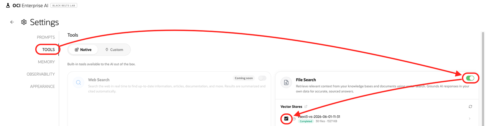
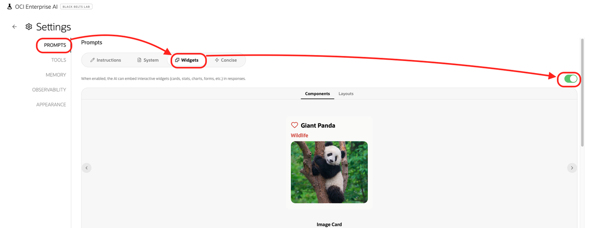
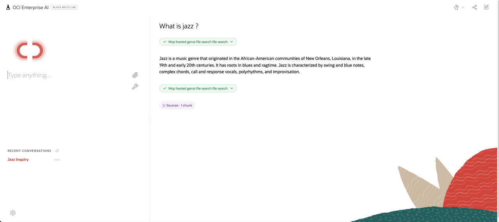
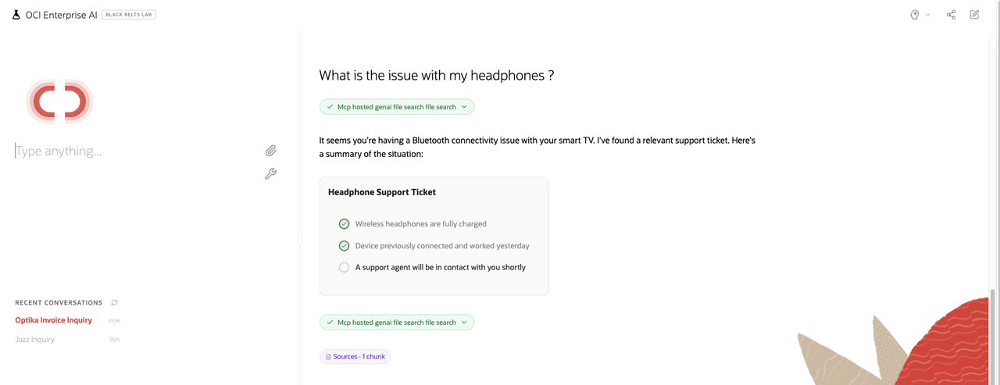

# Test with ReactJS

## Introduction
In this lab, you will test the installation using ReactJS and OpenAI Response API.

Estimated time: 10 min

### Objectives

- Test the program using a ReactJS user interface and OpenAI Response API.

### Prerequisites
- The lab 2 must have been completed.

## Task 1: Test 

2. Check the URL at the end of the Terraform run.

3. Go to the ReactJs URL (e.g., https://xxxx.apigateway.eu-frankfurt-1.oci.customer-oci.com/).

4. Do some setup
    - Click on the tools icon
            
    - In the Tools menu, enable the *File Search* tool 
    - Then select the Vector Store that you have created
            
    - Go to the *Prompts* menu, go to the *Widgets* tab. 
    - Enable the *Widgets* 
            

5. Back to the chat. Type "what is jazz" and press Enter.

        

4. Type "what is the issue with my headphones" and press Enter.

    Click on the link.
        

5. Try more questions:

    | File type | Extension | Question                                          |
    | ----------| --------- | ------------------------------------------------- |
    | PDF       | .pdf      | When was jazz created ?                           |
    |           |           | What is Document Understanding                    |
    | Word      | .docx     | What is OCI ?                                     |
    | Image     | .png      | List the countries in the map of Brazil.          |
    | Website   | .sitemap  | What is Digital Assistant ?                       |
    | Website   | .crawler  | What can I see in France ?                        |
    | FAX       | .tif      | Is there an invoice for Optika ?                  | 
    |           |           | What does the file invoice.tif contain?           |
    | Video     | .mp4      | What is Oracle Analytics                          | 
    | Audio     | .mp3      | What is the issue with my headphones ?            | 

**You may now proceed to the [next lab.](#next)**

## Task 2: More information

For more information about the application. See https://github.com/oracle-devrel/technology-engineering/tree/main/ai/gen-ai-agents/oci-enterprise-ai-chat

To login on the Virtual Machine to check on the ReactJS application is installed, check the Lab: Customize - Task : Virtual Machine

## Known issues

None

## Acknowledgements

- **Author**
    - Marc Gueury, Generative AI Specialist
    - Maurits Dijkens, Generative AI Specialist
    - Ras Alungei, Generative AI Specialist

