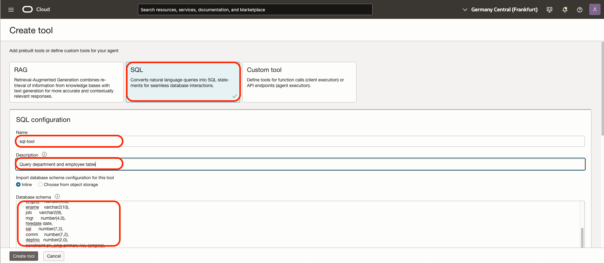
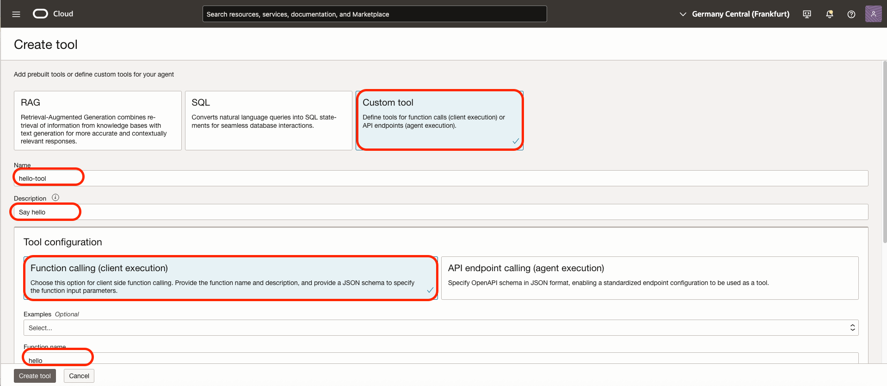
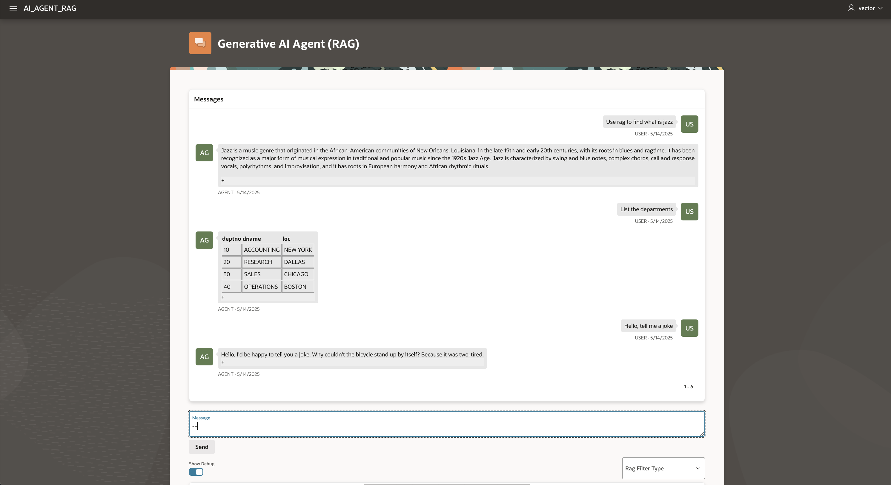

# Adding Tools: SQL and Custom Tools

## Introduction

In this lab, we will add a SQL and custom tool of the previous demos.
At the end, we will have an agent with RAG, SQL and Tool. 

### Objectives

- Add SQL and custom tool. Then test.

### Prerequisites

- The lab 1 must have been completed.
- During the lab 1, terraform has done a part of the work to use the SQL agent. It has created:
    - An Autonomous database
    - Tables DEPT and EMP in the schema ADMIN of this database.
- Find the password of the database in the terraform output of Lab1 ##DB_PASSWORD##

## Task 1: Setup

In the first steps, we will 
- create a connection to the database.
- then, create 3 tools:
    - rag
    - sql
    - custom tool

### 1. Secret ###
- In the hamburger menu, go to Identity and Security / Vault
- You may reuse another existing Vault. If not, create a new one.
- Click **Create Vault**
    - Fill the **Name** - ex: agext-vault
    - **Create** 
- When the Vault is created, go to tab **Master Encryption Keys**
    - **Create Key**
    - Protection mode: **Software**
    - Name: **masterkey**
    - Click **Create**
- When the Master Key is created, go to tab **Secrets**
    - **Create Secret**
    - Name: **agext-db-password-secret**
    - Choose **Manual secret generation**
    - Secret Content: **##DB_PASSWORD##**
    - Click **Create**

### 2. Database Tools Connection ##
- In the hamburger menu, go to Developer Services / Database Tools / Connection
- Click **Create Connection**
    - Name: agext-db-connection    
    - Select Database
    - Database Cloud Service: Autonomous Database
    - Database: agentatp
    - Username: admin
    - Secret: **agext-db-password-secret** (created above)
    - Click **Create Private Endpoint**
        - Name: **agext-db-private-endpoint**
        - Subnet: **agext-db-subnet**
        - Click **Create**
- Wait that the connection is created and active. 
- Click **SQL Worksheet**.
- Check that the tables dept / emp are well there

### 3. Dynamic Group ###
- In the hamburger menu, go to Identity and Security / Domains
- Go the root compartment, and choose your domain
- In the domain, create a Dynamic Group
- For the rule of the Dynamic Group **sql-agent-dyngroup**, add

    ```
    all {resource.type='genaiagent'}
    ```
Note: it is possible that your OCI Admin does not allow you to create Dynamic Group yourself. If so, contact him/her.

### 4. Policies ###
- In the hamburger menu, go to Identity and Security / Policies
- Go to the root compartment
- Create a policy with the following statements ( <compartment_name> is the compartment where you installed the lab 1. )
    ```
    allow dynamic-group sql-agent-dyngroup to read database-tools-family in compartment <compartment_name>
    allow dynamic-group sql-agent-dyngroup to use database-tools-connections in compartment <compartment_name>
    allow dynamic-group sql-agent-dyngroup to read secret-family in compartment <compartment_name>
    allow dynamic-group sql-agent-dyngroup to read objects in tenancy
    ```

### 5. SQL Agent ###
- In the hamburger menu, go to Analytics and AI / Generative AI Agents
- Click on **Agents**
- Open the agent created in Lab 1
- Choose Tools / Create Tool
   
- Choose **SQL**
- Enter:
    **Name** = sql-tool
    **Description** = Query department and employee table
    **Database Schema / Inline** =
    ```
    create table dept(  
      deptno     number(2,0),  
      dname      varchar2(14),  
      loc        varchar2(13),  
      constraint pk_dept primary key (deptno)  
    );

    create table emp(  
      empno    number(4,0),  
      ename    varchar2(10),  
      job      varchar2(9),  
      mgr      number(4,0),  
      hiredate date,  
      sal      number(7,2),  
      comm     number(7,2),  
      deptno   number(2,0),  
      constraint pk_emp primary key (empno),  
      constraint fk_deptno foreign key (deptno) references dept (deptno)  
    );
    ```

    **Dialect**: Oracle SQL
    **Database Connection**: agext-db-connection (created above)
    -> Click Test connection
    **Enable SQL Execution**: Enabled
    Click **Create Tool**

    Optional, add in **Description of tables and columns**, Inline more details of the database columns 
    ```
    Description of the important tables in the schema:

    EMP         Employee names and other information
    DEPT        Department names and other information 

    Description of the important columns of the tables in the schema:

    EMP TABLE    
    emp.empno: Employee number (a unique identifier for each employee).
    emp.ename: Employee name (the name of the employee in uppercase).
    emp.job: Employee job title (the employee's job in uppercase, e.g., 'MANAGER', 'CLERK').
    emp.mgr: Manager employee number (the empno of the employee's manager).  This establishes a hierarchical relationship within the employees.
    emp.hiredate: Employee hire date (the date when the employee was hired).
    emp.sal: Employee salary (the employee's salary).
    emp.comm: Employee commission (any commission earned by the employee).
    emp.deptno: Department number (the deptno of the department the employee belongs to).  This is a foreign key linking back to the dept table.

    DEPT TABLE    
    dept.deptno: Department number (a unique identifier for each department).
    dept.dname: Department name (the name of the department in uppercase, e.g., 'SALES', 'ACCOUNTING').
    dept.loc: Location of the department (the city in uppercase where the department is located).
    ```

### 6. Rag Tool ###

- Let's add the RAG as one of the tool of the toolset. 
- In the hamburger menu, go to Analytics and AI / Generative AI Agents
- Click on **Agents**
- Open the agent created in Lab 1
- Choose Tools / Create Tool
- Choose **RAG** 
   
- Enter:
    **Name** = rag-tool
    **Description** = Use this tool for any question that are not covered by the other tools. It contains generic documentation.
    Select the knowledge base - agext-agent-kb
- Click **Create Tool**

### 6. Custom Tool ###

- In the hamburger menu, go to Analytics and AI / Generative AI Agents
- Click on **Agents**
- Open the agent created in Lab 1
- Choose Tools / Create Tool
   
- Choose **Custom Tool** 
- Enter:
    **Name** = hello-tool
    **Description** = Say hello
    Choose **Function Calling (Client API)**
    **Function Name** = hello
    **Function description** = Say hello
    **Function parameters** == 
    ```
    {"type":"object","properties":"{\"response\":{\"type\":\"string\",\"description\":\"Response to hello.\"}","additionalProperties":"false"}
    ```
- Click **Create Tool**

Wait that all is active.

## Task 2. Test 

1. Go back to the APEX app
2. Type "what is Jazz", then *Enter*
    - The result should come from the RAG tool
3. Type "List the department", then *Enter*
    - The result should come from the SQL tool - table Dept
4. Type "Hello, how are you", then *Enter*
    - The result should come from the Custom Tool Hello Tool



5. Put your mouse over the notes of the different results. Note that you can see:
    - for RAG: document citation, 
    - for SQL: the SQL Query
    - for Custom Tool, function call and parameters

**You may now proceed to the [next lab.](#next)**

## Known issues

None

## Acknowledgements

- **Author**
  - Marc Gueury, Generative AI Specialist
  - Anshuman Panda, Generative AI Specialist
  - Maurits Dijkens, Generative AI Specialist
