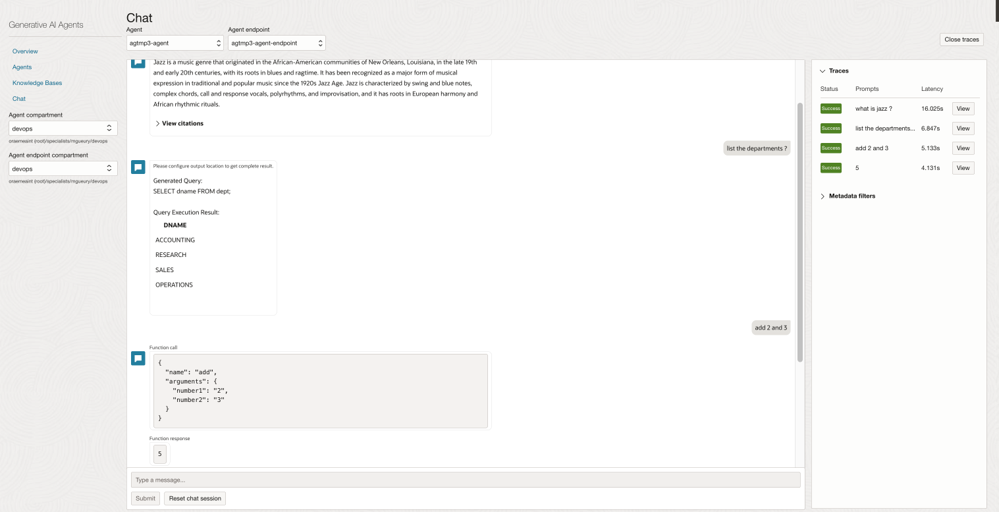
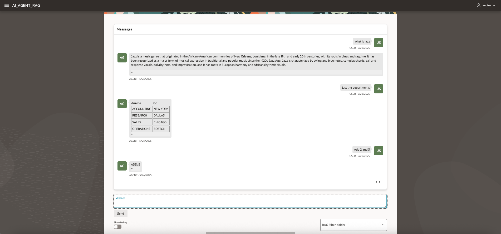
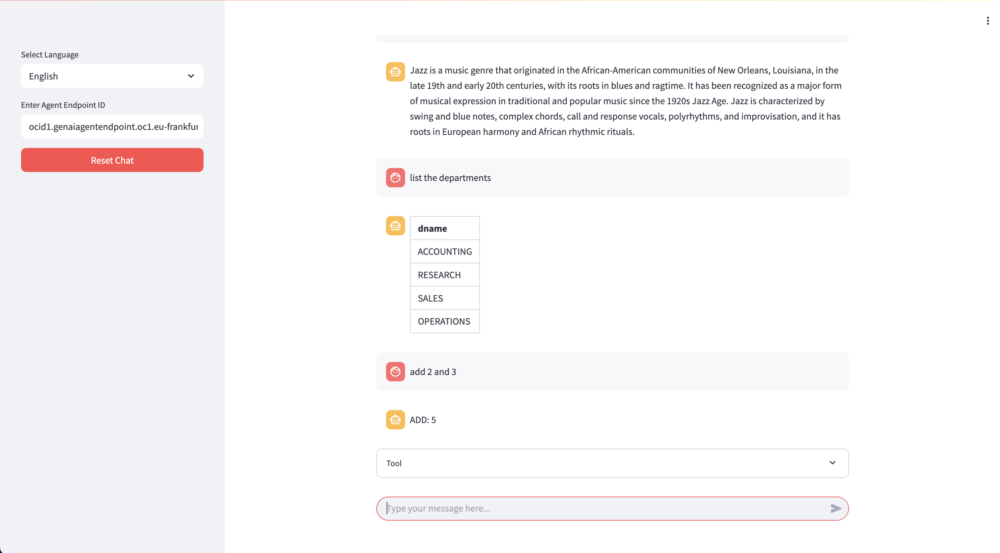

# Adding Tools: SQL and Custom Tools

## Introduction

In this lab, we will add a SQL and a custom tool.
At the end, we will have an agent with RAG, SQL and a custom Tool **implemented on client side**.

### Objectives

- Add SQL and custom tool. Then test.

### Prerequisites

1. The **Install lab** has been completed.
2. The **APEX lab** is completed too. You added the **rag-tool** in the OCI Agent tools.
3. Find the password of the database in the terraform output of Lab1: **##DB_PASSWORD##**

During the lab 1, terraform has done a part of the work to use the SQL agent. It has created:
- An Autonomous database
- Tables DEPT and EMP in the schema ADMIN of this database.

## Task 1: Setup

In the first steps, we will create: 
- A connection to the database.
- 2 tools:
    - SQL tool
    - Custom tool

### 1. Secret ###
- In the hamburger menu, go to **Identity and Security / Vault**
- You may reuse an existing OCI Vault. 
- Or create a new one.
    - Click **Create Vault**
        - Fill the **Name** - ex: agext-vault
        - **Create** 
- Wait that the Vault is active. Click on it to see the details.
- Go to tab **Master Encryption Keys**
    - **Create Key**
    - Protection mode: **Software**
    - Name: **masterkey**
    - Click **Create**
- Go to tab **Secrets**
    - **Create Secret**
    - Name: **agext-db-password-secret**
    - Choose **Manual secret generation**
    - Secret Content: **##DB_PASSWORD##**
    - Click **Create**

### 2. Database Tools Connection ##
- In the hamburger menu, go to **Developer Services / Database Tools / Connection**
- Click **Create Connection**
    - Name = **agext-db-connection**
    - Select Database
    - Database Cloud Service = **Autonomous Database**
    - Database = **agentatp**
    - Username = **admin**
    - Secret = **agext-db-password-secret** (created above)
    - Click **Create Private Endpoint**
        - Name = **agext-db-private-endpoint**
        - Subnet = **agext-db-subnet**
        - Click **Create**
    - Click **Create**    
- Wait that the connection is created and active. 
- Click **SQL Worksheet**.
- Check that the tables dept / emp are well there

### 3. Dynamic Group ###
- In the hamburger menu, go to **Identity and Security / Domains**
- Go the root compartment, and choose your domain
- In the domain, create a Dynamic Group
- For the rule of the Dynamic Group **sql-agent-dyngroup**, add

    ```
    all {resource.type='genaiagent'}
    ```
Note: it is possible that your OCI Admin does not allow you to create Dynamic Group yourself. If so, contact him/her.

### 4. Policies ###
- In the hamburger menu, go to **Identity and Security / Policies**
- Go to your compartment where you installed the lab 1 (##COMPARTMENT_NAME##). Note the name.
- Create a policy with the following statements 
    ```
    allow dynamic-group sql-agent-dyngroup to read database-tools-family in compartment ##COMPARTMENT_NAME##
    allow dynamic-group sql-agent-dyngroup to use database-tools-connections in compartment ##COMPARTMENT_NAME##
    allow dynamic-group sql-agent-dyngroup to read secret-family in compartment ##COMPARTMENT_NAME##
    allow dynamic-group sql-agent-dyngroup to read objects in compartment ##COMPARTMENT_NAME##
    ```

### 5. SQL Agent ###
- In the hamburger menu, go to **Analytics and AI / Generative AI Agents**
- Click on **Agents**
- Open the agent created in Lab 1
- Choose Tools / Create Tool
   
- Choose **SQL**
- Enter:
    - Name = **sql-tool**
    - Description** = **Query department and employee table**
    - Database Schema / Inline =
        ```
        create table dept(  
        deptno     number(2,0),  
        dname      varchar2(14),  
        loc        varchar2(13),  
        constraint pk_dept primary key (deptno)  
        );

        create table emp(  
        empno    number(4,0),  
        ename    varchar2(10),  
        job      varchar2(9),  
        mgr      number(4,0),  
        hiredate date,  
        sal      number(7,2),  
        comm     number(7,2),  
        deptno   number(2,0),  
        constraint pk_emp primary key (empno),  
        constraint fk_deptno foreign key (deptno) references dept (deptno)  
        );
        ```
    - Dialect: **Oracle SQL**
    - Database Connection: **agext-db-connection** (created above)
    -  Click Test connection
    - Enable SQL Execution: **Enabled**
    - Optional:
        - Description of tables and columns = **inline**
        - Description of tables and columns 
            ```
            Description of the important tables in the schema:

            EMP         Employee names and other information
            DEPT        Department names and other information 

            Description of the important columns of the tables in the schema:

            EMP TABLE    
            emp.empno: Employee number (a unique identifier for each employee).
            emp.ename: Employee name (the name of the employee in uppercase).
            emp.job: Employee job title (the employee's job in uppercase, e.g., 'MANAGER', 'CLERK').
            emp.mgr: Manager employee number (the empno of the employee's manager).  This establishes a hierarchical relationship within the employees.
            emp.hiredate: Employee hire date (the date when the employee was hired).
            emp.sal: Employee salary (the employee's salary).
            emp.comm: Employee commission (any commission earned by the employee).
            emp.deptno: Department number (the deptno of the department the employee belongs to).  This is a foreign key linking back to the dept table.

            DEPT TABLE    
            dept.deptno: Department number (a unique identifier for each department).
            dept.dname: Department name (the name of the department in uppercase, e.g., 'SALES', 'ACCOUNTING').
            dept.loc: Location of the department (the city in uppercase where the department is located).
            ```
    - Click **Create Tool**

### 7. Custom Tool ###

- In the hamburger menu, go to **Analytics and AI / Generative AI Agents**
- Click on **Agents**
- Open the agent created in Lab 1
- Choose Tools / Create Tool
   
- Choose **Custom Tool** 
- Enter:
    - Name = **add-tool**
    - Description = **Add 2 numbers**
    - Choose **Function Calling (Client API)**
    - Function Name = **add**
    - Function description = **Add 2 numbers**
    - Function parameters = 
        ```
        {
            "type": "object",
            "properties": {
                "number1": {
                    "type": "string",
                    "description": "Number 1 to add "
                },
                "number2": {
                    "type": "string",
                    "description": "Number 2 to add"
                }

            },
            "required": ["number1","number2"],
            "additionalProperties": false
        }
        ```
- Click **Create Tool**

Wait that all is active.

## Task 2. Test in the console

Using Google Chrome ( there is a known issue at the time of writing with Firefox ), go to the Agent in the OCI console
1. Click **Launch chat**
2. Type "When was Jazz created ?", then *Enter*
    - The result should come from the RAG tool
3. Type "List the departments", then *Enter*
    - The result should come from the SQL tool - table Dept
4. Type "Add 2 and 3", then *Enter*
    - The result should come from the Custom Add Tool
    - Notice that it is a Client tool where the implementation is done on the client side 
    - Type 5, then Submit



## Task 3. Test with APEX

1. Go back to the APEX app (see APEX lab)
2. Type "When was Jazz created ?", then *Enter*
    - The result should come from the RAG tool
3. Type "List the departments", then *Enter*
    - The result should come from the SQL tool - table Dept
4. Type "Add 2 and 3", then *Enter*
    - The result should come from the Custom Add Tool implemented in APEX 
    - See the PLSQL Package body : AI_AGENT / ADD_TOOL



5. Put your mouse over the notes of the different results. Note that you can see:
    - for RAG: document citation, 
    - for SQL: the SQL Query
    - for Custom Tool, function name and arguments

## Task 4: Test with Streamlit 

1. Go back to the Streamlit app (see Streamlit lab)
2. Ask again:
    - When was Jazz created ?
    - List the departments
    - Add 2 and 3



## Known issues

None

## Acknowledgements

- **Author**
  - Marc Gueury, Generative AI Specialist
  - Anshuman Panda, Generative AI Specialist
  - Maurits Dijkens, Generative AI Specialist
