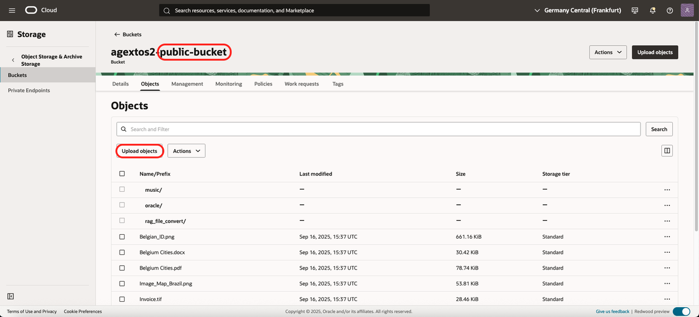
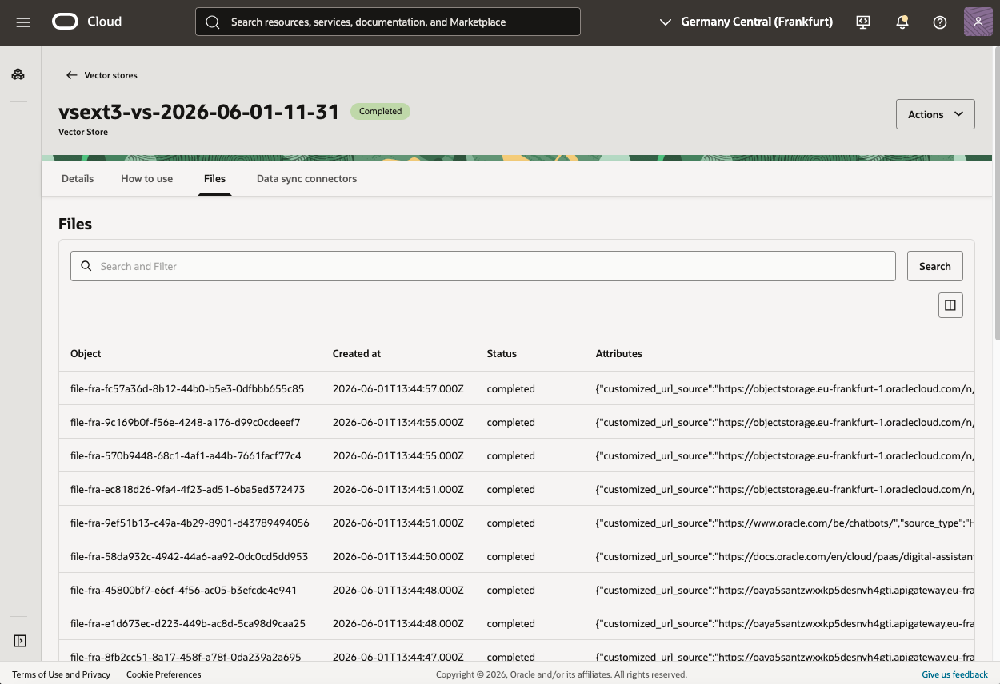

# Customize (Adding new files...)

## Introduction
In this lab, we add our own files to the RAG Agent

Estimated time: 10 min

### Objectives

- Customize the demo

### Prerequisites
- The lab 1 must have been completed.

## Task 1: Recap

When the installation is done, it has created a several resources.


## Task 2: Components

Let's assume that the prefix of the installation is "agext" 

**Virtual Machine**

In OCI Console, click on the Hamburger menu:
- Compute/Instance
- There is a VM "agext-bastion"

**Object storage**

In OCI Console, click on the Hamburger menu:
- Storage/Buckets

There are 2 buckets:
- agext-upload-bucket: where you upload your own files
- agext-converted-bucket: used by the RAG agent for searching. Containing only PDF or text files after conversion.

The files from the agext-upload-bucket are copied or transformed to PDF or text files automatically and stored in the "converted-bucket"

## Task 3: Upload new files
In OCI Console, click on the Hamburger menu:
- Storage/Buckets
- agext-upload-bucket

Upload a new file.
        

- Wait 4/5 mins before to ask a question to the chat.

In the meanwhile,
- Bucket:
    - After 1/2 mins check that it is copied in the Converted Bucket.
- Vector Store
    - In OCI Console, click on the Hamburger menu
    - Analytics & AI/ Generative AI
    - On the side, choose *Vector Stores* 
    - Choose the vector store with your prefix, something like *agext-vs-2026-06-06"
    - Go to the tab *Files*
    - See if your file was indexed. It can take some minutes depending of the size, format, ...
  
          

What will happen internally, depending of the file type, it will be processed in different ways:
- If the file has the extension **.pdf**, **.txt**, **.csv**, **.md**, the file is copied to the AGENT Object Storage.
- If the file has the extension **.png**, **.jpg**, **.jpeg**, or **.gif**, it is processed by OCI Vision. The output is stored in the AGENT Object storage 
- If the file has the extension **.mp4**, **.avi**, **.mp3**, **.wav**, or **.m4a**, it is processed by OCI Speech.
- If the file has the extension **.tif**, it is processed by OCI Document Understanding.
....

## Task 4: (Optional) Virtual Machine

- For debugging purpose if you want to login on the Virtual Machine and see why it could fail

```
In OCI Cloud Shell
cd oci-vector-store-ext/starter

See commands available
./starter.sh 
Navigate to Advanced/SSH

SSH Key
cat target/ssh_key_starter

SSH to Bastion
./starter.sh ssh bastion

# Here you will see the list of apps installed
cd app
ls

# Let's check the "ingest" that does file conversion.
cd ingest
cat ingest.log

# Check the choice of the program by extension
cd src
vi document.py

...
```

## Acknowledgements

- **Author**
    - Marc Gueury, Generative AI Specialist
    - Anshuman Panda, Generative AI Specialist
    - Maurits Dijkens, Generative AI Specialist

