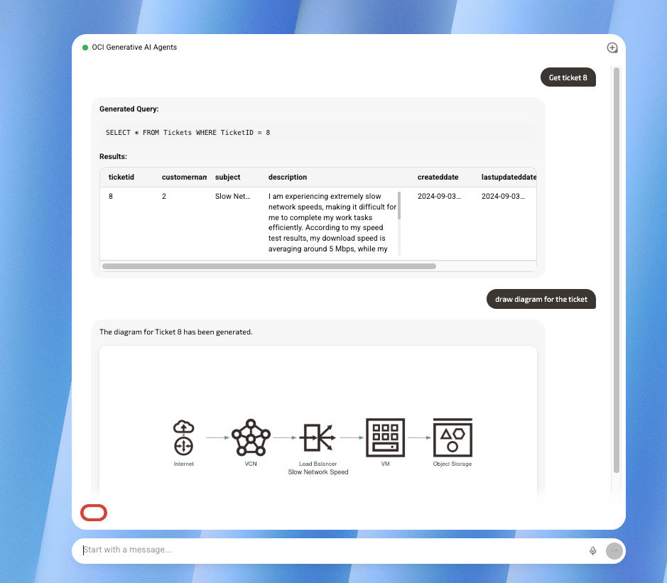
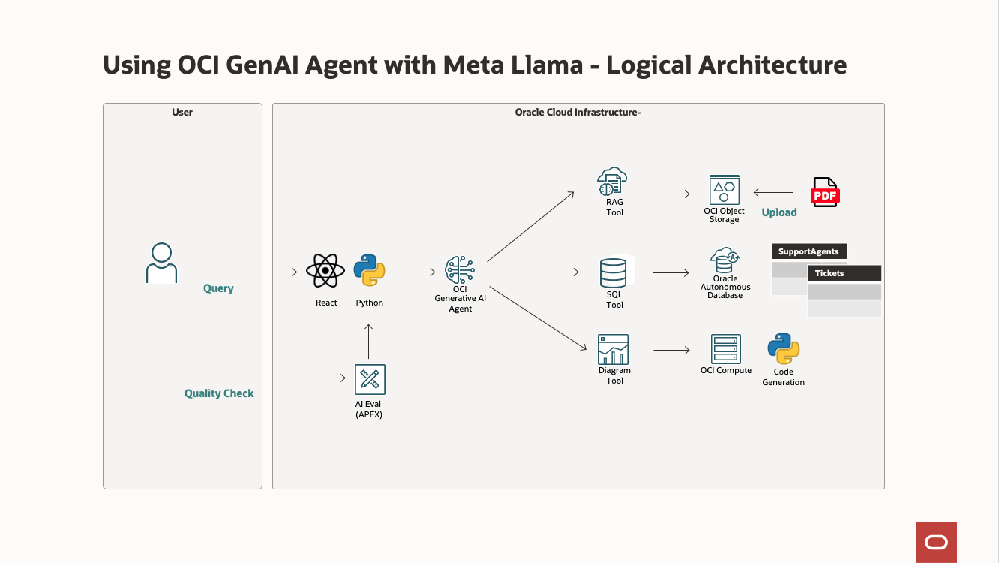
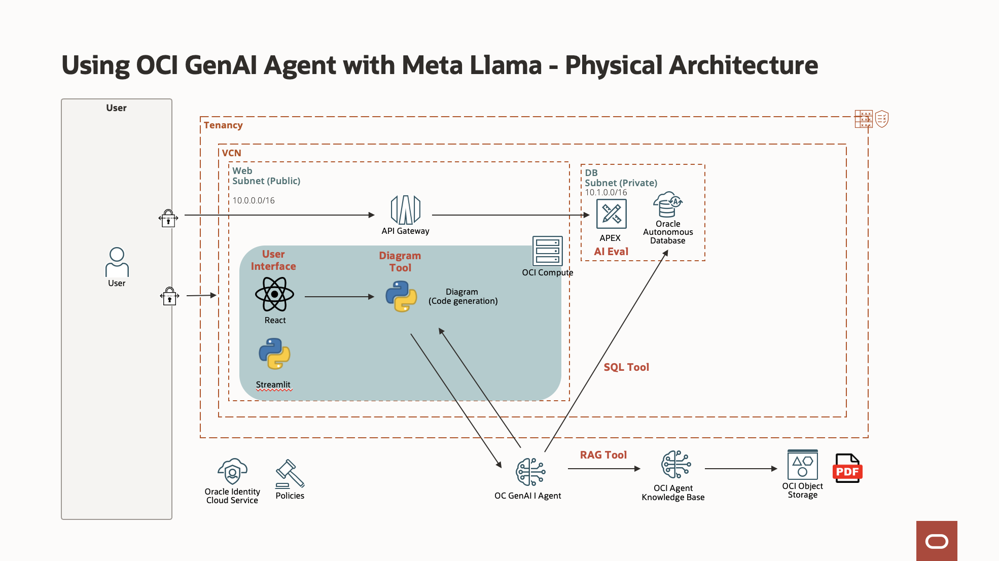

# Introduction

## About This Workshop
In this workshop, we will use Meta Llama with Oracle OCI Generative AI Agent. 

OCI Generative AI Agents combines the power of large language models (LLMs) and retrieval-augmented generation (RAG) with your enterprise data, letting users query diverse enterprise knowledge bases. The service provides up-to-date information through a natural language interface and the ability to act directly on it. The comes with the tools that agents need to address common enterprise requirements:
- **Natural language SQL generation**: This natural language to SQL (NL2SQL) tool lets users interact with structured enterprise data by enabling data retrieval and analysis using natural language queries. Now nterprise users can get answers to their data-related questions.
- **Retrieval-augmented generation (RAG)**: Our RAG tool lets agents dynamically pull data from unstructured sources, improving response accuracy and contextual depth. By integrating RAG within an agent, your experts can provide users with easy access to relevant, high-quality information in real time.
- **Custom Tools**

The sample will show to:
- OCI Generative AI Agent 
- Meta Llama used in several parts of the chat conversation. 

Scenario. The agent will have access 
- to a list of *Tickets* from *Customers* 
- that are being handled by *Support Agents*.

The data of these Customers/Tickets/SupportAgents will stored in an Oracle Database 23ai.

The user will be able to ask questions about the tickets stored in the database **(using SQL)**, about a Knowledge base of PDFs **(using RAG)**, and generate graphical diagrams of the SRs **(using Code Generation)**

The installation uses Terraform.

Estimated Workshop Time: 90 minutes

### Logical Architecture

This picture shows the processing flow.

It works like this:
1. During the installation, you will create an agent with 3 tools:
    - a RAG tool to search in your documents
    - a SQL tool to search in the database
    - a code generation tool to create diagrams
1. When the user go to the user interface (Streamlit)
1. The agent is called and decide which tool to use
1. The tool is called (one of the above one)
1. The response is sent back to the end-user

### Physical Architecture

We will install the following architecture using Terraform.

### Objectives

- Provision the services needed for the system
    - Compartment, Object Storage Bucket, GenAI Agent, Autonomous database and a Virtual Machine
- Integrate the components into a working system

**Please proceed to the [next lab.](#next)**

## Acknowledgements 

- **Author**
    - Marc Gueury, Oracle Generative AI Platform
    - Omar Salem, Oracle Generative AI Platform
    - Ras Alungei, Oracle Generative AI Platform
    - Anshuman Panda, Oracle Generative AI Platform
