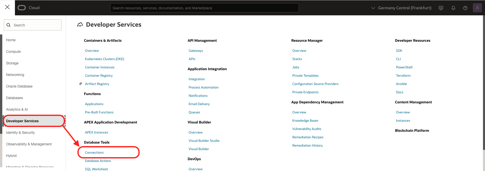
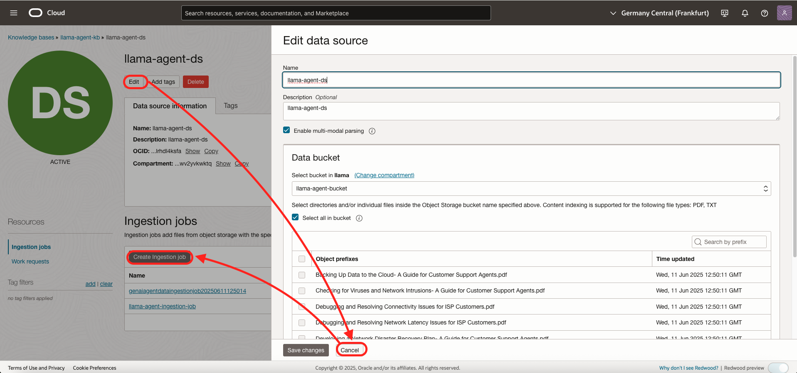
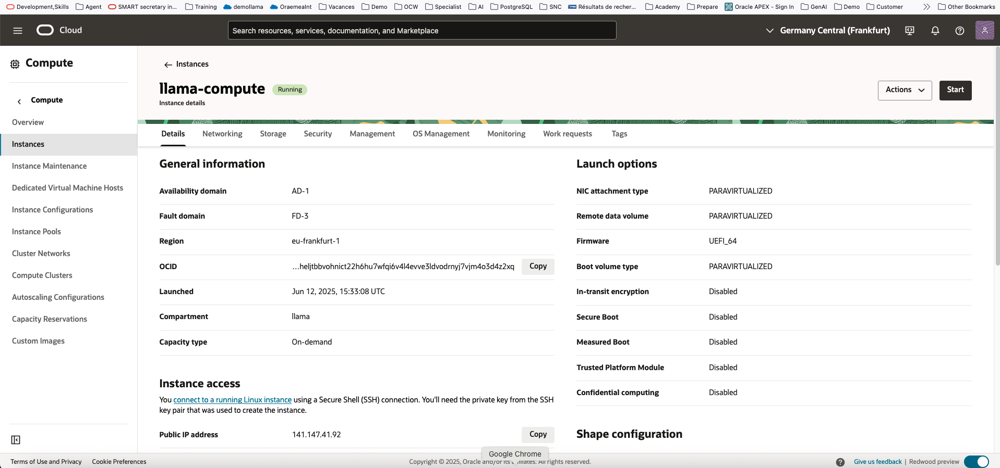
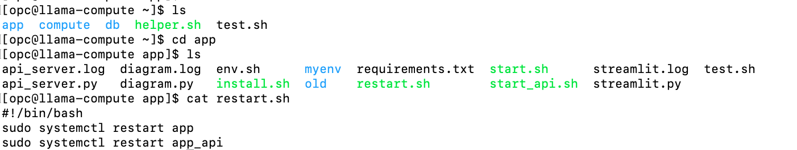

# Explore and Test

## Introduction
In this lab, we will explore and test the installation.
Estimated time: 10 min

### Objectives

- Explore what has been installed 
- Test using the OCI Console
- Test using an user interface

For more information about the OCI Generative agent. Go [here](https://docs.oracle.com/en-us/iaas/Content/generative-ai-agents/overview.htm).

### Prerequisites
- The lab 1 must have been completed.

## Task 1: Explore - Agent

Let's look at what has been installed.

1. Go to the OCI Menu, go to *Analytics & AI* - *Generative AI Agents*
       
1. Check that you selected the *compartment* where the installation was done. 
1. Click on *Agents*.
1. Click on the agent name (ex: *llama-agent*) 
1. In the the Agent definition, click on *tools*
        
1. You will see 3 tools ( RAG / SQL / DIAGRAM )
1. Click on *SQL Tool*. Then *Edit*. Check the SQL Tool definition. Then press *Cancel*.
        
    As you can see there is the definition of the tables and the description of the columns.
1. Click on *RAG Tool*. Then *Edit*. Check the RAG Tool definition. Then press *Cancel*.
        
1. Click on *Diagram Tool*. Then *Edit*. Check the Diagram Tool definition. Then press *Cancel*.
        

## Task 2: Explore - SQL Tool in details 

The SQL tool relies on an Autonomous database and database connection using a user/password stored in a Vault. 

In the test below, you will ask *Get the tickets that have a description containing cloud*. The agent detects the use case using llm and determine to trigger SQL Tool for providing response. SQL Tool converts natural language queries into SQL statements and can run the SQL commands to generate responses against the connected 23ai vector database.

Let's check this.

For more information about the SQL Tools. Go [here](https://docs.oracle.com/en-us/iaas/Content/generative-ai-agents/sql-tool.htm#sql-tool).

#### Autonomous Database
1. Go to the OCI Menu, go to *Oracle Database* - *Autonomous Database*
       
1. Click on the Autonomous database name, typically *llama-atp*
1. If you scroll down, you will see that the database is in a private network. So, not reachable per default from the internet.
       

#### Database Connection
1. Go to the OCI Menu, go to *Developer Services* - *Database Tools - Connection*
       
1. Click on the Connection name, typically *llama-dbtools-connection*
1. If you look at the conenction, you will see the connection string, the username, the password stored in a vault.
       

#### Table
1. Click *SQL Worksheet*
1. Notice the tables Tickets and SupportAgents
1. Drag&Drop the table *Tickets* in the worksheet
1. Choose *select* then click *Apply*
1. Click the *Green run icon* to run the query

      

## Task 3: Explore - RAG tool in details

The RAG tool allows to search inside documents. It stores its documents in a Storage Bucket and ingest them in a Knowledge Base.

In the test below, you will ask *What is the importance of Virus and Intrusion Detection*. The agent detects the use case using llm and determine to trigger RAG Tool and your documents (PDF,...) for providing response. RAG Tool:
- Converts the natural language query into a vector that has a semantic meaning. 
- Using this vector, it will find the documents that speak about the same topic
- And then generate a final response.

Let's check this.

For more information about the RAG Tools. Go [here](https://docs.oracle.com/en-us/iaas/Content/generative-ai-agents/RAG-tool.htm#RAG-tool).

#### Bucket
1. Go to the OCI Menu, go to *Storage* - *Bucket*
       
1. Click on the bucket name, typically *llama-agent-bucket*
1. If you scroll down, you will see that the bucket contains PDF files.
       

#### Knowledge Base
1. Go to the OCI Menu, go to *Analytics / AI* - *Generative AI Agents*
1. Click on *Knowledge Bases*. You should the created Knowledge Base list.
1. Click on the *llama-agent-kb*
       

#### DataSource
1. Click on the datasource *llama-agent-ds*
1. Click *Edit*
1. Check the datasource definition. That it points to the Object Storage Bucket *llama-agent-bucket*
1. Click *Cancel*
    

**Ingestion**
1. In the datasource above, try *Create Ingestion Job*. This process will update the KB when new files are added or updated.

## Task 4: Explore - Diagram tool in details

The diagram tool is written in python code. In the test below, you will ask **Draw a diagram*. The agent detects the use case using llm and determine to trigger Diagram Tool. It will:
- Creates a python program on the fly using Llama
- Run this program that will generate an image with a diagram.
- Show the image to the end-user

For more information about the Custom Tools. Go [here](https://docs.oracle.com/en-us/iaas/Content/generative-ai-agents/function-calling-tool.htm).

#### Compute
1. Go to the OCI Menu, go to *Compute* - *Instance*
       
1. Click on the Compute name, typically *llama-compute*
1. The compute is a virtual machine running the python code.
       

#### SSH ( OPTIONAL )
1. Run again the Cloud shell
2. Run these commands:
```
<copy>
cd oci-genai-agent-llama
./starter.sh ssh bastion
ls
cd app
ls 
cat api_server.py
cat api_server.log
cat restart.sh
</copy>
```

   

The python program is separated in 2 parts:
- an API_SERVER (API only)
- and a Streamlit for the user interface 
Below, we will use the User Interface. We will use the API in the AI Eval in the next lab.

## Task 5 - Test in OCI Console

Go back to the agents:

1. Go to the OCI Menu, go to *Analytics & AI* - *Generative AI Agents*
       
1. Check that you selected the *compartment* where the installation was done. 
1. Click on *Agents*.
1. Click on the agent name (ex: *llama-agent*) 
1. Click *Launch Chat*
1. Type the question *Get the tickets that have a description containing cloud*
       
1. Check the trace
       
1. Type the question *What is the importance of Virus and Intrusion Detection*
      
1. Open the citation and check the source document.
1. Open the trace
       
1. Type the question *Draw a diagram of ticket 36*
       
1. You will see that it asks for an answer. It is expected. The API is defined like a client API tool that will be executed in the Python app.
1. Close the chat.

## Task 6 - Test in React

In the output of the installation of last lab, you got an React URL. Go to it.
ex: http://12.23.56.78

1. Type the question *Get the tickets that have a description containing cloud*
       
1. Type the question *What is the importance of Virus and Intrusion Detection*
       
1. Type the question *Get the ticket 8*
       
1. Type the question *Draw a diagram of ticket 8*
       

## Task 7 - (Optional) Test in Streamlit

In the output of the installation of last lab, you got an Streamlit URL. Go to it.
ex: http://12.23.56.78:8080

1. Type the question *Get the 10 first tickets that have a description containing cloud*
       
1. Type the question *What is the importance of Virus and Intrusion Detection*
       
1. Type the question *Get the ticket 1054*
       
1. Type the question *Draw a diagram of ticket 1054*
       

**You may now proceed to the [next lab.](#next)**

## Known issues

None

## Acknowledgements

- **Author**
    - Marc Gueury, Oracle Generative AI Platform
    - Omar Salem, Oracle Generative AI Platform
    - Ras Alungei, Oracle Generative AI Platform
    - Anshuman Panda, Oracle Generative AI Platform
