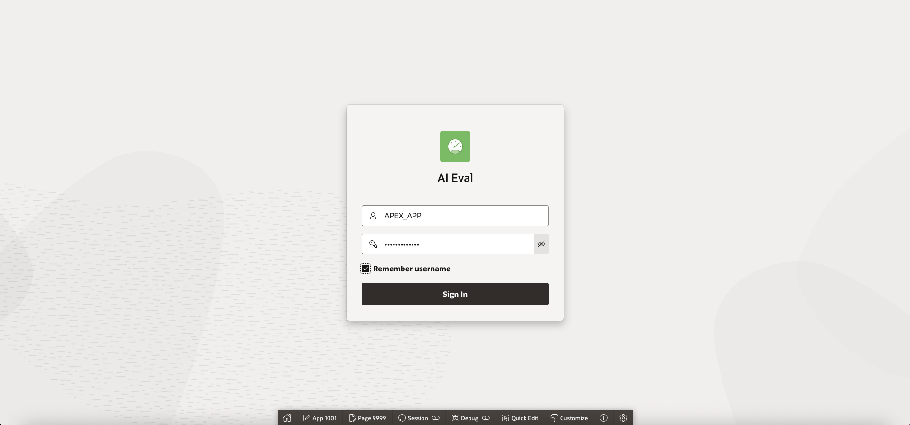

# Quality check

## Introduction
In this lab, we will test the quality of the Agent and program using a evaluation application in APEX
Estimated time: 10 min

### Objectives

To evaluate the quality of the response of the Agent, we will use an application **AI Eval**. It is built with APEX, a low-code development tool, that comes with Oracle Database. It works like this:
- The *Question/Answer* table is stored in 23ai vector.
- When running a test, it will send all the questions to AI Agent API
- Then compare the AI Agent API *Response* with the *expected Answer* using Llama.
- Giving a score of 0 to 100.

During the lab, we will:
- Test the quality of the AI Agent
- The APEX app is using LLama and a prompt to compare the result of Agent with the expected responses stored in the database.

### Prerequisites
- The lab 1 must have been completed.

## Task 1: AI Eval

1. Check the APEX URL and the User/Password at the end of the build log.
    
1. Go to the url of the application (ex: https://abcdefghijklmnop.apigateway.eu-frankfurt-1.oci.customer-oci.com/ords/r/apex_app/apex_app/)
1. In Oracle APEX, click *Go*
1. Login as APEX\_APP / YOUR\_PASSWORD
        
1. You will see the *Dashboard*
        
1. Open the menu and go to *Question Answer*
        
1. Open the menu and go to *Runs*
1. Click *Run Eval*
1. Reset the page after 30 secs. Check the *end date* to see when the run is finished.
        
1. Click on the zoom icon next to the *Run* name
1. Check the results
        
1. Go back to the Dashboard
        

## Task 2: APEX Builder (Optional)

For the fans of APEX, check the APEX Builder URL and the User/Password at the end of the build log.
1. Go to the url of the application (ex: https://abcdefghijklmnop.apigateway.eu-frankfurt-1.oci.customer-oci.com/ords/_/landing)
1. You will see the REST Data Services page. Click *Go* button under Oracle APEX.
1. Login as APEX\_APP / APEX\_APP / YOUR\_PASSWORD
     
1. In the APEX Builder, click *App Builder*
1. Choose *AI Eval* and check the pages
     
1. In the APEX Builder, click *SQL Workshop* / *Object Browser*
   - Extend the tables
   - Check the Database objects
     

## END

Congratulation ! You have finished the lab !!
We hope that you learned something useful.

## Known issues

None

## Acknowledgements

- **Author**
    - Marc Gueury, Oracle Generative AI Platform
    - Omar Salem, Oracle Generative AI Platform
    - Ras Alungei, Oracle Generative AI Platform
    - Anshuman Panda, Oracle Generative AI Platform
