# Setup the database

## Introduction

In this lab, we are going to create an Autonomous Database instance (ADB), define the schema for loan applicants and loan applications, and insert seed data that the Compliance Officer Agent will query.

Estimated Time: 25 minutes

### Objectives

In this lab, you will:

- Create an ADB instance.
- Create the database schema.
- Insert data into the database.
- Create a vault to securely store the database connection information.
- Create a database connection.

### Prerequisites

This lab assumes you have:

- Completed the previous labs.

## Task 1: Create an ADB instance

In this task we are going to create a new ADB instance.

1. Click the navigation menu on the top left.
1. Click **Oracle Database**.
1. Click **Autonomous Database**.

   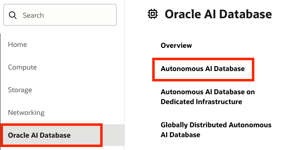

1. Under the **List scope** section, make sure that the **root** compartment is selected.
1. Click the **Create Autonomous Database** button at the top of the **Autonomous Databases** table.

   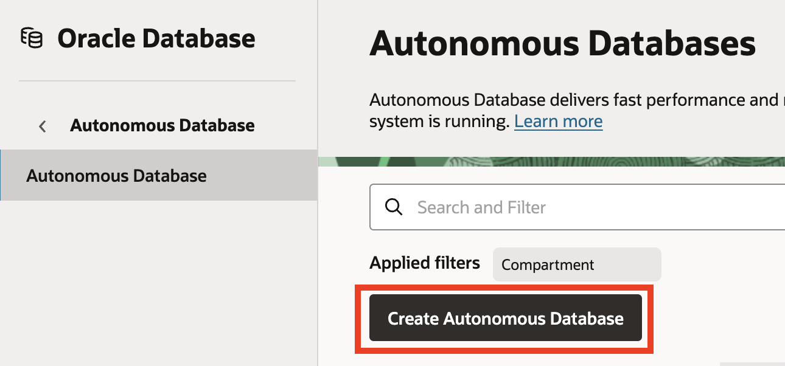

1. For the **Display name** use: _loan-compliance_.
1. For the **Database name** use: _loancompliance_.
1. Under the **Compartment**, make sure that the **root** compartment is selected.
1. Under **Workload type** make sure that **Data Warehouse** is selected.

   

1. Under the **Database configuration** section, enable the **Developer** option.
1. Select **23ai** as the version under **Choose database version**.

   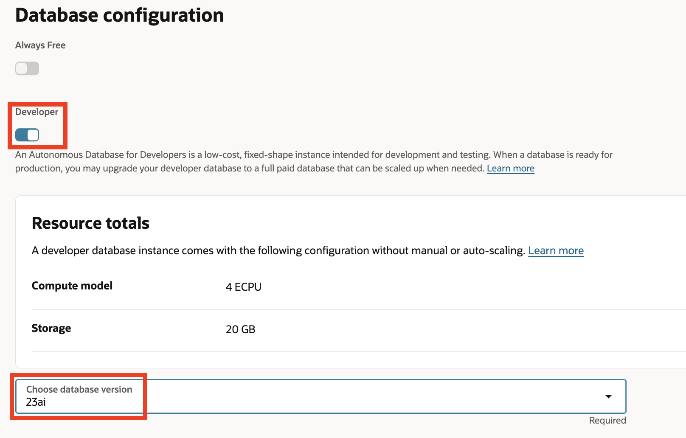

1. Under the **Administrator credentials creation** section, type a password (for example: _myPassword123_), in the **Password** field and confirm the password in the **Confirm password** field. Please make sure to choose a password you'd remember as we are going to need to type this password later.
1. Under the **Network access** section, make sure that the **Secure access from everywhere** option is selected.

   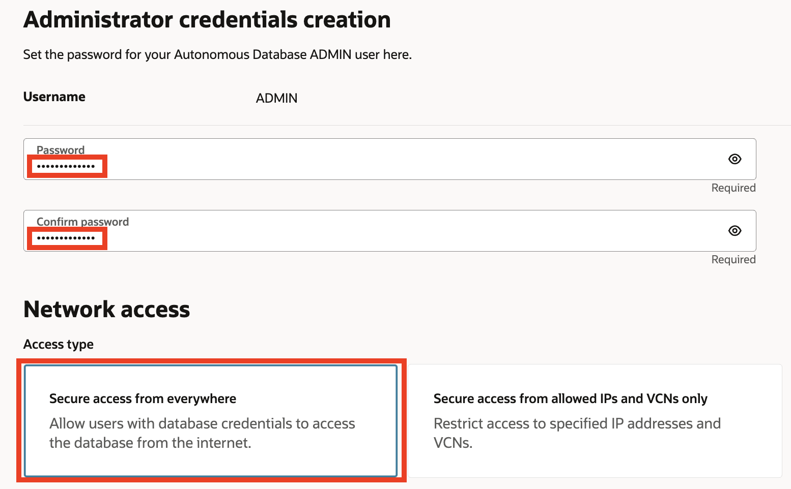

1. Click the **Create** button at the bottom of the screen.

Once the database instance is created, you can move on to the next task (this may take a few minutes).

## Task 2: Create the database schema

In this task we are going to use SQL scripts to create the database schema which consists of tables and sequences (which will take care of inserting unique values for the various IDs like the loan application ID or applicant ID etc.).

1. Once the ADB instance is created, click the **Database actions** drop down and select the **SQL** option. This should launch a new tab in your browser with the SQL application (dismiss any messages if you see any).

   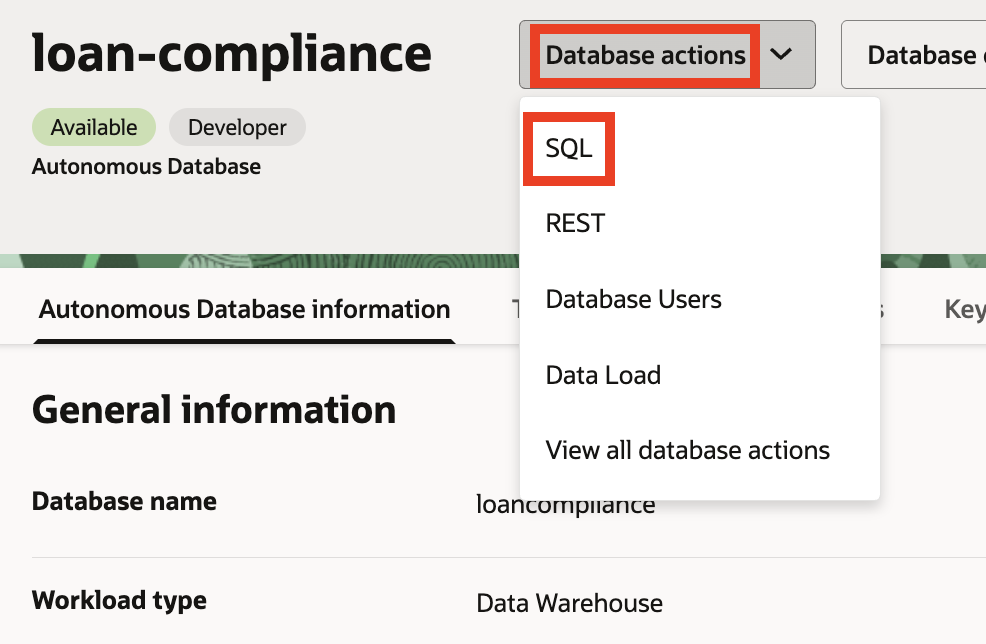

1. Copy the following sql statements, paste them into the **SQL worksheet** and click the green **Run Statement** button at the top.

    ```sql
    <copy>
    CREATE TABLE Applicants (
      ApplicantID        NUMBER PRIMARY KEY,
      ExternalCustomerID VARCHAR2(20) UNIQUE,
      FirstName          VARCHAR2(50) NOT NULL,
      LastName           VARCHAR2(50) NOT NULL,
      Address            VARCHAR2(200),
      City               VARCHAR2(50),
      State              VARCHAR2(2),
      ZipCode            VARCHAR2(10),
      Age                NUMBER,
      AnnualIncome       NUMBER,
      CreditScore        NUMBER
    );
    
    CREATE TABLE LoanOfficers (
      OfficerID NUMBER PRIMARY KEY,
      FirstName VARCHAR2(50) NOT NULL,
      LastName  VARCHAR2(50) NOT NULL,
      Email     VARCHAR2(100) UNIQUE NOT NULL,
      Phone     VARCHAR2(20)
    );
    
    CREATE TABLE LoanStatus (
      StatusID   NUMBER PRIMARY KEY,
      StatusName VARCHAR2(50) NOT NULL
    );
   
    CREATE TABLE LoanApplications (
      LoanApplicationID   NUMBER PRIMARY KEY,
      ApplicationID       NUMBER UNIQUE NOT NULL,
      ApplicantID         NUMBER NOT NULL,
      LoanType            VARCHAR2(50) NOT NULL,
      RequestedAmount     NUMBER NOT NULL,
      DebtToIncomeRatio   NUMBER NOT NULL,
      CreatedDate         DATE DEFAULT SYSTIMESTAMP NOT NULL,
      LastUpdatedDate     DATE DEFAULT SYSTIMESTAMP NOT NULL,
      StatusID            NUMBER NOT NULL,
      AssignedToOfficerID NUMBER,
      EducationLevel      VARCHAR2(50),
      TotalDebt           NUMBER,
      Veteran             VARCHAR2(3),
      CONSTRAINT fk_la_applicant FOREIGN KEY (ApplicantID) REFERENCES Applicants(ApplicantID),
      CONSTRAINT fk_la_status    FOREIGN KEY (StatusID) REFERENCES LoanStatus(StatusID),
      CONSTRAINT fk_la_officer   FOREIGN KEY (AssignedToOfficerID) REFERENCES LoanOfficers(OfficerID)
    );
    
    -- Sequences + Triggers
    CREATE SEQUENCE ApplicantSeq START WITH 1 INCREMENT BY 1;
    /
    CREATE OR REPLACE TRIGGER ApplicantTrigger
    BEFORE INSERT ON Applicants
    FOR EACH ROW
    BEGIN
      SELECT ApplicantSeq.NEXTVAL INTO :NEW.ApplicantID FROM DUAL;
    END;
    /
    CREATE SEQUENCE OfficerSeq START WITH 1 INCREMENT BY 1;
    /
    CREATE OR REPLACE TRIGGER OfficerTrigger
    BEFORE INSERT ON LoanOfficers
    FOR EACH ROW
    BEGIN
      SELECT OfficerSeq.NEXTVAL INTO :NEW.OfficerID FROM DUAL;
    END;
    /
    CREATE SEQUENCE AppStatusSeq START WITH 1 INCREMENT BY 1;
    /
    CREATE OR REPLACE TRIGGER AppStatusTrigger
    BEFORE INSERT ON LoanStatus
    FOR EACH ROW
    BEGIN
      SELECT AppStatusSeq.NEXTVAL INTO :NEW.StatusID FROM DUAL;
    END;
    /
    CREATE SEQUENCE LoanAppSeq START WITH 1 INCREMENT BY 1;
    /
    CREATE OR REPLACE TRIGGER LoanAppTrigger
    BEFORE INSERT ON LoanApplications
    FOR EACH ROW
    BEGIN
      SELECT LoanAppSeq.NEXTVAL INTO :NEW.LoanApplicationID FROM DUAL;
    END;
    /
    </copy>
    ```

   You should see an output similar to the following:

   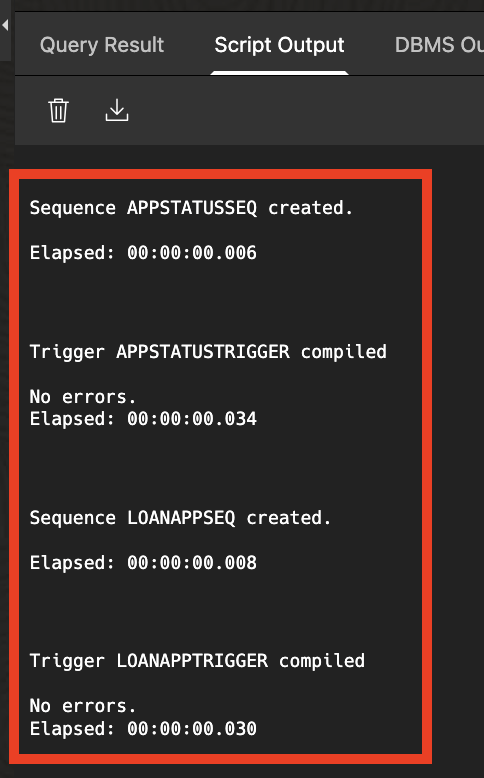

## Task 3: Insert data

In this task we are going to fill the database tables with data.
One after the other, copy each of the following SQL sections, <u>in order</u>, and paste each statement into the **SQL worksheet**, <u>replacing any existing text</u>. After the statement has been pasted, click the **Run Script** button.

   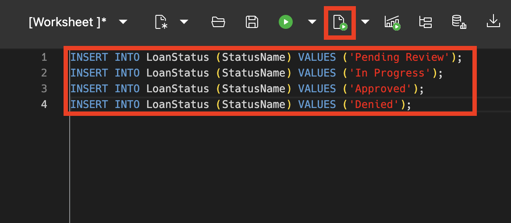

It is important to make sure that you only copy & execute a single section at a time.
Don't forget to select all of the text in the worksheet before executing the statement.
After you execute a statement look for an output similar to the following:

   

1. Insert data into the **LoanStatus** table:

    ```sql
    <copy>
    INSERT INTO LoanStatus (StatusName) VALUES ('Pending Review');
    INSERT INTO LoanStatus (StatusName) VALUES ('In Progress');
    INSERT INTO LoanStatus (StatusName) VALUES ('Approved');
    INSERT INTO LoanStatus (StatusName) VALUES ('Denied');
    </copy>
    ```

1. Insert data into the **LoanOfficers** table:

    ```sql
    <copy>
    INSERT INTO LoanOfficers (FirstName, LastName, Email, Phone)
    VALUES ('Emma','Johnson','emma.johnson@bank.com','555-123-4567');
    INSERT INTO LoanOfficers (FirstName, LastName, Email, Phone)
    VALUES ('Liam','Smith','liam.smith@bank.com','555-234-5678');
    INSERT INTO LoanOfficers (FirstName, LastName, Email, Phone)
    VALUES ('Olivia','Brown','olivia.brown@bank.com','555-345-6789');
    INSERT INTO LoanOfficers (FirstName, LastName, Email, Phone)
    VALUES ('Noah','Davis','noah.davis@bank.com','555-456-7890');
    INSERT INTO LoanOfficers (FirstName, LastName, Email, Phone)
    VALUES ('Sophia','Wilson','sophia.wilson@bank.com','555-567-8901');
    INSERT INTO LoanOfficers (FirstName, LastName, Email, Phone)
    VALUES ('Mason','Garcia','mason.garcia@bank.com','555-678-9012');
    INSERT INTO LoanOfficers (FirstName, LastName, Email, Phone)
    VALUES ('Isabella','Martinez','isabella.martinez@bank.com','555-789-0123');
    INSERT INTO LoanOfficers (FirstName, LastName, Email, Phone)
    VALUES ('Ethan','Lopez','ethan.lopez@bank.com','555-890-1234');
    INSERT INTO LoanOfficers (FirstName, LastName, Email, Phone)
    VALUES ('Ava','Hernandez','ava.hernandez@bank.com','555-901-2345');
    INSERT INTO LoanOfficers (FirstName, LastName, Email, Phone)
    VALUES ('James','Nguyen','james.nguyen@bank.com','555-012-3456');
    </copy>
    ```

1. Insert data into the **Applicants** table:

    ```sql
    <copy>
    -- Insert data into the Applicants table:
    INSERT INTO Applicants (ExternalCustomerID, FirstName, LastName, Address, City, State, ZipCode, Age, AnnualIncome, CreditScore)
    VALUES ('CUST_22000', 'Benjamin', 'Rodriguez', NULL, 'Houston', 'TX', '77001', 27, 130000, 599);

    INSERT INTO Applicants (ExternalCustomerID, FirstName, LastName, Address, City, State, ZipCode, Age, AnnualIncome, CreditScore)
    VALUES ('CUST_30000', 'Emily', 'Davis', NULL, 'Boston', 'MA', '02108', 30, 80000, 680);

    INSERT INTO Applicants (ExternalCustomerID, FirstName, LastName, Address, City, State, ZipCode, Age, AnnualIncome, CreditScore)
    VALUES ('CUST_20000', 'Charlotte', 'Harris', NULL, 'Dallas', 'TX', '75201', 25, 120000, 567);

    INSERT INTO Applicants (ExternalCustomerID, FirstName, LastName, Address, City, State, ZipCode, Age, AnnualIncome, CreditScore)
    VALUES ('CUST_21000', 'Amelia', 'Martin', NULL, 'Denver', 'CO', '80204', 26, 115000, 605);

    INSERT INTO Applicants (ExternalCustomerID, FirstName, LastName, Address, City, State, ZipCode, Age, AnnualIncome, CreditScore)
    VALUES ('CUST_28000', 'Evelyn', 'Garcia', NULL, 'Chicago', 'IL', '60610', 28, 115000, 608);

    INSERT INTO Applicants (ExternalCustomerID, FirstName, LastName, Address, City, State, ZipCode, Age, AnnualIncome, CreditScore)
    VALUES ('CUST_13000', 'Shane', 'Thompson', NULL, 'Las Vegas', 'NV', '89101', 24, 115000, 610);

    INSERT INTO Applicants (ExternalCustomerID, FirstName, LastName, Address, City, State, ZipCode, Age, AnnualIncome, CreditScore)
    VALUES ('CUST_6000', 'Mason', 'Baker', NULL, 'Atlanta', 'GA', '30303', 40, 90000, 650);

    INSERT INTO Applicants (ExternalCustomerID, FirstName, LastName, Address, City, State, ZipCode, Age, AnnualIncome, CreditScore)
    VALUES ('CUST_27000', 'Ava', 'Perez', NULL, 'Phoenix', 'AZ', '85001', 22, 65000, 700);
    </copy>
    ```

1. Insert data into the **LoanApplications** table:

    ```sql
    <copy>
    -- Insert data into the LoanApplications table:
    INSERT INTO LoanApplications (ApplicationID, ApplicantID, LoanType, RequestedAmount, DebtToIncomeRatio, CreatedDate, LastUpdatedDate, StatusID, AssignedToOfficerID, EducationLevel, TotalDebt, Veteran)
    SELECT 1005, a.ApplicantID, 'VA', 200000, 46, TO_DATE('03-JUN-25','DD-MON-YY'), TO_DATE('16-JUN-25','DD-MON-YY'),
      (SELECT StatusID FROM LoanStatus WHERE StatusName='Denied'), 1, 'PhD', 90000, 'Yes'
    FROM Applicants a WHERE a.ExternalCustomerID='CUST_22000';

    INSERT INTO LoanApplications (ApplicationID, ApplicantID, LoanType, RequestedAmount, DebtToIncomeRatio, CreatedDate, LastUpdatedDate, StatusID, AssignedToOfficerID, EducationLevel, TotalDebt, Veteran)
    SELECT 1006, a.ApplicantID, 'VA', 100000, 57, TO_DATE('15-JUN-25','DD-MON-YY'), TO_DATE('30-JUN-25','DD-MON-YY'),
      (SELECT StatusID FROM LoanStatus WHERE StatusName='Denied'), 2, 'High School', 89656, 'Yes'
    FROM Applicants a WHERE a.ExternalCustomerID='CUST_30000';

    INSERT INTO LoanApplications (ApplicationID, ApplicantID, LoanType, RequestedAmount, DebtToIncomeRatio, CreatedDate, LastUpdatedDate, StatusID, AssignedToOfficerID, EducationLevel, TotalDebt, Veteran)
    SELECT 1007, a.ApplicantID, 'VA', 95000, 20, TO_DATE('16-JUN-25','DD-MON-YY'), TO_DATE('01-JUL-25','DD-MON-YY'),
      (SELECT StatusID FROM LoanStatus WHERE StatusName='Approved'), 3, 'PhD', 318639, 'Yes'
    FROM Applicants a WHERE a.ExternalCustomerID='CUST_20000';

    INSERT INTO LoanApplications (ApplicationID, ApplicantID, LoanType, RequestedAmount, DebtToIncomeRatio, CreatedDate, LastUpdatedDate, StatusID, AssignedToOfficerID, EducationLevel, TotalDebt, Veteran)
    SELECT 1008, a.ApplicantID, 'FHA', 3000000, 15, TO_DATE('16-JUL-25','DD-MON-YY'), TO_DATE('01-AUG-25','DD-MON-YY'),
      (SELECT StatusID FROM LoanStatus WHERE StatusName='Pending Review'), 3, 'PhD', 90630, 'No'
    FROM Applicants a WHERE a.ExternalCustomerID='CUST_21000';

    INSERT INTO LoanApplications (ApplicationID, ApplicantID, LoanType, RequestedAmount, DebtToIncomeRatio, CreatedDate, LastUpdatedDate, StatusID, AssignedToOfficerID, EducationLevel, TotalDebt, Veteran)
    SELECT 1011, a.ApplicantID, 'Conventional', 1000000, 35, TO_DATE('16-AUG-25','DD-MON-YY'), TO_DATE('26-AUG-25','DD-MON-YY'),
      (SELECT StatusID FROM LoanStatus WHERE StatusName='In Progress'), 5, 'Bachelor', 75000, 'No'
    FROM Applicants a WHERE a.ExternalCustomerID='CUST_28000';

    INSERT INTO LoanApplications (ApplicationID, ApplicantID, LoanType, RequestedAmount, DebtToIncomeRatio, CreatedDate, LastUpdatedDate, StatusID, AssignedToOfficerID, EducationLevel, TotalDebt, Veteran)
    SELECT 1013, a.ApplicantID, 'FHA', 50000, 5, TO_DATE('10-JUL-25','DD-MON-YY'), TO_DATE('20-JUL-25','DD-MON-YY'),
      (SELECT StatusID FROM LoanStatus WHERE StatusName='Approved'), 7, 'Masters', 650000, 'No'
    FROM Applicants a WHERE a.ExternalCustomerID='CUST_13000';

    INSERT INTO LoanApplications (ApplicationID, ApplicantID, LoanType, RequestedAmount, DebtToIncomeRatio, CreatedDate, LastUpdatedDate, StatusID, AssignedToOfficerID, EducationLevel, TotalDebt, Veteran)
    SELECT 1015, a.ApplicantID, 'Conventional', 25000, 10, TO_DATE('26-JUL-25','DD-MON-YY'), TO_DATE('01-AUG-25','DD-MON-YY'),
      (SELECT StatusID FROM LoanStatus WHERE StatusName='Pending Review'), 10, 'High School', 50000, 'No'
    FROM Applicants a WHERE a.ExternalCustomerID='CUST_6000';
    -- … continue inserting each ApplicationID row exactly as in your sample data …
    </copy>
    ```

## Task 4: Create a Vault to securely store the database connection information

In this task we are going to create a Vault and an encryption key. We are going to use this vault to securely store the password used to connect to the database as a secret. This secret is going to be used in the next section by the database connection.

1. Click the navigation menu on the top left.
1. Click **Identity & Security**.
1. Click **Vault** under **Key Management & Secret Management**.

   

1. Under the **List scope** section, make sure that the **root** compartment is selected.
1. Click the **Create Vault** button at the top of the **Vaults** table.

   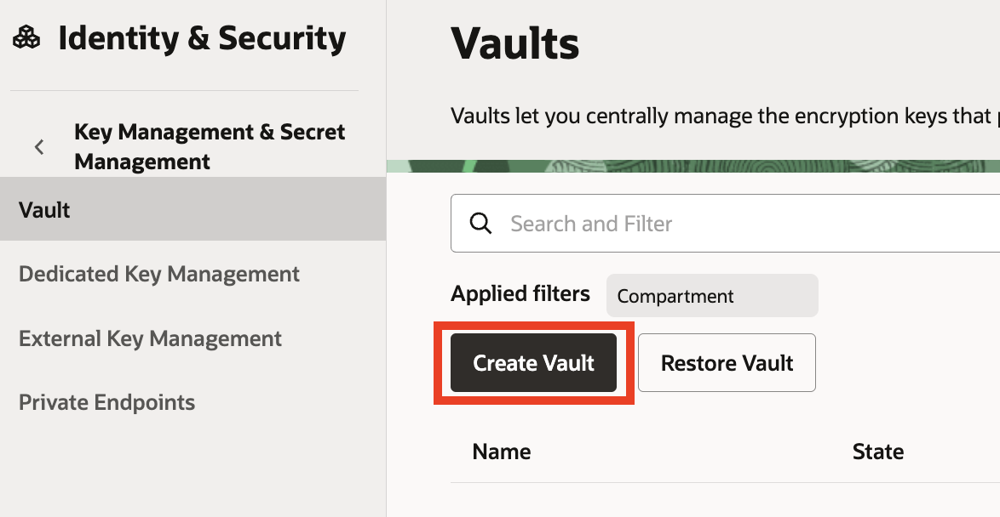

1. Under the **Create in Compartment**, make sure that the **root** compartment is selected.
1. For the **Name** field use: _loan-compliance-secrets_
1. Click the **Create Vault** button at the bottom of the form.

   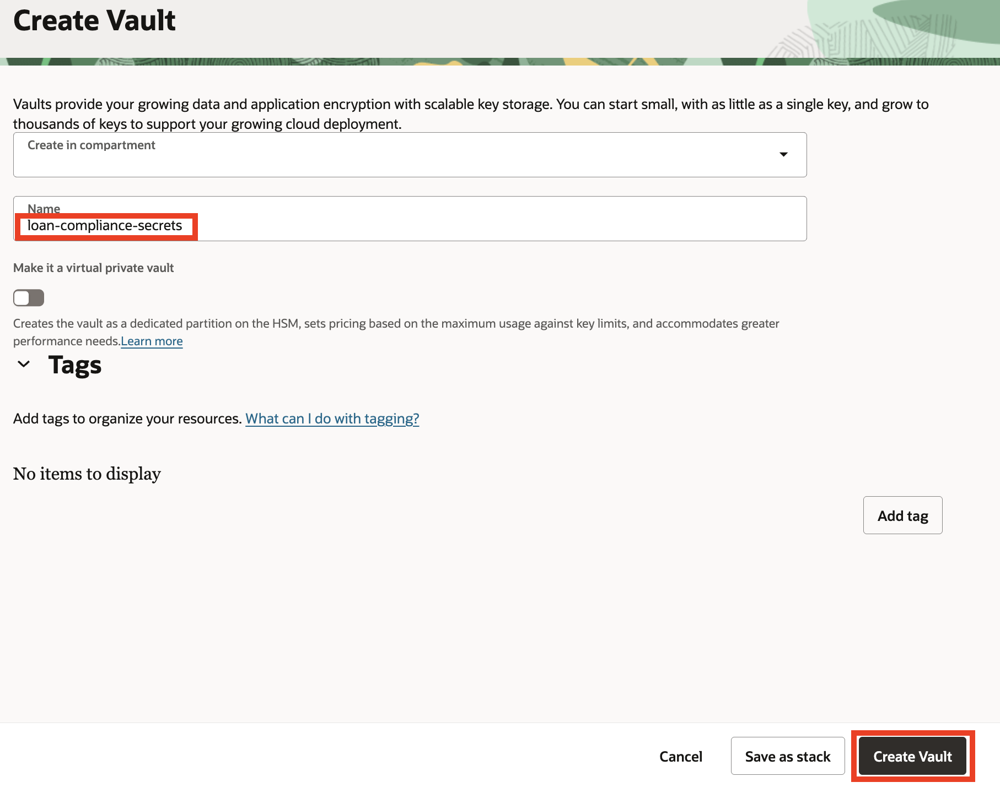

1. Wait for the vault to be created.

   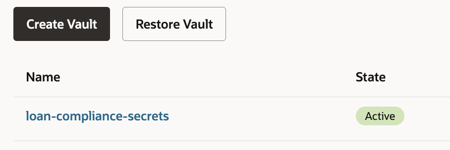

1. Once the vault is created, click it's name from the **Vaults** list.
1. Under the **List scope** section, make sure that the **root** compartment is selected.
1. Click the **Create Key** button at the top of the **Master Encryption Keys** table.

   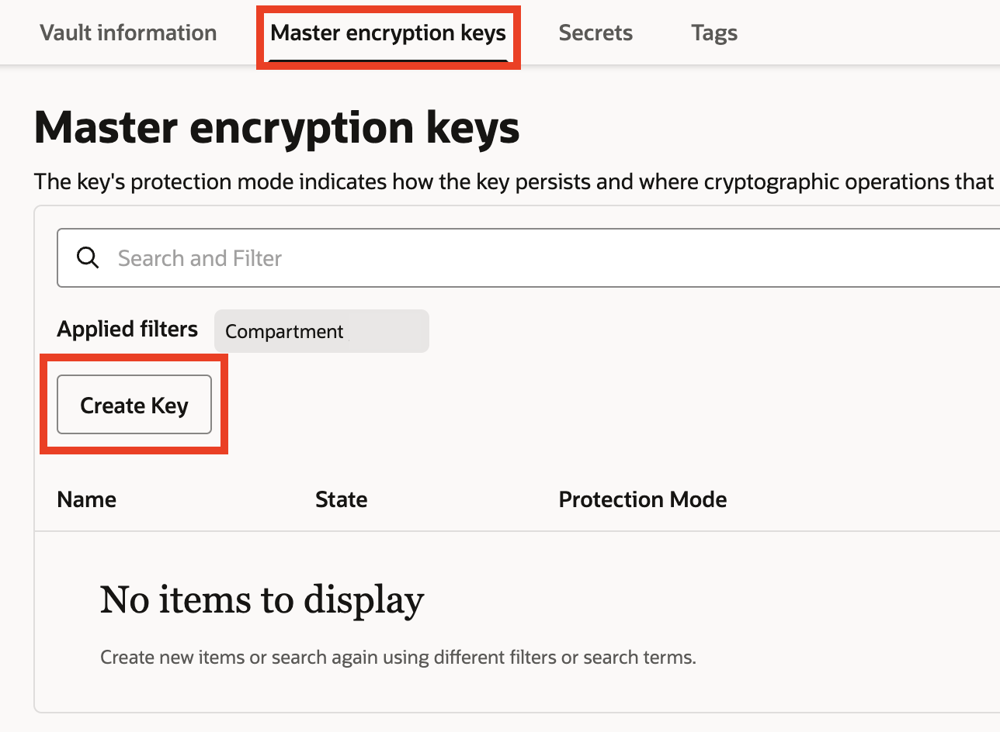

1. Under the **Create in Compartment**, make sure that the **root** compartment is selected.
1. For the **Name** field use: _loan-compliance-key_
1. Click the **Create Key** button.

   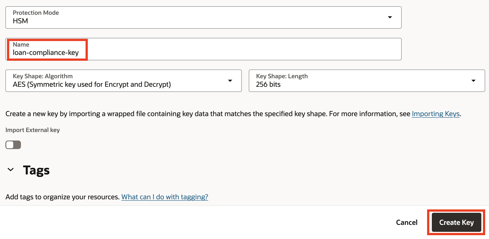

## Task 5: Create a database connection

In this section we are going to create a connection to our database. This connection is going to be used by the agent to retrieve information from the database.

1. Click the navigation menu on the top left.
1. Click **Developer Services**.
1. Click **Connections** under **Database Tools**.

   

1. Under the **List scope** section, make sure that the **root** compartment is selected.
1. Click the **Create Connection** button at the top of the **Connections** table.

   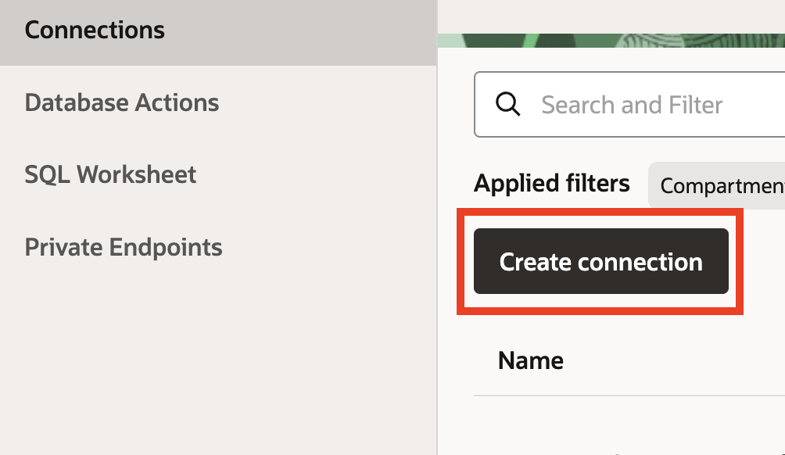

1. For the **Name** field use: _loan-compliance_
1. Under the **Compartment**, make sure that the **root** compartment is selected.
1. Make sure that the **Select database** option is selected under the **Database details** section.
1. In the **Database cloud service** drop-down, select **Oracle Autonomous Database**.
1. In the **Database in...** drop down, select the **loan-compliance** database.
1. In the **Username** field, type: _ADMIN_

   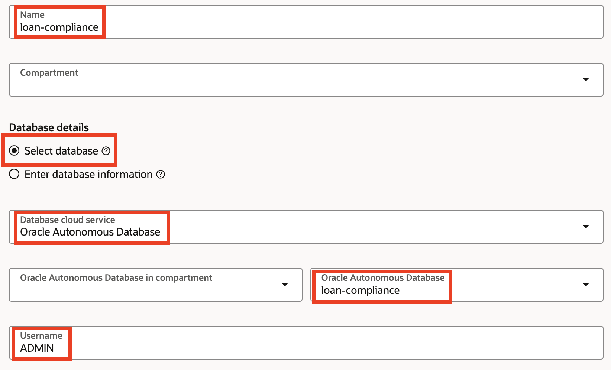

1. Under the **User password secret in...** drop-down, click the **Create password secret** button.

   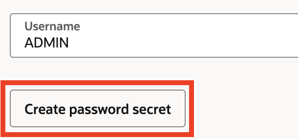

   This step will create a secret which will be stored in the Vault created earlier and will contain the password for connecting to the database.

1. For the **Name** field use: _loan-compliance-admin-password_
1. Select the **loan-compliance-secrets** in the **Valut in...** drop-down.
1. Select the **loan-compliance-key** in the **Encryption key in...** drop-down.
1. In the **User password** field, type the password you've used when you created the ADB instance.
1. Do the same in the **Confirm user password** field.
1. Click the **Create** button.

   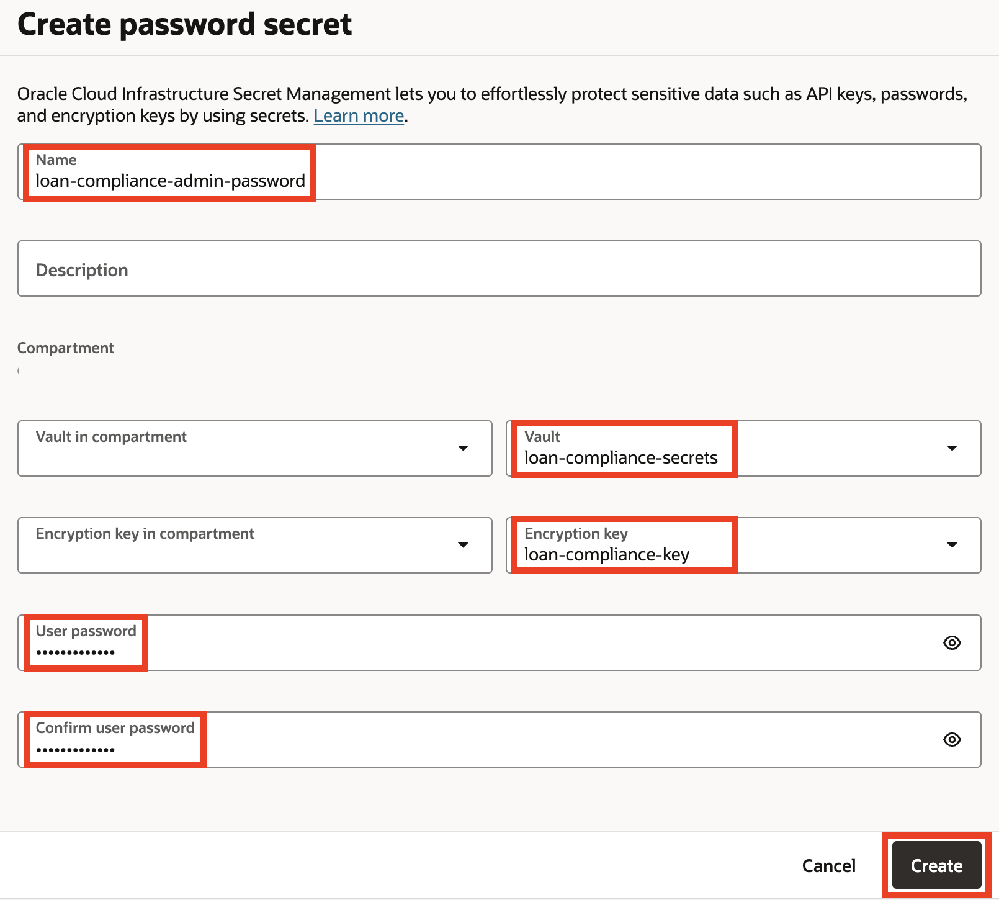

1. Back in the **Create connection** panel, the newly created password secret is automatically selected in the **User password secret in...** drop-down.

   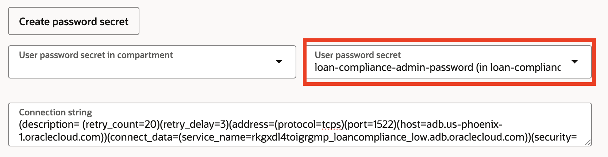

1. Under the **SSL details** section, click the **Create wallet content secret** button. This will create a secret which will help the agent securely communicate with the database.

   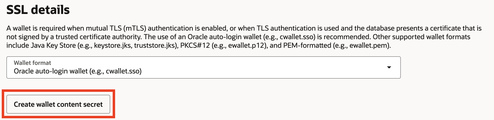

1. For the **Name** field use: _loan-compliance-wallet-secret_
1. Select the **loan-compliance-secrets** in the **Valut in...** drop-down.
1. Select the **loan-compliance-key** in the **Encryption key in...** drop-down.
1. Under the **Wallet** section, select the **Retrieve regional wallet from Autonomous Database** option.
1. Click the **Create** button.

   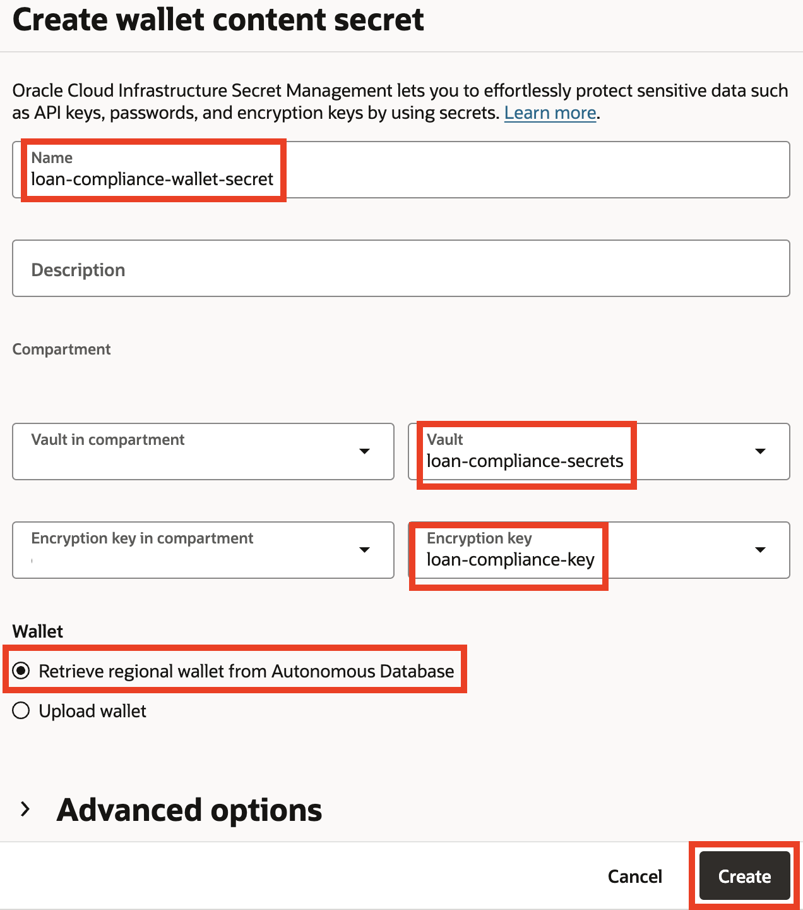

1. Back in the **Create connection** panel, the newly created wallet secret is automatically selected in the **SSO wallet content secret in...** drop-down.
1. Click the **Create** button.

   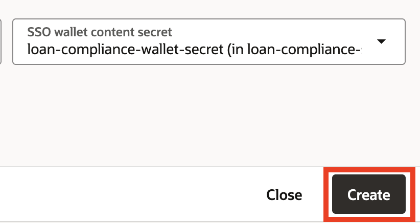

## Task 6: Validate the connection

In this task we are going to make sure that the connection was created successfully.

1. After the connection was created, click **Validate** button on the top right of the connection page.

   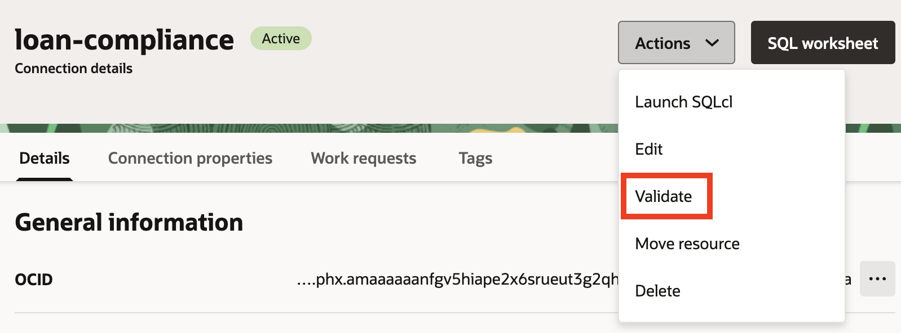

1. Click the **Validate** button at the bottom of the **Validate connection** dialog.

   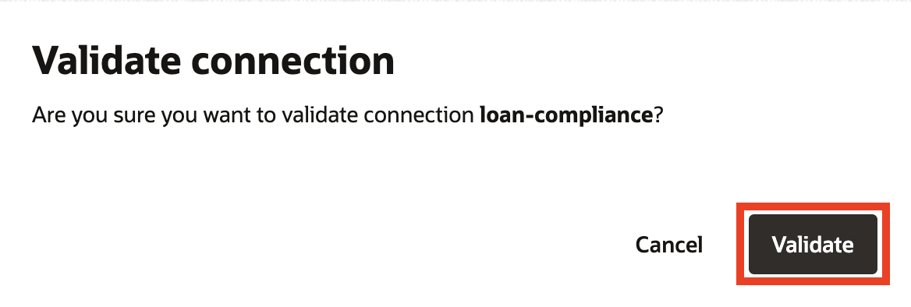

1. If everything was configured correctly, you should see a result similar to the following:

   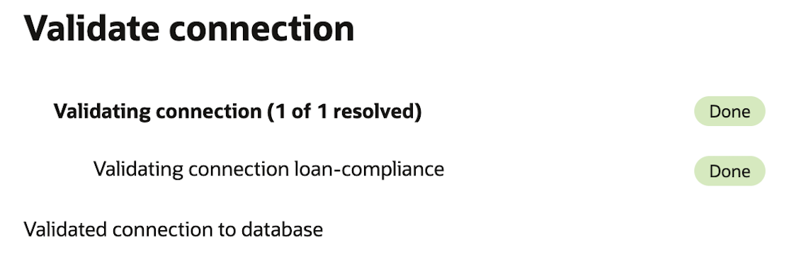

1. You can click the **Close** link to exit the dialog.

   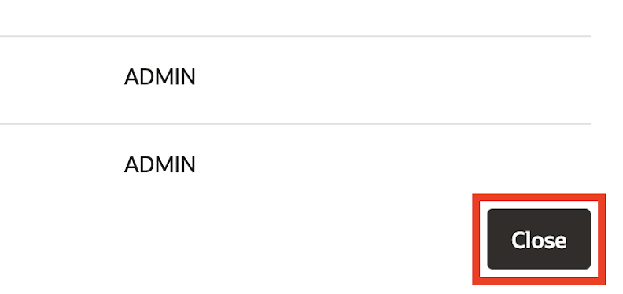

You may now **proceed to the next lab**

## Learn More

- [Provision an Autonomous Database Instance](https://docs.oracle.com/en-us/iaas/autonomous-database-serverless/doc/autonomous-provision.html)
- [Connect with Built-In Oracle Database Actions](https://docs.oracle.com/en/cloud/paas/autonomous-database/serverless/adbsb/connect-database-actions.html)
- [Creating a Vault](https://docs.oracle.com/en-us/iaas/Content/KeyManagement/Tasks/managingvaults_topic-To_create_a_new_vault.htm)
- [Creating a Master Encryption Key](https://docs.oracle.com/en-us/iaas/Content/KeyManagement/Tasks/managingkeys_topic-To_create_a_new_key.htm)
- [Database Tools - Creating a Connection](https://docs.oracle.com/en-us/iaas/database-tools/doc/creating-connection.html)

## Acknowledgements

- **Author** - Daniel Hart, Yanir Shahak
- **Contributors** - Uma Kumar, Hanna Rakhsha, Deion Locklear, Anthony Marino