# Test the solution

## Introduction

Our provisioning work is now complete. It is now time to enjoy the fruits of our labor.
In the previous labs we have:

- Created the proper permissions & basic setup.
- Uploaded the knowledge base articles to a storage bucket.
- Created our ADB instance and filled it with data.
- Created an agent as well as the SQL and RAG tools alongside their knowledge bases.
- Configured the agent endpoint.

It is now time for us to test our solution.

Estimated Time: 15 minutes

### Objectives

In this lab, you will:

- Use the agent to answer questions about our data.

### Prerequisites

This lab assumes you have:

- All previous labs successfully completed

## Task 1: Overview of the chat page functionality

1. If the agent is still not showing as **Active**, give it a few more minutes to complete the provisioning process.
1. Once the agent is showing as **Active**, click the **loan compliance agent** in the **Agents** list.

    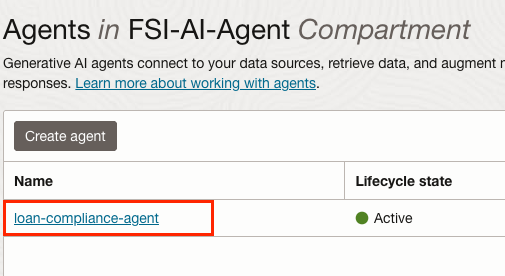

1. In the agent details page, click the **Launch chat** button.

    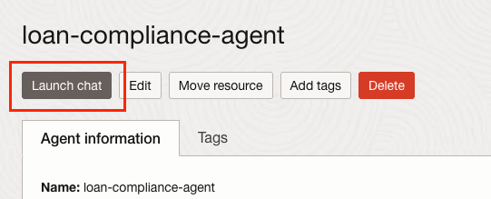

1. In the chat page, on the left, make sure sure that both the **Agent compartment** and the **Agent endpoint compartment** are set to your compartment.

1. On the top of the page, the **Agent** drop down should show **loan compliance agent** and the **Agent endpoint** drop down should show the newly created endpoint.
1. In the chat window, you'll be able to see the greeting message we have configured for the agent.
1. Other elements in the page include:

    - The message text box where you would write the messages for the agent.
    - The **Submit** and **Reset chat session** buttons, which you'll use to send the message you've typed in the message text box and reset all communications up until that point, respectively.
    - On the right, you'll see the **Traces** pane where the agent will communicate the various steps it took while reasoning over your requests.

    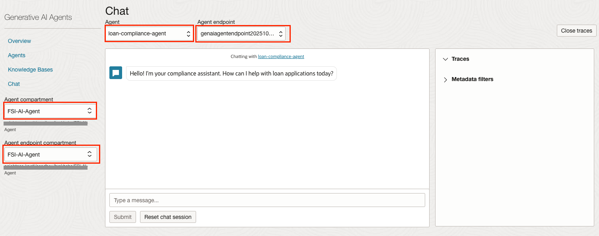

## Task 2: Let's test our agent

1. To start, type the following question into you message box: 

      ``` text
      <copy>
      How many loan applications have been denied since June 2025?
      </copy>
      ```

1. Click the **Submit** button.

    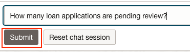

1. As you can see, the agent generated a SQL query because according to our descriptions for the agent and various tools, it figured that the answer to our question can be found in the database. The agent responded correctly with **2** as we have exactly 2 pending applications in our database. In addition, you can see that a trace was generated on the right.
1. Click the **View** button next to the first trace.

    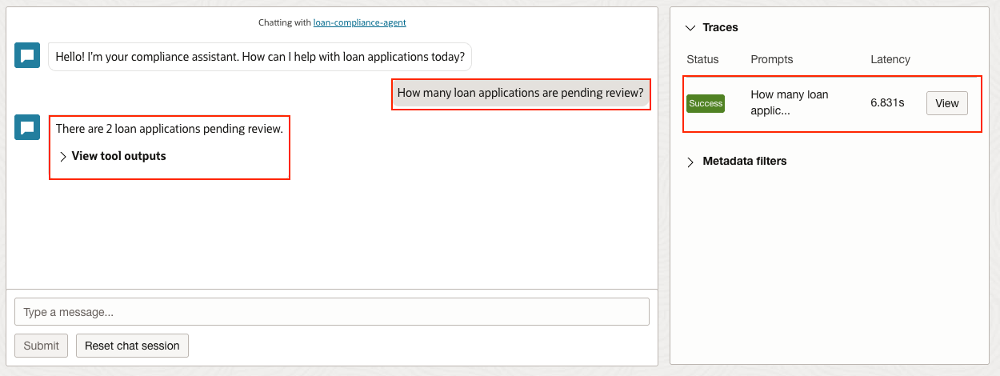

1. Expand the traces to see the full output (you click the **Show more** link to see the rest of the output). The traces give you a glimpse of how the agent went about addressing your response. As you can see, the first trace shows how the agent is trying to figure out what the answer should be.

    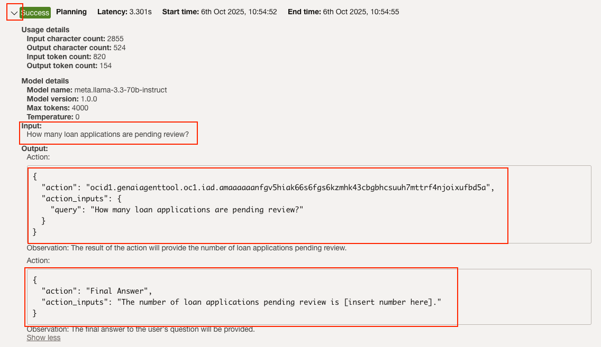

1. In the second trace, you'll be able to see that the agent invoked the SQL tool, and generated a SQL request. This request will be executed and the response will be incorporated in the final response.

    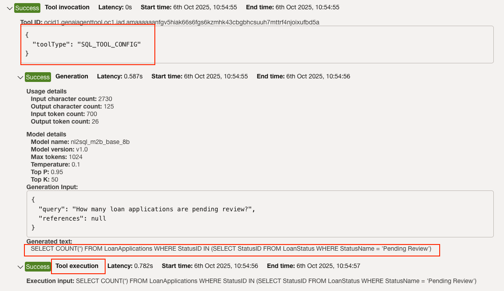

1. The third trace shows how the agent composed the final response using the output of the previous steps.

    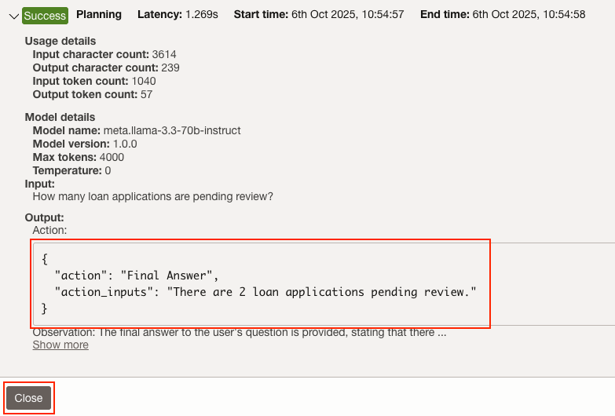

1. Our next question would be: _Which loan officer has the most applications assigned?_ Let's see if the agent will be able to figure that out...

      ``` text
      <copy>
      Which loan officer has the most applications assigned?
      </copy>
      ```

1. Click the **Submit** button.

    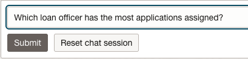

1. The agent shows the correct answer: **Olivia Brown**. Using the magic of Large Language Models (LLMs) and the clues we've left in the configuration of the agent and tools, the agent was able to decipher that the loan agent with the most applications assigned to them.

    

1. Feel free to take a look at the **Traces** generated for this response.
1. Next we'll ask the following:

      ``` text
      <copy>
      List applications that have been in progress for more than 7 days.
      </copy>
      ```

1. Click the **Submit** button.

    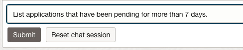

1. The agent returned information on the one application that has been pending review for more than 7 days.

    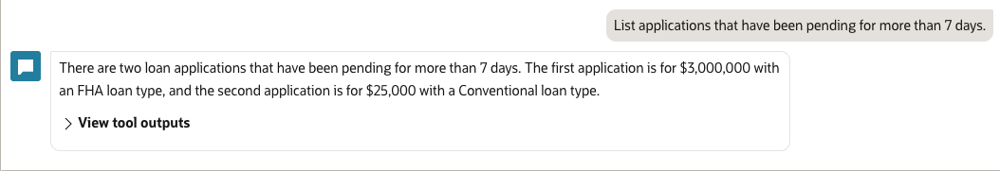

1. Now that we have information about the tickets, let's see if we can pull up a loan policy document which can help us define "Debt-to-Income" limits. Type the following question: 

      ``` text
      <copy>
      Retrieve the policy document section that defines Debt-to-Income (DTI) limits and any exceptions.
      </copy>
      ```

1. Click the **Submit** button.

1. We can see the agent is able to pull important information about about limits for Back-End Debt-to-Income.

    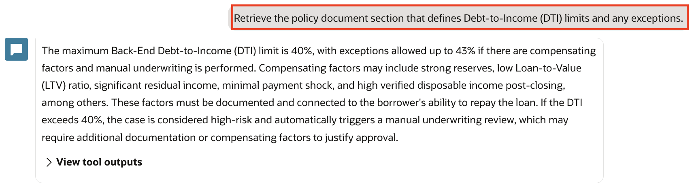

1. Now we can see if there are any applications that violate a policy. Type into the message box:

      ``` text
      <copy>
      Identify any approved applications that violate policy (DTI or credit score); cite the rule and the record.
      </copy>
      ```

1. Click the **Submit** button.

1. As you can see, for this question, the agent figured out that the information required might be in the knowledge base articles. For this task it employed the RAG tool which searched for the relevant information in our loan policy docs stored in object storage. Feel free to look at the traces for this interaction which show the steps the agent took to give us the information we needed. In the response you can see that a summary of the document was provided, but, also, if you expand the **View citations** section, you'll be able to see a reference to the document(s) which were used to compose the reply with a direct link to the file(s), the page(s) from which content was extracted and more.

    

1. Next we'll ask the following: _Identify any approved applications that violate policy (DTI or credit score); cite the rule and the record._
1. Click the Submit button.

    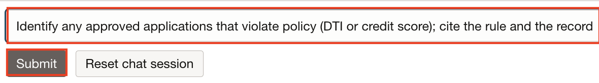

1. The agent successfully detected an approved applicant whose credit score was inconsistent with the requirements outlined in the DTI and Credit Policy document.

    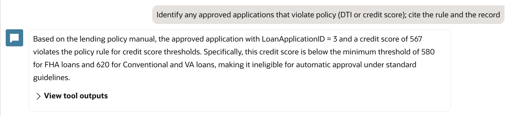

1. We invite you to try some prompts of your own to experiment with agent.

## Task 3: (Optional) More prompts to try

Here are a few more prompts to try with the agent:

- _What is the minimum credit score for FHA vs Conventional loans?_
- _Show the distribution of credit scores by loan type_
- _Provide the policy language for VA loan eligibility and list the denied VA applications from the database_

## Summary

As you've experienced, the OCI AI Agents service allows you to ask complex questions about data stored in multiple locations and get intelligent answers. By simply pointing the various tools towards your data sources and providing the right context, the agent was able to automatically determine which data source should be accessed, retrieve the data for you, compile a coherent and concise response and provide references to the original data when applicable.

Another interesting advantage of building solutions on top the OCI AI Agents service is that the user is no longer restricted to tasks allowed by the application user interface. With a chat interface, the user can ask questions and get answers to any question which can be answered using the data in the system even if the system engineers did not plan for that specific scenario. For example, you can ask the agent to sort the results in any way that is supported by the data even if the application was not designed to give you that option.

Although our use-case was focused on loan compliance, the OCI AI Agents service can be used to fuel many different use-cases which require deep understanding and retrieval of information from internal data sources, reasoning over the data, summarizing it, providing insights and more.

## Learn More

- [Chatting with Agents in Generative AI Agents](https://docs.oracle.com/en-us/iaas/Content/generative-ai-agents/chatting.htm#chatting)

## Acknowledgements

- **Author** - Deion Locklear
- **Contributors** - Hanna Rakhsha, Daniel Hart, Uma Kumar, Anthony Marino
