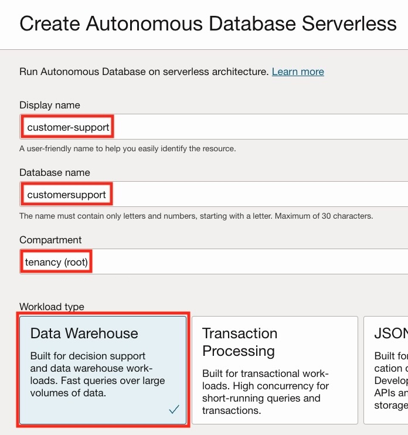
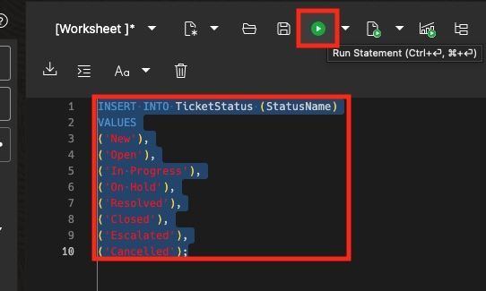

# Setup the database

## Introduction

In this lab, we are going to create an Autonomous Database instance (ADB), load it with data and configure additional resources for our agent to be able to access the database.

Estimated Time: 25 minutes

### Objectives

In this lab, you will:

- Create an ADB instance.
- Create the database schema.
- Insert data.
- Create vault for to securely store the database connection information.
- Create a database connection.

### Prerequisites

This lab assumes you have:

- Completed the previous labs.

## Task 1: Create an ADB instance

In this task we are going to create a new ADB instance.

1. Click the navigation menu on the top left.
1. Click **Oracle Database**.
1. Click **Autonomous Database**.

   

1. Under the **List scope** section, make sure that the **root** compartment is selected.
1. Click the **Create Autonomous Database** button at the top of the **Autonomous Databases** table.

   

1. For the **Display name** use: _customer-support_.
1. For the **Database name** use: _customersupport_.
1. Under the **Compartment**, make sure that the **root** compartment is selected.
1. Under **Workload type** make sure that **Data Warehouse** is selected.

   

1. Under the **Database configuration** section, enable the **Developer** option.
1. Select **23ai** as the version under **Choose database version**.

   

1. Under the **Administrator credentials creation** section, type a password (for example: _myPassword123_), in the **Password** field and confirm the password in the **Confirm password** field. Please make sure to choose a password you'd remember as we are going to need to type this password later.
1. Under the **Network access** section, make sure that the **Secure access from everywhere** option is selected.

   

1. Click the **Create** button at the bottom of the screen.

Once the database instance is created, you can move on to the next task.

## Task 2: Create database schema

I this task we are going to use SQL scripts to create the database schema which consists of tables and sequences (which will take care of the various IDs like the ticket ID or customer ID etc.).

1. Once the ADB instance is created, click the **Database actions** drop down and select the **SQL** option.

   

1. Copy the following database schema and paste into the **SQL worksheet**.

    ```sql
    <copy>
    CREATE TABLE Customers (
        CustomerID NUMBER PRIMARY KEY,
        FirstName VARCHAR2(50) NOT NULL,
        LastName VARCHAR2(50) NOT NULL,
        Email VARCHAR2(100) UNIQUE NOT NULL,
        Phone VARCHAR2(20),
        Address VARCHAR2(200)
    );

    CREATE TABLE SupportAgents (
        AgentID NUMBER PRIMARY KEY,
        FirstName VARCHAR2(50) NOT NULL,
        LastName VARCHAR2(50) NOT NULL,
        Email VARCHAR2(100) UNIQUE NOT NULL,
        Phone VARCHAR2(20)
    );

    CREATE TABLE TicketStatus (
        StatusID NUMBER PRIMARY KEY,
        StatusName VARCHAR2(50) NOT NULL
    );

    CREATE TABLE Tickets (
        TicketID NUMBER PRIMARY KEY,
        CustomerID NUMBER NOT NULL,
        Subject VARCHAR2(200) NOT NULL,
        Description CLOB NOT NULL,
        CreatedDate DATE DEFAULT SYSTIMESTAMP NOT NULL,
        LastUpdatedDate DATE DEFAULT SYSTIMESTAMP NOT NULL,
        StatusID NUMBER NOT NULL,
        AssignedToAgentID NUMBER,
        FOREIGN KEY (CustomerID) REFERENCES Customers(CustomerID),
        FOREIGN KEY (StatusID) REFERENCES TicketStatus(StatusID),
        FOREIGN KEY (AssignedToAgentID) REFERENCES SupportAgents(AgentID)
    );

    CREATE SEQUENCE CustomerSeq START WITH 1 INCREMENT BY 1;
    /
    CREATE OR REPLACE TRIGGER CustomerTrigger BEFORE INSERT ON Customers FOR EACH ROW BEGIN SELECT CustomerSeq.NEXTVAL INTO :NEW.CustomerID FROM DUAL; END;
    /
    CREATE SEQUENCE AgentSeq START WITH 1 INCREMENT BY 1;
    /
    CREATE OR REPLACE TRIGGER AgentTrigger BEFORE INSERT ON SupportAgents FOR EACH ROW BEGIN SELECT AgentSeq.NEXTVAL INTO :NEW.AgentID FROM DUAL; END;
    /
    CREATE SEQUENCE TicketSeq START WITH 1 INCREMENT BY 1;
    /
    CREATE OR REPLACE TRIGGER TicketTrigger BEFORE INSERT ON Tickets FOR EACH ROW BEGIN SELECT TicketSeq.NEXTVAL INTO :NEW.TicketID FROM DUAL; END;
    /
    CREATE SEQUENCE StatusSeq START WITH 1 INCREMENT BY 1;
    /
    CREATE OR REPLACE TRIGGER StatusTrigger BEFORE INSERT ON TicketStatus FOR EACH ROW BEGIN SELECT StatusSeq.NEXTVAL INTO :NEW.StatusID FROM DUAL; END;
    </copy>
    ```

You should see an output similar to the following:

   

## Task 3: Insert data

In this task we are going to fill the database tables with data.
One after the other, copy each of the following SQL sections, <u>in order</u>, and paste each statement into the **SQL worksheet**, <u>replacing any existing text</u>. After the statement has been pasted, click the **Run Statement** button.

   

It is important to make sure that you only copy & execute a single section at a time.
Don't forget to select all of the text in the worksheet before executing the statement.
After you execute a statement look for an output similar to the following:

   

1. Insert data into the **TicketStatus** table:

    ```sql
    <copy>
    INSERT INTO TicketStatus (StatusName)
    VALUES
    ('New'),
    ('Open'),
    ('In Progress'),
    ('On Hold'),
    ('Resolved'),
    ('Closed'),
    ('Escalated'),
    ('Cancelled');
    </copy>
    ```

1. Insert data into the **SupportAgents** table:

    ```sql
    <copy>
    INSERT INTO SupportAgents (FirstName, LastName, Email, Phone)
    VALUES 
    ('Gabriel', 'White', 'gabriel.white@support.com', '456-789-0123'),
    ('Emily', 'Chen', 'emily.chen@support.com', '555-123-4567'),
    ('Michael', 'Kim', 'michael.kim@support.com', '987-654-3210'),
    ('Sophia', 'Patel', 'sophia.patel@support.com', '111-222-3333'),
    ('William', 'Lee', 'william.lee@support.com', '444-555-6666'),
    ('Olivia', 'Martin', 'olivia.martin@support.com', '777-888-9999'),
    ('James', 'Davis', 'james.davis@support.com', '999-000-1111'),
    ('Ava', 'Hall', 'ava.hall@support.com', '123-456-7890'),
    ('Benjamin', 'Walker', 'benjamin.walker@support.com', '234-567-8901'),
    ('Isabella', 'Young', 'isabella.young@support.com', '345-678-9012'),
    ('Alexander', 'Allen', 'alexander.allen@support.com', '456-789-0123'),
    ('Mia', 'Scott', 'mia.scott@support.com', '567-890-1234'),
    ('Ethan', 'Mitchell', 'ethan.mitchell@support.com', '678-901-2345'),
    ('Charlotte', 'Russell', 'charlotte.russell@support.com', '789-012-3456'),
    ('Lucas', 'Wright', 'lucas.wright@support.com', '890-123-4567'),
    ('Abigail', 'Jenkins', 'abigail.jenkins@support.com', '901-234-5678'),
    ('Mason', 'Garcia', 'mason.garcia@support.com', '012-345-6789'),
    ('Harper', 'Martinez', 'harper.martinez@support.com', '123-456-7890'),
    ('Logan', 'Robinson', 'logan.robinson@support.com', '234-567-8901'),
    ('Evelyn', 'Thompson', 'evelyn.thompson@support.com', '345-678-9012'); 
    </copy>
    ```

1. Insert data into the **Customers** table:

    ```sql
    <copy>
    INSERT INTO Customers (FirstName, LastName, Email, Phone, Address)
    VALUES 
    ('John', 'Doe', 'john.doe@example.com', '123-456-7890', '123 Main St, Anytown, USA'),
    ('Jane', 'Smith', 'jane.smith@example.com', '987-654-3210', '456 Elm St, Othertown, USA'),
    ('Bob', 'Johnson', 'bob.johnson@example.com', '555-123-4567', '789 Oak St, Smallville, USA'),
    ('Alice', 'Williams', 'alice.williams@example.com', '901-234-5678', '321 Maple St, Bigcity, USA'),
    ('Mike', 'Davis', 'mike.davis@example.com', '111-222-3333', '901 Pine St, Suburbiaville, USA'),
    ('Emily', 'Miller', 'emily.miller@example.com', '444-555-6666', '777 Cedar St, Downtown, USA'),
    ('Sarah', 'Wilson', 'sarah.wilson@example.com', '888-999-0000', '999 Walnut St, Uptown, USA'),
    ('David', 'Moore', 'david.moore@example.com', '333-444-5555', '111 Cherry St, Midtown, USA'),
    ('Olivia', 'Taylor', 'olivia.taylor@example.com', '666-777-8888', '222 Spruce St, Riverview, USA'),
    ('William', 'Brown', 'william.brown@example.com', '777-888-9999', '333 Fir St, Lakeside, USA'),
    ('Ava', 'Jones', 'ava.jones@example.com', '999-000-1111', '444 Beech St, Hilltop, USA'),
    ('James', 'Garcia', 'james.garcia@example.com', '111-222-3333', '555 Ash St, Valleyview, USA'),
    ('Isabella', 'Martinez', 'isabella.martinez@example.com', '222-333-4444', '666 Birch St, Brookside, USA'),
    ('George', 'Rodriguez', 'george.rodriguez@example.com', '333-444-5555', '777 Cypress St, Parkside, USA'),
    ('Mia', 'Lopez', 'mia.lopez@example.com', '444-555-6666', '888 Poplar St, Creekside, USA'),
    ('Robert', 'Gonzalez', 'robert.gonzalez@example.com', '555-666-7777', '999 Sycamore St, Ridgewood, USA'),
    ('Charlotte', 'Hernandez', 'charlotte.hernandez@example.com', '666-777-8888', '111 Willow St, Meadowbrook, USA'),
    ('Richard', 'Lewis', 'richard.lewis@example.com', '777-888-9999', '222 Oakwood St, Foresthill, USA'),
    ('Amelia', 'Lee', 'amelia.lee@example.com', '888-999-0000', '333 Maplewood St, Lakewood, USA'),
    ('Charles', 'Hall', 'charles.hall@example.com', '999-000-1111', '444 Pineview St, Greenhaven, USA');
    </copy>
    ```

1. Insert data into the **Tickets** table:

    ```sql
    <copy>
    INSERT INTO Tickets (CustomerID, Subject, Description, CreatedDate, LastUpdatedDate, StatusID, AssignedToAgentID)
    VALUES 
    (2, 'Cloud Computing Migration Issue', 'I am in the process of migrating my organization''s IT infrastructure to the cloud, but I am encountering difficulties with ensuring seamless integration and minimizing downtime. Specifically, I am struggling to migrate our critical applications and data to the cloud while maintaining their functionality and performance. I require expert assistance in developing a customized migration plan, including risk assessment, application evaluation, and data transfer strategies, as well as guidance on how to optimize our cloud infrastructure for maximum efficiency and scalability.', TO_DATE('12-SEP-24', 'DD-MON-YY'), TO_DATE('12-SEP-24', 'DD-MON-YY'), 4, 2),
    (4, 'Virtual Private Network (VPN) Configuration', 'I am attempting to configure a Virtual Private Network (VPN) for remote access to my organization''s internal resources, but I am experiencing difficulties with setting up the necessary infrastructure and ensuring secure connections. Specifically, I am struggling to select the most suitable VPN protocol, configure the VPN server, and deploy the VPN client software to our remote users. I would greatly appreciate expert guidance on how to design and implement a secure and reliable VPN solution, including recommendations on VPN protocols, encryption methods, and authentication mechanisms.', TO_DATE('14-SEP-24', 'DD-MON-YY'), TO_DATE('14-SEP-24', 'DD-MON-YY'), 4, 2),
    (6, 'Network Monitoring and Analysis', 'I am responsible for monitoring and analyzing my organization''s network performance, but I am facing challenges in selecting the most effective tools and techniques to achieve this goal. Specifically, I am struggling to choose between various network monitoring software options, configure the monitoring parameters, and interpret the collected data to identify trends and anomalies. I require expert assistance in developing a comprehensive network monitoring strategy, including recommendations on monitoring tools, data collection methods, and analysis techniques.', TO_DATE('16-SEP-24', 'DD-MON-YY'), TO_DATE('16-SEP-24', 'DD-MON-YY'), 1, 6),
    (8, 'Data Backup and Recovery', 'I am responsible for ensuring the integrity and availability of my organization''s critical data, but I am facing challenges in developing an effective data backup and recovery strategy. Specifically, I am struggling to select the most suitable backup solutions, configure the backup schedules, and test the recovery procedures to ensure data integrity and availability. I require expert assistance in designing a comprehensive data protection plan, including recommendations on backup technologies, storage options, and disaster recovery procedures.', TO_DATE('20-SEP-24', 'DD-MON-YY'), TO_DATE('20-SEP-24', 'DD-MON-YY'), 4, 8),
    (10, 'Network Architecture Design', 'I am tasked with designing a scalable and efficient network architecture for my organization, incorporating cutting-edge technologies and best practices to support our growing business needs. However, I am facing challenges in selecting the most suitable network topology, configuring the network components, and ensuring seamless integration with our existing infrastructure. I would greatly appreciate expert guidance on how to develop a comprehensive network architecture plan, including recommendations on network design principles, technology selection, and implementation strategies.', TO_DATE('22-SEP-24', 'DD-MON-YY'), TO_DATE('22-SEP-24', 'DD-MON-YY'), 5, 10),
    (12, 'Disaster Recovery Planning', 'I am responsible for developing a disaster recovery plan for my organization, but I am facing challenges in identifying the most critical systems and data, assessing the risks, and developing effective recovery strategies. Specifically, I am struggling to select the most suitable disaster recovery approaches, configure the recovery procedures, and test the plans to ensure their effectiveness. I require expert assistance in designing a comprehensive disaster recovery plan, including recommendations on risk assessment methodologies, recovery strategies, and plan testing procedures.', TO_DATE('28-SEP-24', 'DD-MON-YY'), TO_DATE('28-SEP-24', 'DD-MON-YY'), 2, 12),
    (14, 'Network Penetration Testing', 'I am seeking expert assistance in conducting a network penetration test to identify vulnerabilities and weaknesses in my organization''s network infrastructure. Specifically, I am struggling to select the most effective penetration testing tools, configure the testing parameters, and interpret the test results to identify potential risks. I would greatly appreciate guidance on how to develop a comprehensive penetration testing plan, including recommendations on testing methodologies, tool selection, and risk assessment procedures.', TO_DATE('30-SEP-24', 'DD-MON-YY'), TO_DATE('30-SEP-24', 'DD-MON-YY'), 3, 14),
    (16, 'Incident Response Plan', 'I am responsible for developing an incident response plan for my organization, but I am facing challenges in identifying the most critical incidents, assessing the risks, and developing effective response strategies. Specifically, I am struggling to select the most suitable incident response approaches, configure the response procedures, and test the plans to ensure their effectiveness. I require expert assistance in designing a comprehensive incident response plan, including recommendations on risk assessment methodologies, response strategies, and plan testing procedures.', TO_DATE('02-OCT-24', 'DD-MON-YY'), TO_DATE('02-OCT-24', 'DD-MON-YY'), 1, 16),
    (18, 'Slow Network Speed', 'I am experiencing extremely slow network speeds, making it difficult for me to complete my work tasks efficiently. According to my speed test results, my download speed is averaging around 5 Mbps, while my upload speed is barely reaching 1 Mbps. This is significantly slower than what I am paying for, and I believe there must be an issue with either my equipment or the service itself. Could someone please investigate this matter further and provide a solution?', TO_DATE('03-SEP-24', 'DD-MON-YY'), TO_DATE('03-SEP-24', 'DD-MON-YY'), 1, 1),
    (1, 'Intermittent Connectivity Issues', 'I am experiencing intermittent connectivity issues with my internet connection. At random intervals, my connection drops, and I am forced to restart my router to regain access. This has been happening frequently over the past week, and I am finding it increasingly frustrating. I have checked my cables and ensured that they are properly connected, but the issue persists. Can someone please assist me in identifying the root cause of this problem and implementing a solution?', TO_DATE('07-SEP-24', 'DD-MON-YY'), TO_DATE('07-SEP-24', 'DD-MON-YY'), 1, 3),
    (3, 'Network Congestion', 'I am experiencing significant network congestion, resulting in slow internet speeds and dropped connections. I have noticed that this issue tends to occur during peak hours, such as evenings and weekends, when multiple devices are connected to my network. I am concerned that my current plan may not be sufficient to support my household''s internet usage. Could someone please review my account and recommend a suitable upgrade or alternative solution to alleviate this issue?', TO_DATE('11-SEP-24', 'DD-MON-YY'), TO_DATE('11-SEP-24', 'DD-MON-YY'), 1, 5),
    (5, 'Internet Outage', 'There appears to be an internet outage in my area, affecting multiple households and businesses. I have contacted my neighbors, who are also experiencing the same issue. I am unsure whether this is related to a technical problem or scheduled maintenance, but I would appreciate assistance in determining the cause and estimated time of resolution. Could someone please look into this matter urgently and provide updates on the status of the outage?', TO_DATE('04-SEP-24', 'DD-MON-YY'), TO_DATE('04-SEP-24', 'DD-MON-YY'), 1, 7),
    (7, 'IT Service Management', 'I am responsible for managing my organization''s IT services, including incident management, problem management, and change management. However, I am facing challenges in developing an effective IT service management strategy, including selecting the most suitable service management framework, configuring the service management processes, and ensuring seamless integration with our existing infrastructure. I require expert assistance in designing a comprehensive IT service management plan, including recommendations on service management best practices, process implementation, and tool selection.', TO_DATE('24-SEP-24', 'DD-MON-YY'), TO_DATE('24-SEP-24', 'DD-MON-YY'), 1, 9),
    (9, 'No Internet Connection', 'I am writing to report that I have lost my internet connection completely. It started around 10pm last night, and despite restarting my router multiple times, I still cannot get online. My router lights indicate that everything should be working fine, but I am unable to load any web pages or access any online services. I have tried checking my cables and ensuring that they are properly connected, but nothing seems to work. I would greatly appreciate assistance in resolving this issue as soon as possible.', TO_DATE('01-SEP-24', 'DD-MON-YY'), TO_DATE('01-SEP-24', 'DD-MON-YY'), 1, 11),
    (11, 'Firewall Blocking Internet', 'I have recently installed a new firewall on my network, but now I am experiencing issues with accessing certain websites and online services. I believe that my firewall may be blocking necessary ports or protocols, preventing me from accessing the internet properly. Could someone please assist me in configuring my firewall to allow the necessary traffic while maintaining adequate security measures?', TO_DATE('06-SEP-24', 'DD-MON-YY'), TO_DATE('06-SEP-24', 'DD-MON-YY'), 1, 13),
    (13, 'Wi-Fi Not Working', 'My Wi-Fi connection has stopped working altogether. I have tried restarting my router and modem, but neither seems to resolve the issue. When I attempt to connect to my network, I receive an error message stating that the password is incorrect, even though I am positive that I am entering the correct credentials. Additionally, my devices are unable to detect my network at all, suggesting that there may be a problem with the broadcast signal. Please help me troubleshoot this issue as soon as possible.', TO_DATE('05-SEP-24', 'DD-MON-YY'), TO_DATE('05-SEP-24', 'DD-MON-YY'), 1, 15),
    (15, 'Modem Issue', 'I believe that my modem may be faulty, as I am experiencing frequent disconnections and slow internet speeds. I have tried restarting my modem and checking my cables, but the issue persists. I am concerned that my modem may be outdated or malfunctioning, and I would like to request a replacement or upgrade. Could someone please assist me in troubleshooting this issue and determining the best course of action?', TO_DATE('13-SEP-24', 'DD-MON-YY'), TO_DATE('13-SEP-24', 'DD-MON-YY'), 1, 17),
    (17, 'Cloud Security Best Practices', 'I am seeking expert guidance on implementing cloud security best practices to protect my organization''s cloud-based assets and data. Specifically, I am struggling to select the most effective cloud security controls, configure the security settings, and ensure compliance with regulatory requirements. I would greatly appreciate recommendations on cloud security frameworks, threat modeling, and risk assessment methodologies, as well as guidance on how to develop a comprehensive cloud security strategy.', TO_DATE('26-SEP-24', 'DD-MON-YY'), TO_DATE('26-SEP-24', 'DD-MON-YY'), 6, 19),
    (19, 'Complex Network Configuration Issue', 'I am experiencing difficulties with my complex network configuration, which involves multiple routers, switches, and firewalls. Despite my best efforts, I am unable to establish a stable connection between my devices. The issue began after I added a new router to my network, and since then, I have encountered numerous problems, including dropped connections, slow speeds, and inconsistent performance. I have tried various troubleshooting steps, such as restarting my devices, checking my cables, and adjusting my settings, but none of these solutions have resolved the issue. I would greatly appreciate assistance from a knowledgeable support agent who can help me identify the root cause of the problem and implement a comprehensive solution.', TO_DATE('02-SEP-24', 'DD-MON-YY'), TO_DATE('02-SEP-24', 'DD-MON-YY'), 1, 2),
    (1, 'Advanced Router Configuration Problem', 'I am struggling to configure my advanced router settings, specifically the Quality of Service (QoS) features. I have followed the manufacturer''s instructions and consulted online resources, but I am still encountering difficulties. The issue is causing significant disruptions to my online activities, including video conferencing, online gaming, and cloud computing. I require expert guidance on how to optimize my QoS settings to ensure seamless performance and minimize latency. Additionally, I would appreciate recommendations on how to monitor and analyze my network traffic to identify potential bottlenecks and areas for improvement.', TO_DATE('04-SEP-24', 'DD-MON-YY'), TO_DATE('04-SEP-24', 'DD-MON-YY'), 1, 4);
    </copy>
    ```

## Task 4: Create a Vault to securely store the database connection information

In this task we are going to create a Vault and an encryption key. We are going to use this vault to securely store the password used to connect to the database as a secret. This secret is going to be used in the next section by the database connection.

1. Click the navigation menu on the top left.
1. Click **Identity & Security**.
1. Click **Vault** under **Key Management & Secret Management**.

   

1. Under the **List scope** section, make sure that the **root** compartment is selected.
1. Click the **Create Autonomous Database** button at the top of the **Autonomous Databases** table.

   

1. Under the **Create in Compartment**, make sure that the **root** compartment is selected.
1. For the **Name** field use: _customer-support-secrets_
1. Click the **Create Vault** button at the bottom of the form.

   

1. Wait for the vault to be created.

   

1. Once the vault is created, click it's name from the **Vaults** list.
1. Under the **List scope** section, make sure that the **root** compartment is selected.
1. Click the **Create Key** button at the top of the **Master Encryption Keys** table.

   

1. Under the **Create in Compartment**, make sure that the **root** compartment is selected.
1. For the **Name** field use: _customer-support-key_
1. Click the **Create Key** button.

   

## Task 5: Create a database connection

In this section we are going to create a connection to the database we've created in the previous tasks. This connection is going to be used by the agent to retrieve information from the database.

1. Click the navigation menu on the top left.
1. Click **Developer Services**.
1. Click **Connections** under **Database Tools**.

   

1. Under the **List scope** section, make sure that the **root** compartment is selected.
1. Click the **Create Connection** button at the top of the **Connections** table.

   

1. For the **Name** field use: _customer-support_
1. Under the **Compartment**, make sure that the **root** compartment is selected.
1. Make sure that the **Select database** option is selected under the **Database details** section.
1. In the **Database cloud service** drop-down, select **Oracle Autonomous Database**.
1. In the **Database in...** drop down, select the **customer-support** database.
1. In the **Username** field, type: _ADMIN_

   

1. Under the **User password secret in...** drop-down, click the **Create password secret** button.

   

   This step will create a secret which will be stored in the Vault created earlier and will contain the password for connecting to the database.

1. For the **Name** field use: _customer-support-admin-password_
1. Select the **customer-support-secrets** in the **Valut in...** drop-down.
1. Select the **customer-support-key** in the **Encryption key in...** drop-down.
1. In the **User password** field, type the password you've used when you created the ADB instance.

   

1. Do the same in the **Confirm user password** field.
1. Click the **Create** button.

   

1. Back in the **Create connection** panel, the newly created password secret is automatically selected in the **User password secret in...** drop-down.

   

1. Under the **SSL details** section, click the **Create wallet content secret** button. This will create a secret which will help the agent securely communicate with the database.

   

1. For the **Name** field use: _customer-support-wallet-secret_
1. Select the **customer-support-secrets** in the **Valut in...** drop-down.
1. Select the **customer-support-key** in the **Encryption key in...** drop-down.
1. Under the **Wallet** section, select the **Retrieve regional wallet from Autonomous Database** option.
1. Click the **Create** button.

   

1. Back in the **Create connection** panel, the newly created wallet secret is automatically selected in the **SSO wallet content secret in...** drop-down.
1. Click the **Create** button.

   

## Task 6: Validate the connection

In this task we are going to make sure that the connection was created successfully.

1. After the connection was created, click **Validate** button on the top right of the connection page.

   

1. Click the **Validate** button at the bottom of the **Validate connection** dialog.

   

1. If everything was configured correctly, you should see a result similar to the following:

   

1. You can click the **Close** link to exit the dialog.

   

## Learn More

- [Provision an Autonomous Database Instance](https://docs.oracle.com/en-us/iaas/autonomous-database-serverless/doc/autonomous-provision.html)
- [Connect with Built-In Oracle Database Actions](https://docs.oracle.com/en/cloud/paas/autonomous-database/serverless/adbsb/connect-database-actions.html)
- [Creating a Vault](https://docs.oracle.com/en-us/iaas/Content/KeyManagement/Tasks/managingvaults_topic-To_create_a_new_vault.htm)
- [Creating a Master Encryption Key](https://docs.oracle.com/en-us/iaas/Content/KeyManagement/Tasks/managingkeys_topic-To_create_a_new_key.htm)
- [Database Tools - Creating a Connection](https://docs.oracle.com/en-us/iaas/database-tools/doc/creating-connection.html)

## Acknowledgements

- **Author** - Yanir Shahak, Senior Principal Software Engineer
