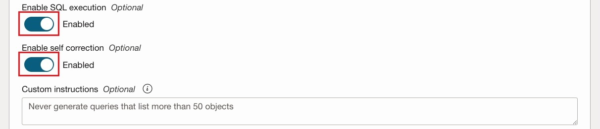

# Create the Agent

## Introduction

In this lab we are going to create the intelligent agent which will drive our entire solution. We will provide the agent with the required tools and knowledge bases to perform it's work effectively. Tools are resources the agent can use to perform it's tasks. In our use-case, we are going to use two tools:

- **RAG Tool** - Which will scan the knowledge articles uploaded to object storage whenever the user requires such information.
- **SQL Tool** - Which will be able to retrieve information stored in our ADB instance relating to the ticketing system.

Estimated Time: 15 minutes

### Objectives

In this lab, you will:

- Create our agent including the RAG & SQL Tools and assign the relevant knowledge base to each.

### Prerequisites

This lab assumes you have:

- All previous labs successfully completed.

## Task 1: Create the agent

1. Click the navigation menu on the top left.
1. Click **Analytics & AI**.
1. Click **Generative AI Agents**.

   

1. In the overview page, click the **Agents** link
1. Under the **List scope** section, make sure that the **root** compartment is selected.
1. Click the **Create Agent** button at the top of the **Agents** table.

   

1. For the **Name** field use: _customer support agent_
1. For the **Compartment** field, make sure that the **root** compartment is selected.
1. For the **Description** field, use: _This agent will help streamline the work of customer support representatives_.
1. For the **Welcome message** field, use: _Hello! I’m your customer support helper, how can I help?_
1. Click the **Next** button.

   

1. Under the **Tools** section, click the **Add tool** button to create our first tool.

   

1. Select the **RAG** tool option.
1. Under the **RAG Configuration** section, use _Knowledge base articles_ in the **Name** field.
1. For the **Description** field, use: _This tool will retrieve knowledge base support articles whenever a customer support representative requires troubleshooting information to resolve a support ticket_. It is very important to provide a high-level description of the knowledge that this tool can retrieve. This allows the agent to make accurate decisions when choosing to invoke this tool.

   

1. Under the **Add knowledge bases** section, make sure that the **root** compartment is selected in the **Compartment** field.
1. Click the **Create knowledge base** button. In this step we are going to create a knowledge base which references the storage bucket into which we've uploaded the knowledge articles.

   

1. In the **New knowledge base** form, use: _Customer support knowledge base articles_ for the **Name** field.
1. Make sure that the **root** compartment is selected in the **Compartment** field.
1. In the **Data store type** field, we will select **Object storage** to be able to retrieve information from our storage bucket.
1. Make sure that **Enable hybrid search** is checked. Enabling this option instructs the system to combine lexical and semantic search when scanning our documents.
1. Click the **Specify data source** button.

   

1. In the **Specify data source** form, use: _Knowledge base articles_ for the **Name** field.
1. Make sure that the **Enable multi-modal parsing** option is **not** checked. This option enable parsing of rich content, such as charts and graphics, to allow responses based on visual elements. However, we do not have any images in our knowledge articles so right now this option is not required.
1. Under the **Data bucket** option, select the _knowledge-base-articles_ bucket into which we've previously uploaded the knowledge articles PDF files.
1. Check the **Select all in bucket option**. This option will automatically flag all of the file in the bucket for ingestion instead of us having to select each file individually.
1. Click the **Create** button.

   

1. Back in the **New knowledge base** panel, the **Knowledge base articles** data source was added to the **Data source** table.
1. Make sure that the **Automatically start ingestion job for above data sources** option is checked. This will create an ingestion job which will scan all of our files automatically when the knowledge base is initially created. Please note that this will only run the ingestion job once. In order to re-ingest information from the bucket in the future, you will need to trigger a job manually.
1. Click the **Create** button.

   

1. The knowledge base will take a few minutes to create and ingest the data.
1. Back at the **Add knowledge bases** panel, make sure that the checkbox next to the knowledge base name is checked.
1. Click the **Create tool** button.

   

1. Now that we have our RAG tool configured, let's configure our SQL tool. In the **Tools** section Click the **Create tool** button.

   

1. Click the **SQL** option.
1. For the **Name** field, use: _Customer support database_.
1. For the **Description** field, use: _The tables contain information about tickets created by customers as well as the customer support agents which will handle those tickets as well as the customers who reported the issues_.

   

1. Under **Import database schema configuration for this tool**, selec the **Inline** option which will allow us to use the same schema text we've used when we created the database.
1. Copy the following text and paste it into the **Database schema** field:

      ```sql
      <copy>
      CREATE TABLE Customers (
         CustomerID NUMBER PRIMARY KEY,
         FirstName VARCHAR2(50) NOT NULL,
         LastName VARCHAR2(50) NOT NULL,
         Email VARCHAR2(100) UNIQUE NOT NULL,
         Phone VARCHAR2(20),
         Address VARCHAR2(200)
      );

      CREATE TABLE SupportAgents (
         AgentID NUMBER PRIMARY KEY,
         FirstName VARCHAR2(50) NOT NULL,
         LastName VARCHAR2(50) NOT NULL,
         Email VARCHAR2(100) UNIQUE NOT NULL,
         Phone VARCHAR2(20)
      );

      CREATE TABLE TicketStatus (
         StatusID NUMBER PRIMARY KEY,
         StatusName VARCHAR2(50) NOT NULL
      );

      CREATE TABLE Tickets (
         TicketID NUMBER PRIMARY KEY,
         CustomerID NUMBER NOT NULL,
         Subject VARCHAR2(200) NOT NULL,
         Description CLOB NOT NULL,
         CreatedDate DATE DEFAULT SYSTIMESTAMP NOT NULL,
         LastUpdatedDate DATE DEFAULT SYSTIMESTAMP NOT NULL,
         StatusID NUMBER NOT NULL,
         AssignedToAgentID NUMBER,
         FOREIGN KEY (CustomerID) REFERENCES Customers(CustomerID),
         FOREIGN KEY (StatusID) REFERENCES TicketStatus(StatusID),
         FOREIGN KEY (AssignedToAgentID) REFERENCES SupportAgents(AgentID)
      );
      </copy>
      ```

1. Under the **Description of tables and columns**, select the **Inline** option.
1. Copy and paste the following text into the **Description of tables and columns**. This verbal description contains details about each table and column. This will allow the tool to better understand the data stored in our database:

      ```text
      <copy>
      Customers table - Each record in this table contains information about a customer which may or may not have created a support ticket
      Columns:
      CustomerID - number, a unique identifier for the customer
      FirstName - string, the customer's first name
      LastName - string, the customer's last name
      Email - string, the customer's email for communications
      Phone - string, the customer's phone for communications
      Address - string - the customer's address for communications

      SupportAgents table - Each in this table contains information about a support agent which handles support tickets
      Columns:
      AgentID - number, a unique identifier for the support agent
      FirstName - string, the support agent's first name
      LastName - string, the support agent's last name
      Email - string, the support agent's work email
      Phone - string, the support agent's work phone

      TicketStatus table - Contains a list of possible statuses a support ticket can be in
      Columns:
      StatusID - number, a unique identifier for the status
      StatusName - string, the name assigned to the status
      The possible status names are:
      New - When a support ticket is initially created and before it was triaged
      Open - When the support ticket is triaged and assigned to a support agent
      In Progress - When the support agent started working on the issue
      On Hold - When an issue's resolution is delayed by an external factor or another issue
      Resolved - When an issue has been successfully resolved to the customer's satisfaction
      Closed - When the customer acknowledged the issue is resolved
      Escalated - When an issue could not be resolved by a support agent or if an issue has been active for more than 3 days
      Cancelled - When a customer reports that an issue has been resolved but no action was taken by the support agent

      Tickets table - Each record in this table contains information about an issue reported by a customer alongside information about the issue as well as the status
      this is issue is currently in and the support agent assigned to handle the issue.
      Columns:
      TicketID - number, a unique identifier for the ticket
      CustomerID - number, a customer ID from the Customers table representing the customer that reported the issue
      Subject - string, a short description of the issue
      Description - string, a full description of the issue, contains all of the information required to understand and address the issue
      CreatedDate - datetime, the date and time at which the ticket was created by the customer
      LastUpdatedDate - datetime, the date and time of the last action taken by a support agent regarding this ticket
      StatusID - number, a status ID from the TicketStatus table representing the current state or status of the ticket
      AssignedToAgentID - number, a support agent ID from the SupportAgents table representing the support agent assigned to handle the ticket
      </copy>
      ```

1. For **Model customization**, select the **Small** option.
1. For **Dialect**, select **Oracle SQL**.
1. In the **Database tool connection in...** select the **customer-support** connection we've previously created.
1. Click the **Test connection** button.

   

1. If the connection test succeeded, you should see a message similar to the following:

   

1. Enable the **SQL execution** option. This option will instruct the tool to execute the SQL queries generated by the tool as a result of the user's requests. This will allow the agent to craft intelligent responses based on the data returned from the queries.
1. Enable the **Self correction** option. Enabling this option will allow the tool to automatically detect and correct syntax errors in generated SQL queries.

1. Click the **Add tool** button.

   

1. Back in the **Tools** section, Click **Next**

   

1. In the **Setup agent endpoint** section, check the **Automatically create an endpoint for this agent**.
1. Enable the **Enable human in the loop** option. This will enable the agent to ask for additional human input or information if needed.

   

1. We are going to leave all of the options under **Guardrails** for **Content moderation**, **Prompt injection (PI) protection** & **Personally identifiable information (PII) protection** sections as **Disabled**. Those options are important but not required for our demonstration. Please refer to the **Learn More** section below for additional information about those options.
1. Click the **Next** button.

   

1. In the **Review and create** page, review the agent information and click the **Create agent** button.

   

1. In the license agreement dialog, review the agreement, check the concent checkbox and click the **Submit** button.

   

1. The agent will take a few minutes to create. When complete, the agent's **Lifecycle state** will show **Active**.

You may now **proceed to the next lab**

## Learn More

- [Creating an Agent in Generative AI Agents](https://docs.oracle.com/en-us/iaas/Content/generative-ai-agents/create-agent.htm#create-agent)
- [Add AI Guardrails to OCI Generative AI Model Endpoints](https://docs.oracle.com/en-us/iaas/releasenotes/generative-ai/ai-guardrails.htm)

## Acknowledgements

- **Author** - Yanir Shahak, Senior Principal Software Engineer
