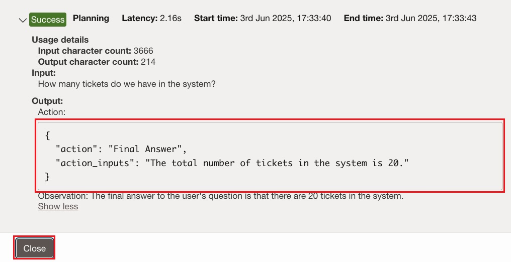

# Test our solution

## Introduction

Our provisioning work is now complete. It is now time to enjoy the fruits of our labor.
In the previous labs we have:

- Created the proper permissions & basic setup.
- Uploaded the knowledge base articles to a storage bucket.
- Created our ADB instance and filled it with data.
- Created an agent as well as the SQL and RAG tools alongside their knowledge bases.
- Configured the agent endpoint.

It is now time for us to test our solution.

Estimated Time: 15 minutes

### Objectives

In this lab, you will:

- Use the agent to answer questions about our data.

### Prerequisites

This lab assumes you have:

- All previous labs successfully completed

## Task 1: Overview of the chat page and functionality

1. If the agent is still now showing as **Active**, give it a few more minutes to complete the provisioning process.
1. Once the agent is showing as **Active**, click the **customer support agent** agent in the **Agents** list.

    

1. In the agent details page, click the **Launch chat** button.

    

1. In the initial chat page, make sure sure that both the **Agent compartment** and the **Agent endpoint compartment** are set to the **root** compartment.

1. On the top of the page, the **Agent** drop down should show **customer support agent** and the **Agent endpoint** drop down should show the newly created endpoint.
1. In the chat window, you'll be able to see the greeting message we have configured for the agent.
1. Other elements in the page include:

    - The message text box where you would write the messages for the agent.
    - The **Submit** and **Reset chat session** buttons, which you'll use to send the message you've typed in the message text box and reset all communications up until that point, respectively.
    - On the right, you'll see the **Traces** pane where the agent will communicate the various steps it took while reasoning over your requests.

    

## Task 2: Let's test our agent

1. To start, type the following question into you message box: _How many tickets do we have in the system?_.
1. Click the **Submit** button.

    

1. As you can see, the agent generated a SQL query because according to our descriptions for the agent and various tools, it figured that the answer to our question can be found in the database. The agent responded correctly with **20** as we have exactly 20 tickets in our database. In addition, you can see that a trace was generated on the right.
1. Click the **View** button next to the first trace.

    

1. Expand the traces to see the full output (you click the **Show more** link to see the rest of the output). The traces give you a glimpse of how the agent went about addressing your response. As you can see, the first trace shows how the agent is trying to figure out what the answer should be.

    

1. In the second trace, you'll be able to see that the agent invoked the SQL tool, and generated a SQL request. This request will be executed and the response will be incorporated in the final response.

    

1. The third trace shows how the agent composed the final response using the output of the previous steps.
1. Click the **Close** button to close the traces pane.

    

1. Our next question would be: _Who is the busiest support agent right now?_. I've phrased this question this way on purpose. "Busiest" is a subjective term that requires deep understanding of the context of the system. In our case, the busiest customer support agent would be the person which has the most tickets assigned to them. Let's see if the agent will be able to figure that out...
1. Click the **Submit** button.

    

1. Here are a couple of possible responses that the agent can generate for our question. They both show the correct answer: **Emily Chen**. Using the magic of Large Language Models (LLMs) and the clues we've left in the configuration of the agent and tools, the agent was able to decipher that the busiest agent would be the one with the most tickets assigned to them.

    
    

1. Feel free to take a look at the **Traces** generated for this response.
1. Next we'll ask the following: _Show me the title and description for Emily Chen's assigned tickets_
1. Click the **Submit** button.

    

1. As you can see, the response included the title and description for the two tickets assigned to Emily Chen.

    

1. Now that we have information about the tickets, let's see if we can pull up a knowledge article which can help us resolve the first token. Type the following question: _Do we have a knowledge article that can help me configure routers, switches and firewalls?_
1. Click the **Submit** button.
1. As you can see, for this questions, the agent figured out that the information required might be in the knowledge base articles. For this task is employed the RAG tool which returned references to some knowledge articles stored in our storage bucket. Feel free to look at the traces for this interaction as well to see the steps the agent took to give us the information we needed.

    

1. We invite you to try some questions of your own to experiment with agent.

## Summary

As you've experienced, the OCI Generative AI service allows you to ask complex questions about data stored in multiple locations and sources and get intelligent answers. By simply pointing the various tools towards your data sources and providing the right context, the agent was able to automatically determine which data source should be accessed, retrieve the data for you, compile a coherent and concise response and provide references to the original data when applicable.

Although our use-case was focused on customer support, the OCI Generative AI service can be used to fuel many different use-cases which require deep understanding and retrieval of information from internal data sources, reasoning over the data, summarizing it, providing insights and more.

## Learn More

- [Chatting with Agents in Generative AI Agents](https://docs.oracle.com/en-us/iaas/Content/generative-ai-agents/chatting.htm#chatting)

## Acknowledgements

- **Author** - Yanir Shahak, Senior Principal Software Engineer
