# Install the Components

## Introduction
In this lab, you will install all the components needed for this workshop. Some of these will be provisioned manually and many will be provisioned automatically using a provided Terraform script.

Estimated time: 40 min

### Objectives

- Provision all the cloud components

### Prerequisites

- An OCI Account with sufficient credits where you will perform the lab. (Some of the services used in this lab are not part of the *Always Free* program.)
- A current web browser. Chrome or Edge is recommended.
- A macOS or Windows 10/11 laptop. You will run a small number of commands locally, then run the remaining commands on the Oracle Linux Compute instance.
- Check that your tenancy has access to the **US Midwest (Chicago)** region. This workshop is validated in Chicago and uses `us-chicago-1` by default.
    - For Paid Tenancy
        - Click on region on top of the screen
        - Check that the Chicago Region is there (Green rectangle)
        - If not, Click on Manage Regions to add it to your regions list. You need Tenancy Admin right for this.
        - Click on the US MidWest (Chicago)
        - Click Subscribe

    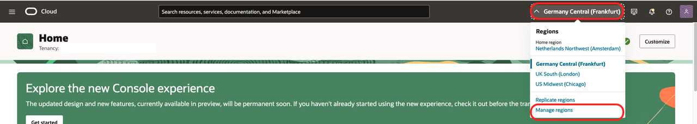

    - For Free Trial, the home region should be Chicago.
- Ashburn can be used only when Chicago is unavailable. If you switch, use that same region for the Console, Terraform stack, OCI Generative AI endpoint, and model OCID.
- The OCI User used in this LiveLab should have OCI Administrator privileges in the OCI Tenancy.

### Local command preflight

Run the applicable command on your **local laptop** before starting.

**macOS Terminal**

````
command -v git ssh ssh-keygen scp
````

**Windows PowerShell**

```powershell
Get-Command git, ssh, ssh-keygen, scp -ErrorAction SilentlyContinue
```

### Install missing commands

**macOS**

macOS includes `ssh`, `ssh-keygen`, and `scp`. If `git` is missing, run the following command and complete the Apple Command Line Tools installer:

````
xcode-select --install
````

If an SSH command is missing, install current macOS software updates or contact your IT administrator before the workshop.

**Windows PowerShell**

If `git` is missing, install Git for Windows, then close and reopen PowerShell:

```powershell
winget install --id Git.Git -e --source winget
```

If `winget` is unavailable, download Git for Windows from [git-scm.com/install/windows](https://git-scm.com/install/windows).

If `ssh`, `ssh-keygen`, or `scp` is missing, open PowerShell as Administrator and run:

```powershell
Add-WindowsCapability -Online -Name OpenSSH.Client~~~~0.0.1.0
```

Close and reopen PowerShell, then rerun the preflight check. If an organization-managed device blocks either installation, ask an instructor for help or use a machine where the required tools are available.


## Task 1: Create a Compartment

The compartment will be used to contain all the components of the lab.

You can
- Use an existing compartment to run the lab 
- Or create a new one (recommended)

1. Login to your OCI account/tenancy

2. Click the Hamburger menu at the top-left corner of the console and select
    1. Identity & Security
    2. Compartments
    
    
3. Click ***Create Compartment***
    - Give a name: ***oci-starter_XX*** (where XX is the initial of the user working on this LiveLab)
    - Then again: ***Create Compartment***
    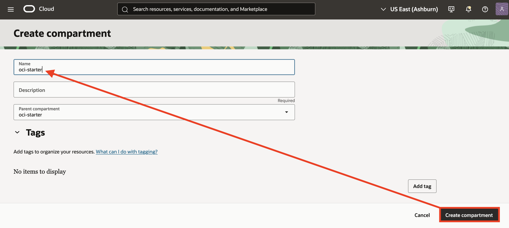

## Task 2: Create API-signing and SSH keys

This lab uses two different private keys:

- **OCI API-signing key**: authenticates the OCI CLI and the application to OCI APIs.
- **SSH key**: authenticates you to the Compute VM.

Keep both private keys private. Paste or upload only the SSH **public** key (`.pub`) to Resource Manager.

1. Go to OCI Console Homepage

2. Click User icon on the top right and *User Settings*

    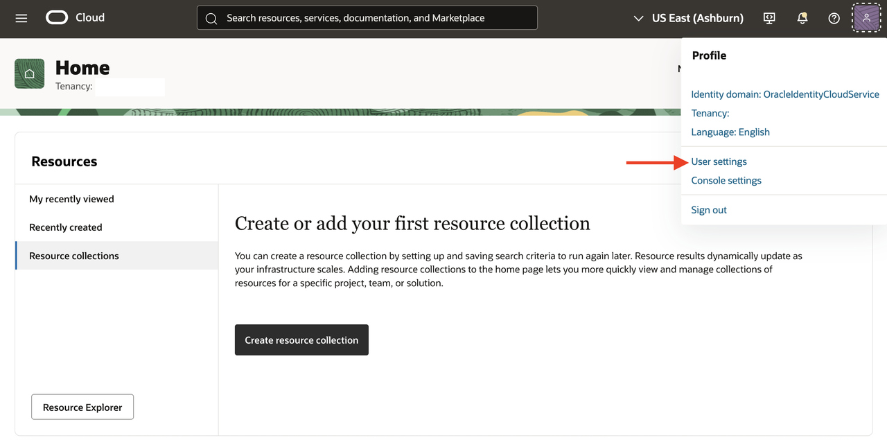
    
3. Go to *Tokens & Keys*, then *Add API Key*
    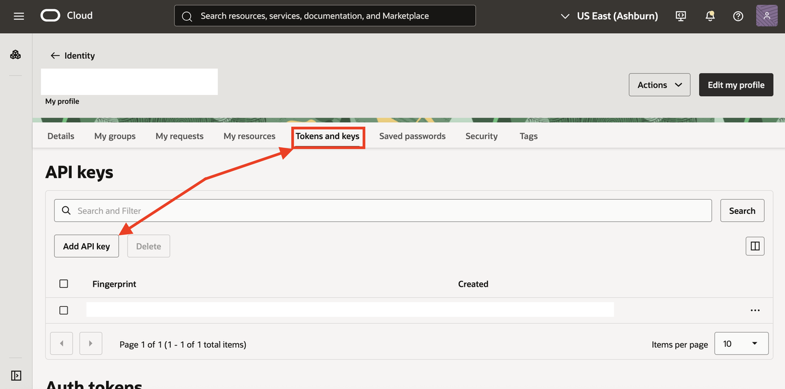
    
4. Generate the API key pair and download the private PEM key. Save it locally as `oci_api_key.pem`.
    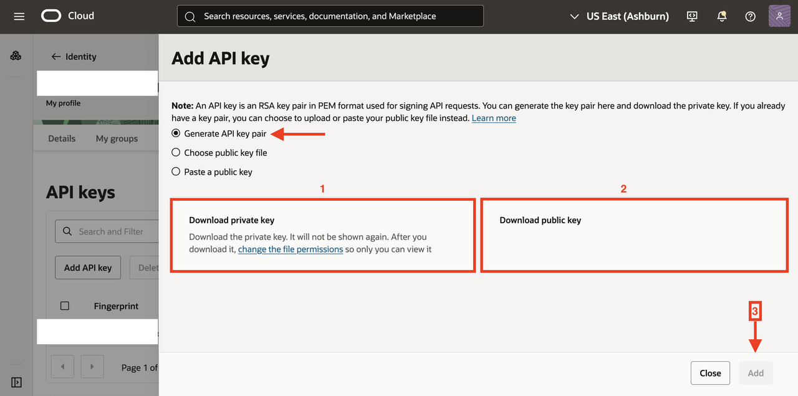

    This PEM key is the OCI API-signing private key used later in the Compute-host configuration.
    
5. Generate an SSH private/public key pair. This key is used only to connect to the Compute VM.

    **macOS Terminal**

    ````
    mkdir -p ~/.ssh
    ssh-keygen -t rsa -b 4096 -f ~/.ssh/oci_livelab
    ````

    **Windows PowerShell**

    ```powershell
    New-Item -ItemType Directory -Force -Path "$HOME\.ssh"
    ssh-keygen -t rsa -b 4096 -f "$HOME\.ssh\oci_livelab"
    ```

    You will use `oci_livelab.pub` in Resource Manager and keep `oci_livelab` private.


## Task 3: Run Terraform script 

1. Review and accept the license agreement before cloning the GitHub code to your local laptop.

    <div class="sample-code-license-gate" data-license-gate>
      <p>Review the Oracle Technology Network License Agreement in Appendix 1, then select <strong>Accept License Agreement</strong> to reveal the download command.</p>
      <button type="button" class="license-gate-review" data-license-gate-review>Review License Agreement</button>
      <p class="license-gate-status" data-license-gate-status aria-live="polite"></p>
    </div>

    <div class="sample-code-clone license-gate-is-hidden" data-license-gated-clone aria-hidden="true">
      <pre><code>git clone https://github.com/kaushik-kundu/PostgreSQL-AI.git</code></pre>
    </div>


       
2. Go to OCI Console Home Page

3. Click on *Developer Services* and then *Stack*
    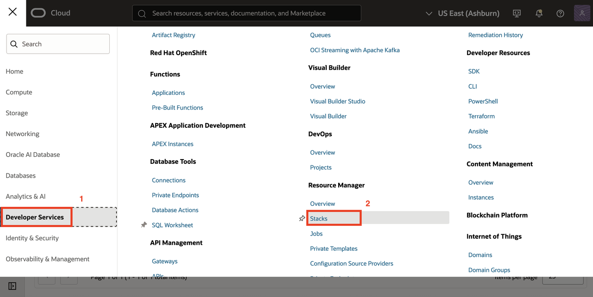

4. Change your compartment to the one created in Task 1 above

5. Select *My Configuration*, scroll down to *Stack Configuration*, and add the `oci_postgres_tf_stack` folder from your local `PostgreSQL-AI` clone.
       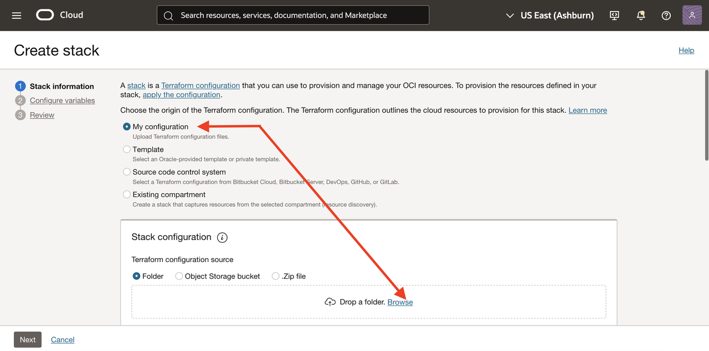
       
       Select the *oci_postgres_tf_stack* folder from your local machine
       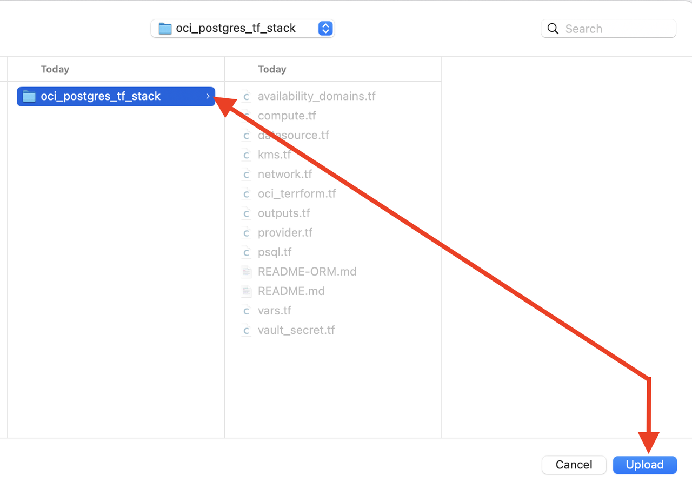
       
6. Select the compartment and click **Next**
       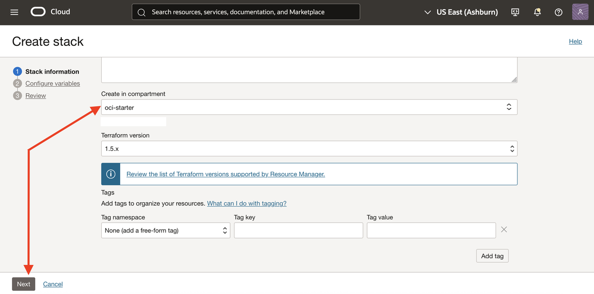

7. Ensure that the "compartment_ocid" is set correctly. Select the **compute assign public ip** option
          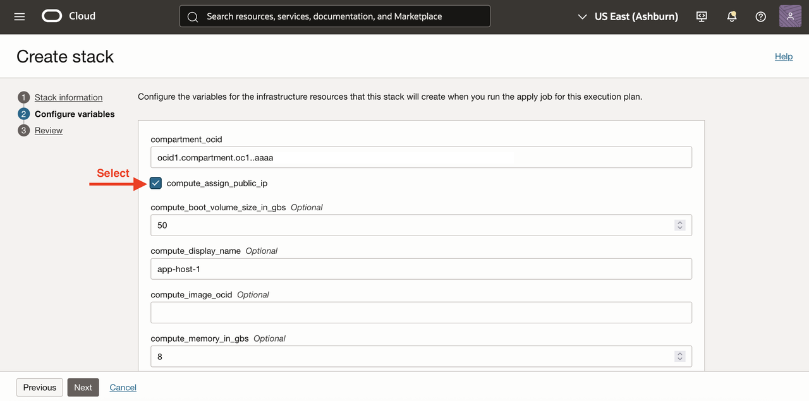

8. Paste the contents of the `oci_livelab.pub` SSH public-key file created in Task 2, Step 5, and check **create compute** | **create\_psql\_configurtion**.

    **macOS Terminal**

    ````
    cat ~/.ssh/oci_livelab.pub
    ````

    **Windows PowerShell**

    ```powershell
    Get-Content "$HOME\.ssh\oci_livelab.pub" | Set-Clipboard
    ```

    Ensure object\_storage\_bucket_name is set as "search-app-uploads\_XX" (where XX is the initial of the user working on this LiveLab)

    The stack currently permits ingress from `0.0.0.0/0` for workshop connectivity. If you know your public IP address and your venue networking is stable, you may restrict ingress to your public IP with a `/32` suffix. If that causes connectivity issues, temporarily use `0.0.0.0/0`.

    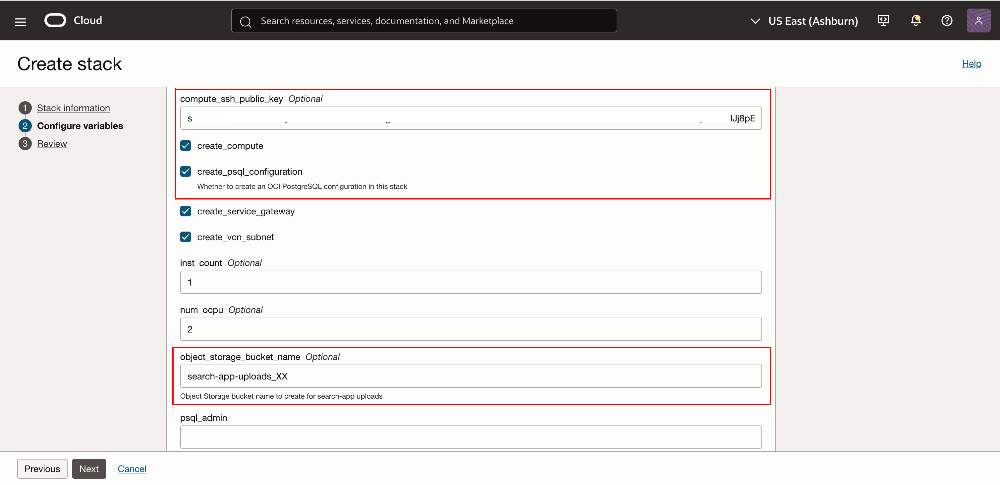

9. pgvector extension and user variables added
     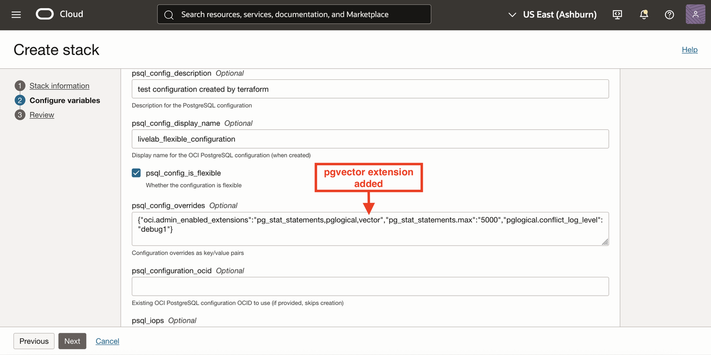

10. Enter Postgres Admin user and password
              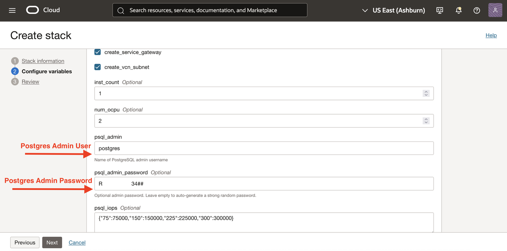

11. Ensure that the region is correctly set, and click next
              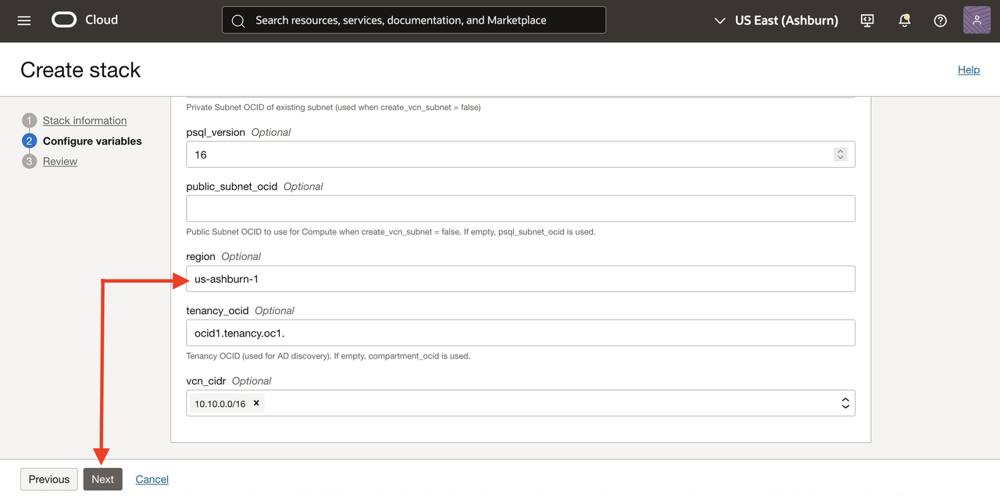

12. Select *Run apply* and create the stack
              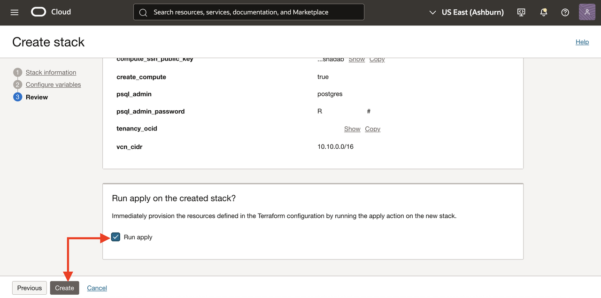

13. Wait about 10-15 minutes for the stack to finish provisioning
              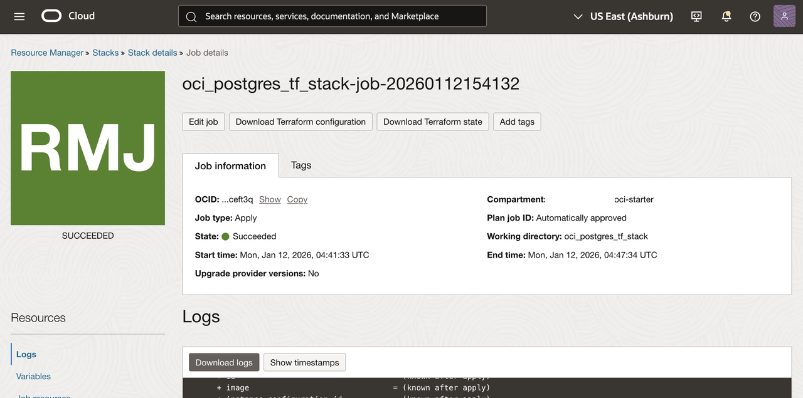
              

        Copy the last 10 lines of the job log and save it in a notepad, it will be like something below

        ````
        Outputs:
        compute_instance_id = "ocid1.instance.oc1.iad.anuw...................uq"
        compute_private_ip = "10.10.2.23"
        compute_public_ip = "150.x.x.74"
        compute_state = "RUNNING"
        psql_admin_pwd = <sensitive>
        psql_configuration_id = "ocid1.postgresqlconfiguration.oc1.iad.amaaaaa............snq"
        ````


14. Go to OCI Console *Compute* and then *Instances*
              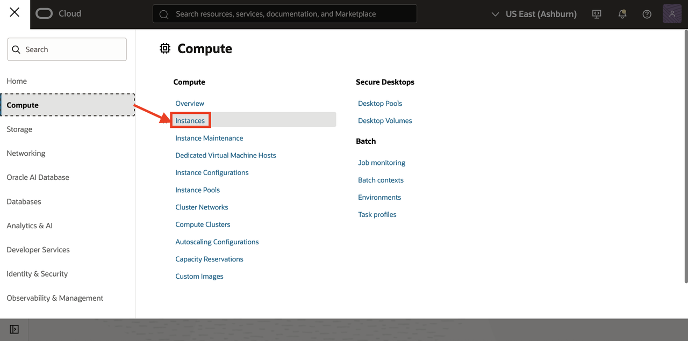

    Copy the public IP of the instance 
              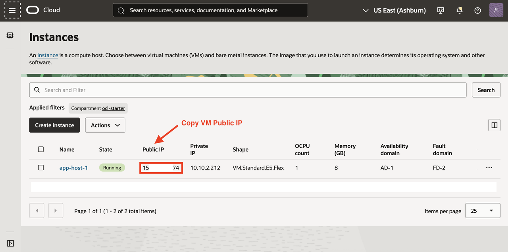

15. Go to OCI Console *Databases -> PostgreSQL -> DB Systems*

    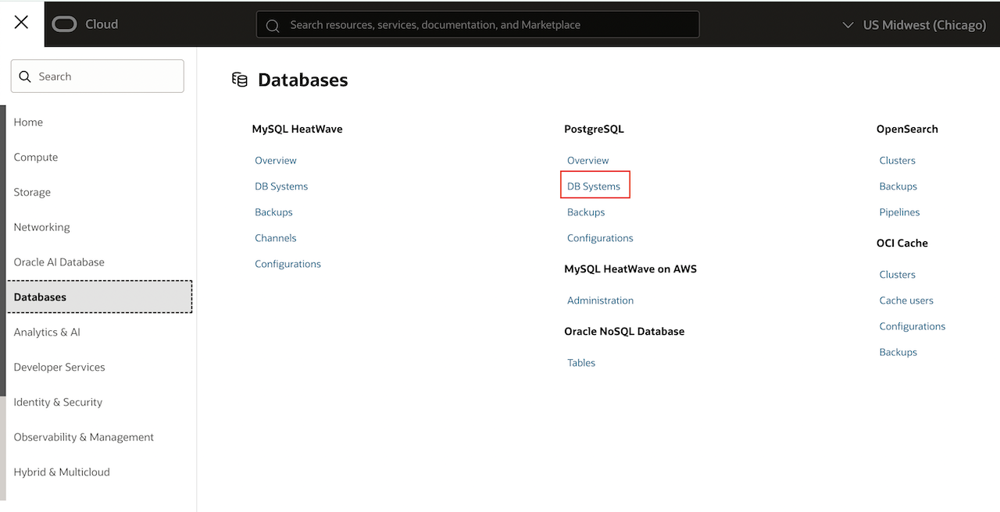

    Click on the database name to view the details

    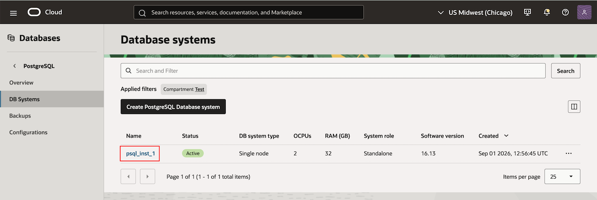

    Note the DB Primary endpoint

    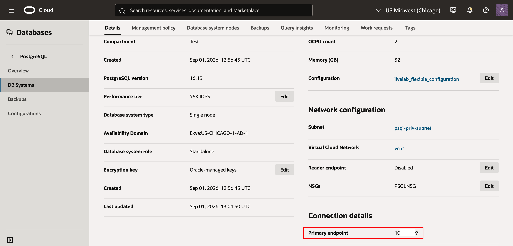

16. Go to OCI Console *Analytics & AI -> AI Services -> Generative AI*

    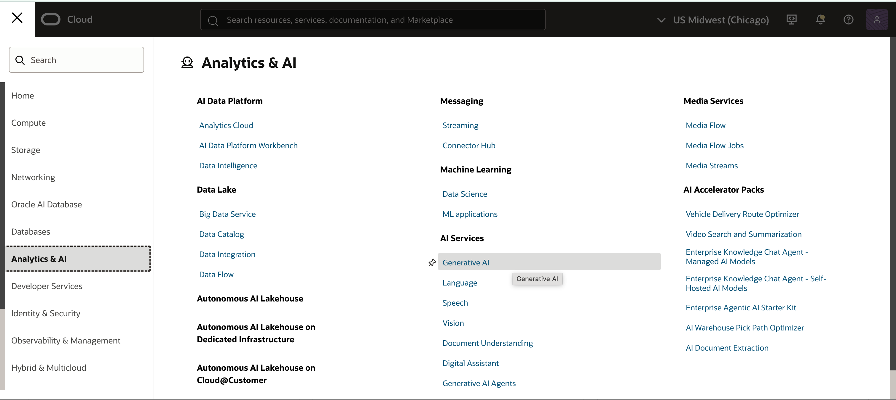

    Click on *Chat*

    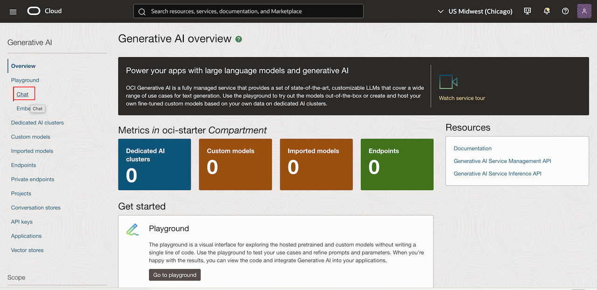

    Select the LLM Model you want to use for this LiveLab, and then click on *View model details*

    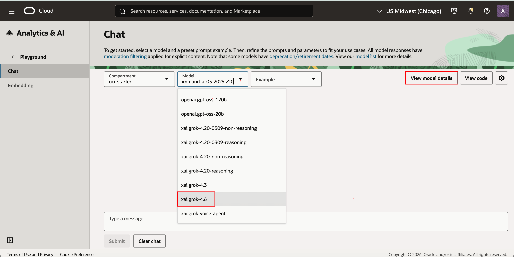

    Scroll down and *Copy OCID* to get the OCID of this LLM Model of OCI Enterprise AI.

    

    Optionally, you can also click on *View Code*, and note the OCID from the code

    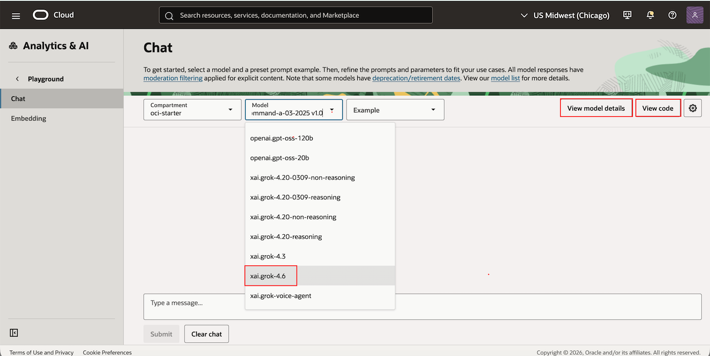
    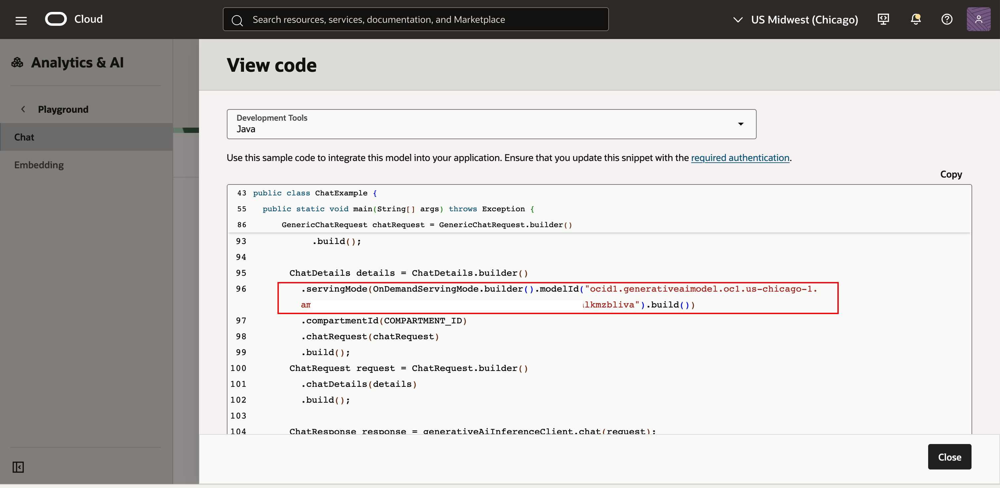

    Make a note of this OCID

## Task 4: Upload the OCI API-signing key

1. Locate the `oci_api_key.pem` private PEM file downloaded in Task 2, Step 4.

    This is the OCI API signing private key. It is different from the SSH private key used to connect to the VM.

2. Use SCP on your local laptop to copy the **OCI API-signing key** to the Compute host. The key provided with `-i` is the separate **SSH private key** from Task 2, Step 5.

    The file after -i is the SSH login key; 'oci\_api\_key.pem' is the API private key being uploaded.

    **macOS Terminal**

    ````
    scp -i ~/.ssh/oci_livelab ~/Downloads/oci_api_key.pem opc@<PUBLIC_IP>:/home/opc/oci_api_key.pem
    ````

    **Windows PowerShell**

    ```powershell
    scp -i "$HOME\.ssh\oci_livelab" "$HOME\Downloads\oci_api_key.pem" opc@<PUBLIC_IP>:/home/opc/oci_api_key.pem
    ````

## Task 5: Setup Application

1. Use SSH on your local laptop to connect to the Compute host. All following commands in this task run on the **Oracle Linux Compute host**, not on your local laptop.

    'oci_livelab' is the same SSH private key used for SCP in Task 4 Step 2

    **macOS Terminal**

    ````
    ssh -i ~/.ssh/oci_livelab opc@<PUBLIC_IP>
    ````

    **Windows PowerShell**

    ```powershell
    ssh -i "$HOME\.ssh\oci_livelab" opc@<PUBLIC_IP>
    ````

      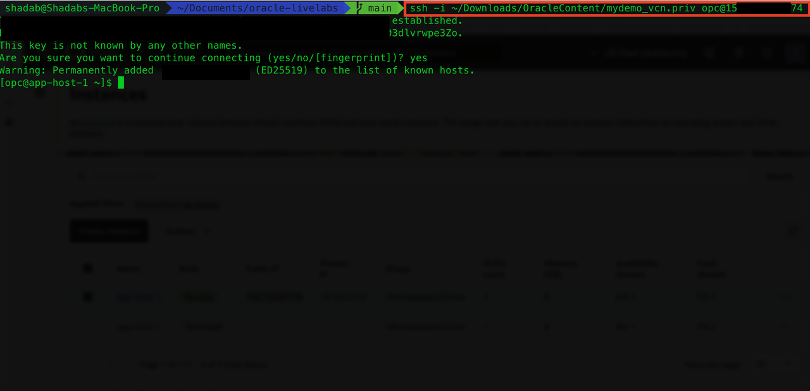

2. Install Linux Packages
   
    ````
    sudo dnf install -y curl git unzip firewalld oraclelinux-developer-release-el10 python3-oci-cli postgresql16
    ````

3. Add the firewall rule for the app port

    This opens TCP port 8000 on the VM so you can access the application in a browser later. OCI network ingress rules must also allow port 8000.
   
    ````
    # Firewalld rules for the app port (default 8000)
    sudo systemctl enable --now firewalld
    sudo firewall-cmd --permanent --add-port=8000/tcp
    sudo firewall-cmd --reload
    ````

4. Download the Code Repository to the compute instance. Use the license agreement above to reveal this command.

    <div class="sample-code-clone license-gate-is-hidden" data-license-gated-clone aria-hidden="true">
    <pre><code>git clone https://github.com/kaushik-kundu/PostgreSQL-AI.git</code></pre>
    </div>

5. Setup OCI ClI

    Move the API-signing key into the OCI configuration directory and restrict its permissions.

    ````
    mkdir -p ~/.oci
    chmod 700 ~/.oci
    mv ~/oci_api_key.pem ~/.oci/oci_api_key.pem
    chmod 600 ~/.oci/oci_api_key.pem
    ````

    ````
    oci setup config
    ````

    Enter the details from Task 2, Step 4. Use Chicago (`us-chicago-1`) unless you deliberately selected Ashburn for the entire lab.

    ````
    Enter a location for your config [/home/opc/.oci/config]:
    Enter a user OCID: ocid1.user.oc1..aaaaaa...........................aq
    Enter a tenancy OCID: ocid1.tenancy.oc1..aaaaaaaa....................ua
    Enter a region by index or name(e.g.) :  us-chicago-1

    Enter the location of your API Signing private key file: /home/opc/.oci/oci_api_key.pem

    Config written to /home/opc/.oci/config
        If you haven't already uploaded your API Signing public key through the
        console, follow the instructions on the page linked below in the section
        'How to upload the public key':

            https://docs.cloud.oracle.com/Content/API/Concepts/apisigningkey.htm#How2
    ````

    Verify that the OCI CLI can authenticate:

    ````
    oci os ns get
    ````

6. Configure the application variables to reflect the provisioned stack and API key.

    ````
    cd ~/PostgreSQL-AI/search-app/
    cp -p .env.example .env
    ````

    ````
    vi .env
    ````

    Add DB Parameters based on the DBSystem created earlier

    ````
    DB_HOST=<DB_Host value from Task 3 Step 15>
    DB_PORT=5432
    DB_NAME=postgres
    DB_USER=postgres OR <Your Postgres Admin Name from task 3 Step 10>
    DB_PASSWORD=<Your Postgres Password from task 3 Step 10>
    DB_SSLMODE=require
    DB_POOL_MIN_SIZE=1
    DB_POOL_MAX_SIZE=10
    ````

    Enter the exact PostgreSQL password that you chose for `DB_PASSWORD`. Do not add quotes or URL-encode special characters such as `@`.

    Set Security (Basic Auth) parameters
    ````
    BASIC_AUTH_USER=admin
    BASIC_AUTH_PASSWORD=<Choose a separate application password>
    ````

    `BASIC_AUTH_PASSWORD` is not the PostgreSQL password. Use a separate value.


    Add OCI cli parameters based on the API Key created earlier

    OCI\_GENAI\_MODEL\_ID can be set to the OCID received in Task 3 Step 16

    ````
    # Set oci
    LLM_PROVIDER=oci

    # OCI Enterprise AI (when LLM_PROVIDER=oci). Use the same region selected for the stack.
    OCI_REGION=us-chicago-1
    OCI_COMPARTMENT_OCID=ocid1.compartment.oc1..aaaaaaaad........................mfa
    OCI_GENAI_ENDPOINT=https://inference.generativeai.us-chicago-1.oci.oraclecloud.com
    OCI_GENAI_MODEL_ID=ocid1.generativeaimodel.oc1.us-chicago-1.amaaaaaask7d.......zta
    #
    # Option 1: Use config file
    OCI_CONFIG_FILE=/home/opc/.oci/config
    OCI_CONFIG_PROFILE=DEFAULT
    ````

7. Save and exit `vi`: press `Esc`, type `:wq`, then press `Enter`. Run the stack.

    ````
    bash run.sh
    ````

    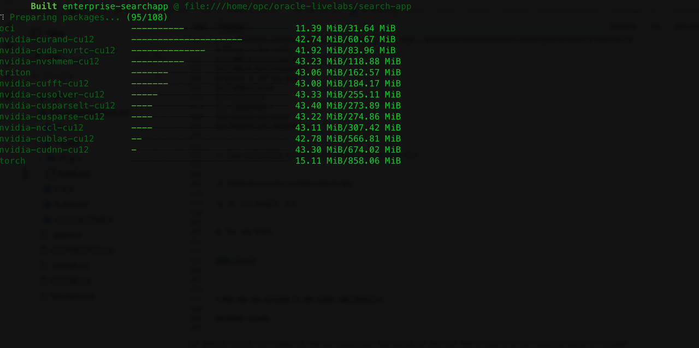
    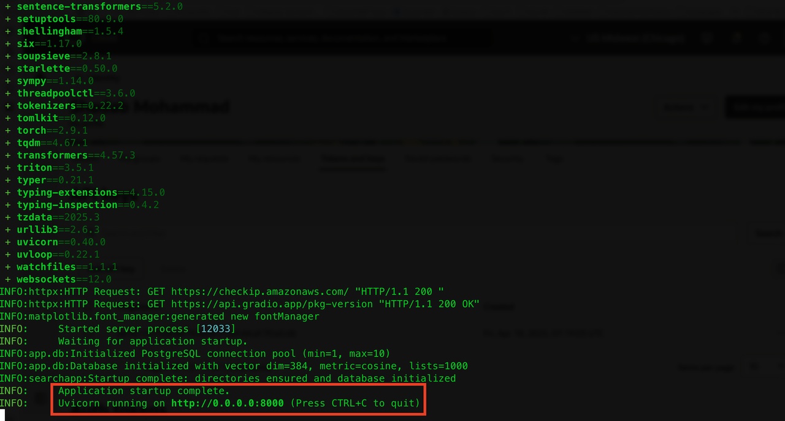

    After the app has completed startup, open a browser with the public IP of the VM with tcp/8000

    ````
    http://128.x.x.54:8000/
    ````

    Enter the API Auth User and Password set in the **.env** file earlier.

    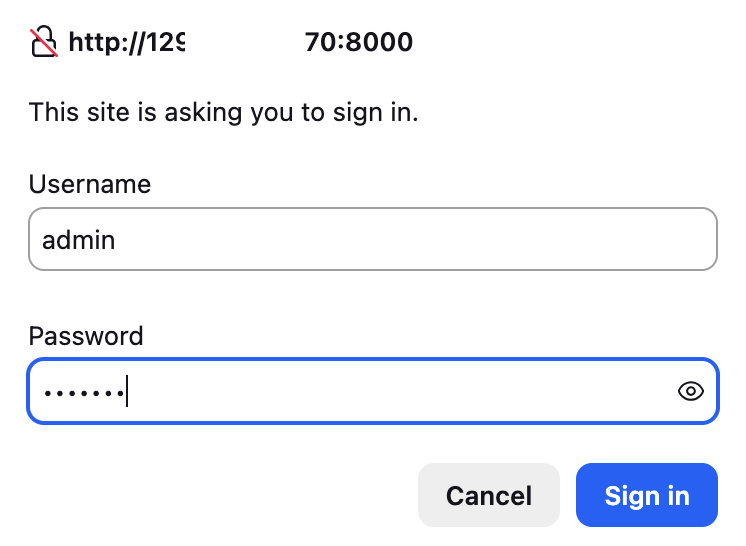


    **You may now proceed to the [next lab](#next)**

## Known issues

None

## Acknowledgements

- **Author**:
    - Shadab Mohammad, Master Principal Cloud Architect, January 2026
- **Contributors**:
    - Kaushik Kundu, Master Principal Cloud Architect
    - Sasanka Abeysinghe, Principal Cloud Architect
    - Luke Farley, Senior Cloud Engineer
- **Last Updated By** - Kaushik Kundu, Master Principal Cloud Architect, September 2026
