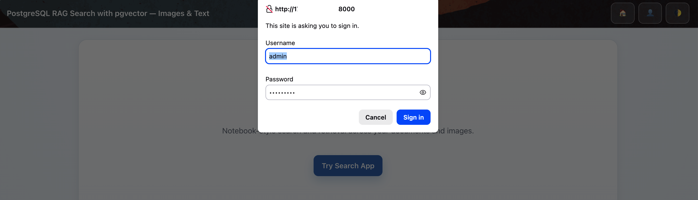
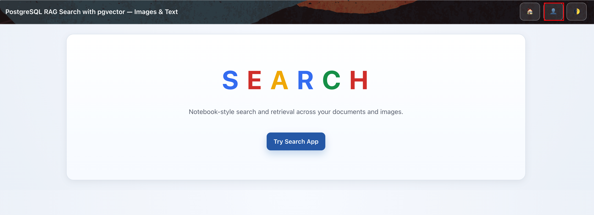
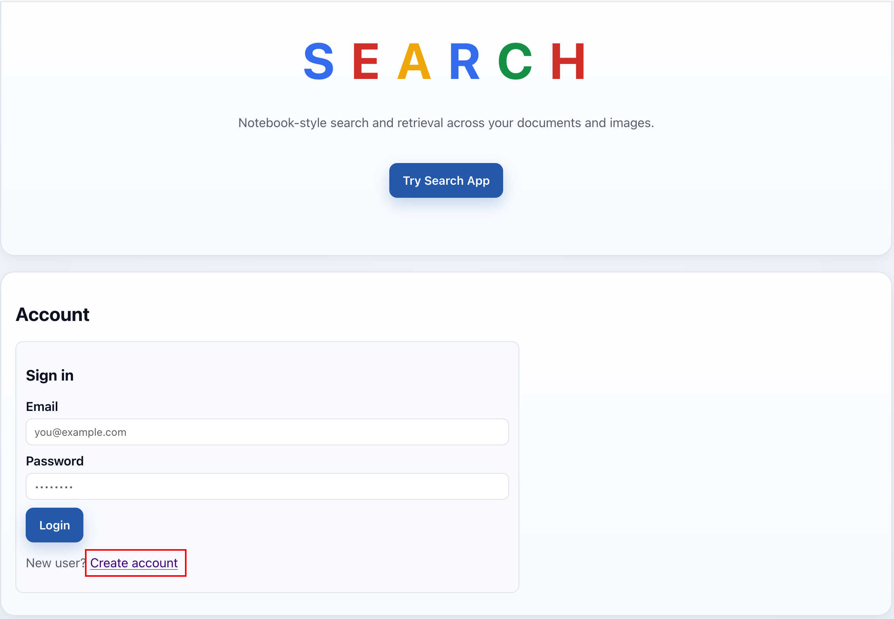
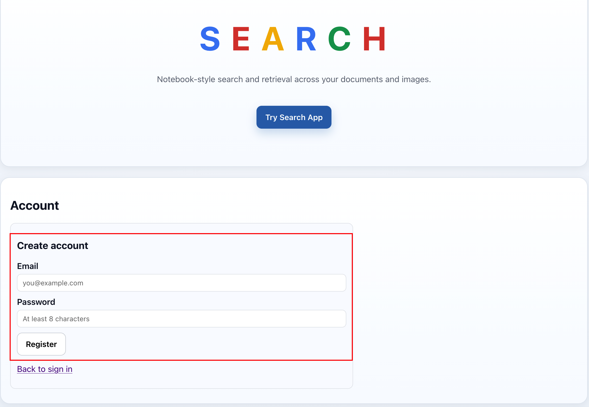
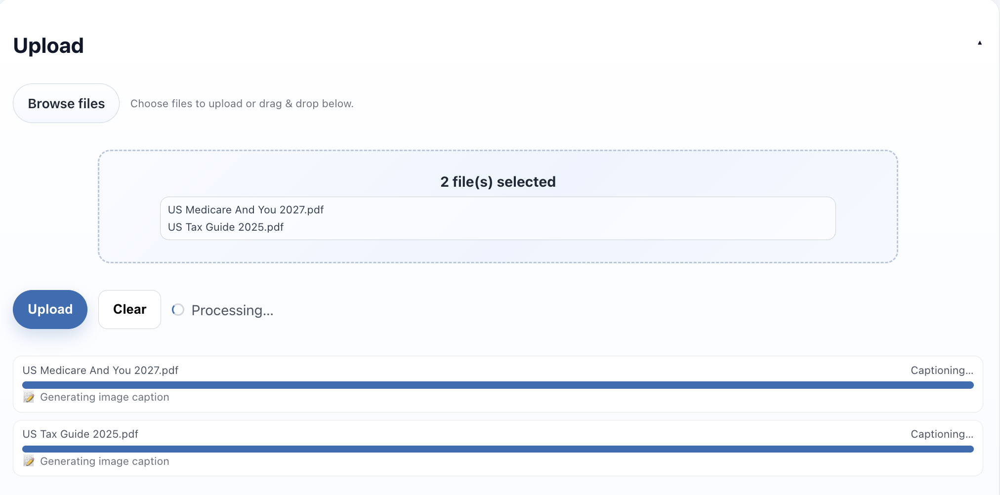
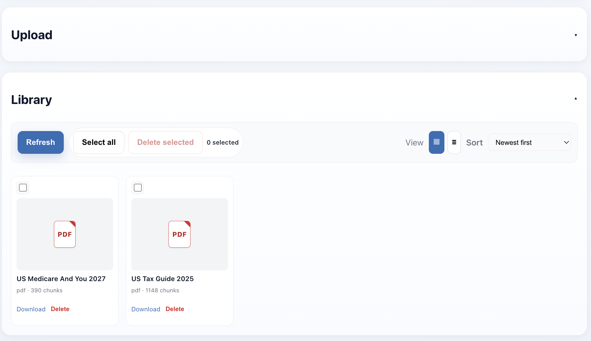
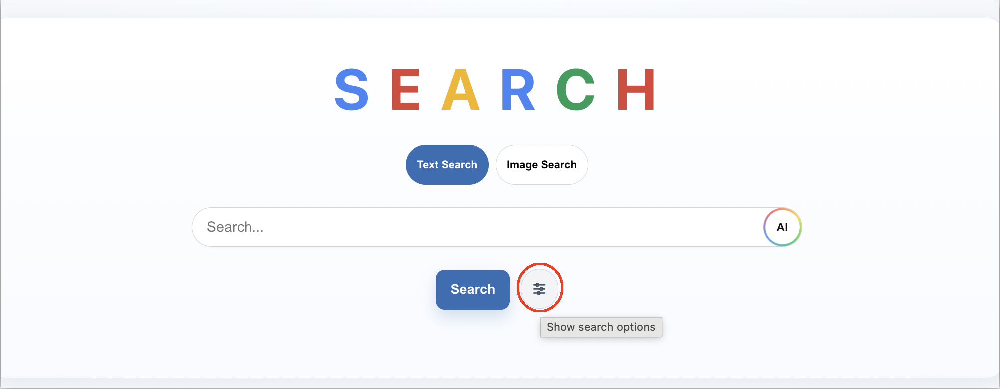
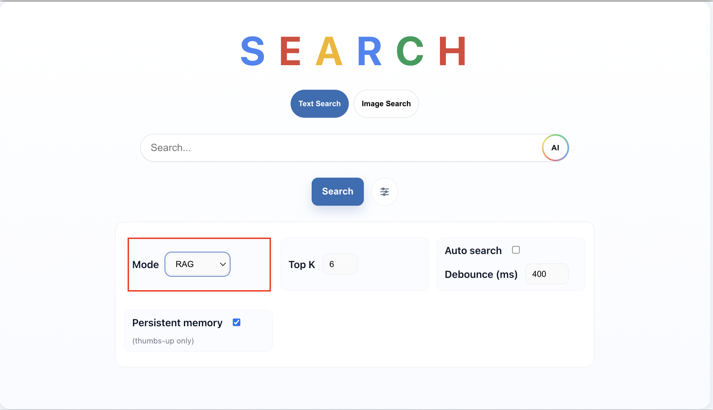
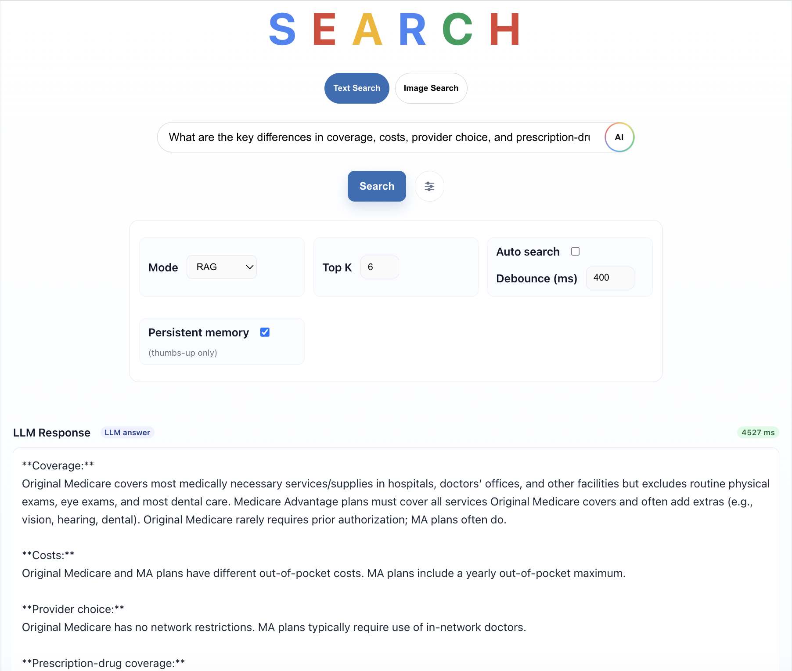
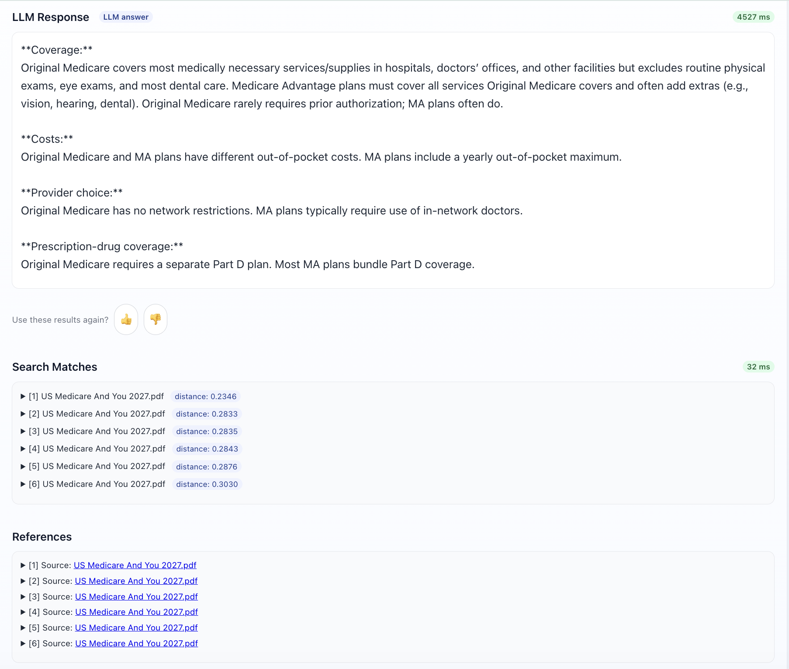

# Upload Files and Test the Search Application

## Introduction
In this lab, we will test what we created in Lab 1
Estimated time: 20 min

### Objectives

- Test the program

### Prerequisites
- The previous lab must have been completed.

## Task 1: Locate the RAG dataset
You will use the local repository cloned in Lab 1. Its `dataset` folder contains the sample files for this exercise:

````
PostgreSQL-AI/dataset/
````

Keep this local repository available while testing the application.

## Task 2: Upload the sample files to the search app

You will load a file into the search app which will be parsed, chunked, vector embeddings created & ingested into the OCI PostgreSQL database. 
     
1. Go to the application URL:

    ````
    http://&lt;PUBLIC_IP&gt;:8000/
    ````

    Replace with your Public_IP (from Task 3 step 14 in Lab 1) in the URL

2. Login to the app, using the credentials set in Task 5 Step 6 in Lab 1

    

3. Click on Account

    

    Scroll down, click "Create Account"

    

    Register with your Email and set your password

    The Email can be a dummy email too.

    

    
4. In the Upload section, browse to the *dataset* folder and select both the sample files, and then click *Upload*

    
    
    

5. Click on "Search Options", then ensure *RAG*  is selected as the Search Mode

     
       

6. Type "What are the key differences in coverage, costs, provider choice, and prescription-drug coverage between Original Medicare and Medicare Advantage?", and click on *Search*

    

    The References of the RAG Search are also listed.

    
   
7. Type "What are the standard-deduction amounts for each filing status, and who may claim an additional deduction because of age or blindness?", then *Search*

    

    The References of the RAG Search are also listed.

     
       
 
## Task 3: Optional - Test additional files
This is an optional test you can run with your own files. If you do this test, you will have more content in the database. If you're running short of time, then you can skip it or come back to it later.

**You may now proceed to the [next lab.](#next)**

## Known issues

None

## Acknowledgements

- **Author**:
    - Shadab Mohammad, Master Principal Cloud Architect, January 2026
- **Contributors**:
    - Kaushik Kundu, Master Principal Cloud Architect
    - Sasanka Abeysinghe, Principal Cloud Architect
    - Luke Farley, Senior Cloud Engineer
- **Last Updated By** - Luke Farley, Senior Cloud Engineer, September 2026
