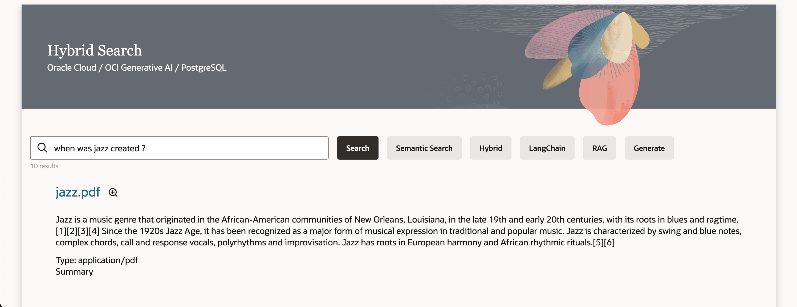

# Introduction

## About This Workshop

We will create a Generative AI / Hybrid Search web application, using Terraform. This application will search documents using OCI Database with PostgreSQL and the pgvector extension. pgvector will turn our OCI Database with PostgreSQL into a vector database where we can natively store and manage vector embeddings while handling unstructured data like documents, images, video, or audio.

We’ll be able to search documents like:
- PDF with text and images using OCI Document Understanding
- Images using OCI Vision
- Audio and Videos files using OCI Speech
- Word, Excel, Powerpoint, ... using OCI Functions
- Custom document: Belgian ID card images



The website created during the workshop has several ways to search:
- Search: Based on *Words* in the documents
- Semantic Search: Based on the *Meaning* (Vector Search)
- Hybrid: Based on the 2 above search
- RAG (Retrieval Augmented Generation): Answer questions based on documents
- and a "Generate" response button.

The procedures in this workshop are designed for users that have obtained an Oracle Cloud free trial account with active credits. The procedures will also work for other Oracle Cloud accounts but may, in some cases, require minor adaptation.

Estimated Workshop Time: 90 minutes

### Architecture


It works like this:
1. A document is uploaded in the Object Storage by the user
1. An event is raised and queued in Streaming (Kafka)
1. The stream is received and processed by a Python program running on a VM.
1. Based on the file type, it will send the file to one or more AI services to enrich them and provide searchable text
1. Vectors are calculated for the text by Generative AI
1. The results are uploaded to an PostgreSQL database
1. The user may then go a to website to query the documents (static HTML pages + REST apis) 

This picture shows the processing flow.


The file types supported by the Object storage are based on the file extensions. Here's how various file types are processed.
- If the name has an extension **.belgian***, it is processed by OCI Vision, and then it is stored in the database

- If the file has the extension **.png**, **.jpg**, **.jpeg**, or **.gif**, it is processed by OCI Vision, then it is stored in the database

- If the file has the extension **.json**, this is an output of the asynchronous AI services such as OCI Speech or OCI Document Understanding. The text is stored in the database.

- If the file has the extension **.mp4**, **.avi**, **.mp3**, **.wav**, or **.m4a**, it is processed by OCI Speech and the json output is processed as described above

- If the file has the extension **.tif** or **.pdf**, it is processed by OCI Document Understanding and the json output is processed as described above

- All other file types are sent to the OCI Function with a document parser.

### Objectives

- Provision the services needed for the system
    - Compartment, Object Storage Bucket, Stream, Event, PostgreSQL, AI services and a Virtual Machine
- Create an OCI Function to identify the documents
- Integrate the components into a working system
- Create a search user interface
- Process files through the system
- Search for files through the user interface

## Prerequisites
### Cloud Account
You need an Oracle Cloud account (i.e. access to an OCI tenancy) to complete this workshop. Participants can take advantage of Oracle's free trial account that comes with free cloud credits that are good for 30 days or until used up. Many Oracle events, such as CloudWorld, offer trial accounts with extra free cloud credits. You should be able to complete this workshop in the allotted time if your free trial cloud account is already created and ready to use. If you previously had a free trial account but the credits have expired, you won't be able to complete the lab. An option in this case is to obtain a new free trial account with fresh credits using a different email address. You can also use an existing paid Oracle Cloud account as long as you have administrator rights that will be needed to provision services.

### Laptop
You need a computer (laptop or desktop) with web browser, a text editor, and internet access. (Attempting to accomplish this workshop using a tablet or phone might be possible but is not recommended and it hasn't been tested on those types of devices.)

### Access to Frankfurt or Chicago
- *The Cloud Account should have access to the Chicago Region or Frankfurt region* where the Generative AI is available.
    - For Free Trial account, this means that the Free Trial should be created in the Chicago region
    - For Paid account, you will need to add the Chicago or Frankfurt Region to your tenancy to access the Generative AI APIs. (See lab 1) 

### Cloud Shell - Public Network

The lab is using Cloud Shell with Public Network
The lab assume that you have access to OCI Cloud Shell with Public Network access.
If that is not the case for some reasons here are the solution.

If you start Cloud Shell and that you see **Network: Public** on the top or that you may change to **Public Network**, there is nothing to do.
OCI Administrator have that right automatically. Or your administrator has maybe already added the required policy.

#### Solution - Add Policy

If not, please ask your Administrator to follow this document:

https://docs.oracle.com/en-us/iaas/Content/API/Concepts/cloudshellintro_topic-Cloud_Shell_Networking.htm#cloudshellintro_topic-Cloud_Shell_Public_Network

He/She just need to add a Policy to your tenancy :

```
<copy>
allow group <GROUP-NAME> to use cloud-shell-public-network in tenancy
</copy>
```

**Please proceed to the [next lab.](#next)**

## Acknowledgements 

- **Author**
    - Marc Gueury, Master Principal Cloud Engineer
    - Marek Krátký, Cloud Storage Specialist 
