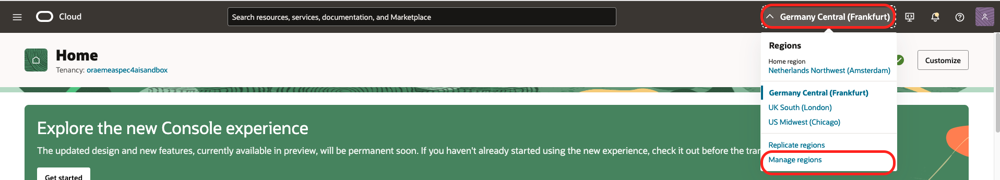
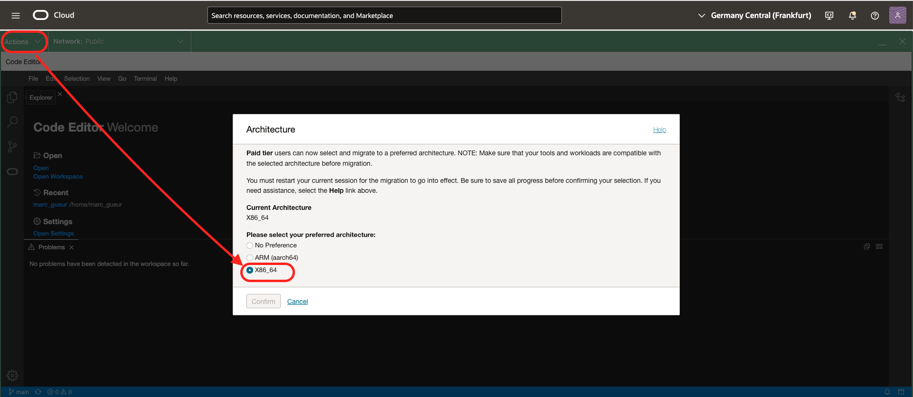
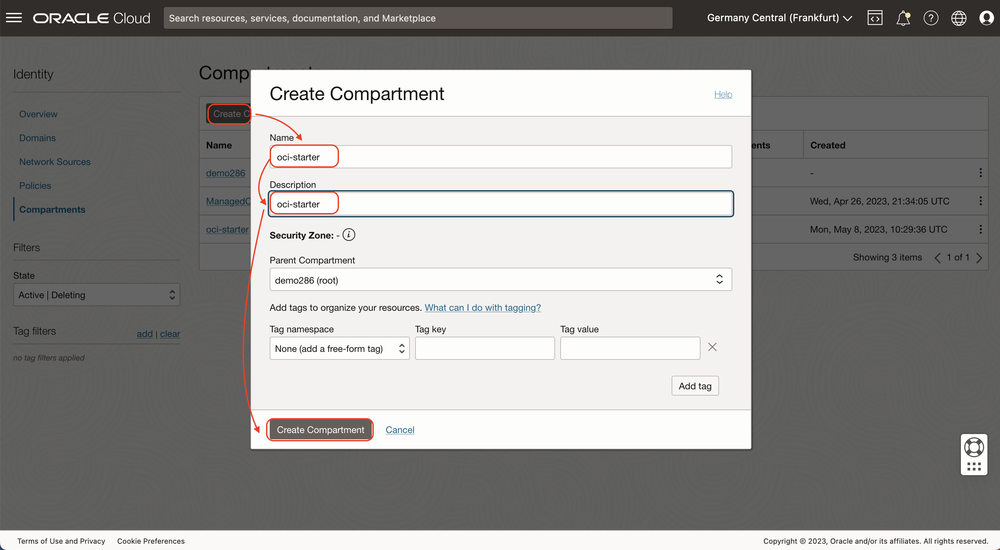
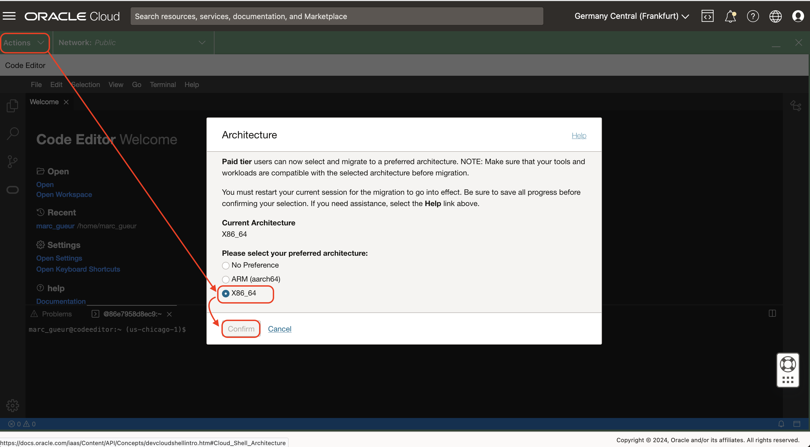

# Install the Components

## Introduction
In this lab, you will install all the components needed for this workshop. Some of these will be provisioned manually and many will be provisioned automatically using a provided Terraform script.

Estimated time: 40 min

### Objectives

- Provision all the cloud components

### Prerequisites

- An OCI Account with sufficient credits where you will perform the lab. (Some of the services used in this lab are not part of the *Always Free* program.)
- Choose which web browser to use before you start. There is an option in a later lab to download a github repo to your local computer using the OCI Console Cloud Shell. Some users have experienced a bug attempting to do this with the Firefox Browser Extended Support Release (ESR). The Chrome browser is an alternative in this case.
- Check that your tenancy has access to the **Chicago or Frankfurt Region**
    - For Paid Tenancy
        - Click on region on top of the screen
        - Check that the Chicago (or Frankfurt) Region is there (Green rectangle)
        - If not, Click on Manage Regions to add it to your regions list. You need Tenancy Admin right for this.
        - Click on the US MidWest (Chicago)
        - Click Subscribe

    

    - For Free Trial, the home region should be Chicago (or Frankfurt)
- The lab is using Cloud Shell with Public Network.

    The lab assume that you have access to **OCI Cloud Shell with Public Network access**.
    To check if you have it, start Cloud Shell and you should see **Network: Public** on the top. If not, try to change to **Public Network**. If it works, there is nothing to do.
    

    OCI Administrator have that right automatically. Or your administrator has maybe already added the required policy.
    - **Solution:**

        If not, please ask your Administrator to follow this document:
        
        https://docs.oracle.com/en-us/iaas/Content/API/Concepts/cloudshellintro_topic-Cloud_Shell_Networking.htm#cloudshellintro_topic-Cloud_Shell_Public_Network

        He/She just need to add a Policy to your tenancy :

        ```
        allow group <GROUP-NAME> to use cloud-shell-public-network in tenancy
        ```

## Task 1: Prepare to save configuration settings

1. Open a text editor and copy & paste this text into a text file on your local computer. These will be the variables that will be used during the lab.

    ````
    <copy>
    List of ##VARIABLES##
    ---------------------
    COMPARTMENT_OCID=(SAMPLE) ocid1.compartment.oc1.amaaaaaaaa
 
    Terraform Output
    ----------------
    SEARCH_URL=(SAMPLE)https://xxxxxxxx.apigateway.us-ashburn-1.oci.customer-oci.com/app/
    </copy>
    `````

## Task 2: Create a Compartment

The compartment will be used to contain all the components of the lab.

You can
- Use an existing compartment to run the lab 
- Or create a new one (recommended)

1. Login to your OCI account/tenancy
2. Go the 3-bar/hamburger menu of the console and select
    1. Identity & Security
    1. Compartments
    
2. Click ***Create Compartment***
    - Give a name: ***oci-starter***
    - Then again: ***Create Compartment***
    
4. When the compartment is created copy the compartment ocid ##COMPARTMENT_OCID## and put it in your notes


## Task 3: Run a Terraform script to create the other components.

1. Go to the OCI console homepage
2. Click the *Developer Tools* icon in the upper right of the page and select *Code Editor*. Wait for it to load.
3. Check that the Network used is Public. (see requirements)
4. Check that the Code Editor Architecture is well X86_64.
    - Go to Actions / Architecture
    - Check that the current Architecture is well X86_64.
    - If not change it to X86_64 and confirm. It will restart.

        

5. In the code editor menu, click *Terminal* then *New Terminal*
6. Run the command below in the terminal
    
    ````
    <copy>
    git clone https://github.com/mgueury/oci-postgres-genai.git
    </copy>
    ````
7. Edit the file *oci-postgres-genai/starter/env.sh*
    1. Click the **Explorer** icon in the left bar of the code editor
    1. Use Explorer to locate env.sh
    1. Click env.sh to open it in the editor
8. In env.sh, replace the ## with the corresponding value from your text file.
    ````
    <copy>
    export TF_VAR_compartment_ocid="##COMPARTMENT_OCID##"
    </copy>
    ````
9. Save your edits using File > Save
10. Run each of the three commands below in the Terminal, one at a time. It will run Terraform to create the rest of the components.
    ```
    <copy>
    cd oci-postgres-genai/starter/
    </copy>
    ```

    Generate an Authorization token for your user:
    ```
    <copy>
    bin/gen_auth_token.sh
    </copy>
    ```
    You should see the following in the results of the *gen\_auth\_token.sh* script:
    - AUTH\_TOKEN stored in env.sh
    - TF\_VAR\_auth\_token='a generated token'

    
    ````
    <copy>
    ./build.sh
    </copy>
    ````
11. **Please proceed to the [next lab](#next) while Terraform is running.** 
    Do not wait for the Terraform script to finish because it takes about 15 minutes and you can complete some steps in the next lab while it's running. However, you will need to come back to this lab when it is done and complete the next step.
12. When Terraform will finished, you will see settings that you need in the next lab. Save these to your text file. It will look something like:

    ```
    -- SEARCH_URL -------
    https://xxxxxxxx.apigateway.us-ashburn-1.oci.customer-oci.com/app/

    Please wait 5 mins. The server is starting.
    ```
**You may now proceed to the [next lab](#next)**

## Known issues

1. During the terraform run, there might be an error resulting from the compute shapes supported by your tenancy:

    ```
    oci_core_instance.starter_instance: Creating..
    - Error: 500-InternalError, Out of host capacity.
    Suggestion: The service for this resource encountered an error. Please contact support for help with service: Core Instance
    ```

    Solution:  edit the file *oci-postgres-genai/starter/src/terraform/variable.tf* and replace the *availability domain* to one where there are still capacity
    ```
    OLD: variable availability_domain_number { default = 1 }
    NEW: variable availability_domain_number { default = 2 }
    ```

    Then rerun the following command in the code editor

    ```
    <copy>
    ./build.sh
    </copy>
    ```

    If it still does not work, to find an availability domain or shape where there are still capacity, try to create a compute manually with the OCI console.

2. During the terraform run, there might be an error resulting from the compute shapes supported by your tenancy:

    ```
    - Error: 404-NotAuthorizedOrNotFound, shape VM.Standard.x86.Generic not found
    ```

    Solution:  edit the file *oci-postgres-genai/starter/src/terraform/variable.tf* and replace the *instance_shape* to one where there are still capacity in your tenancy/region
    ```
    OLD: variable instance_shape { default = "VM.Standard.x86.Generic" }
    NEW: variable instance_shape { default = "VM.Standard.E4.Flex" }
    ```

    Then rerun the following command in the code editor

    ```
    <copy>
    ./build.sh
    </copy>
    ```

    If it still does not work, to find an availability domain or shape where there are still capacity, try to create a compute manually with the OCI console.    

3. It happened on new tenancy that the terraform script failed with this error:

    ```
    Error: 403-Forbidden, Permission denied: Cluster creation failed. Ensure required policies are created for your tenancy. If the error persists, contact support.
    Suggestion: Please retry or contact support for help with service: xxxx
    ```

    In such case, just rerunning ./build.sh fixed the issue.

4. During terraform:
    ```
    Error: 409-PolicyAlreadyExists, Policy 'search-fn-policy' already exists
    ```

    Several persons are probably trying to install this tutorial on the same tenancy.

    Solution:  edit the file *env.sh* and use a unique *TF\_VAR\_prefix*
    ```
    OLD: export TF_VAR_prefix="search"
    NEW: export TF_VAR_prefix="search2"
    ```


## Acknowledgements

- **Author**
    - Marc Gueury, Master Principal Account Cloud Engineer
    - Marek Krátký, Cloud Storage Specialist 

