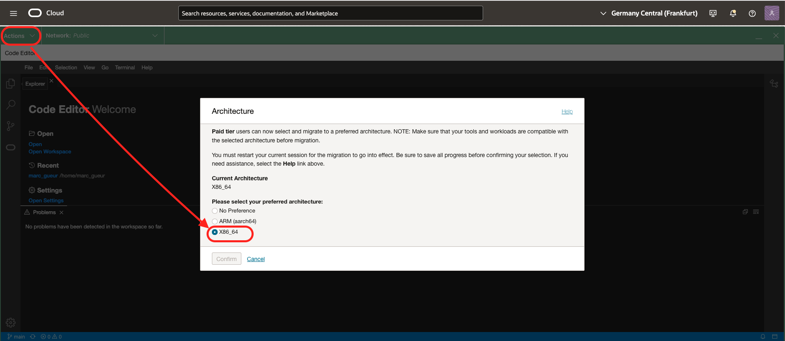

# Install the Components

## Introduction
In this lab, you will install all the components needed for this workshop. Some of these will be provisioned manually and many will be provisioned automatically using a provided Terraform script.

Estimated time: 40 min

### Objectives

- Provision all the cloud components

### Prerequisites

- An OCI Account with sufficient credits where you will perform the lab. (Some of the services used in this lab are not part of the *Always Free* program.)
- Choose which web browser to use before you start. There is an option in a later lab to download a github repo to your local computer using the OCI Console Cloud Shell. Some users have experienced a bug attempting to do this with the Firefox Browser Extended Support Release (ESR). The Chrome browser is an alternative in this case.
- Check that your tenancy has access to the **Chicago or Frankfurt Region**
    - For Paid Tenancy
        - Click on region on top of the screen
        - Check that the Chicago (or Frankfurt) Region is there (Green rectangle)
        - If not, Click on Manage Regions to add it to your regions list. You need Tenancy Admin right for this.
        - Click on the US MidWest (Chicago)
        - Click Subscribe

    

    - For Free Trial, the home region should be Chicago (or Frankfurt)
- The lab is using Cloud Shell with Public Network.

    The lab assume that you have access to **OCI Cloud Shell with Public Network access**.
    To check if you have it, start Cloud Shell and you should see **Network: Public** on the top. If not, try to change to **Public Network**. If it works, there is nothing to do.
    

    OCI Administrator have that right automatically. Or your administrator has maybe already added the required policy.
    - **Solution:**

        If not, please ask your Administrator to follow this document:
        
        https://docs.oracle.com/en-us/iaas/Content/API/Concepts/cloudshellintro_topic-Cloud_Shell_Networking.htm#cloudshellintro_topic-Cloud_Shell_Public_Network

        He/She just need to add a Policy to your tenancy :

        ```
        <copy>
        allow group <GROUP-NAME> to use cloud-shell-public-network in tenancy
        </copy>        
        ```


## Task 1: Create a Compartment

The compartment will be used to contain all the components of the lab.

You can
- Use an existing compartment to run the lab 
- Or create a new one (recommended)

1. Login to your OCI account/tenancy
2. Go the 3-bar/hamburger menu of the console and select
    1. Identity & Security
    1. Compartments
    
2. Click ***Create Compartment***
    - Give a name: ***oci-starter***
    - Then again: ***Create Compartment***
    

## Task 2: Create OCI API Key

The API key will be used to access OCI command line tool and OCI Generative AI service programatically 

1. Go to OCI Console Homepage

2. Click User icon on the top right and *User Settings*

    
    
3. Go to *Tokens & Keys*, then *Add API Key*
    
    
4. Generate API Key pair and Download the Private an Public Key. 
    
    
***We will use the public key later in provisioning the stack and private key to connect to the VM***


## Task 3: Run a Terraform script to create the Virtual Cloud Network, OCI PostgreSQL DBSystem & Virtual Machine.

1. Download the Github code to your Local machine
       ````
    git clone https://github.com/shadabshaukat/oracle-livelabs.git
       ````
       
2. Go to OCI Console Home Page

3. Click on *Developer Services* and then *Stack*
    

4. Change your compartment to the oen created in Task 1 above

5. Select *My Configuration* scroll down to the *Stack Configuration* and add the newly downloaded folder
       
       
   Select the *oci_postgres_tf_stack* folder from your local machine
       
       
6. Select the compartment and click **Next**
       

7. Select *compute_assign_public_ip*
          

8. Paste the Public SSH key created in Task 2 and check *create compute* box
             

9. Enter Postgres Admin user and password
              

10. Enter a region and click next
              

11. Select *Run apply* and create the stack
              

12. Wait about 10-15 minutes for the stack to finish provisioning
              

13. Go to OCI Console *Compute* and then *Instances*
              


   

14. **Please proceed to the [next lab](#next) while Terraform is running.** 
    Do not wait for the Terraform script to finish because it takes about 15 minutes and you can complete some steps in the next lab while it's running. However, you will need to come back to this lab when it is done and complete the next step.
15. When Terraform will finished, you will see settings that you need in the next lab. Save these to your text file. It will look something like:

    ```
    <copy>    
    -- SEARCH_URL -------
    https://xxxxxxxx.apigateway.us-ashburn-1.oci.customer-oci.com/app/

    Please wait 5 mins. The server is starting.
    </copy>    
    ```
**You may now proceed to the [next lab](#next)**

## Known issues

## Acknowledgements

- **Author**
    - Shadab Mohammad, Master Principal Cloud Architect

