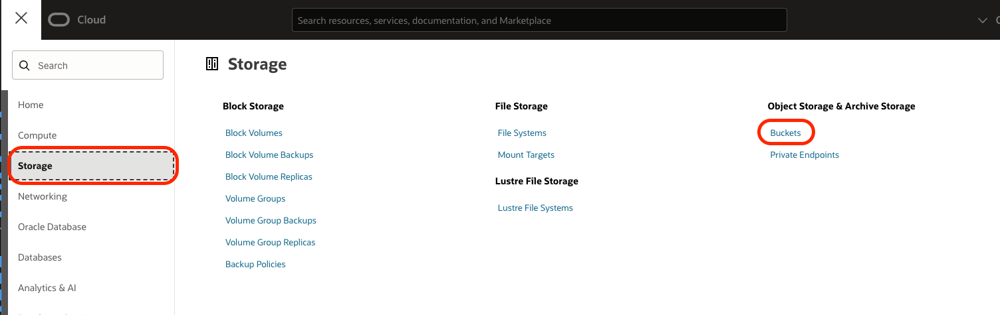
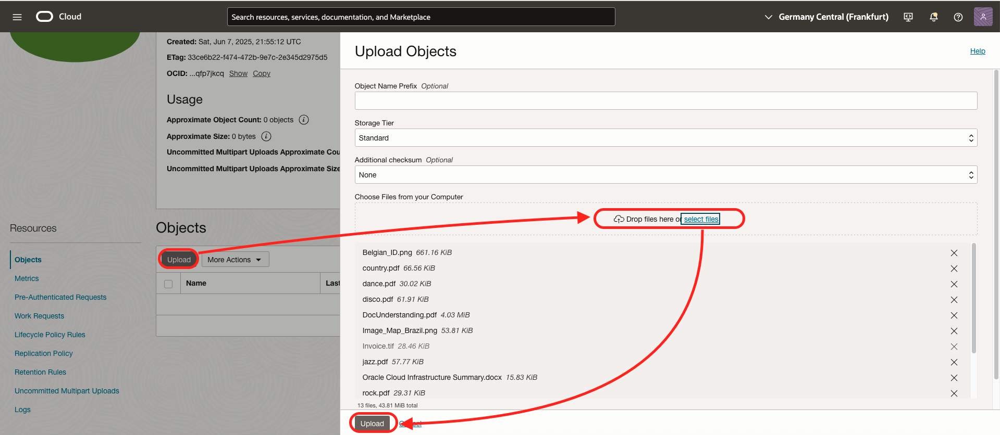
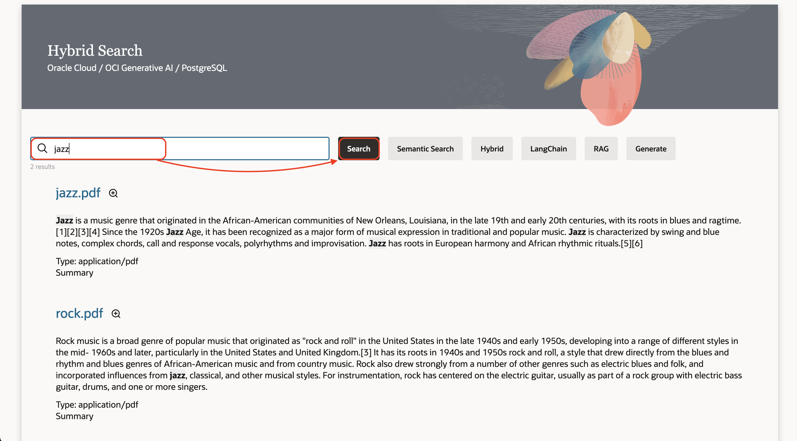

# Integrate the Components

## Introduction
In this lab, we will test what we created in Lab 1
Estimated time: 20 min

### Objectives

- Test the program

### Prerequisites
- The previous lab must have been completed.

## Task 1: Download required files
You will need samples files on your laptop/desktop. To download the files to your laptop from the Github website, please follow these steps.

1. In a new tab or window of your Intenet browser, go to https://github.com/mgueury/oci-postgres-genai/tree/main and click *Code* and then *Download ZIP*.


1. Extract the oci-postgres-genai-main.zip file to your computer. 
 

1. Note the directory contains the program runned in previous lab in the ***starter*** folder, and samples files in the ***sample_files*** folder.

## Task 2: Upload the sample files

Please wait that the script from the previous lab finishes. You should see :

```
-- SEARCH_URL -------
https://xxxxxxxx.apigateway.us-ashburn-1.oci.customer-oci.com/app/
```

You will load a file into object storage which will be ingested, processed with AI, and loaded into the database. 

1. In the OCI Console, select the 3-bar/hamburger menu and select
    - Storage
    - Buckets

    

1. In the *Buckets* list, select **psql-public-bucket**.
1. On your local computer, go to the directory that you previously downloaded from GITHUB
1. Under *Objects* click the **Upload* button. 

    

1. In the *Upload Objects* dialog, upload all the files of the **sample_files** directory. Then click the **Upload** button.

    
1. Click the **Close** button on the *Upload Objects* dialog. The file will be detected automatically and ingested.
     
1. Go to the ##SEARCH_URL## (ex:http://123.123.123.123/)
    
    Type "jazz", then *Search*

    

1. Type "when was jazz created ?", then *Semantic Search*

        

1. Type "when was jazz created ?", then *RAG*

      

1. In the previous screen click on Zoom of the jazz document. Then let's chat about that single document.
   
    - Type "Where was jazz created ?", then *Send*
    - Type "traduit la réponse en Francais", then *Send*

              

## Task 3: Optional - Test additional files
This is an optional test you can run with more sample files. If you do this test, you will have more content in the database. If you're running short of time, then you can skip it or come back to it later.

**You may now proceed to the [next lab.](#next)**

## Known issues

None

## Acknowledgements

- **Author**
    - Marc Gueury, Master Principal Account Cloud Engineer
    - Marek Krátký, Cloud Storage Specialist 


