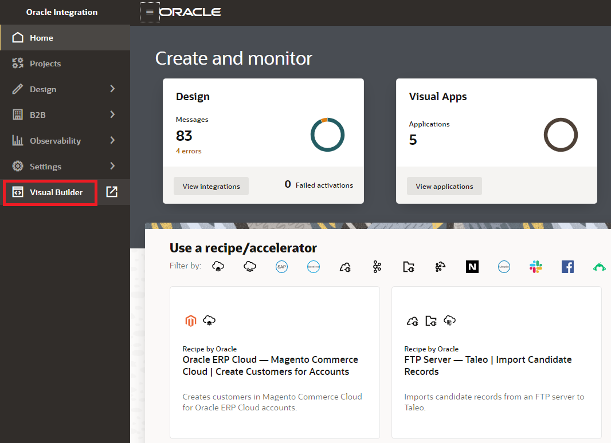
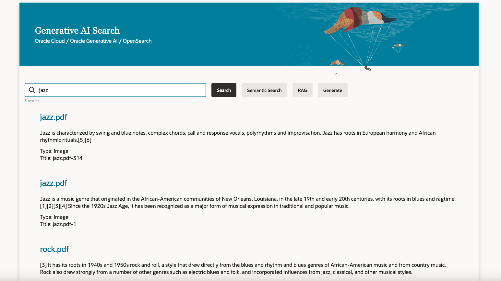

# Create a search user interface and run searches

## Introduction
In this lab you will create a user interface in Visual Builder that can be used to execute searches against the content that has been processed by the AI services and loaded into OpenSearch. A Visual Builder project has been prepared and you will upload this project, connect it to your environment, then use it. 

Estimated time: 20 min

### Objectives

- Create a user interface with Visual Builder and use it to query content that has been processed by the solution

### Prerequisites
- You've completed the previous labs

## Task 1: Import the project
1. You will need the VB application archive *opensearch-1.0.x.zip* for the next task. If you cloned the Git repo to your local computer in a previous lab, you will already have this file. This file is located in the *visual_builder* folder of the cloned repo. You can continue to the next task.

1. Go to the Oracle Integration Cloud (OIC) service console home page. If this is not already open in one of your browser tabs, you can get back to it by following these steps.
  
    1. Go the Cloud console 3-bar/hamburger menu and select the following    
        1. Developer Services
        1. Integration
  
    1. Check that you are in the intended compartment. (*oci-starter* was the recommended compartment name.)

    1. Click **oic** in the Integration instances list

    1. Click the **Service Console** button. It will open the OCI service console in a new tab.

1. In the OIC service console menu, choose **Visual Builder**.

1. Import the project file that you obtained in **Task 1**.
    1. Click *Import*
        
        
    1. Click **Application from file**
        
    1. Choose the file *vb/opensearch-1..x.zip*
    1. Application Name: *opensearch*
    1. Application ID: *opensearch*
    1. Click **Import**

        
    1. Wait for the import to be confirmed

## Task 2: Edit the connections

1. From the Visual Applications list, open the imported application by clicking on the application name, **opensearch**

1. To edit the connection to connect to the OpenSearch server, click on the **Service icon**

### 1. Opensearch connection
1. Click the **opensearch** connection 

1. Click on **Servers** tab

1. Click the **Edit icon** 

1. Use the ***APIGW_URL*** value you saved to your text file to fill in the Connection details:
    - (If you need to get the value, run this command in OCI Console Cloud Shell: oci-postgres-genai/starter/src/search_env.sh)

1. Configure the server as follows:
    - Replace Instance URL: *APIGW_URL*
      - Ex: https://xxxxxxxx.apigateway.eu-frankfurt-1.oci.customer-oci.com
    - Authentication: None

1. Click *Save*

1. Test the connection:
    1. Select tab *Endpoints*
    1. Click **Get - Get Many**
    1. Select tab *Test*
    1. Click **Send Request**

    
    1. The test succeeded if you see *"successful": 1,* in the response

### 2. Generative AI connection
1. Click on the again on *Service icon*
2. Click on the *Backend Tab* 
3. Choose the *GenerativeAI* backend
4. Click on *Servers* tab 
5. Then *Edit icon* 
6. First, we need to get the Generative rest API. *##AI\_GENAI\_URL##*. You got it in the previous lab too.
    You can find it here [https://docs.oracle.com/en-us/iaas/api/#/en/generative-ai/20231130/](https://docs.oracle.com/en-us/iaas/api/#/en/generative-ai/20231130/)
7. Fill the details:
    - Instance URL: ##AI\_GENAI\_URL##
    - Edit the authentication
        - KeyId format = ##TENANCY\_OCID##/##USER\_OCID##/##FINGERPRINT##
        - Ex: ocid1.tenancy.oc1..xxxxx/ocid1.user.oc1..xxxx/11:22:33:44:55:66:77
    - Private KEY =  *##PRIVATE\_KEY\_RSA\_FORMAT##*
8. *Save*
9. *Save*

### 3. Compartment OCID
1. Click on the *Web Application icon*
2. Click on the *opensearch* application 
3. Go to the *Variables* tab
4. Click on the constant *compartmentId*
5. Replace the value with your compartment Id: *##COMPARTMENT_OCID##*

## Task 3: Test the application

1. Click the **run** button on the top right of the Visual Builder page. The Visual Builder application user interface will appear in a new browser tab.

1. In the search user interface, enter *jazz* and click **Search**. This will return a record for the file that was processed by OCI Document Understanding AI service to extract text from the image file so that it could be made searchable.

1. Try the same with the question "when was jazz created" with *Search*, *Semantic Search*, *RAG* and *Generate*. Compare the results.
   
1. If you performed the optional task at the end of the previous lab and processed the additional files, you can query for those now. Here's some hints on words you can search for each of the provided documents. You can also search on *"\*"* to see all indexed documents.

    | Search Terms |
    | ------------------------------------- | --------------------------------------- |
    | When was jazz created | Search |
    | When was jazz created | Semantic Search |
    | When was jazz created | RAG |
    | When was jazz created | Generate |
    | When was the moon created | Search |
    | When was the moon created | Semantic Search |
    | When was the moon created | Generate |
    | When was the moon created | RAG |
    | Penguin | Search |

**Congratulations! You have completed this workshop.**

Here's what you accomplished. You provisioned multiple services into a compartment in your OCI tenancy. These included Oracle Integration Cloud (OIC), several AI services (such as OCI Document Understanding and OCI Language), and Oracle Search with OpenSearch. You imported a project into OIC that ingests document files from Object Storage, sends them to AI services based on the file type, and then loads extracted data into an OpenSearch index. You configured all of the service connections used by that OIC project and then you ran the integration project. Finally, you imported an application project into Visual Builder, you configured the connection to OpenSearch, and then you ran the project to display a search user interface. You used that search tool to query the content added to the OpenSearch index. This workshop has illustrated how different OCI services can be integrated together to use AI to make many types of content more searchable.

## Acknowledgements
- **Author**
    - Marc Gueury, Master Principal Account Cloud Engineer
    - Marek Krátký, Cloud Storage Specialist 

