# Discover services that have been created by automation and that comprise the solution

## Introduction
In this optional lab you can explore services that have been created by automation and that comprise the solution such as the AI services and PostgreSQL. 

Estimated time: 20 min

### Objectives

- Discover services that have been created by automation and that comprise the solution

### Prerequisites
- You've completed the previous labs

## Task 1: Compartment

The compartment is used to contains all the components of the lab.
From an architectural viewpoint, a compartment is simply a logical group of OCI resources. There is no specific implication of network structure, geographical placement, or even any relationship between resources. They are merely a set of resources that are associated with a set of group based permissions.

Go the Cloud console 3-bar/hamburger menu and select the following
  1. Identity & Security
  2. Choose Compartment
    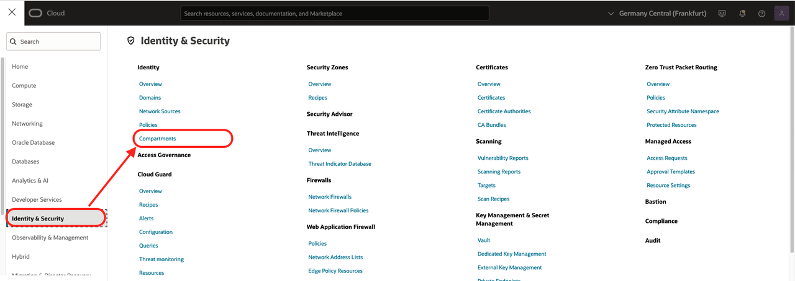
 
  3. Click on the compartment name ***oci-starter***
     
   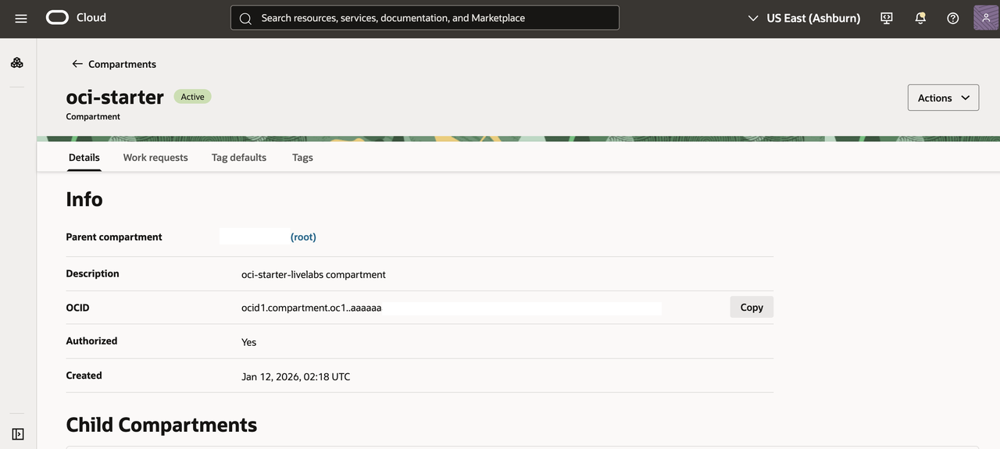

## Task 2: Virtual Cloud Network

The Virtual Cloud Network allows you to manage the network of the components.
A virtual cloud network (VCN) is a virtual, private network that closely resembles a traditional network, with firewall rules and specific types of communication gateways that you can choose. A VCN resides in a single OCI region and covers one or more CIDR blocks (IPv4 and IPv6, if enabled). Each subnet consists of a contiguous range of IP addresses (for IPv4 and IPv6, if enabled) that do not overlap with other subnets in the VCN.

Go the Cloud console 3-bar/hamburger menu and select the following
  1. Networking
  2. Virtual Cloud Network

    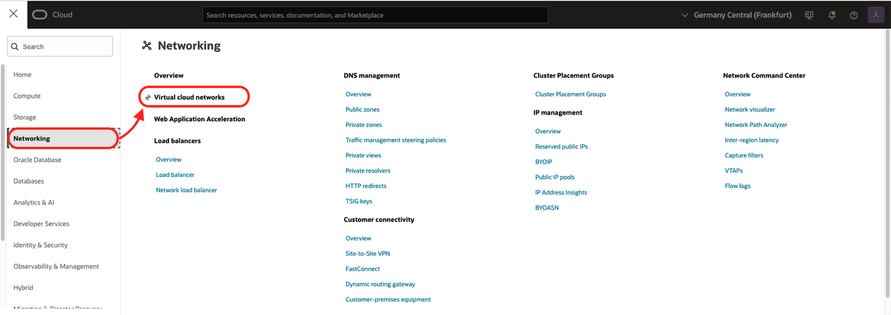

  3. Check that you are in the right compartment (oci-starter in this case)
  4. Click on vcn name *psql-vcn*
  5. Notice two subnets: psql-priv-subnet Private (Regional) and psql-pub-subnet Public (Regional). 
You can designate a subnet as either public or private when you create it. Private means VNICs in the subnet can't have public IPv4 addresses and internet communication with IPv6 endpoints will be prohibited. Public means VNICs in the subnet can have public IPv4 addresses and internet communication is permitted with IPv6 endpoints.

  6. Choose *Security Lists*
  7. Then click on *psql-security-list*

    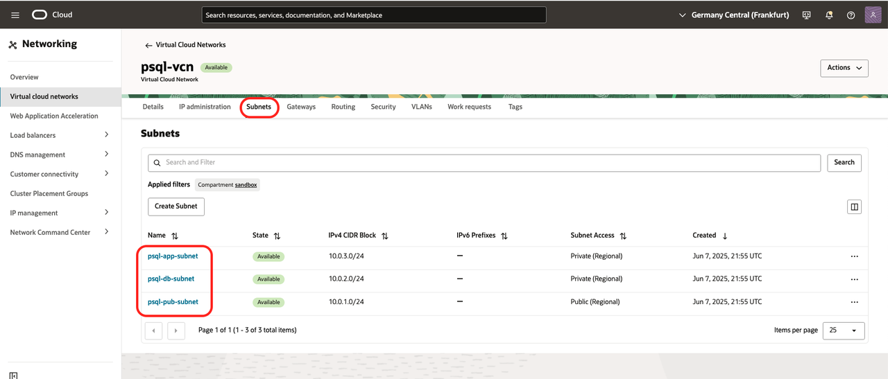

  8. Notice Ingress Rules that were created for this lab
     1. Source CIDR: *0.0.0.0/0*, Destination Port: *80* /required for accessing search user interface from Internet
     2. Source CIDR: *0.0.0.0/16*, Destination Port: *5432* /required for accessing PostgreSQL from a compute instance in the same VCN

    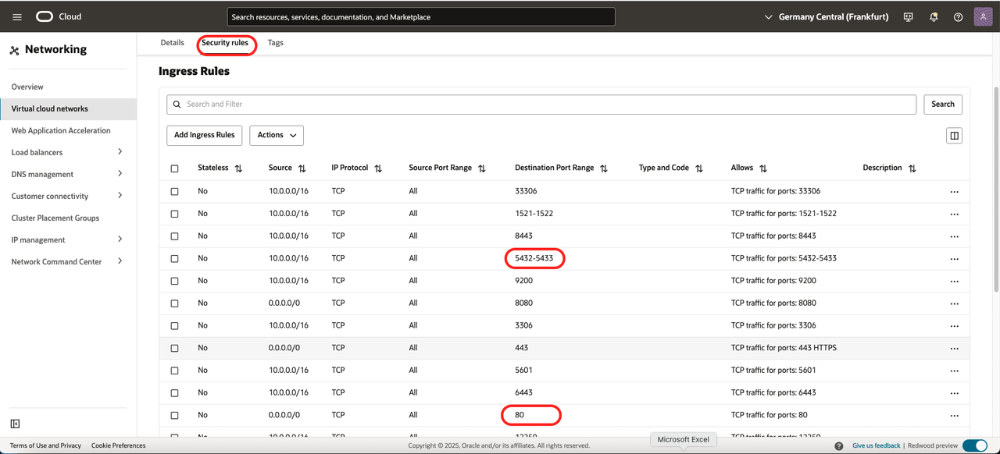


## Task 3: PostgreSQL Database System

OCI Database with PostgreSQL allows us to store extracted text from documents including their corresponding vector embeddings by using the pgvector extension so we can perform a semantic search. Database with PostgreSQL is a fully managed PostgreSQL service with intelligent sizing, tuning and high durability.

Go the Cloud console 3-bar/hamburger menu and select the following
  1. Database
  2. PostreSQL - DB Systems

  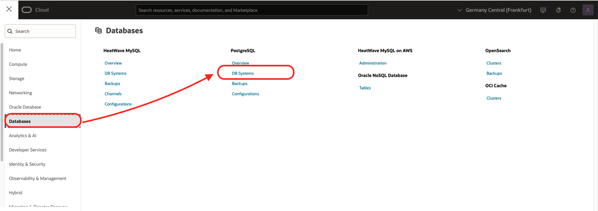

  3. Check that you are in the right compartment (oci-starter in this case)
  4. Click on the PostgreSQL db system name *psqlpsql*
  5. Notice the General information:  
  Performance tier: 75K IOPS
  Shape: VM.Standard.E4.Flex
  OCPU count: 2
  RAM(GB): 32

  6. Notice Network configuration
  7. Notice Connection details
  8. Notice Database system nodes
A Database system is PostgreSQL database cluster running on one or more OCI VM Compute instances. A database system provides an interface enabling the management of tasks such as provisioning, backup and restore, monitoring, and so on. Each database system has one endpoint for read/write PSQL queries and can have multiple endpoints for read-only queries.

  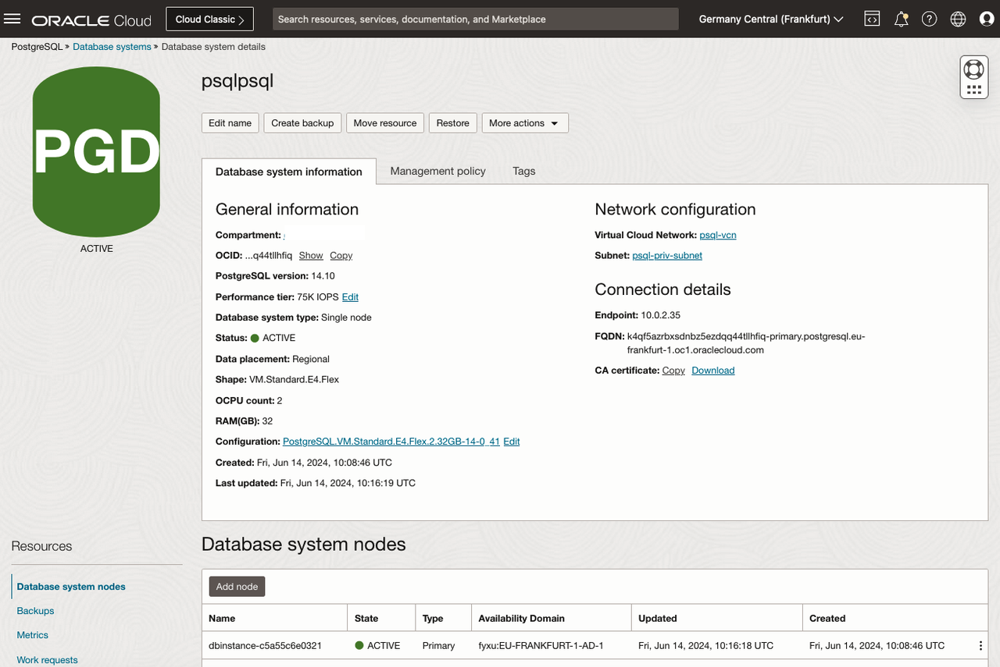


## Task 4: Compute Instance

Compute instance is used to host the application logic.

   1. Explore the Compute instance details    
    1. Go the Cloud console 3-bar/hamburger menu and select the following    
        1. Compute
        2. Instances
  
  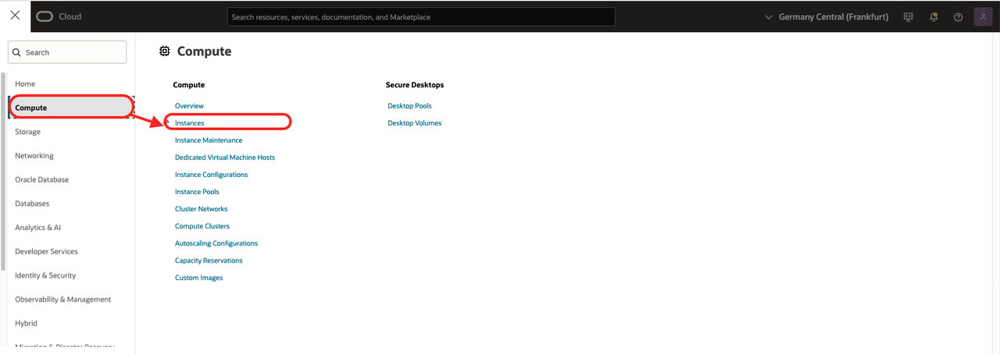 
    
    2. Check that you are in the intended compartment. (*oci-starter* was the recommended compartment name.)
    3. Click **psql-bastion** in the Compute instances list
    4. Review the information on the Compute instance details page 

  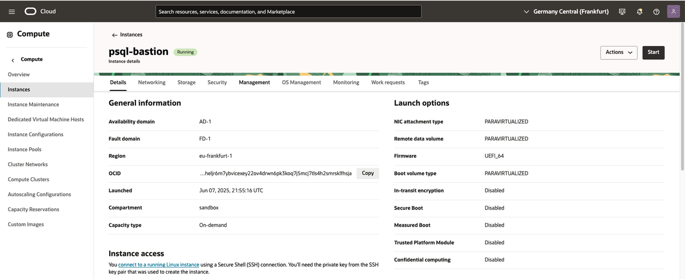
 
  2. Connect to the instance
    1. In the OCI Console, select the Developer Tools icon and then select Cloud Shell.
    2. In OCI Console Cloud Shell, run the following commands: 

       
     ```
     <copy>
     cd oci-postgres-genai/starter/bin/
     ./ssh_bastion.sh 
     </copy>     
     ```

  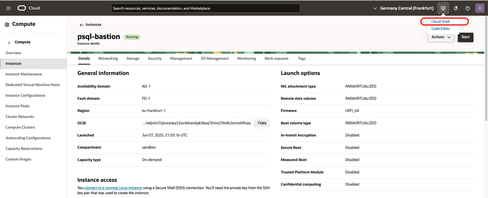
    
    3. When succesfully connected to the bastion instance you should see the following prompt:
    
        [opc@psql-bastion ~]$

    4. Explore the application code in the opc user home direcotory

  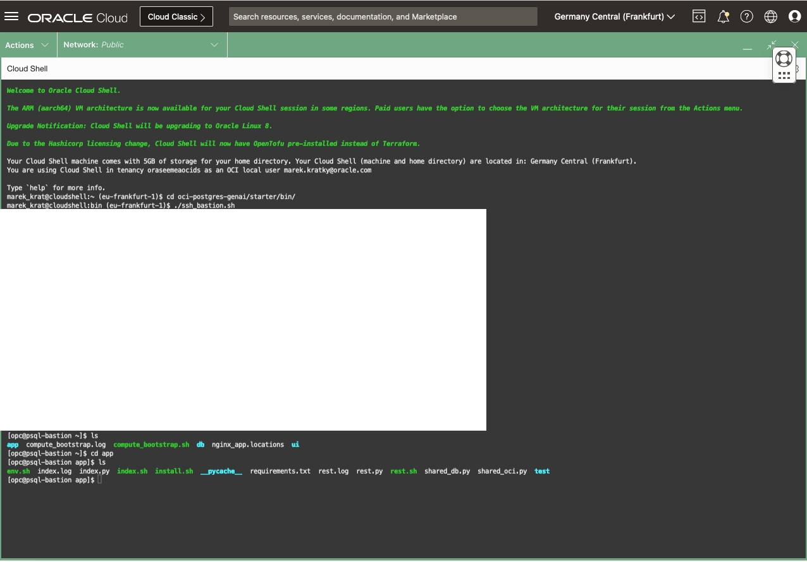

## Task 5: OCI GenAI Service

AI services are a collection of offerings, including generative AI, with prebuilt machine learning models that make it easier for developers to apply AI to applications and business operations. The models can be custom trained for more accurate business results. Teams within an organization can reuse the models, data sets, and data labels across services. The services let developers easily add machine learning to apps without slowing application development.
In this step you will explore the AI Services that are leveraged in the solution. 

   1. Explore the Generative AI Service used in the solution. Common use cases of the Generative AI Service include: Create text for any purpose, Extract data from text, Summarize articles, transcripts, and more. Classify intent in chat logs, support tickets, and more. Rewrite content in a different style or language.    
    1. Go the Cloud console 3-bar/hamburger menu and select the following    
        1. Analytics & AI
        2. AI Services
        3. Select Generative AI

      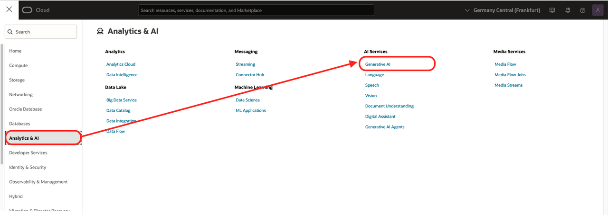
        
        OCI Generative AI offers several playground modes, each with ready-to-use pretrained models:
            Generation: Generates text or extracts information from text
            Summarization: Summarizes text with specified format, length, and tone
            Embedding: Converts text to vector embeddings to use in applications for semantic searches, text classification, or text clustering
         
       
**Congratulations! You have completed this workshop.**

Here's what you accomplished. You explored multiple services in a compartment in your OCI tenancy. These included OCI VCN, Compute, OCI GenerativeAI, and OCI PostgreSQL Databae System. This lab has illustrated how different OCI services can be integrated together to make a complete cloud native AI search solution.

## Acknowledgements
- **Author**
    - Shadab Mohammad, Master Principal Cloud Architect


