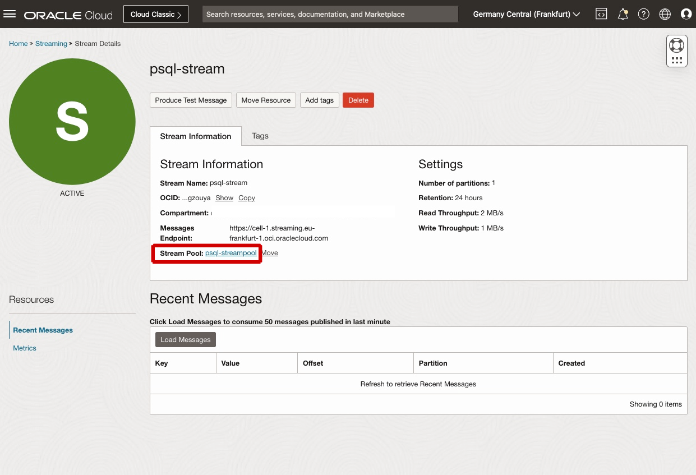
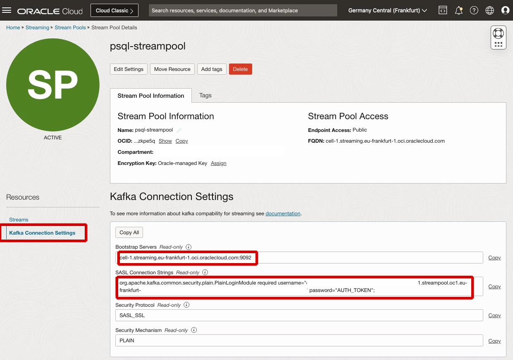
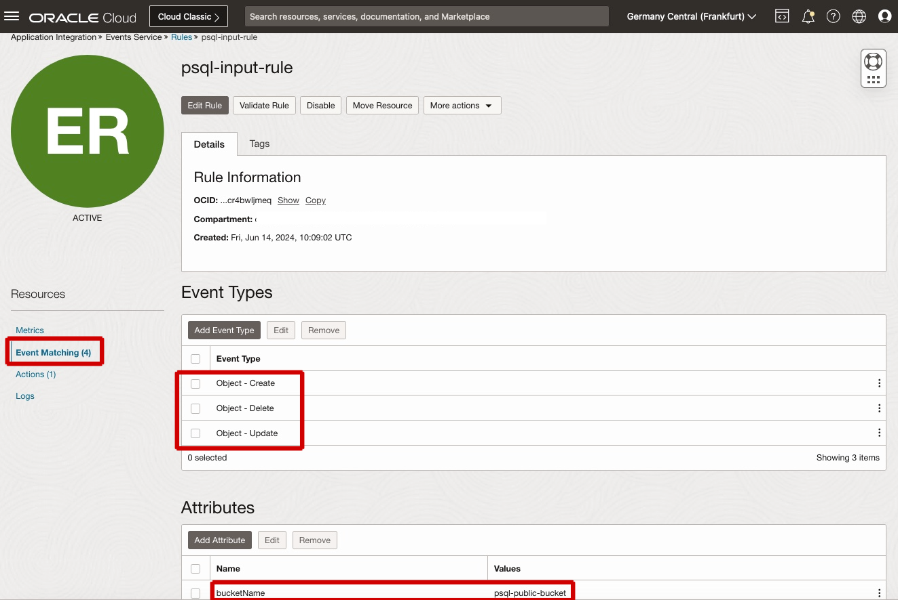
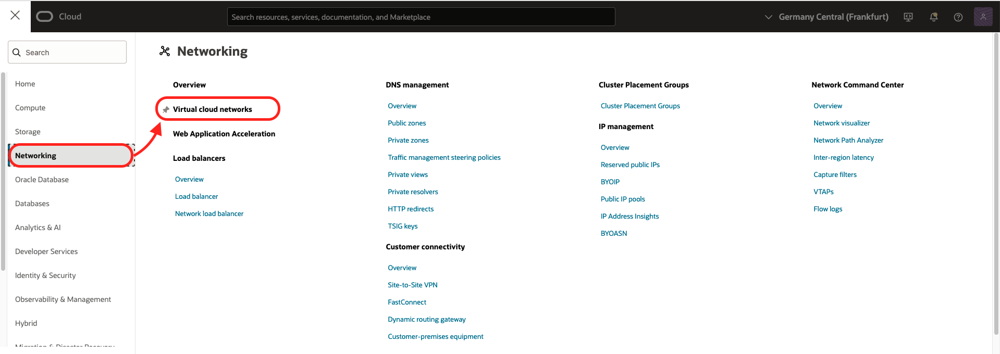
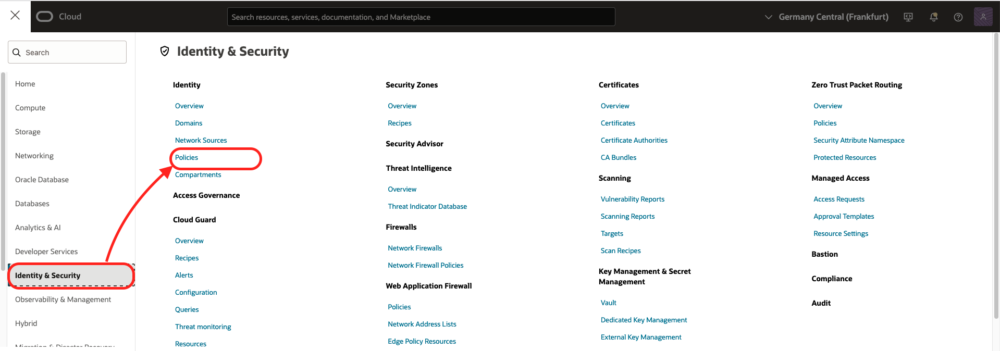
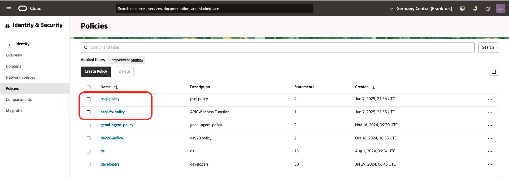

# Discover services that have been created by automation and that comprise the solution

## Introduction
In this optional lab you can explore services that have been created by automation and that comprise the solution such as the AI services and PostgreSQL. 

Estimated time: 20 min

### Objectives

- Discover services that have been created by automation and that comprise the solution

### Prerequisites
- You've completed the previous labs

## Task 1: Compartment

The compartment is used to contains all the components of the lab.
From an architectural viewpoint, a compartment is simply a logical group of OCI resources. There is no specific implication of network structure, geographical placement, or even any relationship between resources. They are merely a set of resources that are associated with a set of group based permissions.

Go the Cloud console 3-bar/hamburger menu and select the following
  1. Identity & Security
  2. Choose Compartment
  3. Click on the compartment name ***oci-starter***
     


## Task 2: Object Storage Bucket

The Object Storage Bucket is be used to contain the documents to index and search.
The Object Storage service is an internet-scale, high-performance storage platform that offers reliable and cost-efficient data durability. The Object Storage service can store an unlimited amount of unstructured data of any content type, including analytic data and rich content, like images and videos.

Go the Cloud console 3-bar/hamburger menu and select the following
  1. Storage
  2. Object Storage / Bucket


  3. Choose the right compartment (oci-starter in this case)
  4. Click on the bucket name *psql-bucket*
  5. In the bucket details page note that this bucket is configured to Emit Object Events. You can create automation based on state changes for your Oracle Cloud Infrastructure resources by using event types, rules, and actions. In the search solution we leverage events to create a new message in the Sreaming service for every document either created, updated or deleted in the bucket.


## Task 3: Stream

The stream is queing the list of files uploaded to Object Storage before processing.

Go the Cloud console 3-bar/hamburger menu and select the following
  1. Analytics / AI
  2. Messaging / Streaming


  3. Check that you are in the right compartment (oci-starter in this case)
  4. Click on the stream name: *psql-stream*
The Oracle Cloud Infrastructure Streaming service provides a fully managed, scalable, and durable solution for ingesting and consuming high-volume data streams in real-time. Streaming can be used for any use case in which data is produced and processed continually and sequentially in a publish-subscribe messaging model. Streaming is used to decouple the components of large systems. Producers and consumers can use Streaming as an asynchronous message bus and act independently and at their own pace.



  
Review the stream details:
  1. Click on Stream Pool: *psql-streampool* 
  2. Go the *Kafka Connection Settings*
  3. Note the Bootstrap Servers: ex: "cell-1.streaming.eu-frankfurt-1.oci.oraclecloud.com:9092" 
  4. Note user name in the SASL Connection Strings ex: "tenancyname/oracleidentitycloudservice/name@domain.com/ocid1.streampool.oc1.eu-frankfurt-1.amaccccccccfsdfsdxfa"
Streaming is compatible with most Kafka APIs, allowing you to use applications written for Kafka to send messages to and receive messages from the Streaming service without having to rewrite your code. 
Streaming can also utilize the Kafka Connect ecosystem to interface directly with external sources like databases, object stores, or any microservice on the Oracle Cloud. Kafka connectors can easily and automatically create, publish to, and deliver topics while taking advantage of the Streaming service's high throughput and durability.



## Task 4: Event Rule

The "Event rule" sends Object Storage events (file upload, ...) to the Stream created above.
Oracle Cloud Infrastructure services emit events, which are structured messages that indicate changes in resources.
Oracle Cloud Infrastructure Events enables you to create automation based on the state changes of resources throughout your tenancy. Use Events to allow your development teams to automatically respond when a resource changes its state.

Go the Cloud console 3-bar/hamburger menu and select the following
  1. Observability & Management
  2. Event Rules


  3. Check that you are in the right compartment (oci-starter in this case)
  4. Click on the rule name *psql-input-rule*
  5. Cick on Event Matching.
     Rules include a filter you define to specify events produced by the resources 
  7. Notice Event Types: *Object - Create, Object - Delete, Object - Update*
  8. Notice Attributes: Name: *bucketName*, value: *psql-bucket* 
  9. Click on Actions
     Rules must  specify an action to trigger when the filter finds a matching event. Actions are responses you define for event matches. The resources for these services act as destinations for matching events. When the filter in the rule finds a match, the Events service delivers the matching event to one or more of the destinations you identified in the rule. The destination service that receives the event then processes the event in whatever manner you defined. This delivery provides the automation in your environment.
  10. Notice Action Type: *Streaming*, Stream=psql-stream



## Task 5: Virtual Cloud Network

The Virtual Cloud Network allows you to manage the network of the components.
A virtual cloud network (VCN) is a virtual, private network that closely resembles a traditional network, with firewall rules and specific types of communication gateways that you can choose. A VCN resides in a single OCI region and covers one or more CIDR blocks (IPv4 and IPv6, if enabled). Each subnet consists of a contiguous range of IP addresses (for IPv4 and IPv6, if enabled) that do not overlap with other subnets in the VCN.

Go the Cloud console 3-bar/hamburger menu and select the following
  1. Networking
  2. Virtual Cloud Network



  3. Check that you are in the right compartment (oci-starter in this case)
  4. Click on vcn name *psql-vcn*
  5. Notice two subnets: psql-priv-subnet Private (Regional) and psql-pub-subnet Public (Regional). 
You can designate a subnet as either public or private when you create it. Private means VNICs in the subnet can't have public IPv4 addresses and internet communication with IPv6 endpoints will be prohibited. Public means VNICs in the subnet can have public IPv4 addresses and internet communication is permitted with IPv6 endpoints.

  6. Choose *Security Lists*
  7. Then click on *psql-security-list*


  8. Notice Ingress Rules that were created for this lab
     1. Source CIDR: *0.0.0.0/0*, Destination Port: *80* /required for accessing search user interface from Internet
     2. Source CIDR: *0.0.0.0/16*, Destination Port: *5432* /required for accessing PostgreSQL from a compute instance in the same VCN

## Task 6: Dynamic group

Two Dynamic Groups allow us to give rights to the compute instande and the function (explored later) to read documents on the Object Storage.
Dynamic groups allow you to group Oracle Cloud Infrastructure compute instances and service instances as "principal" actors (similar to user groups). You can then create policies to permit compute or service instances to make API calls against Oracle Cloud Infrastructure services. 

Go the Cloud console 3-bar/hamburger menu and select the following
  1. Identity & Security 
  2. Domains
  3. Click on Default domain. Note that you might need to change the compartment to root compartment in order to see the Default domain
  4. Dynamic Groups
  6. Notice the two dynamic groups in Default Domain:  *psql-fn-dyngroup* and *psql-bastion-dyngroup*  


When you create a dynamic group, rather than adding members explicitly to the group, you instead define a set of matching rules to define the group members. For example, a rule could specify that all instances in a particular compartment are members of the dynamic group. The members can change dynamically as instances are launched and terminated in that compartment.

  6. Click on the dynamic group name: psql-bastion-dyngroup
  7. Notice Matching rules: e.g. instance.id = 'ocid1.instance.oc1.aaaabbbbbbcccccc'
  8. Go back to the list of dynamic groups in Default Domain
  9. Click on the dynamic group name: *psql-fn-dyngroup*
  10. Notice Matching rules: Match all rules defined below
    Rule 1: resource.type = 'fnfunc'
    Rule 2: e.g. resource.compartment.id = 'ocid1.compartment.oc1..aaaaaaaanmnkccccc'


## Task 7: Policies

The policies will give the rights to the components to access other Oracle Cloud Infrastructure services, e.g. to read documents on the Object Storage
Access is granted at the group and compartment level, which means you can write a policy that gives a group a specific type of access within a specific compartment, or to the tenancy itself. 

Go the Cloud console 3-bar/hamburger menu and select the following
  1. Identity & Security
  2. Policies



  3. Check that you are in the right compartment (oci-starter in this case)
  4. Notice two Policies in oci-starter Compartment: *psql-policy* and *psql-fn-policy*
  5. Click on the policy name *psql-policy*
  6. Notice the following policy statements:
Allow dynamic-group psql-fn-dyngroup to manage objects in compartment id ocid1.compartment.oc1..aaaaaaaanmnkccccc
Allow dynamic-group psql-bastion-dyngroup to manage all-resources in compartment id ocid1.compartment.oc1..aaaaaaaanmnkccccc
Allow dynamic-group psql-bastion-dyngroup to manage stream-family in ocid1.compartment.oc1..aaaaaaaanmnkccccc

  7. Go back to the list of policies in oci-starter Compartment
  8. Click on the policy name *psql-fn-policy*
  6. Notice the following policy statement:
ALLOW any-user to use functions-family in compartment id ocid1.compartment.oc1..aaaaaaaanmnkccccc where ALL {request.principal.type= 'ApiGateway'}



## Task 8: PostgreSQL Database System

The PostgreSQL Database System allow to store extracted text from documents including their corresponding vector embeddings and perform semantic search.
OCI Database with PostgreSQL is a fully managed PostgreSQL-compatible service with intelligent sizing, tuning, and high durability.

Go the Cloud console 3-bar/hamburger menu and select the following
  1. Database
  2. PostreSQL - DB Systems


  3. Check that you are in the right compartment (oci-starter in this case)
  4. Click on the PostgreSQL db system name *psqlpsql*
  5. Notice the General information:  
  Performance tier: 75K IOPS
  Shape: VM.Standard.E4.Flex
  OCPU count: 2
  RAM(GB): 32

  6. Notice Network configuration
  7. Notice Connection details
  8. Notice Database system nodes
A Database system is PostgreSQL database cluster running on one or more OCI VM Compute instances. A database system provides an interface enabling the management of tasks such as provisioning, backup and restore, monitoring, and so on. Each database system has one endpoint for read/write PSQL queries and can have multiple endpoints for read-only queries.

## Task 9: Functions Application

The function takes a binary file as input (Word, PDF, ...), parse it and give his content in text back.
Oracle Cloud Infrastructure Functions is a fully managed Functions-as-a-Service platform. The serverless and elastic architecture of OCI Functions means there's no infrastructure administration or software administration for you to perform. You don't provision or maintain compute instances, and operating system software patches and upgrades are applied automatically. OCI Functions simply ensures your app is highly-available, scalable, secure, and monitored. With OCI Functions, you can write code in Java, Python, Node, Go, Ruby, and C# (and for advanced use cases, bring your own Dockerfile, and Graal VM). You can then deploy your code, call it directly or trigger it in response to events, and get billed only for the resources consumed during the execution.

Go the Cloud console 3-bar/hamburger menu and select the following
  1. Developer Services
  2. Functions / Application


  3. Check that you are in the right compartment (oci-starter in this case)
  4. Notice Applications in oci-starter compartment
  5. Click on the application name: *psql-fn-application*
  6. Notice Functions
  Name: psql-fn-function, Image: e.g. fra.ocir.io/fr9qm01oq44x/tikaparser:0.0.66


## Task 10: Compute Instance

Compute instance is used to host the application logic.

   1. Explore the Compute instance details    
    1. Go the Cloud console 3-bar/hamburger menu and select the following    
        1. Compute
        1. Instances
  
    1. Check that you are in the intended compartment. (*oci-starter* was the recommended compartment name.)

    1. Click **psql-bastion** in the Compute instances list

    1. Review the information on the Compute instance details page 


  1. Connect to the instance
    1. In the OCI Console, select the Developer Tools icon and then select Cloud Shell.
    2. In OCI Console Cloud Shell, run the following commands: 
    ```
    <copy>
      cd oci-postgres-genai/starter/bin/
      ./ssh_bastion.sh 
    </copy>
    ```
    3. When succesfully connected to the bastion instance you should see the following prompt:
     ```
    <copy>
     [opc@psql-bastion ~]$ 
    </copy>
    ```
    4. Explore the application code in the opc user home direcotory

## Task 11: AI Services

AI services are a collection of offerings, including generative AI, with prebuilt machine learning models that make it easier for developers to apply AI to applications and business operations. The models can be custom trained for more accurate business results. Teams within an organization can reuse the models, data sets, and data labels across services. The services let developers easily add machine learning to apps without slowing application development.
In this step you will explore the AI Services that are leveraged in the solution. 

   1. Explore the Generative AI Service used in the solution. Common use cases of the Generative AI Service include: Create text for any purpose, Extract data from text, Summarize articles, transcripts, and more. Classify intent in chat logs, support tickets, and more. Rewrite content in a different style or language.    
    1. Go the Cloud console 3-bar/hamburger menu and select the following    
        1. Analytics & AI
        1. AI Services
        2. Select Generative AI
OCI Generative AI offers several playground modes, each with ready-to-use pretrained models:
    Generation: Generates text or extracts information from text
    Summarization: Summarizes text with specified format, length, and tone
    Embedding: Converts text to vector embeddings to use in applications for semantic searches, text classification, or text clustering
        3. Use the generation, summarization, and embedding playgrounds to try the pretrained models: input text, adjust the parameters, and repeat until you get the desired results.

1. Explore the Vision AI Service used in the solution. Common use cases of the Vision AI Service include: Image Classification, Object Detaction, Text Detection
    1. Go the Cloud console 3-bar/hamburger menu and select the following    
        1. Analytics & AI
        1. AI Services
        2. Select Vision
        3. Click on Image classification.  
        4. Review the results of the image classification examples. (Assigns classes and confidence scores based on the scene and contents of an image)      
        5. Click on Object Detection
        6. Review the results of the object detection examples. (Identifies objects and their location within an image along with a confidence score)

 1. Explore the Document Understanding AI Service used in the solution. Common use cases of the Document Understanding AI Service include: Text extraction, Table Extraction, Key value extraction and Document classification
    1. Go the Cloud console 3-bar/hamburger menu and select the following    
        1. Analytics & AI
        1. AI Services
        2. Select Document Understanding
        3. Click on Text extraction.  
        4. Review the results of the text exctraction examples. (Detect and recognize text in a document)      


       
**Congratulations! You have completed this workshop.**

Here's what you accomplished. You provisioned multiple services into a compartment in your OCI tenancy. These included Oracle Integration Cloud (OIC), several AI services (such as OCI Document Understanding and OCI Language), and Oracle Search with OpenSearch. You imported a project into OIC that ingests document files from Object Storage, sends them to AI services based on the file type, and then loads extracted data into an OpenSearch index. You configured all of the service connections used by that OIC project and then you ran the integration project. Finally, you imported an application project into Visual Builder, you configured the connection to OpenSearch, and then you ran the project to display a search user interface. You used that search tool to query the content added to the OpenSearch index. This workshop has illustrated how different OCI services can be integrated together to use AI to make many types of content more searchable.

## Acknowledgements
- **Author**
    - Marc Gueury, Generative AI Speciialist
    - Marek Krátký, Cloud Storage Specialist 

