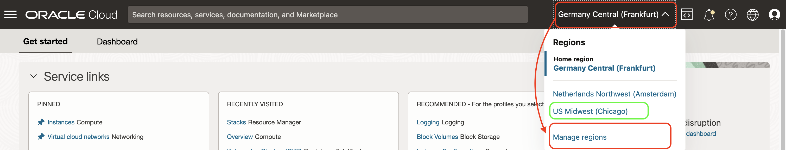
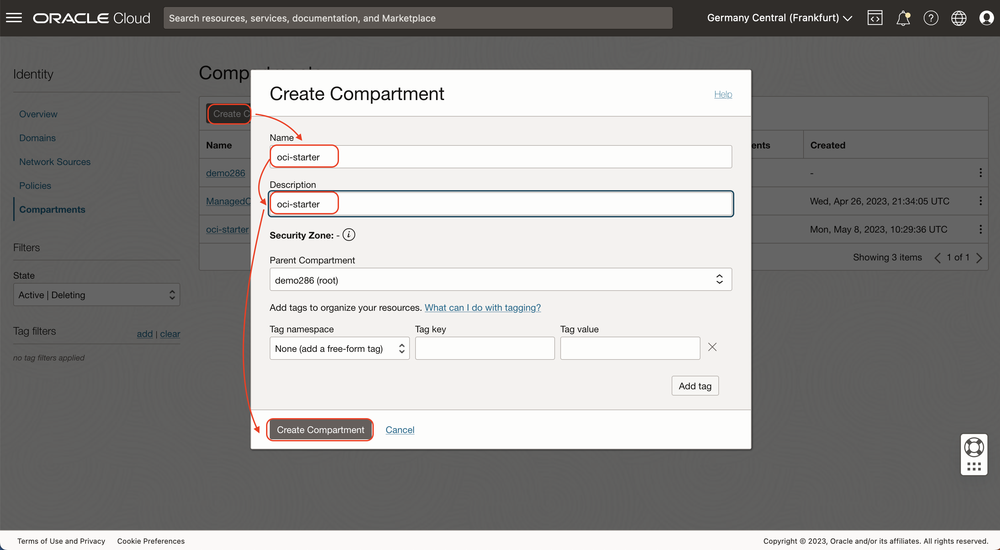
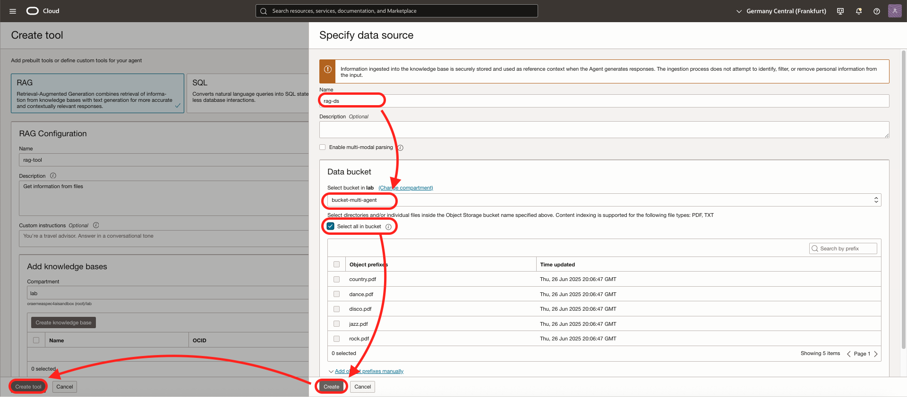
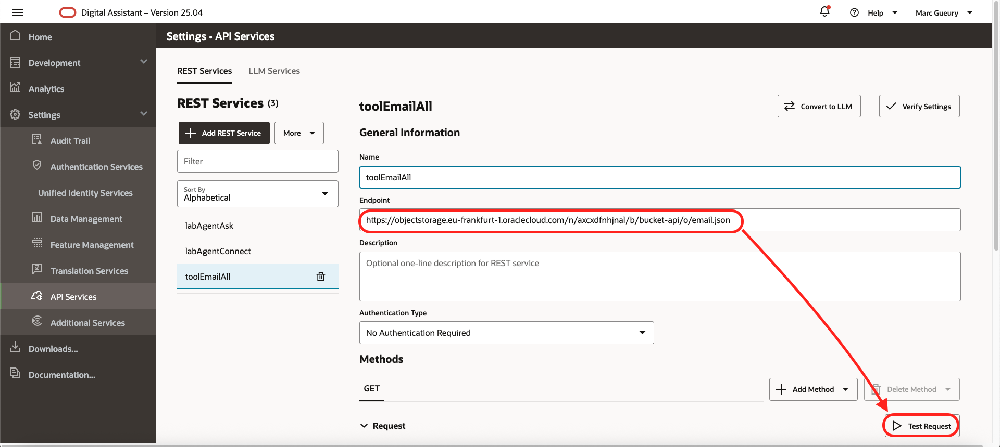

# Install the Components

## Introduction
In this lab, you will install all the components needed for this workshop. It will be provisioned automatically using a provided Terraform script.

Estimated time: 45 min

### Objectives

- Provision all the cloud components

### Prerequisites

1. Open a text editor and copy & paste this text into a text file on your local computer. These will be the variables that will be used during the lab.
    ```
    <copy>
    List of ##VARIABLES##
    =====================
    ##ODA_OCID##=ocid1.odainstance.oc1.eu-frankfurt-1.xxxxxxx
    ##COMPARTMENT_OCID##=ocid1.compartment.oc1..xxxxxxx
    ##AGENT_ENDPOINT_OCID##=ocid1.genaiagentendpoint.oc1..xxxxxxx
    ##BUCKET_URL##=https://objectstorage.eu-frankfurt-1.oraclecloud.com/n/xxxxxx/b/bucket-api/o/
    </copy>
    ```
2. Download the sample files. Here: (https://github.com/mgueury/oda-multi-agent/archive/refs/heads/main.zip)[https://github.com/mgueury/tools/archive/refs/heads/main.zip]
3. An OCI Account with sufficient credits where you will perform the lab. (Some of the services used in this lab are not part of the *Always Free* program.)
4. Check that your tenancy has access to the **Frankfurt, London or Chicago Region**
    - For Paid Tenancy
        - Click on region on top of the screen
        - Check that the Frankfurt, London, Chicago Region is there
        - If not, Click on Manage Regions to add it to your regions list. You need Tenancy Admin right for this.
        - For ex, click on the US MidWest (Chicago)
        - Click Subscribe

    

    - For Free Trial, the HOME region should be Frankfurt, London or Chicago.

## Task 1: Create a Compartment

The compartment will be used to contain all the components of the lab. You can use an existing one too.

You can
- Use an existing compartment to run the lab 
- Or create a new one (recommended)

1. Login to your OCI account/tenancy
2. Go the 3-bar/hamburger menu of the console and select
    1. Identity & Security
    1. Compartments
    
2. Click ***Create Compartment***
    - Give a name: ex: ***multi-agent***
    - Then again: ***Create Compartment***
    
4. When the compartment is created copy the compartment ocid ##COMPARTMENT\_OCID## and put it in your notes

## Task 2: Create an Oracle Digital Assistant.

If you do not have an  Oracle Digital Assistant (ODA) installation yet, create one.

**ODA**
- Go to the OCI Console menu, and choose *Analytics & AI* / *Digital Assistant*
    
- Click *Create digital assistant instance*
    - Name *oda-multi-agent*
    - Choose the *shape*, ex: *Development*
    - Click *Create*
    
- Click on the name of the ODA instance
    - Copy the OCID. Ex: ocid1.odainstance.oc1.eu-frankfurt-1.xxxxxxx
    - Take note of it ##ODA\_OCID##

Don't wait that it gets created, go to the next step.

## Task 3: Create a OCI RAG Agent

We will need to create several items in the OCI Console.

**Bucket**
- Go to the OCI Console menu, and choose *Storage* / *Bucket*
    
- Click *Create Bucket*
    - Name *bucket-multi-agent*
    - Click *Create*
    
- Open the created bucket
- Click *Upload*
    - Upload the files from the downloaded directory above 
    - Click Upload
    - Click Close
    

**Generative AI Agent**
- Go to the OCI Console menu, and choose *Analytics & AI* / *Generative AI Agent*
    
- On the left, go to *Agents*
- Click *Create*
- In the *Basic Information* tab, enter
    - Name: *rag-agent*
    - Description: *Get info from files*
    - Click *Next*
    
- In the *Add tool* tab, 
    - Click *Create tool*
    - Choose *RAG*
    - Name: *rag-tool*
    - Description: *Get Information from files*
    - Click *Create Knowledge Base*
    - Name: *rag-kb*
    - Click *Specify Datasource*
    
    - Name: *rag-ds*
    - Select the bucket created above *bucket-multi-agent*
    - Check *Select all in bucket*
    - Click *Create*
    - Back in the knowledge base, click *Create* again
    - Click *Create tool*
    - Click *Next*
    
- In tab *Setup agent endpoint*    
    - Click *Next*
- In tab *Setup agent endpoint*    
    - Click *Next*
- In tab *Review and create*
    - Click *Create Agent*
- Click on the name of the Gen AI Agent. 
- Below, click the name of the Agent Endpoint that was created.
    - Copy the OCID. Ex: ocid1.genaiagentendpoint.oc1.eu-frankfurt-1.xxxxxxx
    - Take note of it ##AGENT\_ENDPOINT\_OCID##
    - Notice you need the AGENT ENDPOINT OCID and not the AGENT OCID. 

    

## Task 4: Create fake APIs

We will need to create several items in the OCI Console.

**Bucket**
- Go to the OCI Console menu, and choose *Storage* / *Bucket*
    
- Click *Create Bucket*
    - Name *bucket-api*
    - Click *Create*
    
- Open the created bucket
- Click *Edit Visibility*
    - Choose *Public*
    - Click *Save Changes*    
    
- Click *Upload*
    - Upload the files from the downloaded directory above 
    - Click Upload
    - Click Close
- After uploading, at the end of the line with the email.json, click on the 3 dots *...*, Choose *View Object Details*
- Copy the path, remove the email.json at the end. Ex: https://objectstorage.eu-frankfurt-1.oraclecloud.com/n/xxxxxx/b/bucket-api/o/
- Take not of it ##BUCKET\_URL##

    

## Task 5: Create a Policy
- Go to the OCI Console menu, and choose *Identity & Security* / *Policies*
    
- Click *Create Policy*
- Name: *policy-multi-agent*
- Description: *policy-multi-agent*
- Click *Show Manual editor*
- Copy this with your value of ##COMPARTMENT\_OCID## and ##ODA\_ID##
    ```
    allow any-user to manage genai-agent-family in compartment id ocid1.compartment.oc1..xxxxxxx where request.principal.id='ocid1.oda-instance.oc1..xxxxxxx'
    allow any-user to manage generative-ai-family in compartment id ocid1.compartment.oc1..xxxxxxx where request.principal.id='ocid1.oda-instance.oc1..xxxxxxx'
    ```
- Click *Create*
    

## Task 6: Import the APIs in ODA

- Go to the OCI Console menu, and choose *Analytics & AI* / *Digital Assistant*
- Choose *oda-multi-agent* that you created before
- Click *Service Console*
- You will maybe need to login again
- You should arrive to the home page of Digital Assistant. 
  There is a known issue that can lead to a blank page. If you have this, in the open the *more tools*/*Developer Console*. And reload the page (CTRL+R)

Remark about regions:
- All the API here refers to eu-frankfurt-1. 
- If you want to use it without changing the URLS, your tenancy need to have access to Frankfurt. You can ask your admin to subscribe the region.
- If not, all URL needs containing eu-frankfurt-1 needs to be replaced by your AI region of choice ex: us-chicago-1

**Import LLM Service**
- Open the hamburger menu
- Choose *Settings* / *API Services*
- Go to tab *LLM Services*
- Click *Import LLM Services*
    
- Choose the *LLMService-mgLlama.yaml*
- In the body, change to compartment_ocid to the one of your notes ##COMPARTMENT\_OCID##
- Click *Test Service*
    
- The API should answer to the joke question 

**Import REST Services - labAgentConnect**
- Open the hamburger menu
- Choose *Settings* / *API Services*
- Go to tab *REST Services*
- Click *Import REST Services*
- Import the file: *RESTService.yaml*
- In the parameters, change the agentEndpointId to the one of your notes ##AGENT\_ENDPOINT\_OCID##
- Click the *Save* icon
- Click *Test Service*
    
- The API should answer to the session_id 

**Import REST Services - labAgentAsk**
- Go to Rest Service *labAgentAsk*
- In the parameters, change the agentEndpointId to the one of your notes ##BU\_ENDPOINT\_OCID##
- Click the *Save* icon

**Import REST Services - toolEmailAll**
- Go to Rest Service *toolEmailAll*
- Change the URL to the one of your notes ##BUCKET\_URL##
- Click *Test Service*
- The API should answer to the json file that we uploaded before 
    

**Import REST Services - toolEmailOne**
- Go to Rest Service *toolEmailOne*
- Change the URL to the one of your notes ##BUCKET\_URL##
    - Take care to keep the format with the parameter email_id.
    - Ex: https://objectstorage.eu-frankfurt-1.oraclecloud.com/n/xxxxxxx/b/bucket-api/o/email_{email_id}.json
- Click *Test Service*
- The API should answer to the json file of one email uploaded before 
    

**Import REST Services - toolHrPolicy**
- Go to Rest Service *toolHrPolicy*
- Change the URL to the one of your notes ##BUCKET\_URL##
    - Take care to keep the format.
    - Ex: https://objectstorage.eu-frankfurt-1.oraclecloud.com/n/xxxxxxx/b/bucket-api/o/hr_policy_joe_doe.txt
- Click *Test Service*
- The API should answer to the text file of hr_policy uploaded before 
    

**Import REST Services - toolWeather**
- Go to Rest Service *toolWeather*
- Change the URL to the one of your notes ##BUCKET\_URL##
    - Take care to keep the format with the parameter email_id.
    - Ex: https://objectstorage.eu-frankfurt-1.oraclecloud.com/n/xxxxxxx/b/bucket-api/o/weather_{city}.json
- Click *Test Service*
- The API should answer to the json file of one email uploaded before 
        

## Task 7: Import the Samples in ODA

**Import ODA Skills**
- Open the hamburger menu
- Choose *Development* / *Skills*
- Click *Import Kill*
- Choose the file *mgLlmAgent(1.0).zip*
- Click *Open*

        

Redo the same import for all the other zip files.
- *mgLlmHistory(1.0).zip*
- *mgLlmRouter(1.0).zip*
- *mgLlmReflection(1.0).zip*
- *mgLlmSupervisor(1.0).zip*

**Agent Endpoint OCID**
- Open the *mgLlmRouter* skill, 
- Go to *Settings icon*
- Go to tab *Configuration*

     

- Scroll down
- Edit the agent endpoint id and replace by the value of your notes ##AGENT\_ENDPOINT\_OCID##

        


## Task 8: (Optional) Install Custom Components in Compute

The goal of this step it to improve the startup time of the custom component that is used
to translate the LLM Block request to a real LLM API request. By default, it takes some seconds to wake up.
To avoid this, the custom component can be installed on a compute. This is not explained in this lab in details.

But the code to do this is here: 

https://github.com/mgueury/tools

It has 2 sample custom components: Cohere and Meta LLama.

**You may now proceed to the [next lab](#next)**

## Known issues

## Acknowledgements

- **Author**
    - Marc Gueury, Oracle Generative AI Platform
