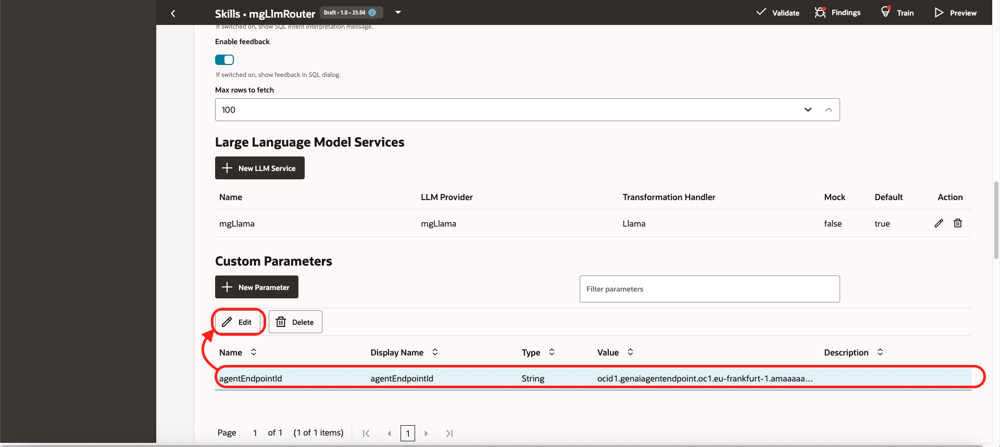

# Install the Components

## Introduction
In this lab, you will install all the components needed for this workshop. 

Estimated time: 60 min

### Objectives

- Provision all the cloud components

### Prerequisites

1. Open a text editor and copy & paste this text into a text file on your local computer. These will be the variables that will be used during the lab.
    ```
    <copy>
    List of ##VARIABLES##
    =====================
    ##ODA_OCID##=ocid1.odainstance.oc1.eu-frankfurt-1.xxxxxxx
    ##COMPARTMENT_OCID##=ocid1.compartment.oc1..xxxxxxx
    ##AGENT_ENDPOINT_OCID##=ocid1.genaiagentendpoint.oc1..xxxxxxx
    ##BUCKET_URL##=https://objectstorage.eu-frankfurt-1.oraclecloud.com/n/xxxxxx/b/bucket-api/o/
    </copy>
    ```
2. Download the sample files. Here: [https://github.com/mgueury/oda-multi-agent/archive/refs/heads/main.zip](https://github.com/mgueury/tools/archive/refs/heads/main.zip)
3. An OCI Account with sufficient credits where you will perform the lab. (Some of the services used in this lab are not part of the *Always Free* program.)

## Task 1: Create a Compartment

The compartment will be used to contain all the components of the lab. 

You can
- Use an existing compartment to run the lab 
- Or create a new one (recommended)

1. Login to your OCI account/tenancy
2. Go the 3-bar/hamburger menu of the console and select
    1. Identity & Security
    1. Compartments
    
2. Click ***Create Compartment***
    - Give a name: ex: ***oda-multi-agent***
    - Then again: ***Create Compartment***
    
4. When the compartment is created copy the compartment ocid ##COMPARTMENT\_OCID## and put it in your notes

## Task 2: Create an Oracle Digital Assistant.

Oracle Digital Assistant (ODA) is the main tool that we use in this lab.
If you do not have an Oracle Digital Assistant (ODA) installation yet, create one. You can use an existing one.

**ODA**
- Go to the OCI Console menu, and choose *Analytics & AI* / *Digital Assistant*
    
- Click *Create digital assistant instance*
    - Name *oda-multi-agent*
    - Choose the *shape*, ex: *Development*
    - Click *Create*
    
- Click on the name of the ODA instance
    - Copy the OCID. Ex: ocid1.odainstance.oc1.eu-frankfurt-1.xxxxxxx
    - Take note of it in your text editor ##ODA\_OCID##

Don't wait that it gets created, go to the next step.

## Task 3: Create an OCI Generative AI Agent with a RAG tool

Let's create a Agent with RAG to search inside your PDF files.
We will need to create several items in the OCI Console.

**Bucket**
- Go to the OCI Console menu, and choose *Storage* / *Bucket*
    
- Click *Create Bucket*
    - Name *bucket-multi-agent*
    - Click *Create*
    
- Open the created bucket
- Click *Upload*
    - Upload *sample_files* from the downloaded directory (See prerequisites) 
    - Click Upload
    - Click Close
    

**Generative AI Agent**
- Go to the OCI Console menu, and choose *Analytics & AI* / *Generative AI Agent*
    
- On the left, go to *Agents*
- Click *Create*
- In the *Basic Information* tab, enter the following values:
    - Name: *rag-agent*
    - Description: *Get info from files*
    - Click *Next*
    
- In the *Add tool* tab, 
    - Click *Create tool*
    - Choose *RAG*
    - Name: *rag-tool*
    - Description: *Get Information from files*
    - Click *Create Knowledge Base*
    - Name: *rag-kb*
    - Click *Specify Datasource*
    
    - Name: *rag-ds*
    - Select the bucket created above *bucket-multi-agent*
    - Check *Select all in bucket*
    - Click *Create*
    - Back in the knowledge base, click *Create* again
    - Click *Create tool*
    - Click *Next*
    
- In tab *Setup agent endpoint*    
    - Click *Next*
- In tab *Setup agent endpoint*    
    - Click *Next*
- In tab *Review and create*
    - Click *Create Agent*
- Click on the name of the Gen AI Agent. 
- Below, click the name of the Agent Endpoint that was created.
    - Copy the OCID. Ex: ocid1.genaiagentendpoint.oc1.eu-frankfurt-1.xxxxxxx
    - Take note of it ##AGENT\_ENDPOINT\_OCID##
    - Notice you need to copy the **AGENT ENDPOINT OCID** and not the AGENT OCID. 

    

## Task 4: Create fake APIs

In Digital Assistant, we will use the REST APIs for a lot of tool. To make the installation easier, instead of implementing real REST APIs in Java, Python, or NodeJS, we will fake REST APIs by storing static JSON files in an Object Storage Bucket.

**Bucket**
- Go to the OCI Console menu, and choose *Storage* / *Bucket*
    
- Click *Create Bucket*
    - Name *bucket-api*
    - Click *Create*
    
- Open the created bucket
- Click *Edit Visibility*
    - Choose *Public*
    - Click *Save Changes*    
    
- Click *Upload*
    - Upload the files from the downloaded directory above 
    - Click Upload
    - Click Close
- After uploading, at the end of the line with the email.json, click on the 3 dots *...*, Choose *View Object Details*
- Copy the path, remove the email.json at the end. Ex: https://objectstorage.eu-frankfurt-1.oraclecloud.com/n/xxxxxx/b/bucket-api/o/
- Take not of it ##BUCKET\_URL##

    

## Task 5: Create a Policy

Digital Assistant will call the OCI APIs of Generative AI. For this, it needs an authorization that we will give using Policies.

- Go to the OCI Console menu, and choose *Identity & Security* / *Policies*
    
- Click *Create Policy*
- Name: *policy-multi-agent*
- Description: *policy-multi-agent*
- Click *Show Manual editor*
- Copy this with your value of ##COMPARTMENT\_OCID## and ##ODA\_ID##
    ```
    allow any-user to manage genai-agent-family in compartment id ocid1.compartment.oc1..xxxxxxx where request.principal.id='ocid1.oda-instance.oc1..xxxxxxx'
    allow any-user to manage generative-ai-family in compartment id ocid1.compartment.oc1..xxxxxxx where request.principal.id='ocid1.oda-instance.oc1..xxxxxxx'
    ```
- Click *Create*
    

## Task 6: Import the APIs in ODA

Let's import all the APIs definition in ODA. We will test them in the next lab.

- Go to the OCI Console menu, and choose *Analytics & AI* / *Digital Assistant*
- Choose *oda-multi-agent* that you created before
- Click *Service Console*
- You will maybe need to login again
- You should arrive to the home page of Digital Assistant. 
  There is a known issue that can lead to a blank page. If you have this, in the open the *more tools*/*Developer Console*. And reload the page (CTRL+R)

Remark about regions:
- All the configuration here refers to eu-frankfurt-1. 
- If you want to use this lab without changing the URLS, your tenancy need to have access to Frankfurt. You can ask your admin to subscribe the region.
- If not, all URL needs containing eu-frankfurt-1 needs to be replaced by your AI region of choice ex: us-chicago-1
- You can find the list of regions and their abbreviations [here](https://docs.oracle.com/en-us/iaas/Content/General/Concepts/regions.htm).

**Import LLM Service**
- Open ODA hamburger menu
- Choose *Settings* / *API Services*
- Go to tab *LLM Services*
- Click *Import LLM Services*
    
- Choose the *LLMService-mgLlama.yaml*
- In the body, change to compartment_ocid to the one of your notes ##COMPARTMENT\_OCID##
- Click *Test Service*
    
- The API should answer successfully.

**Import REST Services**
- Open the hamburger menu
- Choose *Settings* / *API Services*
- Go to tab *REST Services*
- Click *Import REST Services*
- Import the file: *RESTService.yaml*

**Configure REST Services - labAgentConnect**
- Go to Rest Service *labAgentConnect*
- In the parameters, change the agentEndpointId to the one of your notes ##AGENT\_ENDPOINT\_OCID##
- Click the *Save* icon
- Click *Test Service*
    
- The API should answer to the session_id 

**Configure REST Services - labAgentAsk**
- Go to Rest Service *labAgentAsk*
- In the parameters, change the agentEndpointId to the one of your notes ##AGENT\_ENDPOINT\_OCID##
- Click the *Save* icon

**Configure REST Services - toolEmailAll**
- Go to Rest Service *toolEmailAll*
- Change the URL to the one of your notes ##BUCKET\_URL##
- Click *Test Service*
- The API should answer to the json file that we uploaded before 
    

**Configure REST Services - toolEmailOne**
- Go to Rest Service *toolEmailOne*
- Change the URL to the one of your notes ##BUCKET\_URL##
    - Take care to keep the format with the parameter email_id.
    - Ex: https://objectstorage.eu-frankfurt-1.oraclecloud.com/n/xxxxxxx/b/bucket-api/o/email_{email_id}.json
- Click *Test Service*
- The API should answer to the json file of one email uploaded before 
    

**Configure REST Services - toolHrPolicy**
- Go to Rest Service *toolHrPolicy*
- Change the URL to the one of your notes ##BUCKET\_URL##
    - Take care to keep the format.
    - Ex: https://objectstorage.eu-frankfurt-1.oraclecloud.com/n/xxxxxxx/b/bucket-api/o/hr_policy_joe_doe.txt
- Click *Test Service*
- The API should answer to the text file of hr_policy uploaded before 
    

**Import REST Services - toolWeather**
- Go to Rest Service *toolWeather*
- Change the URL to the one of your notes ##BUCKET\_URL##
    - Take care to keep the format with the parameter city.
    - Ex: https://objectstorage.eu-frankfurt-1.oraclecloud.com/n/xxxxxxx/b/bucket-api/o/weather_{city}.json
- Click *Test Service*
- The API should answer to the json file of one email uploaded before 
        

## Task 7: Import the Skills in ODA

Let's import all the ODA Skills. We will test them in the next lab.

**Import ODA Skills**
- Open the hamburger menu
- Choose *Development* / *Skills*
- Click *Import Kill*
- Choose the file *mgLlmAgent(1.0).zip*
- Click *Open*

        

Redo the same import for all the other zip files.
- *mgLlmHistory(1.0).zip*
- *mgLlmRouter(1.0).zip*
- *mgLlmReflection(1.0).zip*
- *mgLlmSupervisor(1.0).zip*

**Agent Endpoint OCID**
- Open the *mgLlmRouter* skill, 
- Go to *Settings icon*
- Go to tab *Configuration*

     

- Scroll down
- Edit the agent endpoint id and replace by the value of your notes ##AGENT\_ENDPOINT\_OCID##

        

- Redo the same for *mgLlmSupervisor* skill


## Task 8: (Optional) Install LLM Transformation Handler in Compute

This is really optional. Mostly read it and potentially do it after completing the lab, as a bonus.

When using the sample of the next lab, you will notice that the first response of the bot takes 10+ seconds to come.
The reason is that each LLM call from ODA is first using a LLM Transformation Handler. 
The goal of that Transformation Handler is to convert your question in a LLM API format (Cohere, Llama, any LLM, ...).

In the sample that you have imported, the Transformation Handler is inside a custom components running in ODA. 
Since the first call takes 10+ seconds to wake it up, the goal of this step it to remove this startup time by using a Virtual machine where the custom component is always running.

This lab does not explained it in details.
But the code to do this is here: 

https://github.com/mgueury/tools

When installed, it will create 2 custom components: Cohere and Meta LLama.

You will have also an URL like this:
- http://your-compute-ip:3000/components
- Check that the URL answer in your browser with some JSON payload.

To use it inside a skill (ex mgLlmAgent), please do this:
- Open the Skill of *mgLlmAgent*
- On the left bar, click on the icon *Custom Components*
- Click *Add Service*
- Fill these details
    - Name: *LlamaVM*
    - Service Type: *External*
    - Metadata URL: *http://your-compute-ip:3000/components*
    - User Name: *dummy*
    - Password: *dummy*
    - Click *Create*
       
- On the left bar, click on the icon *Settings*
- Go to the tab *Configuration* and scroll down.
       
- Add a LLM Service
    - Click *New LLM Service*
    - Name: *mgLlamaVM*
    - LLM Provider: *mgLlama*
    - Transformation Handler: *LlamaVM* / *Llama* (or *Cohere*)
    - Default: *True*
    - Click *Save*
       

That is it. The chat should answer now faster mostly after some period where it was not used.

**You may now proceed to the [next lab](#next)**

## Known issues

## Acknowledgements

- **Author**
    - Marc Gueury, Oracle Generative AI Platform
