# Explore and Test

## Introduction
In this lab, we will explore and test what we have installed in Lab 1.
Estimated time: 20 min

### Objectives

- Explore what we have installed 
- Test the skills using the OCI Console

We will test the following architecture:
1. Agent 
2. Agent with history (memory)
3. Router - Agent calling other agents
4. Reflection (2 agents working in team)
5. Supervisor (a main agent calling other agent and looping until the good answer is found)

  

### Prerequisites
- The lab 1 must have been completed.

## Task 1: Agent

Let's look at our first Agent. It is an Agent who is using Tools and Data.

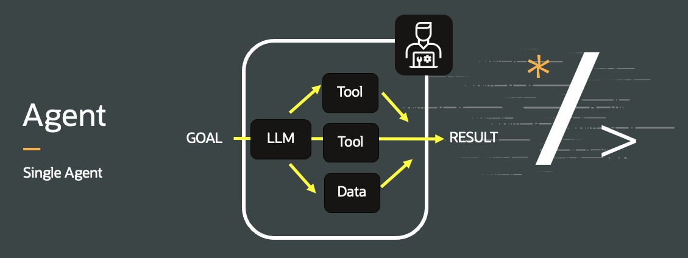   

1. Go to Oracle Digital Assistant Console.
2. In the home page or in the list of skills, open *mgLlmAgent*
3. Click on the *Flow icon* and check how the *agentFlow* looks like. Notice that there are 2 tools, a *Weather tool* and an *Hello tool*.
4. Click *Preview*

    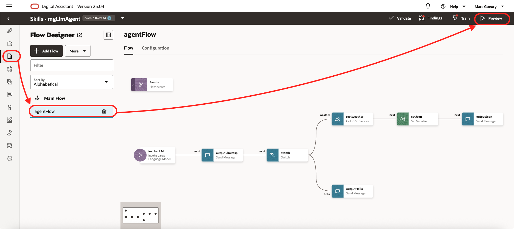   

5. Run the following questions:
    - *hello*
    - *what is the weather in Brussels*

    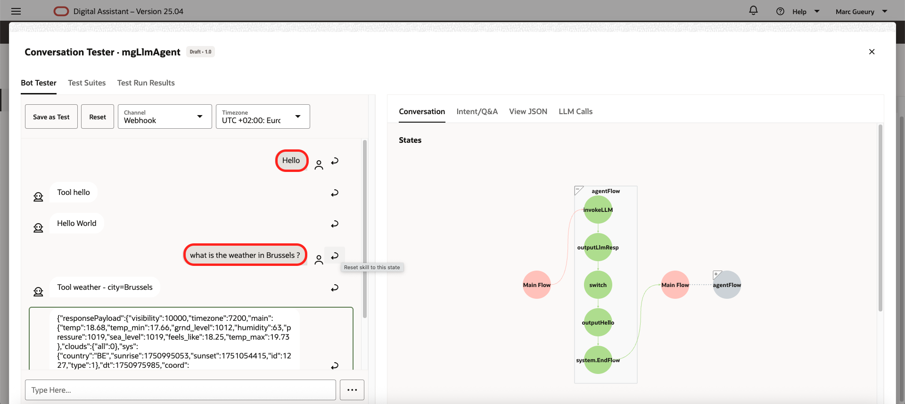   

6. In the preview, go to the LLM Calls tab and check the LLM calls.
    - Go to tab *LLM Calls*
    - Right click on the *column Request* of the call
    - Choose *Full Text*
    - Check the *LLM Request* and *LLM Response*

    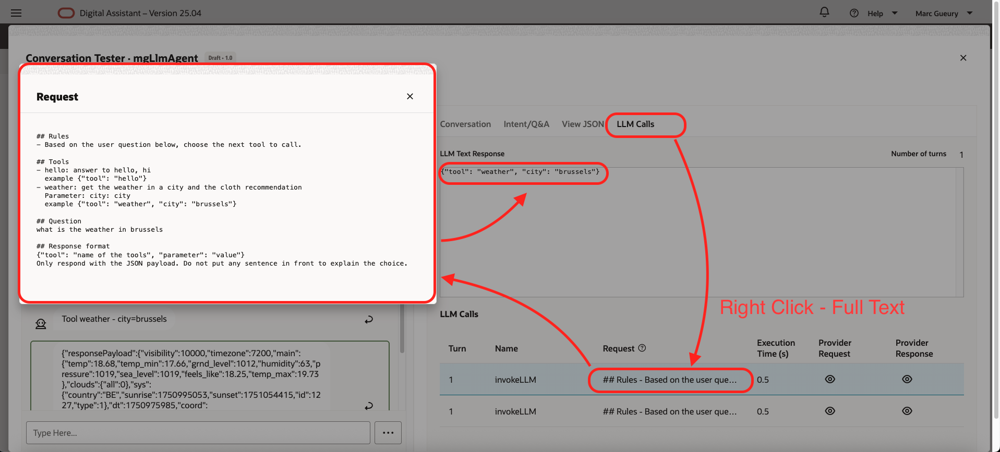   

7. Come back to the flow and look how it is built. Check the LLM block and the LLM prompt.

    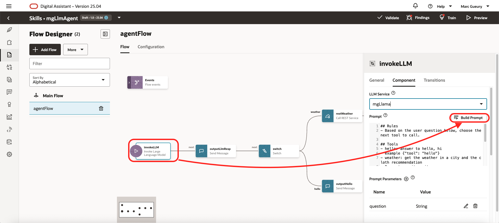   

    ```
    ## Rules
    - Based on the user question below, choose the next tool to call.

    ## Tools
    - hello: answer to hello, hi
    example {"tool": "hello"}    
    - weather: get the weather in a city and the cloth recommendation
    Parameter: city: city
    example {"tool": "weather", "city": "brussels"}  

    ## Question
    ${question}
    ```

## Task 2: Agent with history (memory)

In the previous sample, the LLM has no access to the chat history. Let's do a small change to solve this.

1. In the home page or in the list of skills, open *mgLlmHistory*
2. Click on the *Flow icon* and check the *outputFlow*, notice the last block.

    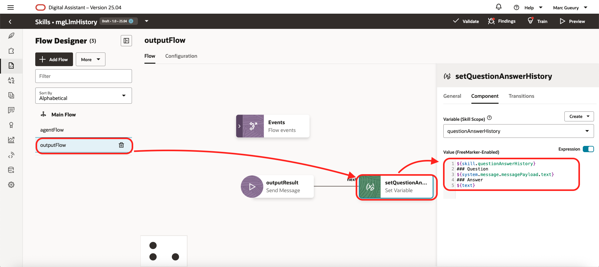   

    The history of the chat is kept in the *questionAnswerHistory variable*. It is a design choice, several other options exists. This one has the advantage to be compatible with all LLMs.

3. Check the *agentFlow* is nearly identical to the previous sample.
4. Click *Preview*
5. Run the following questions:
    - *hello from Brussels*
    - *what is the weather*

    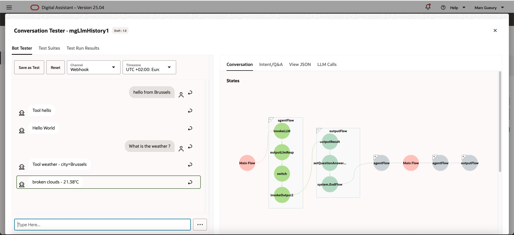  

     Notice that the answer of the question 2 refer to the question 1 of the chat history.

6. In the preview, go to the *LLM Calls* tabs and check the LLM calls.

7. Come back to the flow and look how it is build. Check the LLM block and the LLM prompt. Notice *questionAnswerHistory*

    ```
    ## Previous questions/answers
    ${questionAnswerHistory}

    ## Rules
    - Based on the user question below, choose the next tool to call.

    ## Tools
    - hello: answer to hello, hi
    example {"tool": "hello"}    
    - weather: get the weather in a city and the cloth recommendation
    Parameter: city: city
    example {"tool": "weather", "city": "brussels"}  

    ## Question
    ${question}

    ## Response format
    {"tool": "name of the tools", "parameter": "value"}
    Only respond with the JSON payload. Do not put any sentence in front to explain the choice.
    ```

## Task 3: Router + Human in the loop

In the previous example, we got just one Agent, let's start with several agents. One main agent that route the request to other Agents (or LLMs).

The difference between Agent and Tool is:
- an Agent speaks with another agent using Natural Language
- an Agent speaks with a tools using parameters like number, data, string, ... 

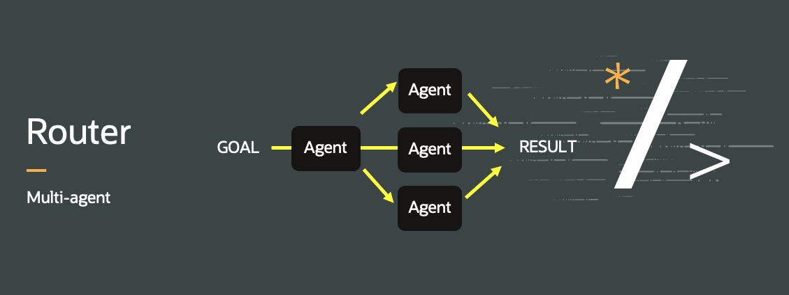   

1. In the home page or in the list of skills, open *mgLlmRouter*
2. Click on the *Flow icon* and check the *ragAgent*, notice that the Agent is calling another Agent (OCI GenAI agent). He will just pass the Natural Language question.

    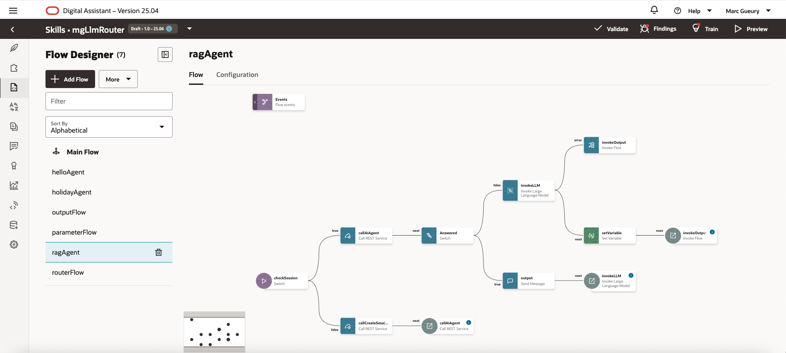   

3. Check the *agentFlow* is nearly identical to the previous sample.
4. Click *Preview*
5. Run the following questions:
    - *Hello, how are you ?*
        - Notice that the "Hello" is an Agent now. The answer comes from a LLM. 
    - *Book an holiday*
        - Notice that he ask for the missing parameter (Human in the loop)
        - Answer: *Tomorrow, normal holiday*
        - Confirm: *Yes*
    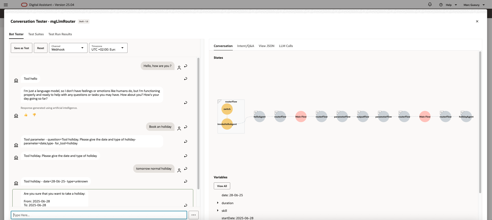  
    - *What is jazz ?*
        - Here the RAG Agent for OCI answer to the question and give a reference to the file we have ingested before.
    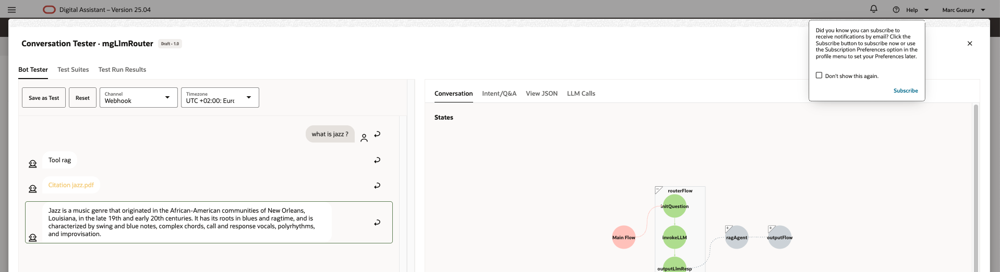  
6. In the preview, go to the *LLM Calls* tabs and check the LLM calls.
7. Come back to the flow and look how it is build. Check the LLM block and the LLM prompt. 
   You will see that there are no major changes.

## Task 4: Reflection

Here we will use 2 agents that will work together. 
- One will produce a document based on a wikipedia page. 
- The other one will check the quality. The result is shown to the user only when the check agent is happy about the quality.

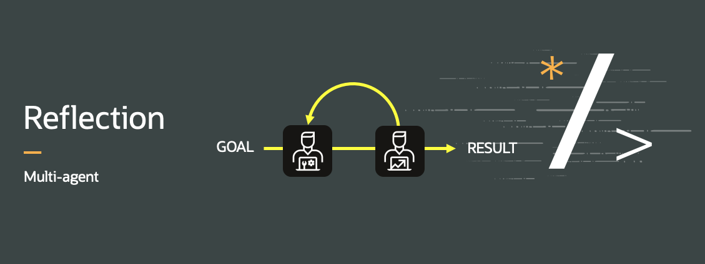   

1. In the home page or in the list of skills, open *mgLlmReflect*
2. Click on the *Flow icon* and check the *checkAgent* and the *summarizeAgent*.

    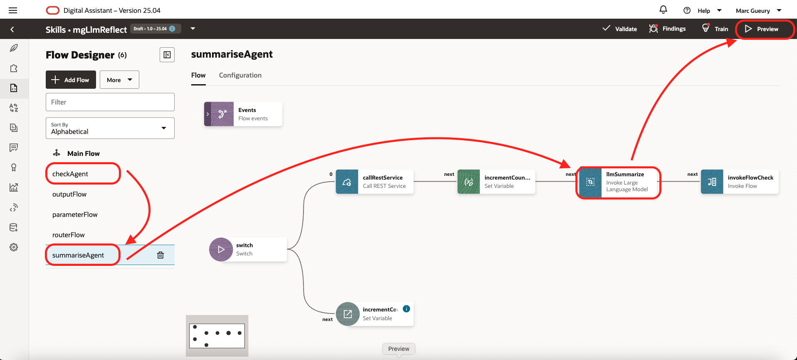   

3. Check the *agentFlow* is nearly identical to the previous sample.
4. Click *Preview*
5. Run the following questions:
    - tell me more about agent
    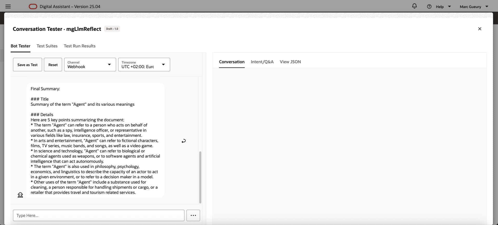  
6. In the preview, go to the *LLM Calls* tabs and check the LLM calls.

## Task 5: Supervisor

Here, we will use a group of agents working together with a supervisor to supervise the work of the other agents. 

The supervisor has 2 tasks:
- Divide the work to the other agents
- Evaluate the response of each agent and check if he needs to call more agents, more tools or get other data to answer to the question of the end-user.

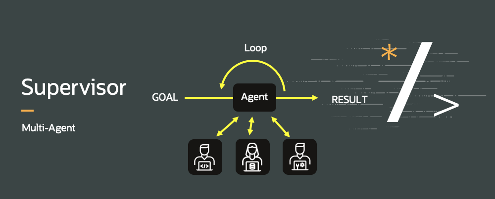   

1. In the home page or in the list of skills, open *mgLlmSupervisor*
2. Click on the *Flow icon* and check the *supervisorFlow*. Look at the LLM Block and its definition. It is more complex than before but like you see he has the same structure than before, the only main difference is that during the supervisor flow. The history of the tools calls is kept to make the thinking of the LLM progress to respond to the user question.

    ```
    [...]
    ## Tools History
    ${toolsHistory}
    ```

    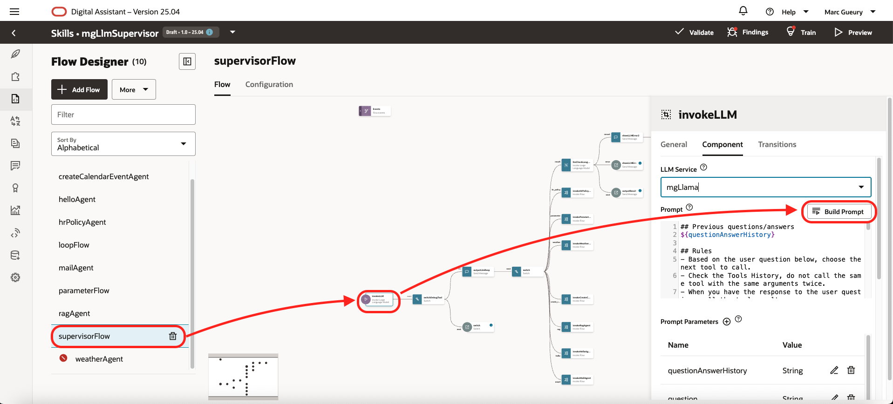   

3. Click *Preview*
4. Run the following questions:
    - *What is the weather in Brussels*
        - Check the LLM Calls. You will see that the *Supervisor* calls the *Weather* tool. Check if the result is correct. Then use the *Result* tool.
    - *Show all emails*
    - *Get email 3*
    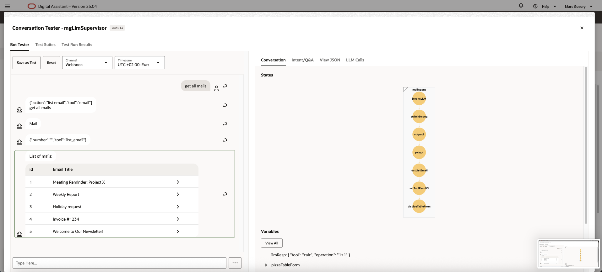  

5. Reset the conversation (to avoid inference with the history of the conversation before)
    - *Get email 3 and send a mail back with an answer based on the hr policy*
    - *What is the weather in brussels ? Send a mail about it to toto@gmail.com*
    - *Look when was jazz created. Send a mail about it to toto@gmail.com*

    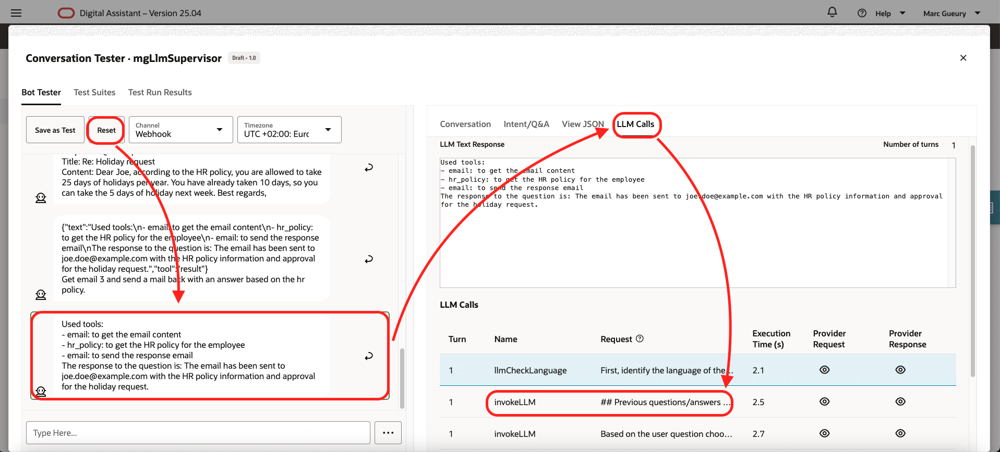  

6. In the preview, go to the *LLM Calls* tabs and check the LLM calls.

## END

Congratulation ! You have finished the lab !!
We hope that you learned something useful.

## Known issues

None

## Acknowledgements

- **Author**
    - Marc Gueury, Oracle Generative AI Platform
