# Provision ADB and Link to ODI

## Introduction

This lab walks you through the steps to get started using the Oracle Autonomous Database (Autonomous Data Warehouse [ADW] and Autonomous Transaction Processing [ATP]) on Oracle Cloud. You will provision a new ADW instance and connect to the database using Oracle SQL Developer Web.

*Note: While this lab uses ADW, the steps are identical for creating and connecting to an ATP database.*

Estimated Lab Time:  10 minutes

### Objectives

* Learn how to provision a new Autonomous Data Warehouse
* An Oracle Free Tier, Always Free, Paid or LiveLabs Cloud Account

### Prerequisites

This lab assumes you have already completed the [Log in to Oracle Cloud] (?lab=lab-1-login-oracle-cloud) lab seen in the menu on the right.  In this lab you will be provisioning an ADW database instance using the cloud console.

### Video Preview

Watch a video demonstration of provisioning a new autonomous data warehouse:

## Task 1: Choosing ADW from the Services Menu

1. Login to the Oracle Cloud, as shown in the previous lab.
2. Once you are logged in, you are taken to the cloud services dashboard where you can see all the services available to you. Click the navigation menu in the upper left to show top level navigation choices.

    __Note:__ You can also directly access your Autonomous Data Warehouse service in the __Quick Actions__ section of the dashboard.

    

3. The following steps apply similarly to either Autonomous Data Warehouse or Autonomous Transaction Processing. This lab shows provisioning of an Autonomous Data Warehouse database, so click **Autonomous Data Warehouse**.

    

4. Make sure your workload type is __Data Warehouse__ or __All__ to see your Autonomous Data Warehouse instances. You can use the __List Scope__ drop-down menu to select a compartment. Select the compartment provided in the email instructions where you will create your new ADW instance.

 __Note__ - Avoid the use of the ManagedCompartmentforPaaS compartment as this is an Oracle default used for Oracle Platform Services.

5. This console shows that no databases yet exist. If there were a long list of databases, you could filter the list by the state of the databases (available, stopped, terminated, and so on). You can also sort by __Workload Type__. Here, the __Data Warehouse__ workload type is selected.

    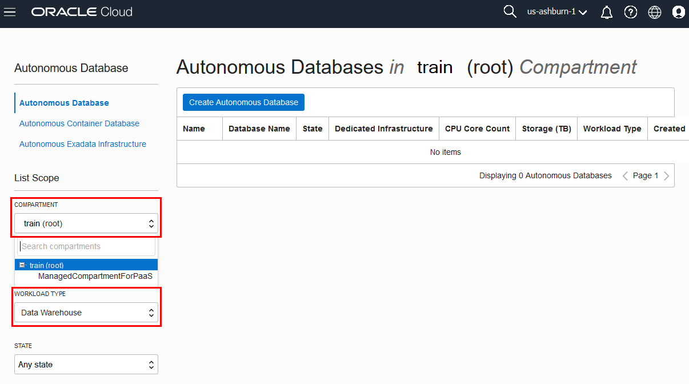

7. You can see your current default **region** in the top, right hand corner of the page. Go ahead and select the region indicated in the email you received.

    

## Task 2: Creating the ADB instance

1. Click **Create Autonomous Database** to start the instance creation process.

    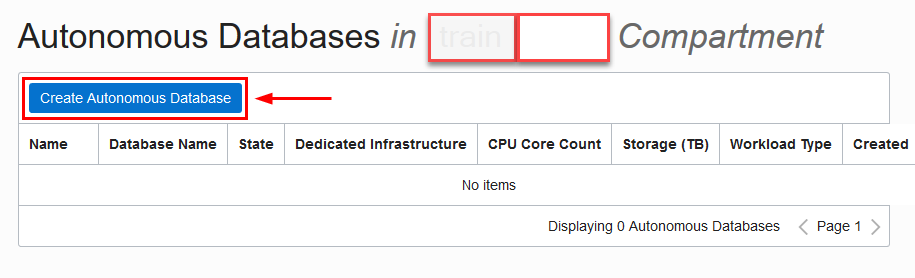

2.  This brings up the __Create Autonomous Database__ screen where you will specify the configuration of the instance.
3. Provide basic information for the autonomous database:

    - __Choose a compartment__ - Select the compartment provided in the email you received.
    - __Display Name__ - Enter a memorable name for the database for display purposes. For this lab, prefix the name with the first letter of your *first* and *last* name.
    - __Database Name__ - Use letters and numbers only, starting with a letter. Maximum length is 14 characters. (Underscores not initially supported.) For this lab, prefix the name with the first letter of your *first* and *last* name.

    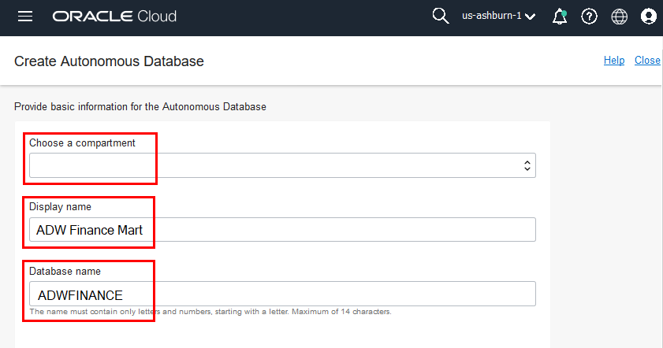

4. Choose a workload type. Select the workload type for your database from the choices:

    - __Data Warehouse__ - For this lab, choose __Data Warehouse__ as the workload type.
    - __Transaction Processing__ - Alternately, you could have chosen Transaction Processing as the workload type.

    

5. Choose a deployment type. Select the deployment type for your database from the choices:

    - __Shared Infrastructure__ - For this lab, choose __Shared Infrastructure__ as the deployment type.
    - __Dedicated Infrastructure__ - Alternately, you could have chosen Dedicated Infrastructure as the workload type.

    

6. Configure the database:

    - __Always Free__ - For this lab, you can select this option to create an always free autonomous database, or not select this option and create a database using your paid subscription. An always free database comes with 1 CPU and 20 GB of storage. Selecting Always Free will suffice for this lab.
    - __Choose database version__ - Select a database version from the available versions.
    - __OCPU count__ - Number of CPUs for your service. For this lab, specify __2 CPUs__. Or, if you choose an always free database, it comes with 1 CPU.
    - __Storage (TB)__ - Select your storage capacity in terabytes. For this lab, specify __1 TB__ of storage. Or, if you choose an always free database, it comes with 20 GB of storage.
    - __Auto Scaling__ - For this lab, keep auto scaling enabled, to allow the system to automatically use up to three times more CPU and IO resources to meet workload demand.
    - __New Database Preview__ - If a checkbox is available to preview a new database version, do __not__ select it.

    

7. Create administrator credentials:

    - __Password and Confirm Password__ - Specify the password for ADMIN user of the service instance. The password must meet the following requirements:
    - The password must be between 12 and 30 characters long and must include at least one uppercase letter, one lowercase letter, and one numeric character.
    - The password cannot contain the username.
    - The password cannot contain the double quote (") character.
    - The password must be different from the last 4 passwords used.
    - The password must not be the same password that is set less than 24 hours ago.
    - Re-enter the password to confirm it. Make a note of this password.

    
8. Choose network access:
    - For this lab, accept the default, "Allow secure access from everywhere".
    - If you want a private endpoint, to allow traffic only from the VCN you specify - where access to the database from all public IPs or VCNs is blocked, then select "Virtual cloud network" in the Choose network access area.
    - You can control and restrict access to your Autonomous Database by setting network access control lists (ACLs). You can select from 4 IP notation types: IP Address, CIDR Block, Virtual Cloud Network, Virtual Cloud Network OCID).

    

9. Choose a license type. For this lab, choose __Bring Your Own License (BYOL)__. The two license types are:

    - __Bring Your Own License (BYOL)__ - Select this type when your organization has existing database licenses.
    - __License Included__ - Select this type when you want to subscribe to new database software licenses and the database cloud service.

10. Click __Create Autonomous Database__.

    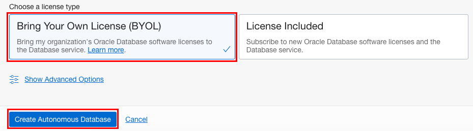

11.  Your instance will begin provisioning. In a few minutes the state will turn from Provisioning to Available. At this point, your Autonomous Data Warehouse database is ready to use! Have a look at your instance's details here including its name, database version, CPU count and storage size.

    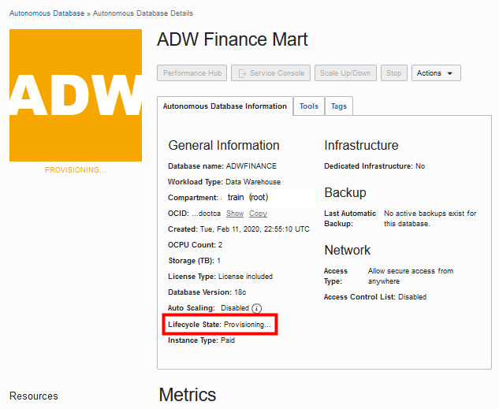

## Task 3: Populating ADW Database with Seed Data

1. Ensure your ADW instance is available:
  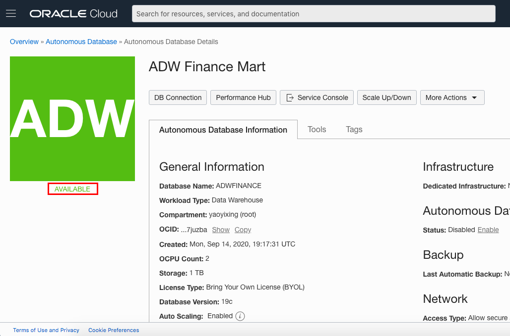

2. In your ADW database's details page, click the **Tools** tab.

    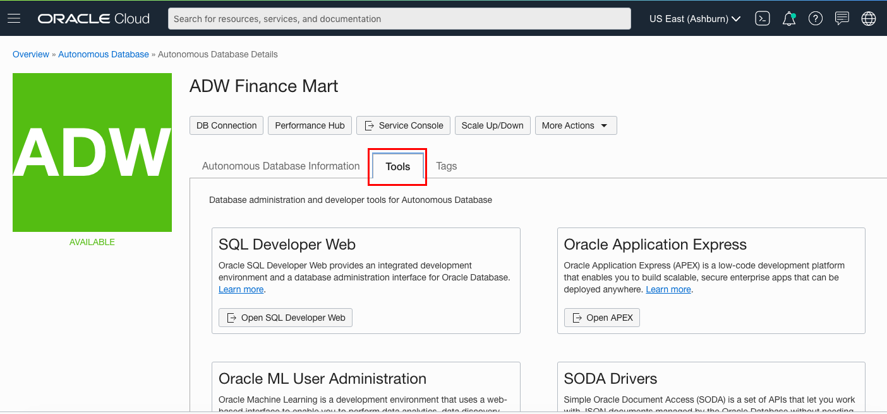

3. The Tools page provides you access to SQL Developer Web, Oracle Application Express, and Oracle ML User Administration. In the SQL Developer Web box, click **Open SQL Developer Web**.

    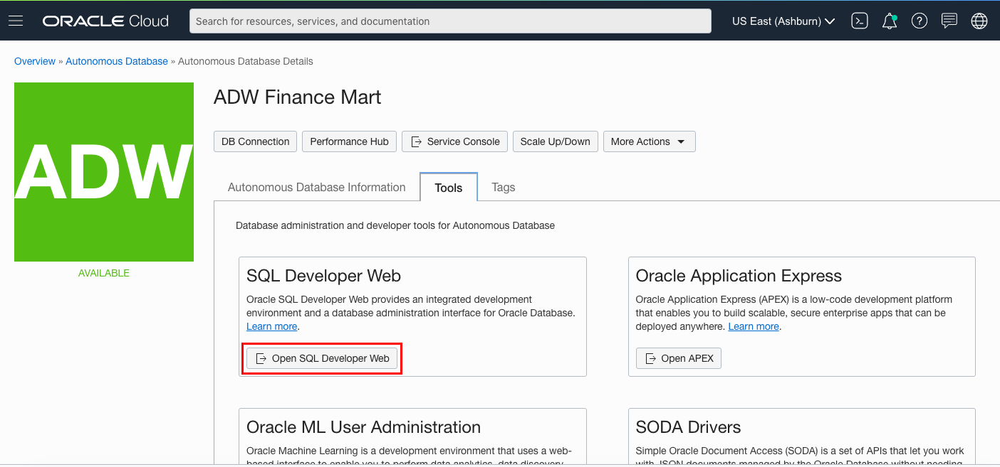
4. A sign-in page opens for the SQL Developer Web. For this lab, simply use your database instance's default administrator account, **Username - admin**, and with the admin **Password** you specified when creating the database. Click **Sign in**.

    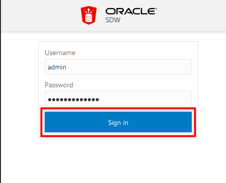

5. SQL Developer Web opens on a worksheet tab. The first time you open the SQL Developer Web, a series of pop-up informational boxes introduce you to the main features.

    

6. Click on the link [User-Seed-SQL.ZIP](https://objectstorage.us-ashburn-1.oraclecloud.com/p/jyHA4nclWcTaekNIdpKPq3u2gsLb00v_1mmRKDIuOEsp--D6GJWS_tMrqGmb85R2/n/c4u04/b/livelabsfiles/o/labfiles/ODI_User-Seed-SQL.zip) to download a ZIP file containing:
  * User_setup.sql
  * Seed_data.sql   

7. Copy the contents of *User_setup.sql* in to the worksheet:
    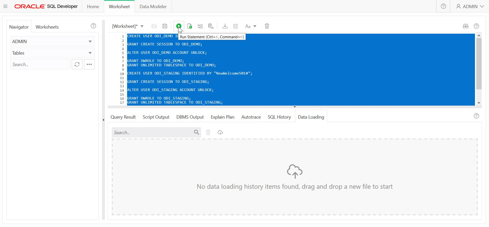

8. Select all of the text and run it to create the users *ODI\_DEMO* and *ODI\_STAGING*

9. Copy the contents of *Seed_data.sql* in to the worksheet, select the text and run to create tables and populate with seed data. The execution may take few minutes to complete (UI doesn't show any activity in the meantime). Check for messages in "Script Output" tab to make sure commit completed after the execution.
    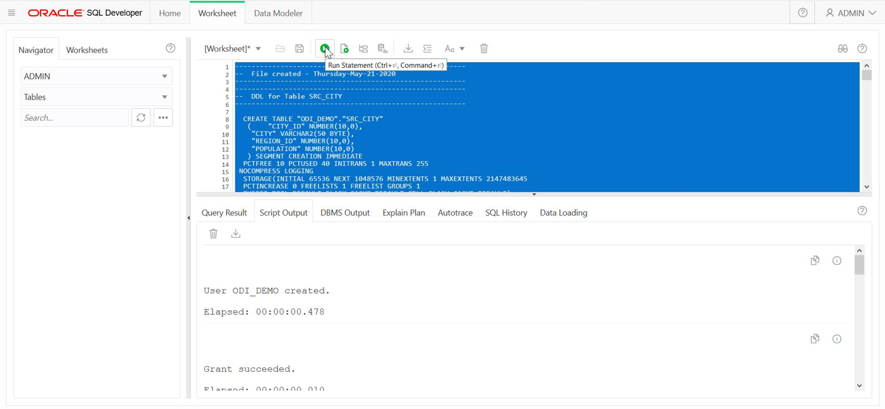   

## Want to Learn More?

Click [here](https://docs.oracle.com/en/cloud/paas/autonomous-data-warehouse-cloud/user/autonomous-workflow.html#GUID-5780368D-6D40-475C-8DEB-DBA14BA675C3) for documentation on the typical workflow for using Autonomous Data Warehouse.

## Acknowledgements

- **Author** - Nilay Panchal, ADB Product Management
- **Adapted for Cloud by** - Richard Green, Principal Developer, Database User Assistance
- **Contributors** - Jeffrey Malcolm Jr, Arabella Yao, June 2020
- **Last Updated By/Date** - Kamryn Vinson, September 2020

