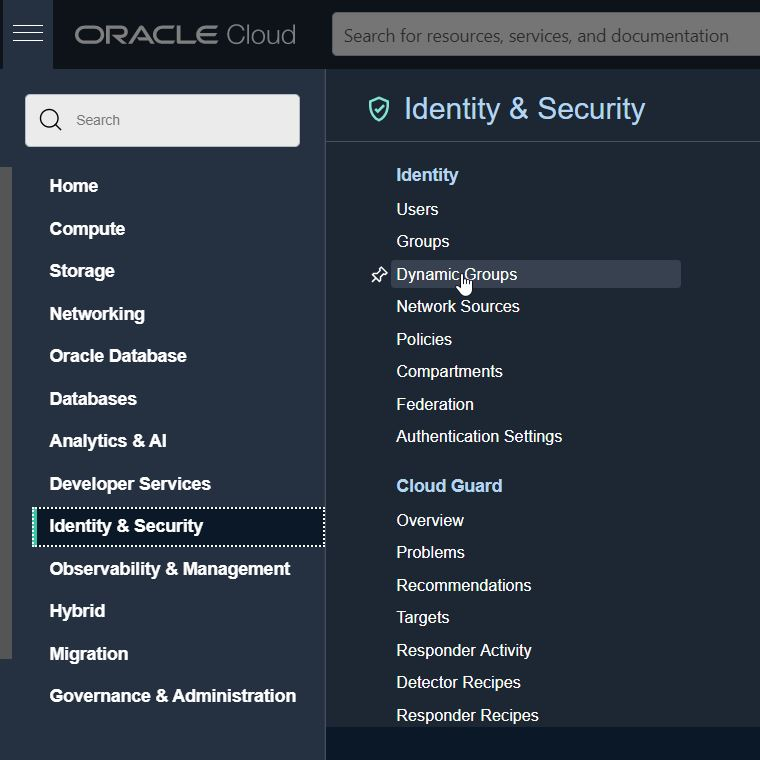
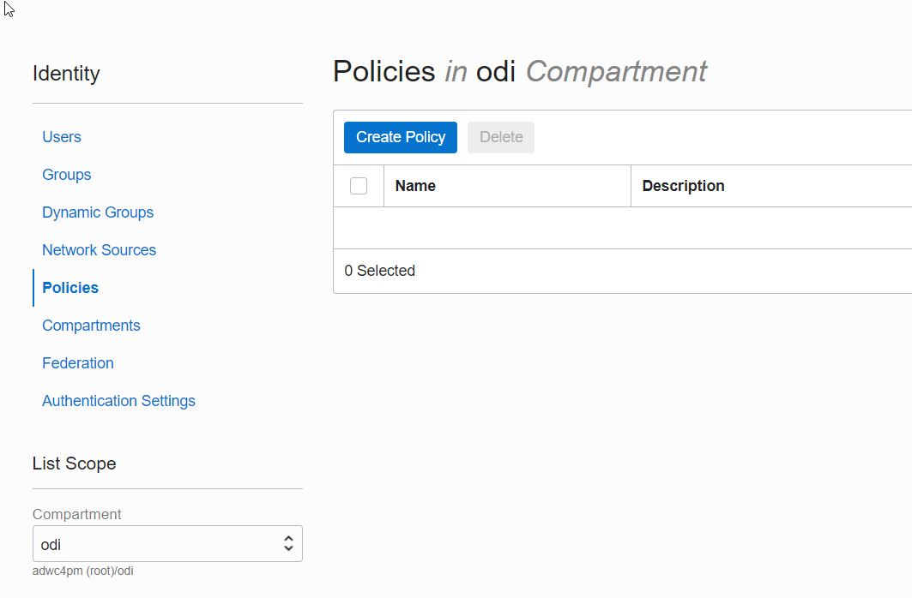
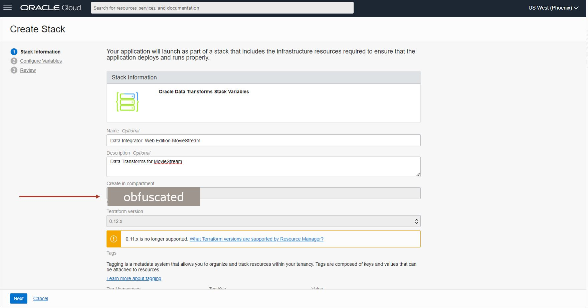
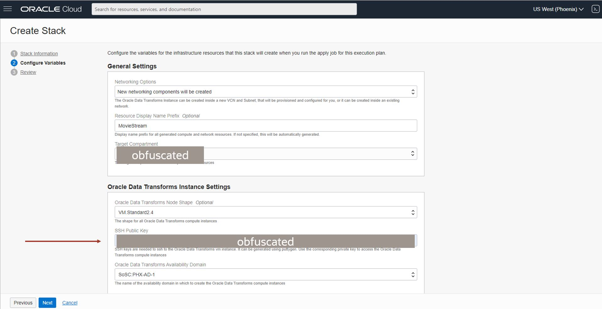
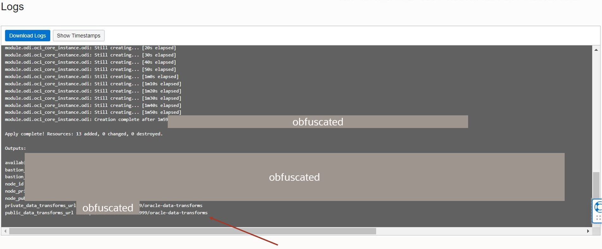
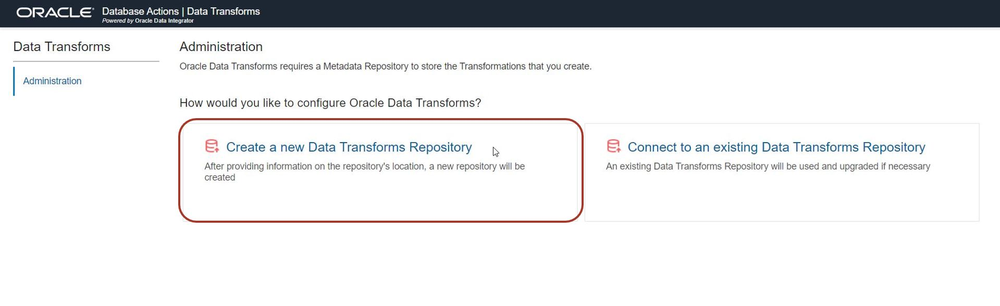
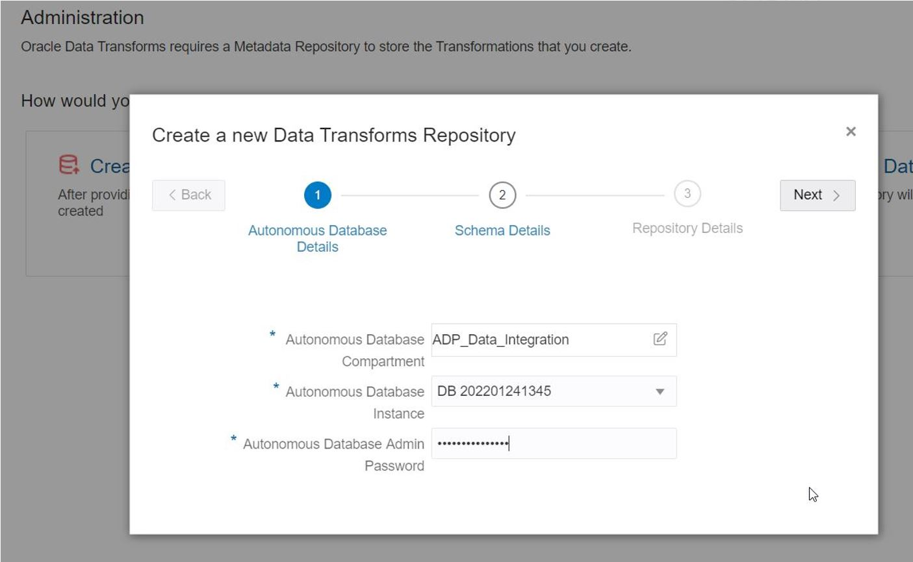
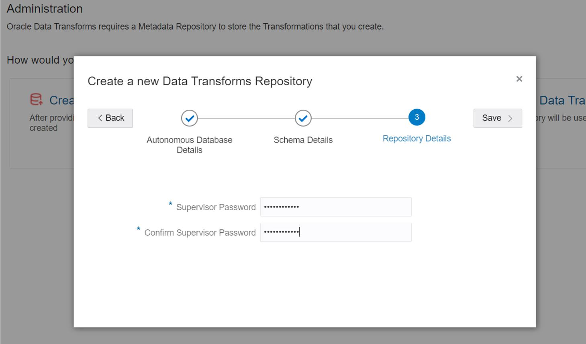
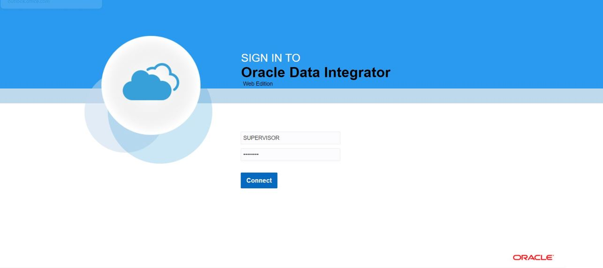


# Deploy ODI Web Edition

## Introduction

Oracle Data Integrator (ODI) is Oracle's industry-leading, enterprise-class data integration tool. It features an extract-load-transform (ELT) architecture, which delivers very high performance, scalability and reliability because it uses the target database to execute transformations. Why do an **E** and an **L** if all you want to do is a **T**? That's the problem with legacy ETL tools with server-based architectures that require data to be extracted for processing (transformation) and reloaded afterwards. ODI Web Edition brings this power and pedigree to a wider user base through the Data Transforms tool, which provides a simple drag and drop low-code environment for creating data integration projects.

ODI Web Edition needs to be deployed from OCI Marketplace before we can use Data Transforms. In this lab we will go through the steps to create an  ODI Web Edition instance.

Estimated Lab Time: 20 minutes

### Objectives

In this lab, you will:

- Create an ODI Web Edition instance

- Register it with Autonomous Database so that Data Transforms can be launched from the Database Tools page

### Prerequisites

To complete this lab, you need to have the following:

- Autonomous Database, which will host repository for ODI Web Edition

- SSH Key

- OCI privileges (work with your tenancy administrator)

    - Available resource in OCI to create VCN, Stack and Compute instance

    - Privilege to create VCN

    - Privilege to create OCI dynamic group and policies

- Privilege to create an OCI compartment or access to a compartment

- Knowledge of basic concepts of OCI console navigation 

## Task 1: Create OCI Policies for ODI Web Edition Deployment

1. **NOTE:** If you have already been provided a compartment then skip this step. For the remaining steps, replace compartment name `odi` with your assigned compartment name. Create a compartment `odi` where ODI Web Edition related artifacts will be created. Make sure you have a privilege to create a compartment or request your administrator to give you a compartment. Use this compartment for the rest of the lab. Navigate to **Identity & Security > Compartments** and create a compartment. 

    

2. **NOTE:** If you have already been provided a compartment then skip this step. Create a compartment named `odi`. If you already have access to a compartment provided by your administrator then skip creation. You should also copy the OCID of your compartment since it is needed in the next step.

    

3. Navigate to **Identity & Security > Dynamic Groups**.

    

4. Create a dynamic group `odi`; to include matching rules for instances in a specified compartment. Replace the OCID of your compartment in the example. For example:

    ALL {[instance.compartment.id](http://instance.compartment.id) = 'ocid1.compartment.oc1..aaaaaaaabgr34tpuanpvq6xfb667nsmy2jz45zj6dexojhxdsv4mjayem3cq'}

    

5. Navigate to **Identity & Security > Policies**.

    

6. Select your compartment under **List Scope** and click **Create Policy**.

    

7. Create a policy named `odi_policies`.

    

8. Click on `odi_policies` to add policies. Use the manual editor.

    Set policy at your compartment level. All ADW/ATP instances in the compartment where the ODI instance is created will be accessed during deployment. Copy and paste the policies below in the editor window and click **Create**.

    **NOTE:** If you are working on a different compartment then replace `odi` with your compartment name.

    Set up the following policy:

    Allow dynamic-group odi_group to inspect autonomous-database-family in compartment odi

    Allow dynamic-group odi_group to read autonomous-database-family in compartment odi

    Allow dynamic-group odi_group to inspect compartments in compartment odi

    **Note:** If you want ODI web to be able to access autonomous databases in other compartments in your tenancy, you will need to set additional policy statements at the root level of your tenancy. In this case, all ADW/ATP instances from the tenancy where ODI instance is created will be accessed during deployment.

    Allow dynamic-group odi_group to inspect autonomous-database-family in tenancy

    Allow dynamic-group odi_group to read autonomous-database-family in tenancy

    Allow dynamic-group odi_group to inspect compartments in tenancy

    

## Task 2: Deploy ODI Web Edition

1. Starting from the OCI console, navigate to the OCI Marketplace, as follows (and as shown in the screenshot below):

    - Be sure that you are working in the same OCI Region as your Autonomous Database. (In the example below, that is US West (Phoenix))

    - From the Hamburger menu at the top left, select Marketplace, then **All Applications**

    - Under **Filters** on the left, specify:
        - Publisher: Oracle
        - Category: Data Integration
        - Price: Free

    - Of the cards that match these criteria, select **Data Integrator: Web Edition**

    

2. In the details screen that appears, you should review and (if suitable) accept the Oracle Terms of Use. Then click **Launch Stack**. 

    

3. What follows is a simple fill-in-the-blanks dialog to configure the OCI software stack appropriately. In the **Stack Information** section, provide a name and description for this software stack. Specify target compartment in in which you want to create the stack and the compute instance. Then click **Next**. 

    

4. In the **Oracle Data Transforms Instance Settings** section, enter your own OCI Public key into the field SSH PUBLIC KEY. Then click **Next**.

    

5. Next comes the **Review** section. Be sure to check the values specified here, so that the stack is deployed successfully. Go back and make any corrections necessary. When you're satisfied, click **Create**. 

    

6. First status will be yellow **In Progress** and when the OCI components of the stack are successfully deployed, the status icon will turn green, as shown below.

    **NOTE:** It can take several minutes to finish.

    In this window, you can view the progress of the stack deployment log.

7. Wait for the job to finish and scroll to the end of the log and copy Data Transforms URL.

    

8. In a browser window, launch Data Transforms using the URL copied in previous step. Click on **Create a new Data Transforms Repository**.

    **NOTE:** It may take one minute to start the Transforms service. Refresh the page after one minute if you don't get the UI immediately

    

9. Provide Autonomous Database Details where the repository will be created. You can select the Autonomous database from the list in a specified compartment. If your database doesn't show in the list then it means OCI policies are not set in order to access the database from your compartment. Refer to the Task 1 to review the policies. Ask your Autonomous Database administrator for the Admin password. Then click **Next**.

    

10. Provide schema Details where the repository will be created. Data Transforms repository schema name is prefixed with the text provide. Schema password will be used to create the schema. Then click **Next**.

    

11. Provide Supervisor password for Data Transforms. Carefully note down this password. Then click **Next**.

    

12. Repository creation process will start and you can see the progress. It will take around 15 minutes for the process to complete. After the process is successfully complete, you can launch Data Transforms by clicking on **Login to Data Transforms**. In future you can also use the previously copied URL to start Data Transforms.

    **Note:** If there is an error then you can download the logs and look for the cause of the failure. Please refer to the documentation linked in the Marketplace listing for error logs.

    

## Task 3: Launch The Data Transforms Tool

Data Transforms tool can be launched by two methods:

- Direct URL from a browser

- Data Transforms card in Autonomous Database tools page.

1. In order to find the URL we need to access the application properties in OCI stack created in previous step. In the OCI Control plane, from the hamburger menu select **Resource Manager – Stacks**, as follows:

    

2. In the screen that appears, click on the name of the stack.

    

3. Then click on the tab for **Application Information**:

    

4. The page that appears provides both private and public URLs for accessing **Oracle Data Integrator - Web Edition** directly.  

    

5. We need to perform few administration steps before we can successfully launch Data Transforms form Autonomous Database Actions menu. Click on the Data Transforms URL in previous step to launch Data Transform. Login with SUPERVISOR user and your password.

    

6. Click Administration and click Continue.

    

7. This is where Database user is mapped to Data Transforms user. There is a default map for ADMIN user to SUPERVISOR. Click + and add QTEAM user mapping to SUPERVISOR. Enter Database URL (as shown) and click Save. After this you will be able to launch Data Transforms from Autonomous Database Actions page.

    

8. You can also launch **Data Transforms** from Autonomous Database. You'll see a card for a fully pre-configured connection to your Autonomous Database. Click the **DATA TRANSFORMS** card.

    

9. You will see the login screen for the Data Transforms tool. Specify username **SUPERVISOR** and the password that you provided in the ODI Web Edition deployment. Click **Connect**.

    Follow the next lab for using Data Transforms to create a data flow.

## Conclusion

In this section we've covered the following topics:

- Deploying ODI Web Edition compute instance from OCI Marketplace

- Register Data Transforms tool to Autonomous Database Tools page

- Launch Data Transforms tool

## Acknowledgements

- **Authors** - Jayant Mahto, ADB Product Management
- **Contributors** - Patrick Wheeler, Mike Matthews, ADB Product Management
- **Last Updated By/Date** - Jayant Mahto, Arabella Yao, October 2021
