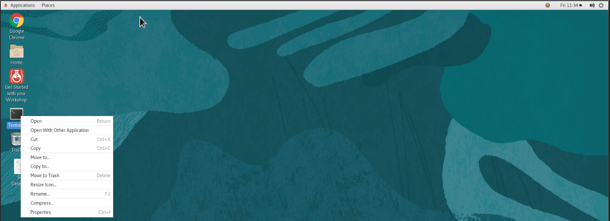
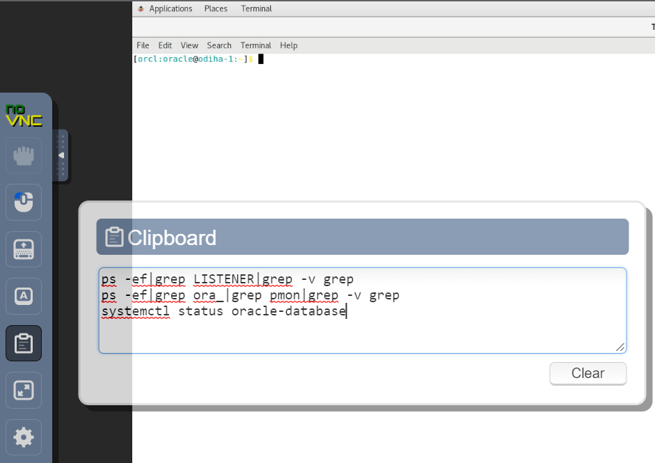
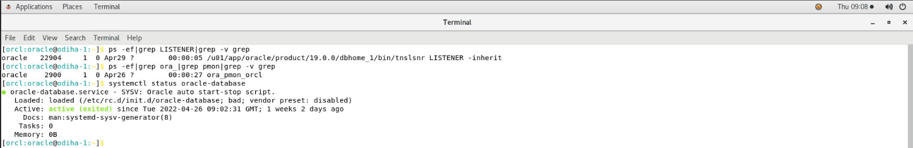
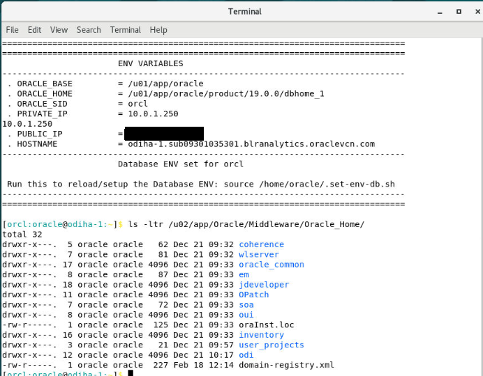
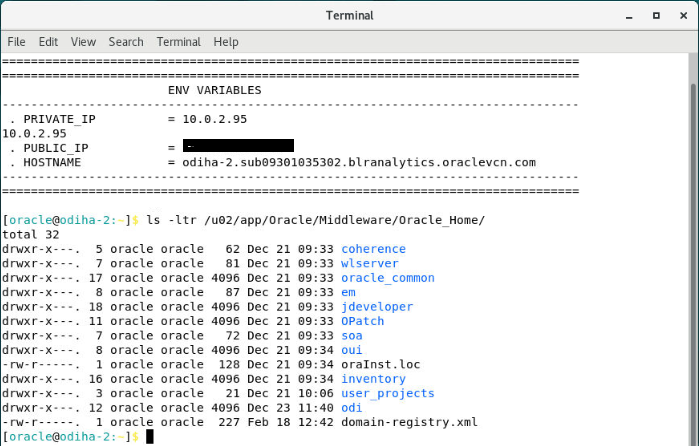

# Access and Configure ODI Instance

## Introduction
This lab will show you how to access an ODI instance using NoVNC and configure ODI Studio

*Estimated Lab Time*: 10 minutes

### Objectives
* Validate the Database Processes are Up and Running
* Validate the ODI Installation

### Prerequisites
This lab assumes you have:
- A Free Tier, Paid or LiveLabs Oracle Cloud account
- You have completed:
    - Lab: Prepare Setup (*Free-tier* and *Paid Tenants* only)
    - Lab: Environment Setup

## Task 1: Validate the Database Processes are Up and Running.
1. Now with access to your remote desktop sessions, proceed as indicated below to validate your environment before you start executing the subsequent labs. 

    ```
    <copy>
    Sample NoVNC URL: http://Node1_ip_address/livelabs/vnc.html?password=LiveLabs.Rocks_99&resize=scale&quality=9&autoconnect=true&reconnect=true
    </copy>
    ```  

The following Processes should be up and running in Node1:

   - Database Listener
       - LISTENER
   - Database Server Instance
       - orcl

2. Validate that expected processes are up. Please note that it may take up to 5 minutes after instance provisioning for all processes to fully start.

   

    ```
    <copy>
    ps -ef|grep LISTENER|grep -v grep
    ps -ef|grep ora_|grep pmon|grep -v grep
    systemctl status oracle-database
    </copy>
    ```

  

  

The above screenshot clearly indicates that the listener and Oracle database processes are running.


3. If you see questionable output(s), failure or down component(s), restart the service accordingly.

    ```
    e.g. Restarting the DB and DB Listener
    <copy>
    sudo systemctl restart oracle-database
    </copy>
    ```
4. ODI Livelabs webpage, ODI Studio and SQL Developer are also launched with the instance. You can minimize these screens for now.

    

## Task 2: Validate the ODI Installation.

Below is the ODI installation path

1. Open the terminal in ODI node1 desktop and provide below command.

    


    ```
    <copy>ls -ltr /u02/app/Oracle/Middleware/Oracle_Home/</copy>
    ```  

   

    These files indicate that ODI is installed in the above path. You can verify the same in Node2.

    


You may now [proceed to the next lab](#next).

## Appendix 1: Managing Startup Services

1. Database service (Database and Standard Listener).

    - Start

    ```
    <copy>
    sudo systemctl start oracle-database
    </copy>
    ```
    - Stop

    ```
    <copy>
    sudo systemctl stop oracle-database
    </copy>
    ```

    - Status

    ```
    <copy>
    systemctl status oracle-database
    </copy>
    ```

    - Restart

    ```
    <copy>
    sudo systemctl restart oracle-database
    </copy>
    ```

2. Command to start listener services.

    - Start

    ```
    <copy>
    lsnrctl start
    </copy>
    ```

## Learn More
- [Oracle Data Integrator](https://docs.oracle.com/en/middleware/fusion-middleware/data-integrator/index.html)

## Acknowledgements

- **Author** - Srivishnu Gullapalli, January 2022
- **Contributors** - Amit Kotarkar
- **Last Updated By/Date** - Rene Fontcha, LiveLabs Platform Lead, NA Technology, January 2022
