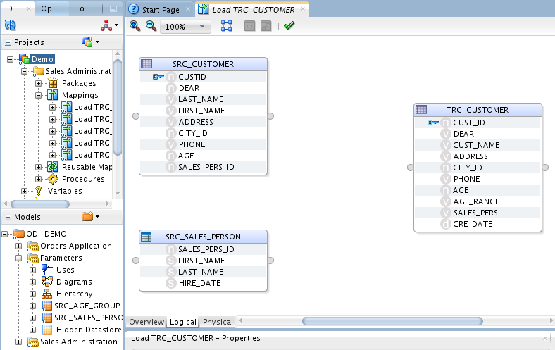
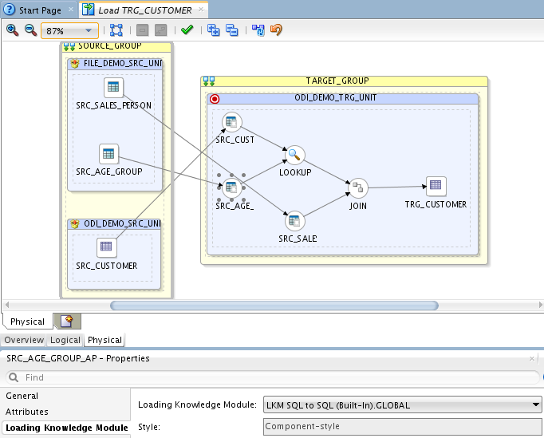
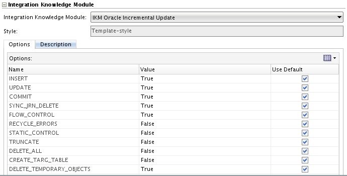

# Work with Mappings - Part 1

## Introduction

This chapter describes how to work with mappings in Oracle Data Integrator. The demonstration environment includes several example mappings. In this chapter you will learn how to create the following mappings:

  * Load TRG\_CUSTOMER: This mapping loads the data from the SRC\_CUSTOMER table in the *Orders Application* model into the TRG\_ CUSTOMER target table in the *Sales Administration* model.
  * Load TRG\_SALES: This mapping loads the data from the SRC\_ ORDERS table and from the SRC\_ORDER\_LINES table in the *Orders Application* model into the TRG\_SALES target table in the *Sales Administration* model. (details in Lab *ODI12c: Working with Mappings - 2*)

## Task 1:  Load TRG_CUSTOMER Mapping Example

1. Purpose and Integration Requirements
The purpose of the Load TRG\_CUSTOMER mapping is to load the data from the SRC\_ CUSTOMER table in the *Orders Application* model into the TRG\_CUSTOMER target table in the *Sales Administration* model.

However, the SRC\_CUSTOMER table does not contain all of the data that is required for this operation. The following information has to be added to the target table:

  * The age range (AGE\_RANGE) that is defined in the SRC\_AGE\_GROUP flat file in the *Parameters* model corresponds to the AGE attribute in the source table.
  * The last and first names of the customer sales rep. (LAST\_NAME and FIRST\_ NAME) that is defined in the SRC\_SALES\_PERSON file in the *Parameters* model correspond to the sales representative ID (SALES\_PERS\_ID) in the source table.
  * The transformed value of the numeric data (0, 1, 2) from the DEAR column in the source table into an standard salutation text string in the target (Mr, Mrs, or Ms).
  * The concatenated first and last names of the source customers.

The source data is not always consistent with the integrity rules implemented in the target environment. For this mapping, the data has to be cleansed by verifying that all constraints are satisfied and by storing invalid rows in an error table rather than in our target database. In this example, two important integrity rules must be satisfied:
  * Customers must be older than 21 (condition AGE \> 21)
  * The customers must be associated with a city (CITY\_ID) that exists in the TRG\_ CITY table (reference FK\_CUST\_CITY)

The functional details for these rules and the procedure to follow are described later in this lab.

2. Mapping Definition
This section describes the mapping Load TRG\_CUSTOMER that will be created in this example. See *Creating the Mapping* for more information.

The Load TRG\_CUSTOMER mapping uses the following data and transformations:
  * One target datastore. Details:

| Model                 | Datastore     | Description |  Type        |
|-----------------------|---------------|-------------|--------------|
| Sales Administration  | TRG\_CUSTOMER |              | Oracle Table |

  * Three source datastores:

| Model                 | Datastore     | Description |  Type        |
|-----------------------|---------------|-------------|--------------|
| Orders Application    | SRC\_CUSTOMER | Customers in the source system | Oracle Table |
| Parameters            | SRC\_AGE_GROUP | Age bracket file | File delimited by semicolons |
| Parameters            | SRC\_SALES\_PERSON | Salesperson File | File delimited by semicolons |

  * One Join:

| Join                  | Description                                | SQL RULE                   |
|-----------------------|--------------------------------------------|----------------------------|
| Sales Representatives and Customers | Join SRC\_SALES\_PERSON and SRC\_CUSTOMER | SRC\_CUSTOMER.SALES\_PERS\_ID = SRC\_SALES\_PERSON.SALES\_PERS\_ID |

  * One **Lookup** table:

| Lookup                   | Description   | SQL RULE                                                        |
|--------------------------|---------------------------------------------|-----------------------------------|
| Customers and age range  | The customers age must be between the min and max ages in the file | SRC\_CUSTOMER.AGE between SRC\_AGE\_GROUP.AGE\_MIN and SRC\_AGE\_GROUP.AGE\_MAX  |

  * Several transformation rules:

| Target Column  | Origin                               | SQL Rule(Expression)                                                       |
|----------------|--------------------------------------|----------------------------------------------------------------------------|
| CUST\_ID       | SRC\_CUSTOMER.CUSTID                 | SRC\_CUSTOMER.CUSTID      |
| DEAR           | If SRC\_CUSTOMER.DEAR = 0 then 'Mr'  If SRC\_CUSTOMER.DEAR = 1 then 'MRS' else 'MS'| CASE  WHEN CUSTOMER.DEAR=0 THEN 'Mr' WHEN CUSTOMER.DEAR=1 THEN 'Mrs' ELSE 'MS' END |
| CUST\_NAME     | Concatenation of SRC\_CUSTOMER.FIRST\_NAME and SRC\_CUSTOMER.LAST\_NAME in upper case | TRIM(SRC\_CUSTOMER.FIRST\_NAME) \|\| ' ' \|\| UPPER(TRIM(SRC\_CUSTOMER.LAST\_NAME))    |
| ADDRESS        | SRC\_CUSTOMER.ADDDRESS                | SRC\_CUSTOMER.ADDRESS   |
| CITY\_ID       | SRC\_CUSTOMER.CITY\_ID                | SRC\_CUSTOMER.CITY\_ID   |
| PHONE          | SRC\_CUSTOMER.PHONE                   | SRC\_CUSTOMER.PHONE     |
| AGE            | SRC\_CUSTOMER.AGE                     | SRC\_CUSTOMER.AGE       |
| AGE\_RANGE     | SRC\_AGE\_GROUP.AGE\_RANGE            | SRC\_AGE\_GROUP.AGE\_RANGE|
| SALES\_PERS    | Concatenation of SRC\_SALES\_PERSON.FIRST\_NAME and SRC\_SALES\_PERSON.LAST\_NAME in upper case | TRIM(SRC\_SALES\_PERSON.FIRST\_NAME) \|\| ' ' \|\| UPPER(TRIM(SRC\_SALES\_PERSON.LAST\_NAME)) |
| CRE\_DATE      | Today's date                         | SYSDATE                 |
| UPD\_DATE      | Today's date            | SYSDATE                 |

## Task 2: Creating the Mapping

This section describes how to create the Load TRG\_CUSTOMER mapping. To create the Load TRG\_CUSTOMER mapping perform the following procedure:
1. Insert a New Mapping

To create a new mapping:
   1. In Designer Navigator, expand the Demo project node in the Projects accordion.
   2. Expand the Sales Administration node.
   3. In the Sales Administration folder, right-click the Mapping node and select **New Mapping**:

 

   4. Enter the name of your mapping (Load TRG\_CUSTOMER) in the Name field:

  

 Ensure the *Create Empty Dataset* option is not selected.

## Task 3: Define the Target

The target is the element that will be loaded by the mapping.

**To insert the target in the Load TRG\_CUSTOMER mapping:**

  1.  Verify you are in the Logical tab of the Mapping Editor.

  2.  In the Designer Navigator, expand the Models accordion and the *Sales Administration* model.

  3.  Select TRG\_CUSTOMER datastore under the *Sales Administration* model and drag it into the mapping editor

  

## Task 4: Define the Source

The source datastores contain data used to load the target datastore. Two types of datastores can be used as a mapping source: datastores from the models and reusable mappings. This example uses datastores from the *Orders Application* and *Parameters* models.

**To add source datastores to the Load TRG\_CUSTOMER mapping:**

1.  Under models, drag the following source datastores into the Source Diagram:

  * SRC\_CUSTOMER from the *Orders Application* model
  * SRC\_SALES\_PERSON from the *Parameters* model

2.  The Mapping should look like:

  

## Task 5: Define the Lookup

This section describes how to create a lookup that defines that the customer's age must be between the minimum and maximum ages in the file.
A lookup is a datastore (from a model or the target datastore of a map) - called the *lookup table* - associated to a source datastore - the *driving table* - via a join expression and from which data can be fetched and used in mappings.

Lookup tables are added with the Lookup Component.

**To create a lookup in the Load TRG\_CUSTOMER mapping:**

  1.  From the Components panel, drag **Lookup into the mapping** as shown:

  

  2.  From the Parameters model, drag the SRC\_AGE\_GROUP datastore into the Mapping. The SRC\_AGE\_GROUP datastore will be used as a lookup table.

  3.  Drag the following source columns into the Lookup:

    * Age from the SRC\_CUSTOMER source datastore
    * AGE\_MIN from the SRC\_AGE\_GROUP datastore
    * AGE\_MAX from the SRC\_AGE\_GROUP datastore

    

  4.  Select the LOOKUP, click **Condition** in the LOOKUP -- Properties as shown:

    

  5.  Modify the Condition by replacing the '=' with the string 'between'. You should have the following in the Lookup Condition:

    * SRC\_CUSTOMER.AGE between SRC\_AGE\_GROUP.AGE\_MIN and SRC\_AGE\_GROUP.AGE\_MAX

  This corresponds to a join between the SRC\_CUSTOMER and the SRC\_AGE\_GROUP datastore and defines that the customer's age must between the minimum and maximum ages in the file.

    

  6.  Click **Save**.

## Task 6: Define the Join between the Source Datastores

This section describes how to define a join between the source datastores. To create the join defined in Step 1 above:

  1.  Drag the JOIN component into the mapping.

  2.  In the mapping, drag the SALES\_PERS\_ID column from the SRC\_CUSTOMER datastore into the JOIN.

  3.  In the mapping, drag the SALES\_PERS\_ID column from the SRC\_SALES\_PERSON datastore into the join.

    

  ***Source Diagram of the Load TRG\_CUSTOMER Mapping with a Lookup and a Join***

    

## Task 7: Define the Target Expressions

The following columns are mapped in this section: CUST\_ID, DEAR, CUST\_NAME, AGE\_RANGE, SALES\_PERS, CRE\_DATE and UPD\_DATE.
To Auto Map from the sources to the target, the connector points need to be dragged and dropped between components.

  1.  From the JOIN component, drag the connector point, holding and dragging to the target input connector point. An Attribute matching dialog is displayed, keep the defaults and click **OK**.

  

**The transformation rules, defined as *expressions*, are listed on the target column.**

  2. To complete the custom mappings.

Click on the TRG\_CUSTOMER datastore in the mapping to display the properties.

  

## Task 8: CUST_ID Mapping Expression

The CUST\_ID mapping expression maps the SRC\_CUSTOMER.CUSTID source column to the TRG\_CUSTOMER.CUST\_ID target column. Note that these 2 columns have not been automatically mapped, since their names are slightly different.

To define the expression for the CUST\_ID target column:

  1.  In the SRC\_CUSTOMER data source, select the CUSTID column.

  2.  Drag it into the CUST\_ID field in the Target Datastore as shown:

    

  3.  Select the mapped field, CUST\_ID in the Target Datastore to display its properties in the Property Inspector.

**DEAR Mapping Expression**

This transformation rule maps the source datastore's DEAR column (numeric) as a string expression (0 \--\>'MR', 1 \--\>'MRS', 2\--\>'MS').

To define the expression for the DEAR target column:

1.  In the Target Datastore, select the DEAR target column to display the mapping properties in the Property Inspector.

2.  In the Expression field, enter the following mapping expression:

    ````
    <copy>
    CASE
      WHEN SRC_CUSTOMER.DEAR = 0 THEN 'Mr'
      WHEN SRC_CUSTOMER.DEAR = 1 THEN 'Mrs'
    ELSE 'Ms'
    END
    </copy>
    ````
**Tip:** You can drag source columns, for example the SRC\_CUSTOMER.DEAR column, into the Expression field. You can also use the Expression Editor.

**CUST\_NAME Mapping Expression**

This transformation rule maps the concatenated value of the first name
and uppercase last name of each customer.

To define the expression for the CUST\_NAME target column:

1.  In the Target Datastore, select CUST\_NAME to display the expression
    properties in the Property Inspector.

2.  In the Expression field, enter the following mapping expression:

    ````
    <copy>
    TRIM(SRC_CUSTOMER.FIRST_NAME) || ' ' ||
    UPPER(TRIM(SRC_CUSTOMER.LAST_NAME))
    </copy>
    ````
**Tip:** Use the Expression Editor to create this rule. By using the Expression Editor, you can avoid most common syntax errors.

**AGE\_RANGE Mapping Expression**

This mapping expression maps the SRC\_AGE\_GROUP.AGE\_RANGE to the TRG\_CUSTOMER.AGE\_RANGE and is already defined.

1.  In the Target Datastore, select AGE\_RANGE to display the mapping properties in the Property Inspector.

2.  In the Expression field, the following mapping expression should appear:

     SRC\_AGE\_GROUP.AGE\_RANGE

**Tip:** Auto-completion functions are available in ODI Studio. In the Expression, type SRC\_ and then press <CTRL-SPACE\>, a pop-up window displays available fields as shown:

   

You can also drag and drop the AGE\_RANGE column from SRC\_AGE\_GROUP into AGE\_RANGE in TRG\_CUSTOMER.

**SALES\_PERS Mapping Expression**

This will map the concatenated value of the first name and uppercase last name of each salesperson.

To define the mapping expression for the SALES\_PERS target column:

1.  In the Target Datastore, select SALES\_PERS to display the expression properties in the Property Inspector.

2.  In the Expression field, enter the following mapping expression:

    ````
    <copy>
    TRIM(SRC_SALES_PERSON.FIRST_NAME) || ' ' ||
    UPPER(TRIM(SRC_SALES_PERSON.LAST_NAME))
    </copy>
    ````

**CRE\_DATE Mapping Expression**

To define the mapping expression for the CRE\_DATE target column:

1.  In the Target Datastore, select CRE\_DATE to display the mapping
    properties in the Property Inspector.

2.  In the Expression field, enter the following mapping expression:
       SYSDATE

3.  Verify that **Active** is selected.

4.  Unselect **Update**. The mapping will be performed only on Insert.

5.  The Property Inspector of the CRE\_DATE attribute appears as shown:

  

**UPD\_DATE Mapping Expression**

To define the mapping expression for the UPD\_DATE target column:

1.  In the Target Datastore, select UPD\_DATE to display the attribute properties in the Property Inspector.

2.  In the Expression field, enter the following mapping expression:
        SYSDATE

3.  Verify that **Active Mapping** is selected.

4.  Unselect **Insert**. The mapping expression will be performed only on Update.

**Notes on the Expression Editor**

  * The Expression Editor that is used to build the Expressions does not contain all the functions specific to a technology. It contains only functions that are common to a large number of technologies. The fact that a function does not appear in the Expression Editor does not prevent it from being entered manually and used in an Expression.
  * If you were to execute this mapping on the target using the Execute on Hint field, the Expression Editor would give you the syntax for your target system.

**The Target Datastore Panel**

Your transformation rules appear in the Target Datastore Attributes panel:

  

**Set the Integration Type**

Finally click on TRG\_CUSTOMER datastore in the Mapping and in the Properties panel under Target set the Integration Type to Incremental Update.


## Task 9: Define the Data Loading Strategies (LKM)

The data loading strategies are defined in the Physical tab of the Mapping Editor. Oracle Data Integrator automatically computes the flow depending on the configuration in the mapping's diagram. It proposes default Knowldege Modules (KMs) for the data flow. The Physical tab enables you to view the data flow and select the KMs used to load and integrate data.

Loading Knowledge Modules (LKM) are used for loading strategies and Integration Knowledge Modules (IKM) are used for integration strategies.

You have to define the way to retrieve the data from the SRC\_AGE\_GROUP, SRC\_ SALES\_PERSON files and from the SRC\_CUSTOMER table in your source environment.

To define the loading strategies:

1.  In the Physical tab of the Mapping Editor, select the access point that corresponds to the loading of the SRC\_AGE\_GROUP, SRC\_SALES\_PERSON files. In this example, this is the SRC\_AGE\_GROUP\_AP and SRC\_SALES\_PERSON\_AP. The Property Inspector should display the properties of the access points.

2.  In the Property Inspector, verify that the **LKM SQL to SQL (Built-In)** is selected in the Loading Knowledge Module Selector list:

  

3.  Use **LKM SQL to SQL (Built-In)** for the access point corresponding to SRC\_CUSTOMER as well.

## Task 10: Define the Data Integration Strategies (IKM)

After defining the loading phase, you need to define the strategy to adopt for the integration of the data into the target table.

To define the integration strategies:

1.  In the Physical tab of the Mapping Editor, select TRG\_CUSTOMER in the TARGET\_GROUP object. The Property Inspector will display the properties of the target.

2.  In the Property Inspector, set the IKM to **IKM Oracle Incremental Update** in the *Integration Knowledge Module* Selector list. If this IKM is not in the list, make sure you have correctly set the  Target Integration Type to Incremental Update in the Logical panel.

3.  In the knowledge module options, leave the default values. The Property Inspector appears as shown:

  

**Note:** Only the built-in Knowledge Modules or the ones you imported to your Project appear in the KM Selector lists. The demonstration environment already includes the Knowledge Modules required for the getting started examples. You do not need to import KMs into the demonstration Project.For more information on importing KMs into your Projects, see *Importing a KM* in the *Oracle Fusion Middleware Developer's Guide for Oracle Data Integrator*.

## Task 11: Define the Data Control Strategy

In the preceeding steps you have specified the data flow from the source to the target. You must now define how to check your data (CKM) and the constraints and rules that must be satisfied before integrating the data.

To define the data control strategy:

  1.  In the Mapping Physical tab under the TRG\_CUSTOMER Properties, select Check Knowledge Module, verify that the **CKM Oracle** is selected for Check Knowledge Module.

  2.  In the Logical view, select the target datastore TRG\_CUSTOMER and verify the Constraints panel. Set the constraints that you wish to verify to true.

    * PK\_TRG\_CUSTOMER
    * FK\_CUST\_CITY

The Constraints tab appears as shown:

  

3.  From **File** main menu, select **Save**.

The Load TRG\_CUSTOMER mapping is now ready to be run.

You may proceed to the next lab.


## Acknowledgements

 - **Author** - Narayanan Ramakrishnan, December 2020
 - **Contributors** - Srivishnu Gullapalli
 - **Last Updated By/Date** - Srivishnu Gullapalli, March 2023

## See an issue?
Please submit feedback using this [form](https://apexapps.oracle.com/pls/apex/f?p=133:1:::::P1_FEEDBACK:1). Please include the *workshop name*, *lab* and *step* in your request.  If you don't see the workshop name listed, please enter it manually. If you would like for us to follow up with you, enter your email in the *Feedback Comments* section.
