# Run ODI Mapping when both Nodes are Up

## Introduction
This lab will show you steps to access an ODI instance, execute an ODI job and observe the high availability functionality of ODI.

*Estimated Lab Time*: 20 minutes

### Objectives
* Verify the Flatfile Data in Node1 and Node2
* Access Target Table and Truncate the Data in it
* Access ODI Instance through No VNC
* Test the connection to Source and Target Datasource
* Run ODI Mapping in HA setup

### Prerequisites
This lab assumes you have:
- A Free Tier, Paid or LiveLabs Oracle Cloud account
- You have completed:
    - Lab: Prepare Setup (*Free-tier* and *Paid Tenants* only)
    - Lab: Environment Setup
    - Lab: Initialize Environment
    - Lab: ODI High Availability Configuration
    - Lab: Create and Configure Load Balancer


## Task 1: Verify the Flatfile Data in Node1 and Node2

1) Access the Node1 instance using the NoVNC URL and if SQL Developer and ODI Studio windows are open, minimize them.

2) Double click on the terminal icon.

  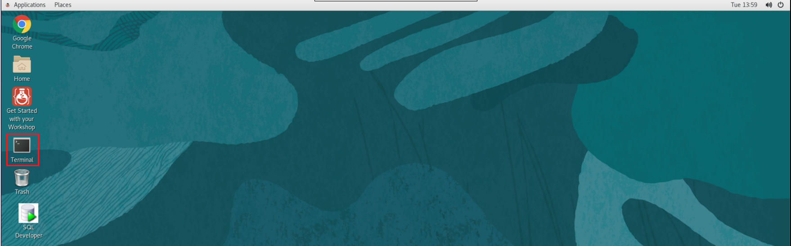

3) Run below commands on the terminal screen.

   ```
    <copy>
    cd /u03/Sample_Files/CSV
    cat user_info.csv
    </copy>
   ```

4) Repeat the steps 1 to 3 in Node2.

5) You will notice that the data in Node1 is different from Node2. We will use this data to understand how an ODI agent will extract the data from file and load it into target database.
    
   - Node1
  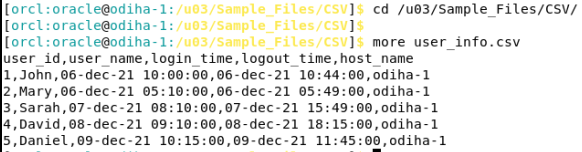

  - Node2
  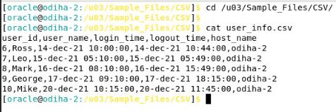

**Note:** In the actual High Availability setup, a shared file storage, which is accessible to Node1 and Node 2, is used for file datasource.


## Task 2: Access Target Table and Truncate the Data in it
1. Open the "SQL Developer" window on desktop in any of the node, right click on "target DB" and click on connect. A connection to target DB is already created in the SQL developer. You can test the connections to the target database. The database credentials are given below.
   
   ```
    <copy>
    username: target
    password: Welcome1#
    </copy>
   ```   

  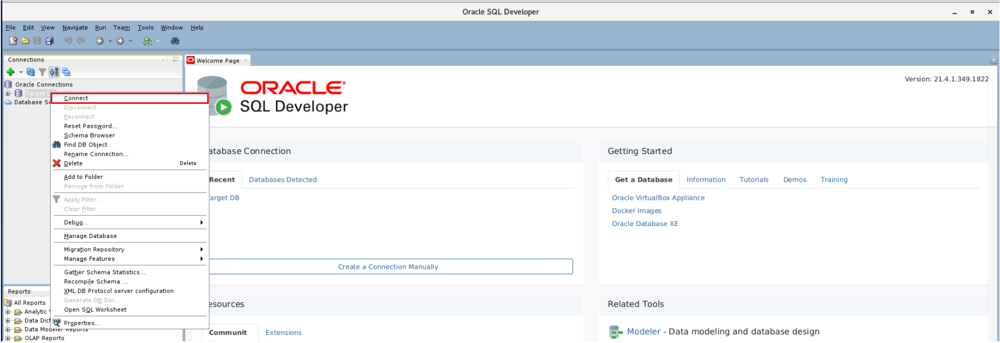

2. Query Builder window will be displayed on screen. Run the below commands in the query builder window.

   ```
    <copy>
    truncate table target.user_login;
    select * from target.user_login;
    </copy>
   ```  

3. As we truncate the data in target table "user_login", we will see that select query will return zero rows.

  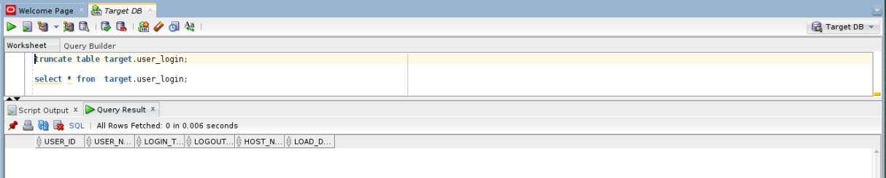

In further modules, we will load the data in this table using ODI job.


## Task 3: Access ODI Instance through No VNC.
1. Once you access the Node 1 instance through No VNC URL, ODI studio is also launched with it. If ODI Studio is not launched, use below command to launch the odi studio.

   ```
    <copy>
    /home/oracle/scripts/odi_studio_startup.sh
    </copy>
   ```  

2. Open the ODI Studio and click on "Connect to Repository".

  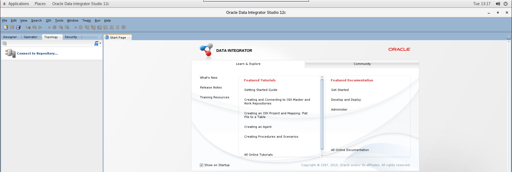

  

3. Click "OK" when the default login username and password appear on screen.

  

Now, you have logged into the ODI Studio.


## Task 4: Test the connection to Source and Target Datasource

1) Drill down the Technologies option in Topology tab.

  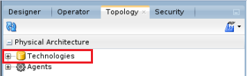

2) Drill down on "File" and double click on "File_Generic" data server. 

  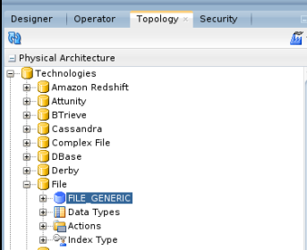 

3) File Generic connection details will be displayed on screen. A connection is already created to the **user\_info.csv** file in path "/u03/Sample_Files/CSV". Click on "Test Connection" to verify the connectivity.

  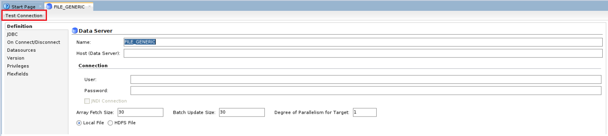

4) Change the physical agent to **OracleDIAgent** and click on "Test".

  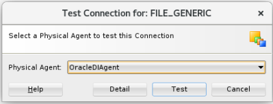

5) Successful connection dialouge box will be displayed on screen. Click "OK" and close the **File_Generic** connection window.

  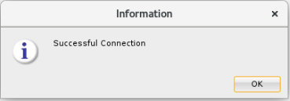

6) Now, drill down the target datasource "Oracle" and verify its connection.
   
  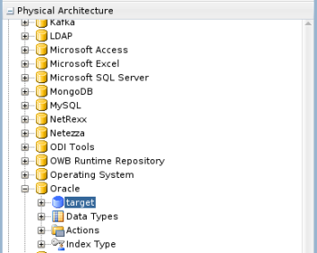

7) Double click on **target** and click on "Test Connection".

  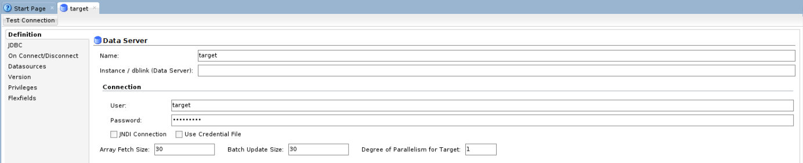

8) Change the physical agent to **OracleDIAgent** and click on "Test".

  

9) Successful connection dialouge box will be displayed on screen. Click "OK" and close the target connection window.


## Task 5: Run ODI Mapping in HA setup

1) Click on Designer tab in ODI studio and drill down on "HA_Demo".

  

2) Drill Down on "Demo" folder, "Mappings" and double click on "Load File to DB".

  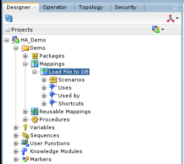

   "Load File to DB" is a simple one-to-one mapping which extracts the data from flatfile and load the data into target database. The target table "User_Login" has one additional column called **load\_date** which loads the system date to the table.

  

3) Click on the "Run" icon to execute the mapping.

  

4) Run box will appear on the screen. Change the Logical Agent to "OracleDIAgent" and click "OK".

  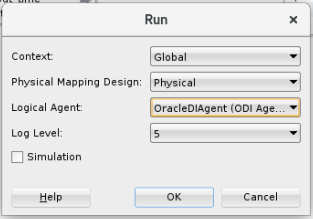

5) Session started message will appear on screen. Click "OK".

  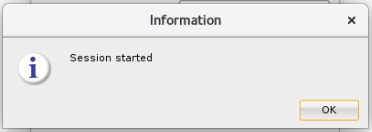

6) Go to operator tab and check the status of the job.

  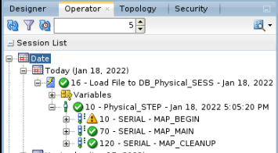

  Green tick mark indicates that the job is successful.

7) Verify the data in target table by running the below SQL query.

   ```
    <copy>
    select * from target.user_login;
    </copy>
   ```
  

  Hostname in above screenshot is "odiha-2". This clearly indicates that the above job is executed by Node2 ODI agent. The output may be different in your lab as the load balancer routes the traffic to the ODI hosts randomly.


You may now [proceed to the next lab](#next).


## Learn More
- [Oracle Data Integrator](https://docs.oracle.com/en/middleware/fusion-middleware/data-integrator/index.html)

## Acknowledgements

- **Author** - Srivishnu Gullapalli, January 2022
- **Contributors** - Amit Kotarkar
- **Last Updated By/Date** - Rene Fontcha, LiveLabs Platform Lead, NA Technology, January 2022


