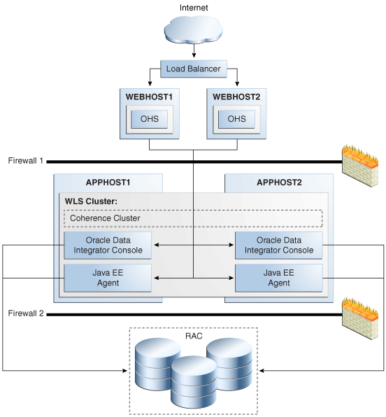

# Introduction

This workshop will help you to understand Oracle Data Integrator (ODI) high availability setup. The user can understand various components of ODI high availability and also learn the configuration steps for ODI high availability.Users can also run ODI jobs and observe the agent functionality.

## About ODI High Availability
Oracle Data Integrator (ODI) is a comprehensive data integration platform that covers all data integration requirements: from high-volume, high-performance batch loads, to event-driven, trickle-feed integration processes, to SOA-enabled data services. Oracle Data Integrator (ODI) 12c, the latest version of Oracle’s strategic Data Integration offering, provides superior developer productivity and improved user experience with a redesigned flow-based declarative user interface and deeper integration with Oracle GoldenGate. 

The high availability setup in ODI provides minimal downtime. When a node is not reachable, it allows execution of ETL jobs through an alternative node. During normal execution, it reduces the load on the agents by routing the ETL jobs to appropriate agent.

Figure below shows a two-node Oracle Data Integrator cluster running on two Oracle WebLogic servers. 

  

The main components of the high availability setup are given below:
  * Load Balancer
  * Weblogic Server
  * ODI on Host 1
  * ODI on Host 2
  * Oracle RAC database
  * Data Connectivity

**Load Balancer**: The load balancer is used to route the traffic between the two ODI hosts.

**Weblogic Server**: Weblogic server is the main component in the HA setup. The cluster deployment and nodemanager protects the ODI components from failure.

**ODI on Host 1 and Host 2** : ODI Agent is installed on the weblogic server in these hosts. A weblogic cluster is configured between these two hosts.

**Oracle RAC database**: The Oracle Data Integrator repositories are protected against failures in the database by using multi data sources. These multi data sources connections are supported in Oracle RAC database.

**Data Connectivity**: Appropriate database, weblogic and ODI ports should be opened for connectivity.

**Note:** For the purpose of this livelabs, the RAC setup is replaced with a single instance database. The database is installed on Host 1.

*Estimated Lab Time*: 3 Hours

### Objectives

- Access an ODI instance
- Job Execution when both Nodes are Running
- ODI Agent Crash

### Prerequisites
* Knowledge on ODI Architecture and administration activities.
* An Oracle Free Tier, Always Free, Paid or LiveLabs Cloud Account

You may now [proceed to the next lab](#next).

## Learn More
- [Oracle Data Integrator](https://docs.oracle.com/en/middleware/fusion-middleware/data-integrator/index.html)

## Acknowledgements

- **Author** - Srivishnu Gullapalli, January 2022
- **Contributors** - Amit Kotarkar
- **Last Updated By/Date** - Rene Fontcha, LiveLabs Platform Lead, NA Technology, January 2021

