# Create and Configure Load Balancer

## Introduction
In this lab you will learn to create a load balancer in OCI and configure it to route the traffic between odiha-1 and odiha-2 hosts.

*Estimated Lab Time*: 1 hour

### Objectives
* Create Load Balancer in OCI
* Choose Backends
* Configure Listener
* Manage Logging
* Modify load balancer entry in /etc/hosts


### Prerequisites
This lab assumes you have:
- A Free Tier, Paid or LiveLabs Oracle Cloud account
- You have completed:
    - Lab: Prepare Setup (*Free-tier* and *Paid Tenants* only)
    - Lab: Environment Setup
    - Lab: Initialize Environment
    - Lab: ODI High Availability Configuration


## Task 1: Create Load Balancer in OCI

1) Login into Oracle cloud free tier account using the credentials in Getting Started Lab and click on hamburger button in the OCI home page. Below is the cloud url.

   ```
    <copy>
    cloud.oracle.com
    </copy>
   ```

  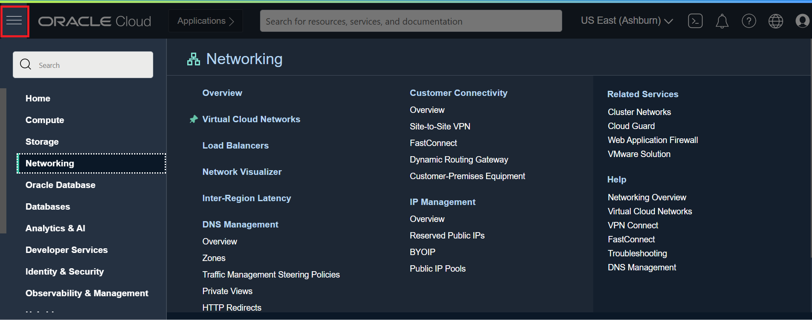

2) Click on Networking tab and then click on load balancer.

  

3) Load Balancer home page will be displayed on screen. Click on Create Load Balancer.

  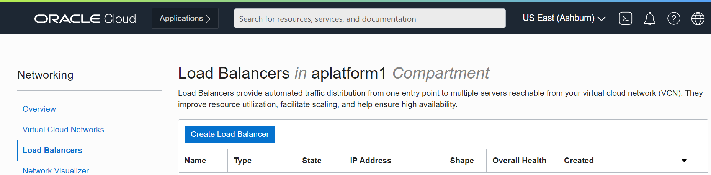

4) Select the load balancer type as "Load Balancer". Scroll down and click on "Create Load Balancer".

  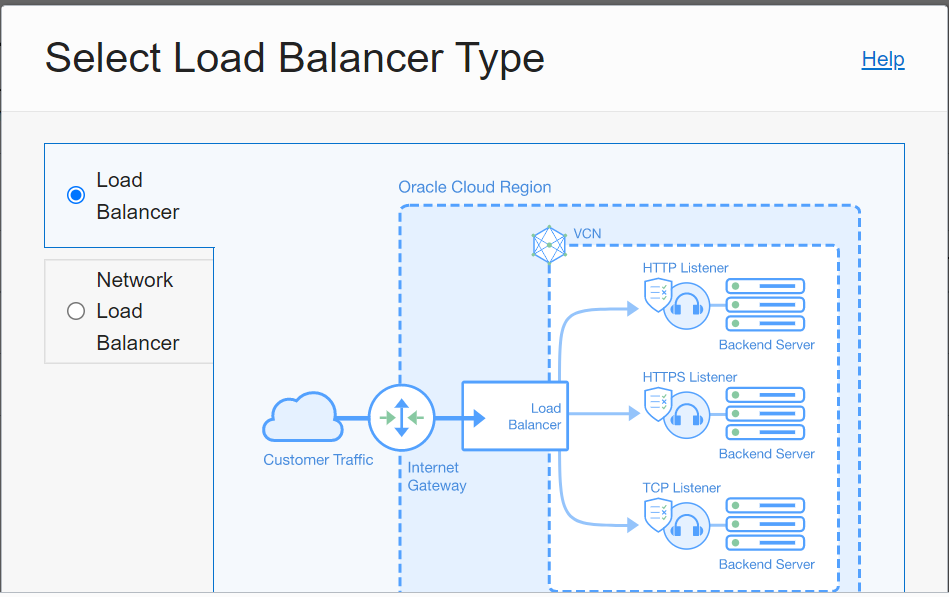

  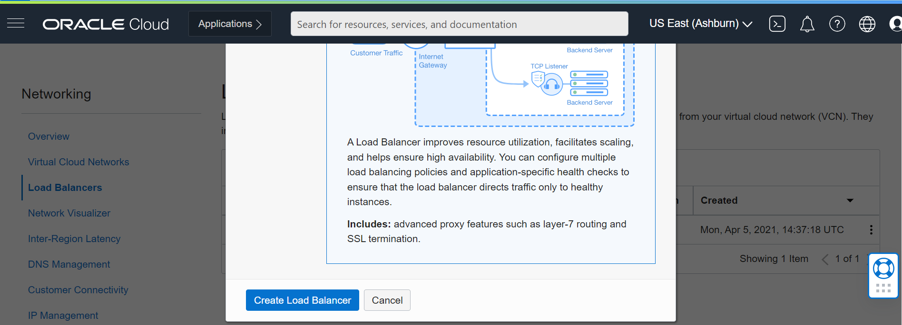

5) Provide load balancer name as lb_odi and select the visibility as private. You can even choose public if you want to use public ip for load balancer.

  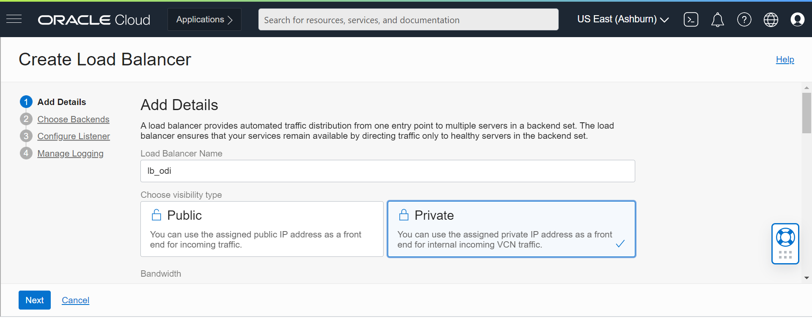

6) Select the shape as flexible and keep the default values for minimum and maximum bandwidth as it is.
    
  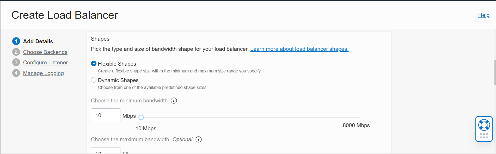

7) Select the **existing network that you used for ODI compute machines and the corresponding subnet**. Click Next.

  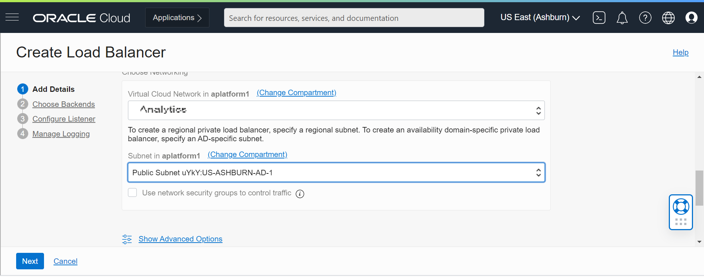


## Task 2: Choose Backends
1. Select load balancer policy as Weighted Round Robin.
   
  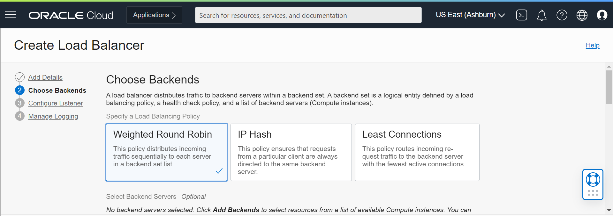

2. Scroll down and click on Add Backends. 

  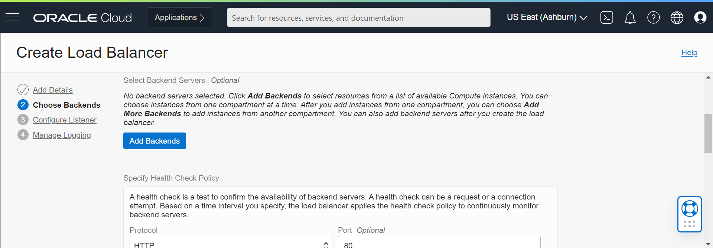 

3. Select odiha-1 and odiha-2 and click on "Add Selected Backends".
   
  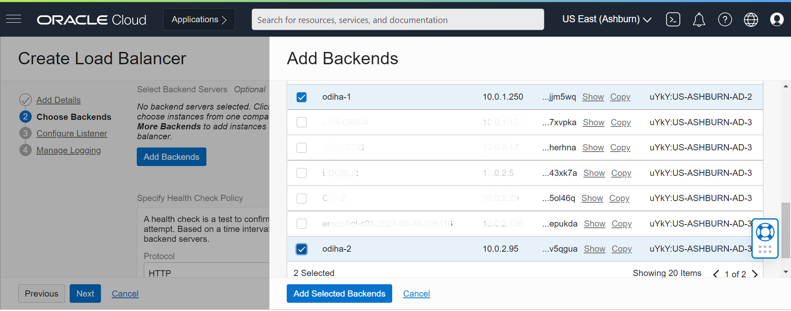

4. The default port is 80, modify the port to 15101.    

   

  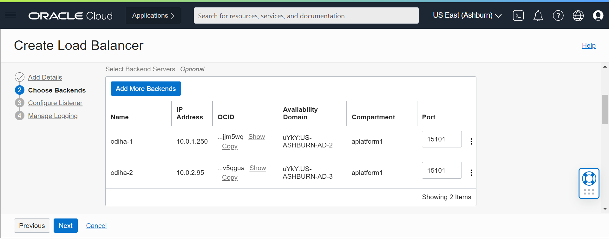 

5. Scroll down and modify the health check policy port to 15101 and add url path as "/oraclediagent/". Click Next.

  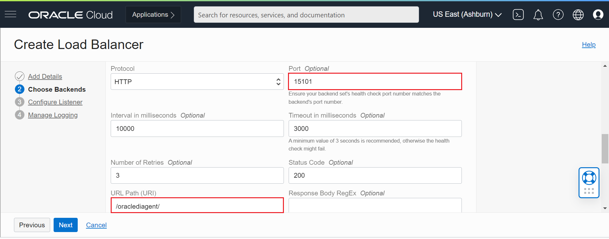 


## Task 3: Configure Listener
1. Keep the default listener name in the configure listener tab. Specify the type of traffic as "HTTP". Click Next.

   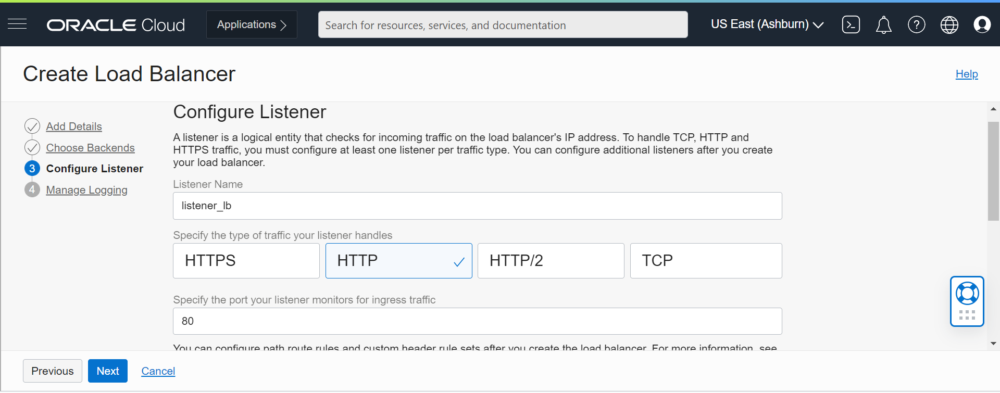

## Task 4: Manage Logging
1. Keep the default values. Select the default Log Group and click "Submit".

   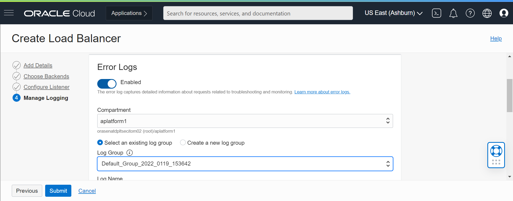

2. The load balancer will be created and status will be changed to Active in some time.
   
   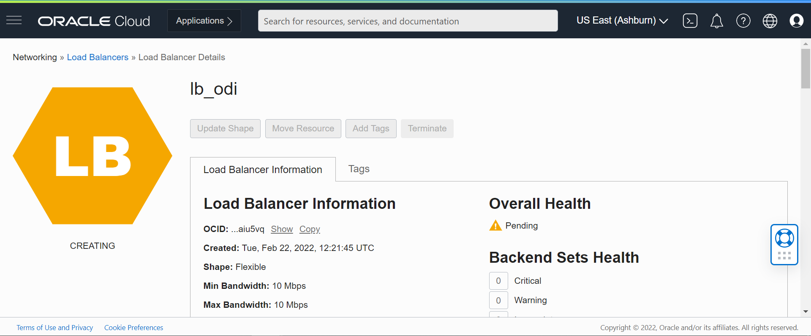

   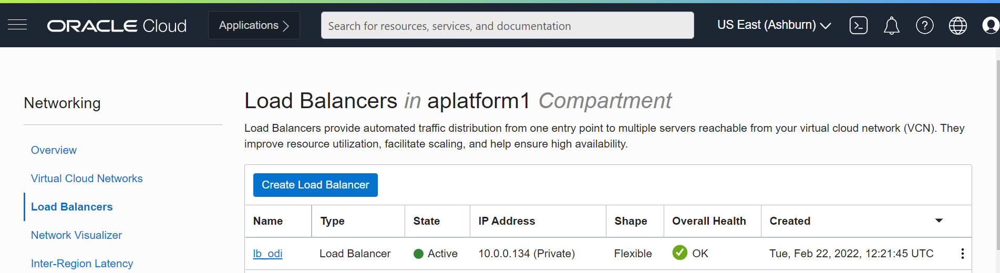

Note down the private/public ip address of the load-balancer.


## Task 5: Modify load balancer entry in /etc/hosts

1) Login into odiha-1 and odiha-2 using novnc console and open the terminal.

   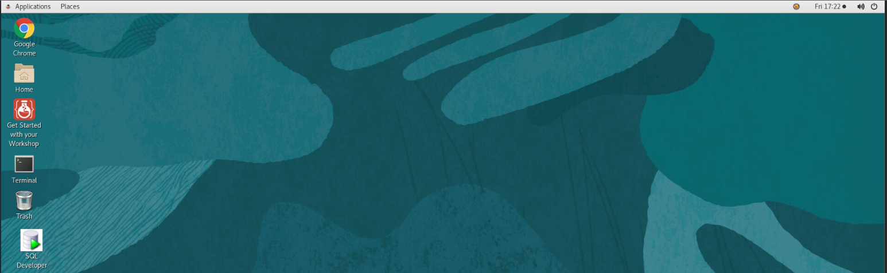

2) Execute the below command to modify the load-balancer entry in odiha-1 and odiha-2 hosts. The load-balancer-ip is the ip address that you obtain in above step.

   **Command:** sudo sed -i '/load-balancer/c\\**load-balancer-ip** load-balancer' /etc/hosts
   
   ```
    <copy>
    Example: sudo sed -i '/load-balancer/c\10.5.3.2 load-balancer' /etc/hosts
    </copy>
   ```

   

3) Verify the data in /etc/hosts using below command.

   ```
    <copy>
    more /etc/hosts
    </copy>
   ```

   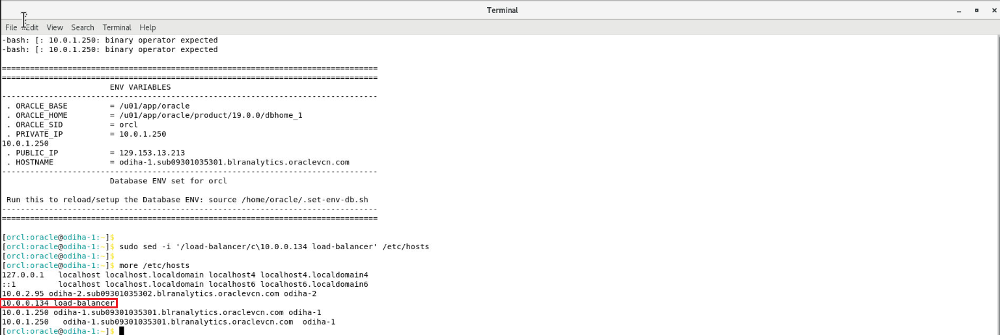

The private ip should be your load balancer ip address.

**Note:**The above steps should be executed in odiha-1 and odiha-2 hosts.

This completes the load balancer setup.


You may now [proceed to the next lab](#next).


## Learn More
- [Oracle Data Integrator](https://docs.oracle.com/en/middleware/fusion-middleware/data-integrator/index.html)

## Acknowledgements

- **Author** - Srivishnu Gullapalli, January 2022
- **Contributors** - Amit Kotarkar
- **Last Updated By/Date** - Rene Fontcha, LiveLabs Platform Lead, NA Technology, January 2022