# Run ODI job when primary ODI server is down

## Introduction
In this lab user will bring down the primary ODI services and understand how the secondary ODI agent will execute the job and vice versa.

*Estimated Time*: 15 minutes

### Objectives
In this lab, you will learn
* Shutdown the Primary ODI Server
* Run ODI Job when Primary Agent is Down
* Start the Primary ODI Server

### Prerequisites
This lab assumes you have completed:
    - Lab: Prepare Setup
    - Lab: Environment Setup
    - Lab: Initialize Environment
    - Lab: ODI HA Configuration
    - Lab: Run ODI Job when both Nodes are Up


## Task 1: Shutdown the primary ODI server

1. Open the chrome browser on your desktop and navigate to the *WebLogic Server Administration Console* login page using the below URL, click on the *Username* field, and provide the credentials below to log in. The WebLogic is configured on 7005 for this lab.

    - URL

    ```
      <copy>http://odiha-1:7005/console</copy>
    ```  

    - Username

    ```
      <copy>weblogic</copy>
    ```

    - Password

    ```
      <copy>Welcome1#</copy>
    ```
    
    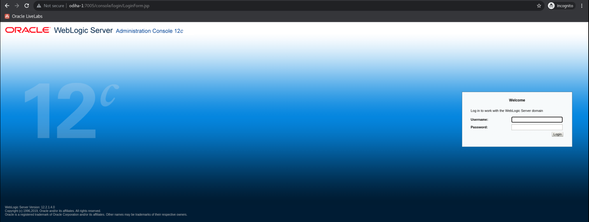

2. On the WebLogic home page, click on "Servers".

  

3. "Summary of Servers" will be displayed on the screen. Click on the "Control" tab.

  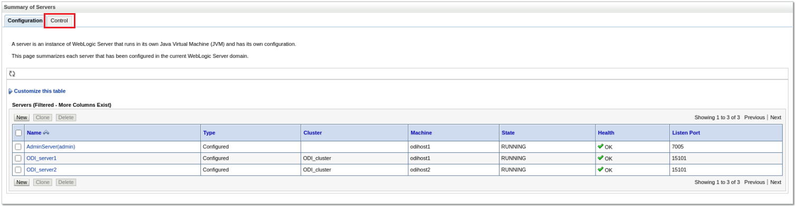

4. Select ODI_server1, shutdown and **Force shutdown now** option.

  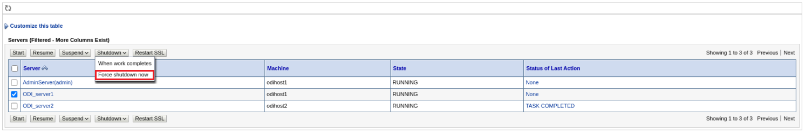

5. Refresh the page and the **ODI_server1** status will be changed to SHUTDOWN.

  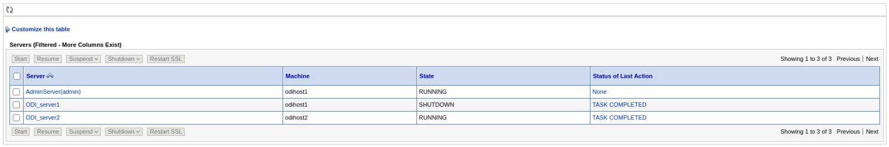

Now, the primary ODI server is down, you can execute the ODI mapping and observe that the ODI server in node2 will execute the ODI jobs and will act as the primary node.


## Task 2: Run ODI job when primary agent is down

1. Open ODI Studio in Node1 or Node2, navigate to Designer tab and drill down on "HA_Demo".

  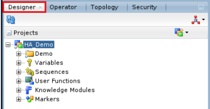

2. Drill Down on the "Demo" folder, "Mappings" and double-click on "Load File to DB".

  

   "Load File to DB" is a simple one-to-one mapping that extracts the data from a flat file and loads the data into the target database. The target table "User_Login" has one additional column called **load\_date** which loads the system date to the table.

  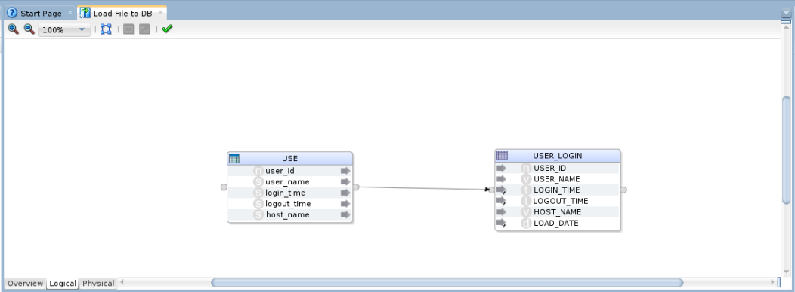

 **Note:** The truncate target table is set to true in ODI Mapping because of which only the latest run data will be present in the target table. If historical data is required, change this option to false.

   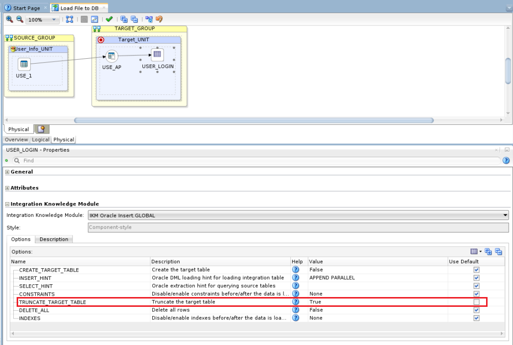

3. Click on the "Run" icon to execute the mapping.

  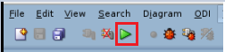

4. Run box will appear on the screen. Change the Logical Agent to "OracleDIAgent" and click "OK".

  

5. Session started message will appear on the screen. Click "OK".

  

6. Go to the operator tab and check the status of the job.

  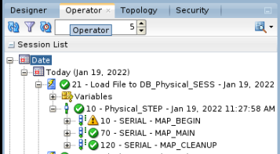

  A green tick mark indicates that the job is successful.

7. Verify data in the target table by running the below SQL query.

   ```
    <copy>
    select * from target.user_login;
    </copy>
   ```
  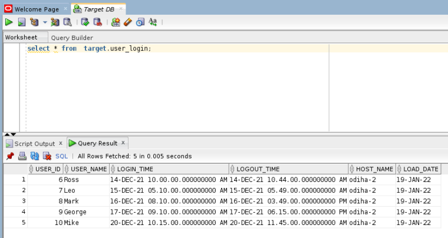
 

  the hostname in the above screenshot is "odiha-2". This indicates that the above job is executed by the Node2 ODI agent. As the primary ODI server is down the job is routed to the Node2 ODI server.


## Task 3: Start the primary ODI server

1. Login to **WebLogic Admin page** and go to the control tab in the **Summary of Servers** page. Select **ODI_server1** and click on start.

  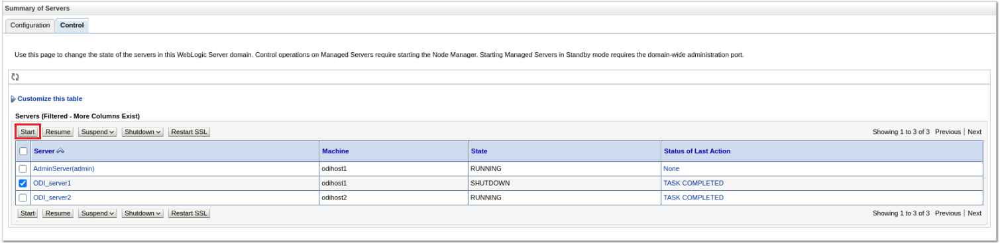

2. Refresh the page after some time and the ODI server state will be changed to "RUNNING".

  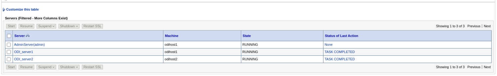

3. Shut down the "ODI_Server2", run the ODI job using steps 3 to 7 in Task 2, and verify the data in SQL Developer.

  

  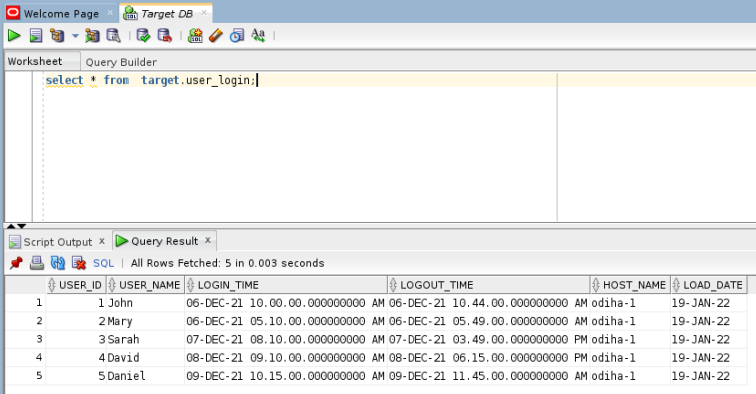

Now, the hostname in the above screenshot is "odiha-1".  This indicates that the above job is executed by the Node1 ODI agent.

Congratulations, you have completed the workshop!

## Learn More
- [Oracle Data Integrator](https://docs.oracle.com/en/middleware/fusion-middleware/data-integrator/index.html)

## Acknowledgements

- **Author** - Srivishnu Gullapalli, Senior Solution Engineer, NA Technology, September 2022
- **Contributors** - Amit Kotarkar, Senior Solution Engineer, NA Technology, September 2022
- **Last Updated By/Date** - Rene Fontcha, LiveLabs Platform Lead, NA Technology, September 2022


