# Access and Configure ODI Instance

## Introduction
This lab will show you how to access an ODI instance using Apache Guacamole and configure ODI Studio

*Estimated Lab Time*: 30 minutes

### Objectives
* Access an ODI Instance through Apache Guacamole
* Configure ODI Studio
* Import Mappings and Run Initial Load
* Test the Environment

### Prerequisites
This lab assumes you have:
- A Free Tier, Paid or LiveLabs Oracle Cloud account
- You have completed:
    - Lab: Prepare Setup (*Free-tier* and *Paid Tenants* only)
    - Lab: Environment Setup

## Task 1: Validate That Required Processes are Up and Running.
1. Now with access to your remote desktop session, proceed as indicated below to validate your environment before you start executing the subsequent labs. The following Processes should be up and running:

    - Database Listener
        - LISTENER
    - Database Server Instance
        - orcl

2. Validate that expected processes are up. Please note that it may take up to 5 minutes after instance provisioning for all processes to fully start.

    ```
    <copy>
    ps -ef|grep LISTENER|grep -v grep
    ps -ef|grep ora_|grep pmon|grep -v grep
    systemctl status oracle-database
    </copy>
    ```

3. If you see questionable output(s), failure or down component(s), restart the service accordingly

    ```
    e.g. Restarting the DB and DB Listener
    <copy>
    sudo systemctl restart oracle-database
    </copy>
    ```
4. On the right preloaded with the *Oracle Data Integrator*.

    

## Task 2: Configure ODI Studio  

1. From the same remote desktop session, Click on "Connect to Repository".

  

2. Type in the wallet password and click OK

    ```
    Password: <copy>Welcome1#</copy>
    ```

    

3. Click "OK" when the default login username and password appear on screen.

  

4. Go to the Designer tab and select import to open the import wizard.

  

5. Select "Smart Import" option and click ok.

  

6.  Enter the path to the **ODI_Models.xml** file (`/home/oracle/ODI_Mappings_V1/ODI_Models.xml`) and click "Next".

  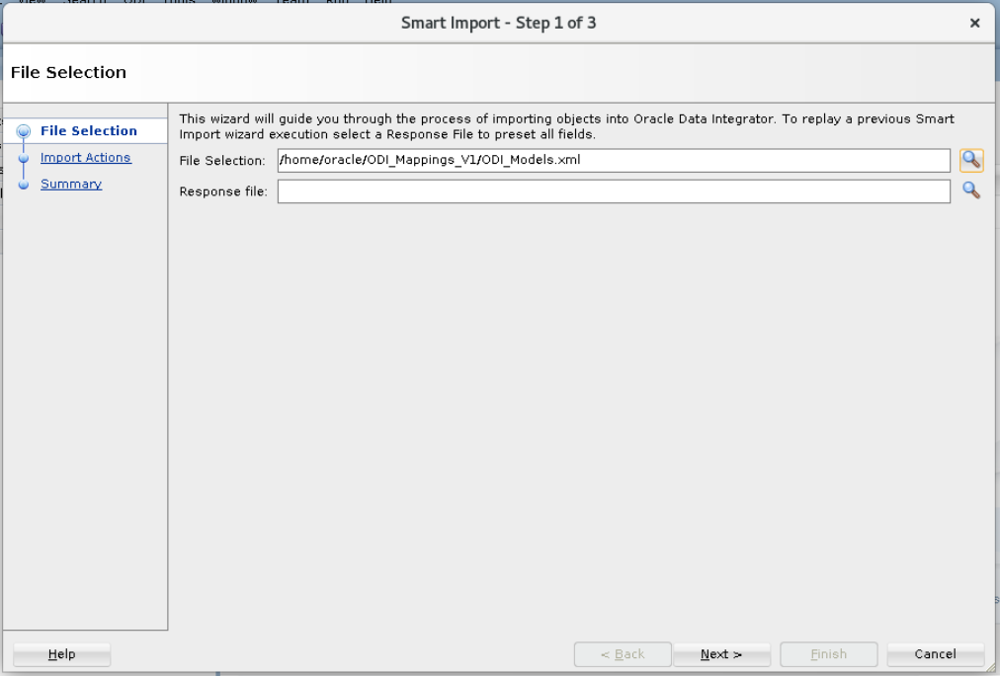

  The import will take approximately 5 minutes

7. Provide the export key and click "OK". Export key is given below.

  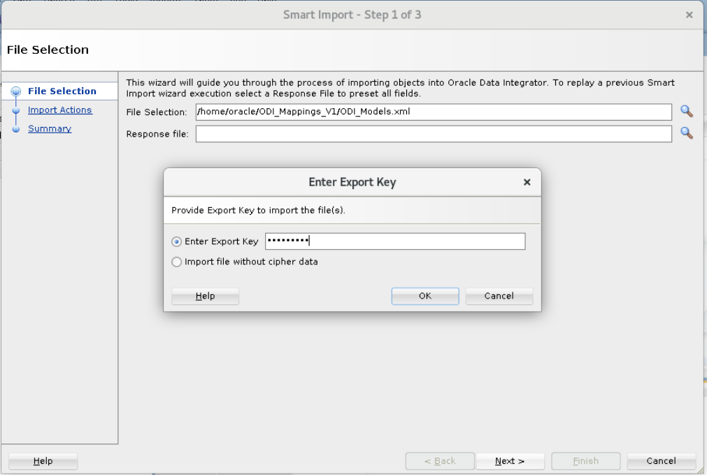   

  Unless specified otherwise, the export key is
    ```
    <copy>Welcome1#</copy>
    ```

8. Click "Next" on the next screen and then click on Finish.

  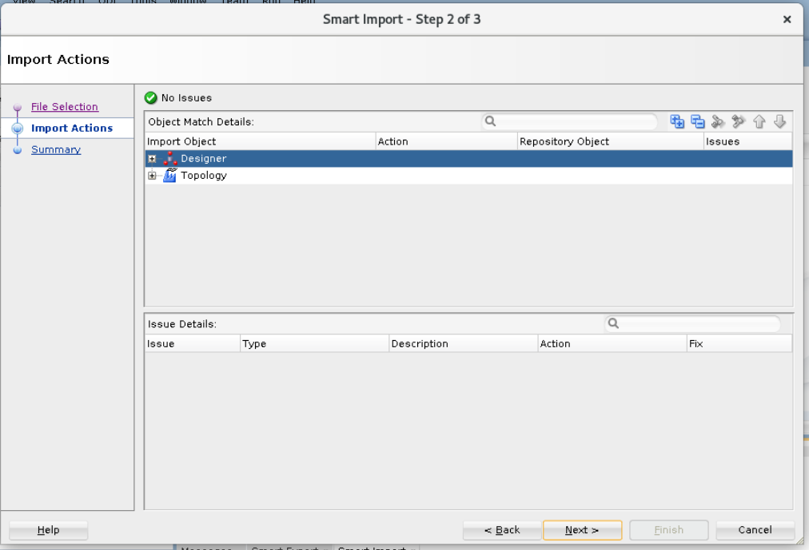

  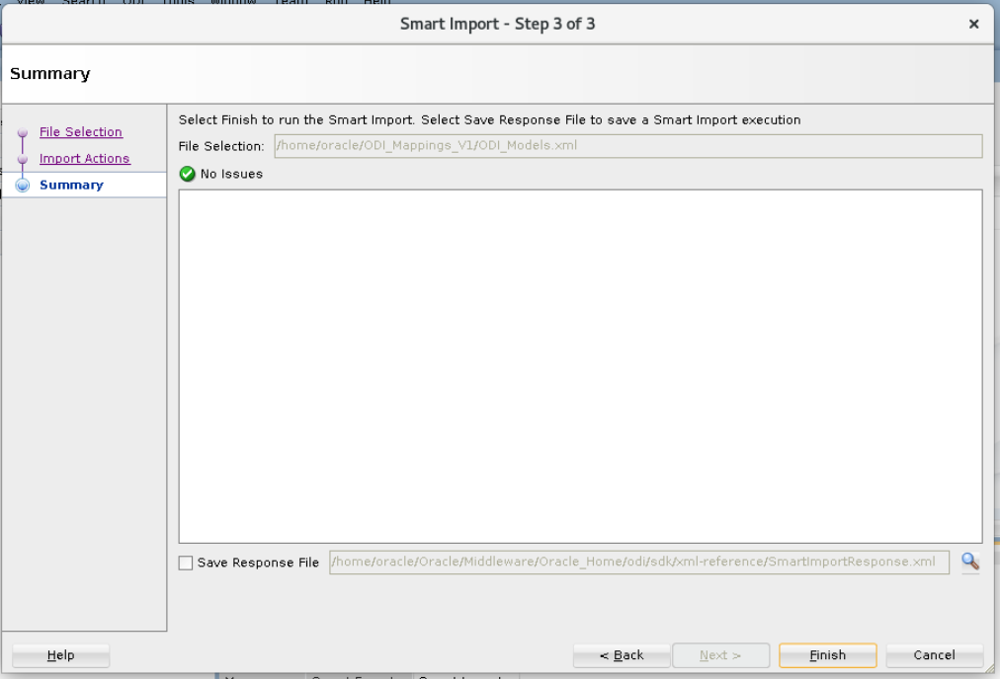

9. Click close on the next screen.

  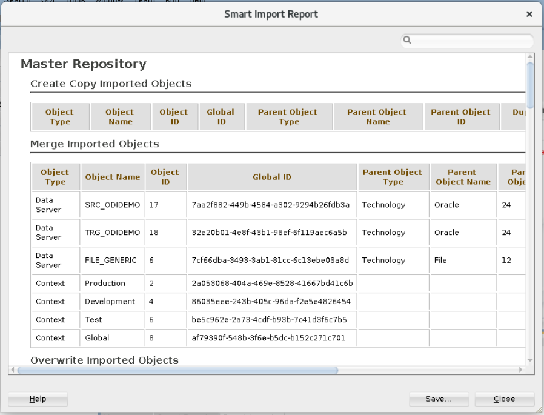

## Task 3: Import Mappings and Run Initial Load

1. If you are new to ODI, import these mappings using smart import. Select import to open the import wizard

    

2. Select "Smart Import" option and click ok.

  

3.  Enter the path to the **`ODI_Beginner_Labs.xml`** (or) **`ODI_Advance_Labs.xml`** file (`/home/oracle/ODI_Mappings_V1/ODI_Beginner_Labs.xml`) or (`/home/oracle/ODI_Mappings_V1/ODI_Advance_Labs.xml`) and click "Next".

    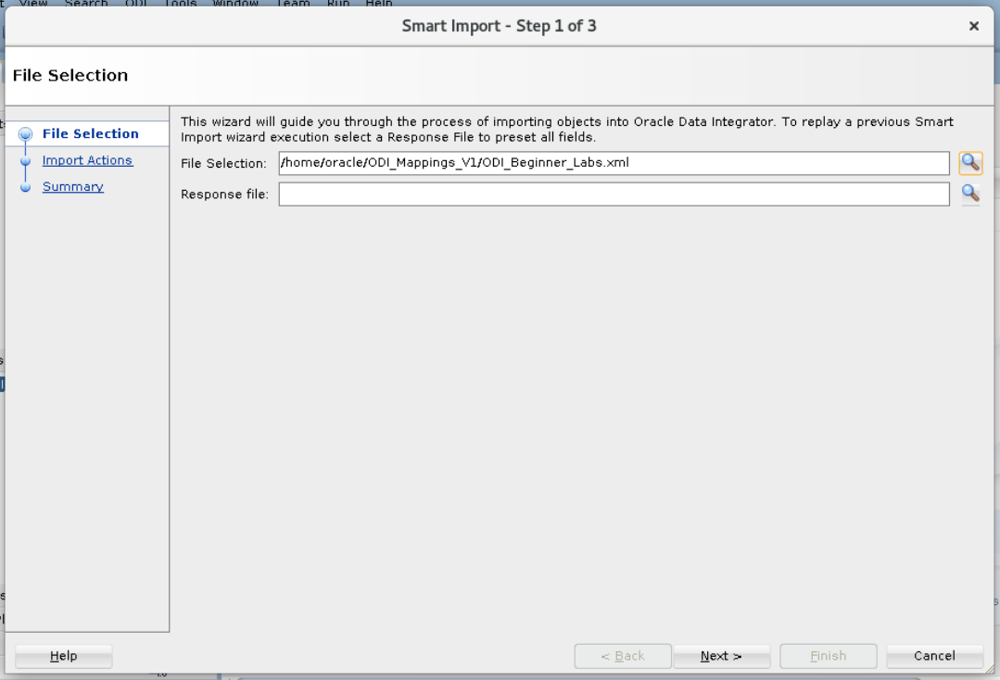  

4. Click "Next" on the next screen, provide the Export key and then click on Finish.

    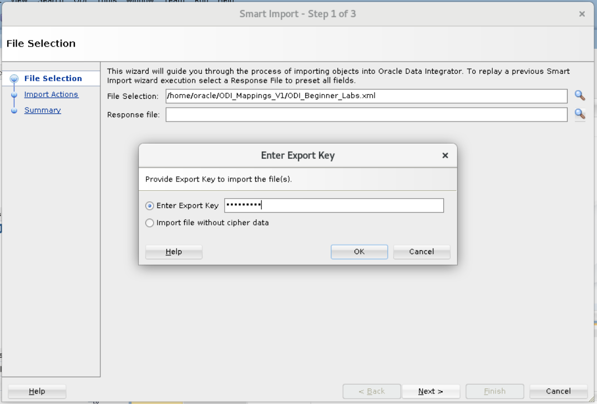  

    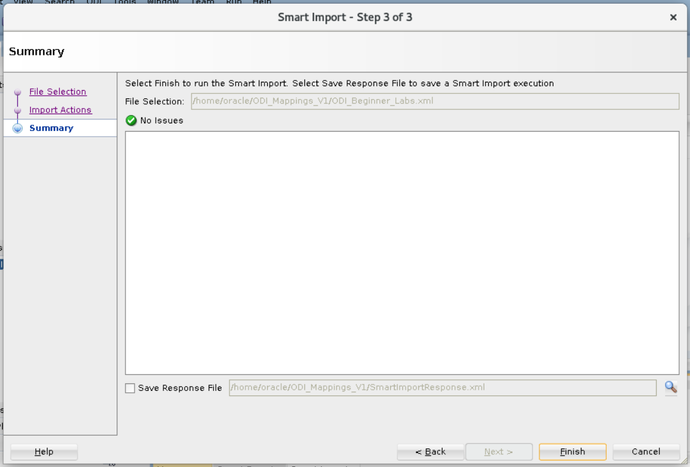  

5. Click close on the next screen.

    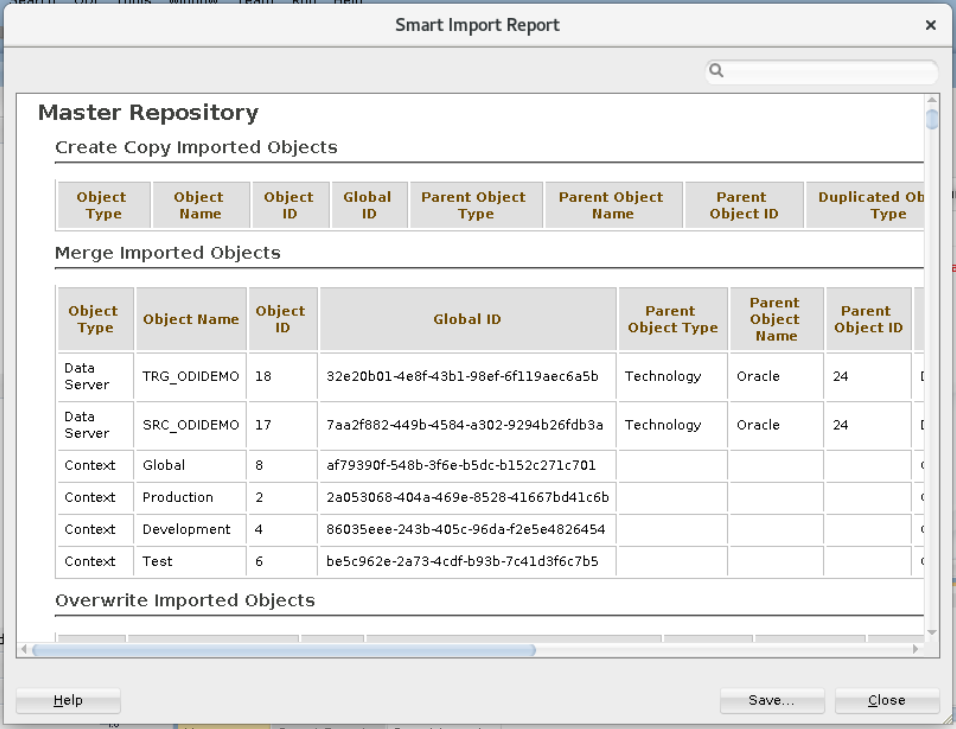

6. Click on Refresh button in the Designer tab and drill down on project to verify if required mappings are imported.

    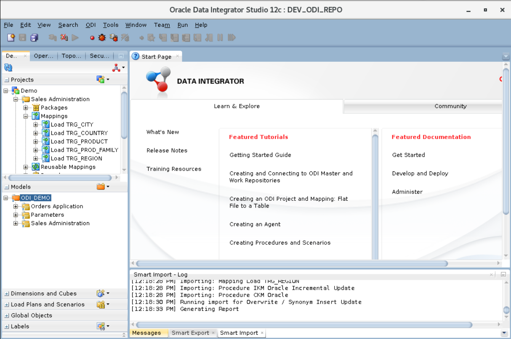

7. Drill down, right click on "**`Environment_Reset`**" package an click on "Run".

  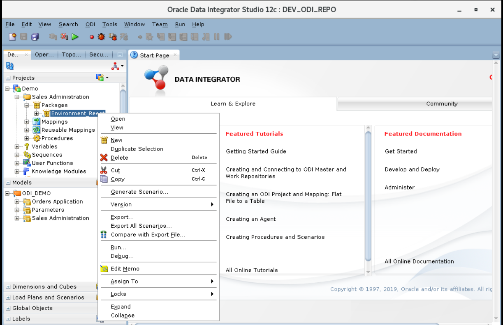   

   Click "OK" on the Run box and Information box.

  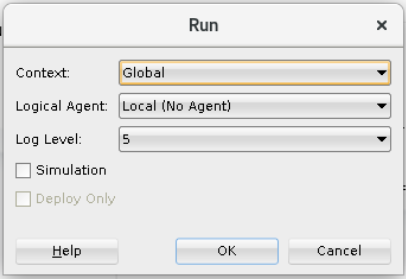   

  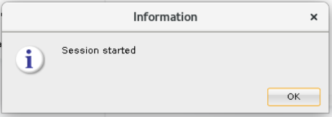   

8. You can check the status of the job in "Operator" tab.

  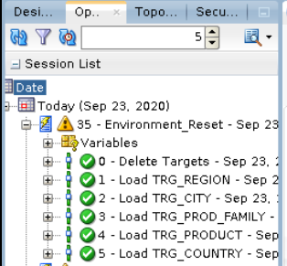  


## Task 4: Test the environment

1. Expand **Model**, **Parameters** and right-click on **`SRC_AGE_GROUP`** and select **View Data**

  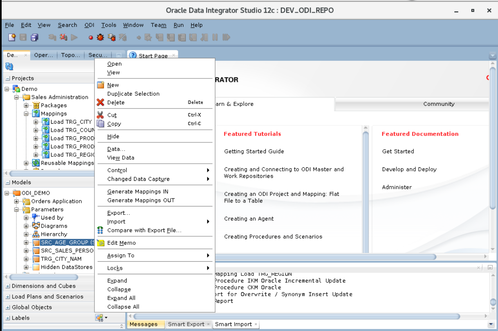   

2. If you see data your environment is ready to use

  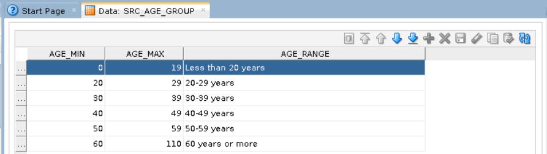      

You may now proceed to the next lab.

## Appendix 1: Managing Startup Services

1. Database service (Database and Standard Listener).

    - Start

    ```
    <copy>
    sudo systemctl start oracle-database
    </copy>
    ```
    - Stop

    ```
    <copy>
    sudo systemctl stop oracle-database
    </copy>
    ```

    - Status

    ```
    <copy>
    systemctl status oracle-database
    </copy>
    ```

    - Restart

    ```
    <copy>
    sudo systemctl restart oracle-database
    </copy>
    ```

## Learn More
- [Oracle Data Integrator](https://docs.oracle.com/en/middleware/fusion-middleware/data-integrator/index.html)

## Acknowledgements

- **Author** - Narayanan Ramakrishnan, December 2020
- **Contributors** - Srivishnu Gullapalli
- **Last Updated By/Date** - Arabella Yao, Product Manager, Database Product Management, March 2022
