# Create an ODI Instance

## Introduction
This lab will show you how to create an ODI instance from a Marketplace image and configure ODI Studio

### Objectives
* Create an ODI Instance from Marketplace
* Configure ODI Studio

## Task 1: Create an ODI instance from OCI Marketplace

1. Click the **Navigation Menu** in the upper left and select **Marketplace**.

	
2. OCI Marketplace hosts many applications ready to be deployed.
   Search for “Oracle Data Integrator”.

    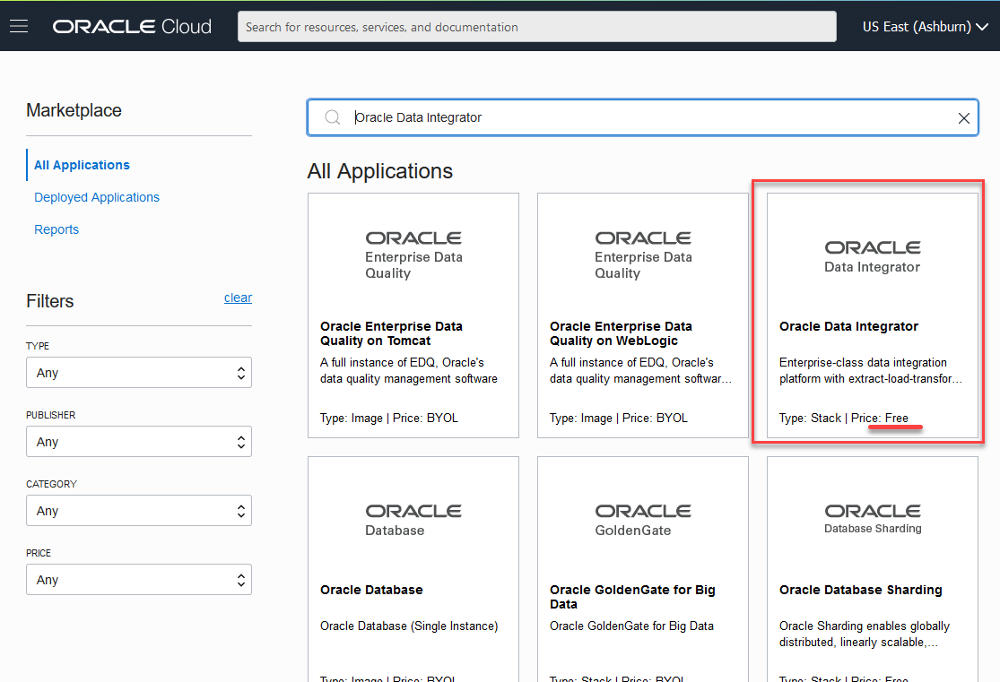

   If there are more than one listing then pick the one which says “Free”

3. Choose the ODI listing. A page displays describing the ODI product overview and usage instructions. There is also a link to a detailed user guide for deploying the marketplace image.
Make sure you have chosen the correct **COMPARTMENT**
    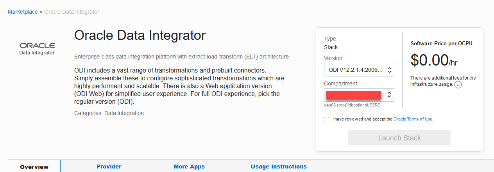
    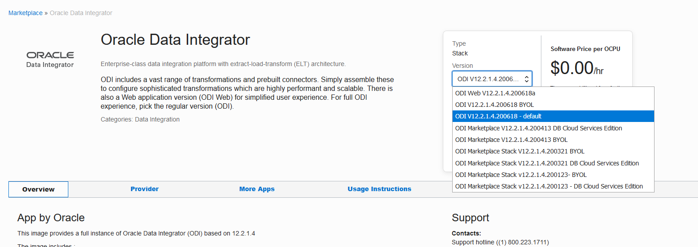    
    Select the latest free version (*not BYOL or Web versions*) from the list. If in doubt then check with your instructor for which version to use for this workshop.

    Accept the Terms&Conditions and click **Launch Stack**
    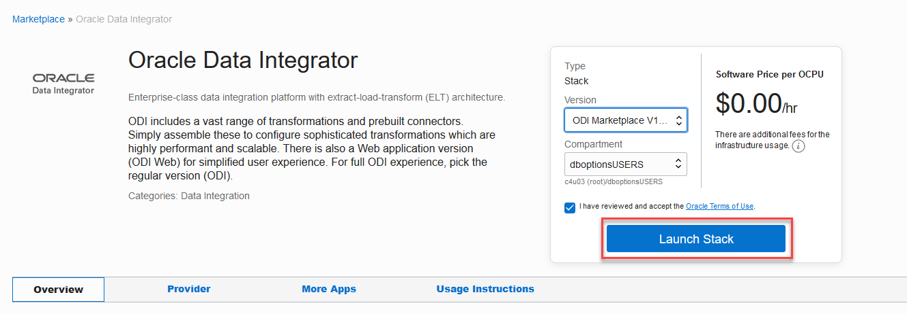

4. Add your initials to the **Name** field so you can easily identify your Instance. Click **Next**
    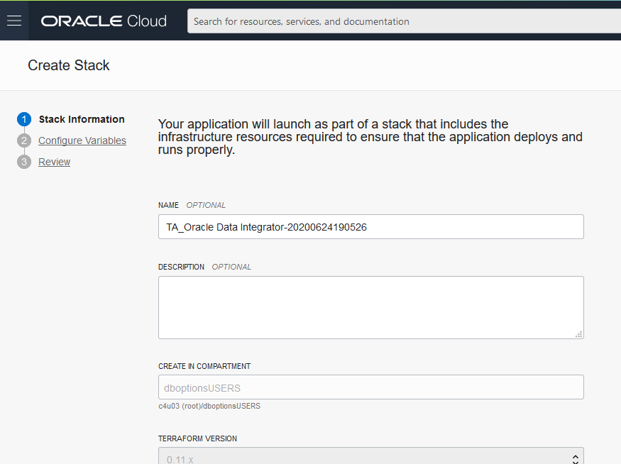    

5. ***IMPORTANT: If your administrator has created a network then use that network rather than creating a new one.***

    Select *Create an embedded ODI repository*. Embedded repository uses MySQL DB included in the compute instance. It is much simpler and good enough for the workshop. In practice an external database (autonomous database or DBCS) will be used for the ODI repository. 

    Add your initials to the **Resource Display Name Prefix** field so that you can identify your compute instance later.
    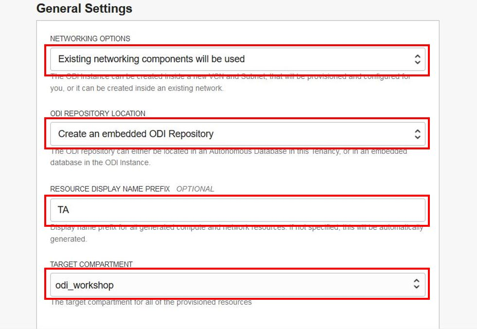

    Scroll down and enter *Network Configuration* info. (*Check with your administrator/instructor for which network to use*)
    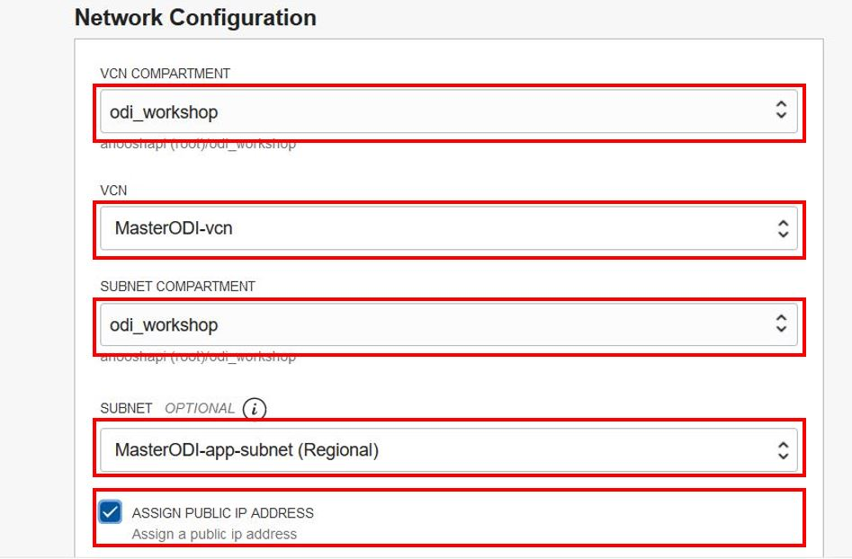

6. Scroll down to **ODI Instance Settings** and choose the
    * **VM Shape** (*Check with your administrator/instructor for which shape to use*),
    * **SSH Key**: Paste the Public Key you created earlier (it should be only ONE line)
    * **Availability Domain**: (*Check with your administrator/instructor for which availability domain to use*)
    * **VNC Password**: create and remember a password to access your VNC environment (This password will not be accessible again and is required to access the VNC from which to run ODI Studio)
    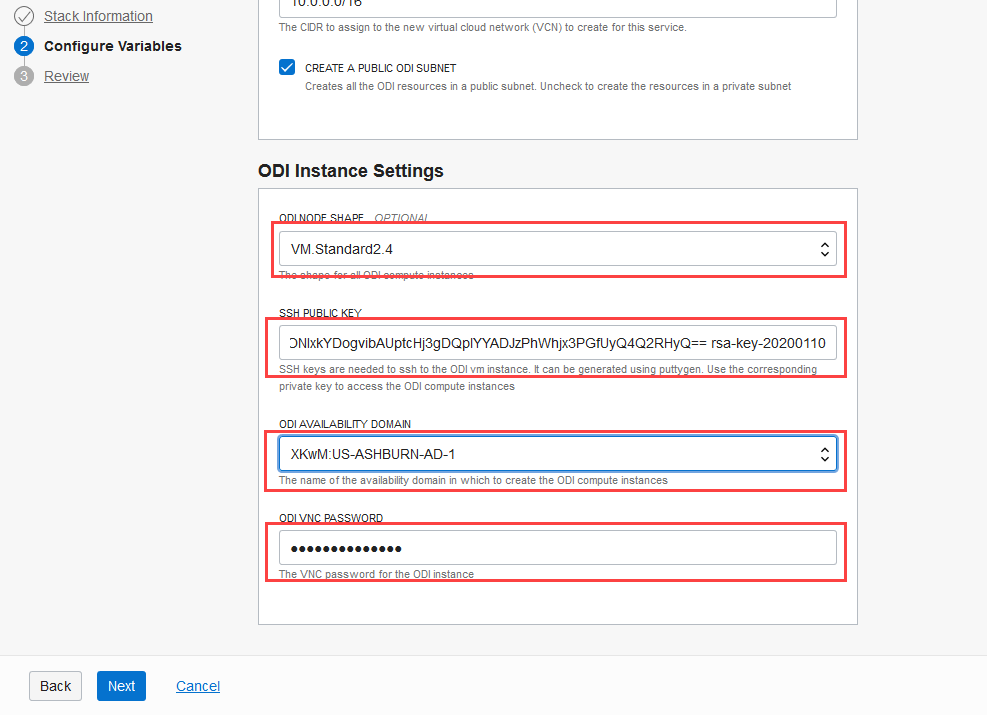

7. Click **NEXT** and then click **CREATE** in the next page

8. The Stack will get created and a job should have started to create other resources. If you don't see any job created automatically then go to "Terraform Action" and click "Apply" to start the job. Scroll down for the JOB logs:
    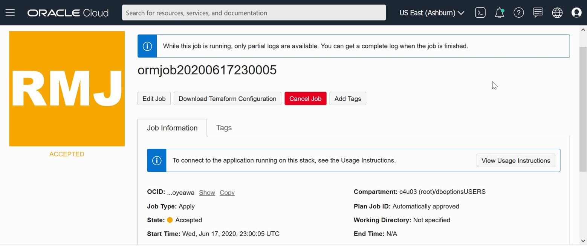

    Your instance will have your initials as a Prefix (provided you added them as instructed)
    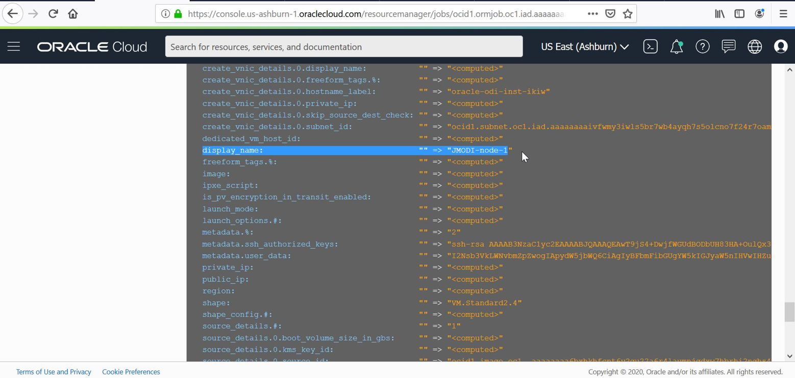

## Task 2: Configure ODI Studio and import training repository

1. Click the **Navigation Menu** in the upper left, navigate to **Compute**, and select **Instances**.

	

2. Search for your instance by *Display Name*. Ensure you have chosen the correct *Region* and *Compartment*

    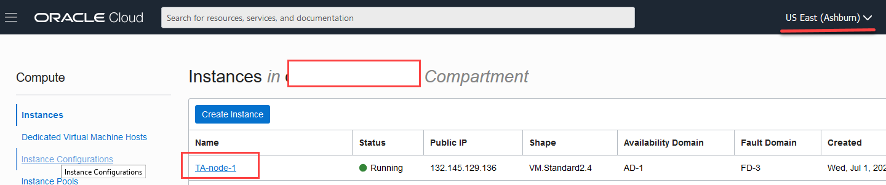     

3. Select the Instance Detail page by clicking the Name

4. Copy the Public IP Address. This is needed to access the ODI Instance
           

5. You will need a VNC viewer for the following steps

**Mac**
If you are using an Apple Mac, you can use the <a href="https://support.apple.com/guide/mac-help/share-the-screen-of-another-mac-mh14066/mac" "target=\_blank"> Screen Sharing application </a>. On other operating systems you will need a suitable VNC viewer.

**Windows**
To install a VNC viewer for Windows
<a href="https://tigervnc.org/TigerVNC" "target=\_blank"> TigerVNC</a> is available from *My Desktop* for Oracle employees    

This example uses TigerVNC

Open the VNC viewer and enter the Public IP Address for your compute Instance
    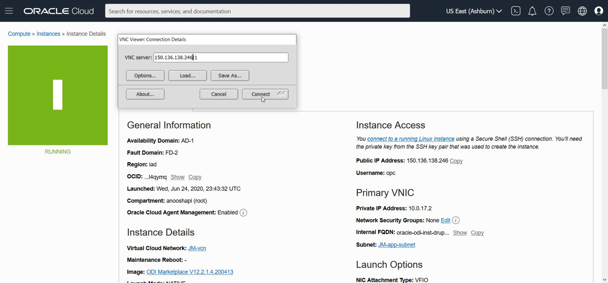

6. Enter the VNC Password you added when creating the ODI Instance

    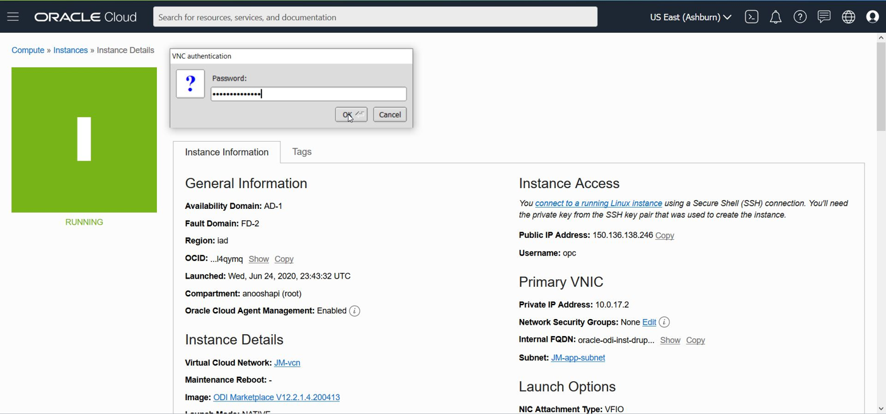  

7. You will be connected to the ODI instance and you will see the Desktop. Click through the *Welcome* screen on the first access
    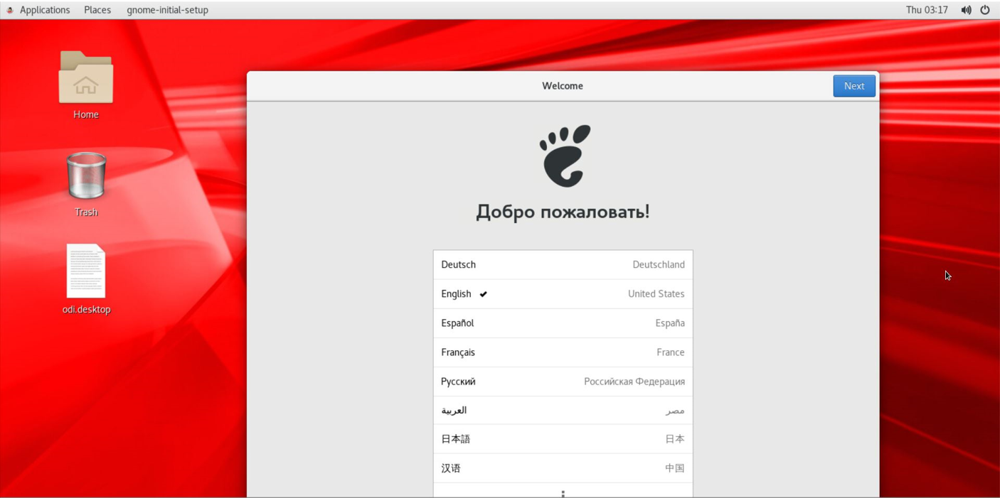     

8. Right-click in the Desktop and open a **Terminal**. Enter the following commands:
  ````
  <copy>
  cd /home/oracle/Downloads
  wget https://objectstorage.us-ashburn-1.oraclecloud.com/p/jyHA4nclWcTaekNIdpKPq3u2gsLb00v_1mmRKDIuOEsp--D6GJWS_tMrqGmb85R2/n/c4u04/b/livelabsfiles/o/labfiles//ODI12c_training_master_repo.zip
  wget https://objectstorage.us-ashburn-1.oraclecloud.com/p/jyHA4nclWcTaekNIdpKPq3u2gsLb00v_1mmRKDIuOEsp--D6GJWS_tMrqGmb85R2/n/c4u04/b/livelabsfiles/o/labfiles/ODI12c_training_work_repo.zip
  wget https://objectstorage.us-ashburn-1.oraclecloud.com/p/jyHA4nclWcTaekNIdpKPq3u2gsLb00v_1mmRKDIuOEsp--D6GJWS_tMrqGmb85R2/n/c4u04/b/livelabsfiles/o/labfiles/ODI12c_Sales_data.zip

  unzip ODI12c_Sales_data.zip

  ls -al
  </copy>
  ````
    
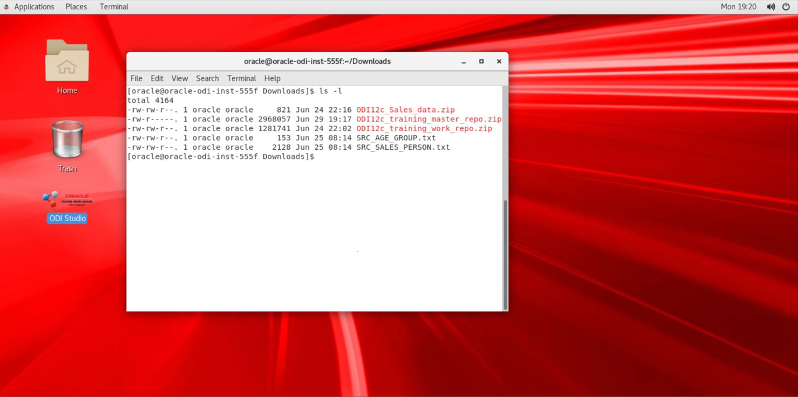  

All files as shown in the screenshot should be present in the directory      

9. It can take up to **30 minutes** for the configuration of the ODI repository to complete. This process is running in the background and you will not be able to launch ODI Studio until the configuration is completed.

Approximately 1/3 of the way through the configuration the **odiConfigure.log** file is created and will begin to be populated with progress entries. You can examine this log if you would like to follow the progress of the ODI repository configuration:

  ````
  <copy>
  cd $MW_HOME
  cd ../logs
  tail -f odiConfigure.log
  </copy>
  ````
The last log update will be **...Scheduler started for work repository WORKREP on Agent OracleDIAgent**

10. Launch ODI Studio from the Desktop
    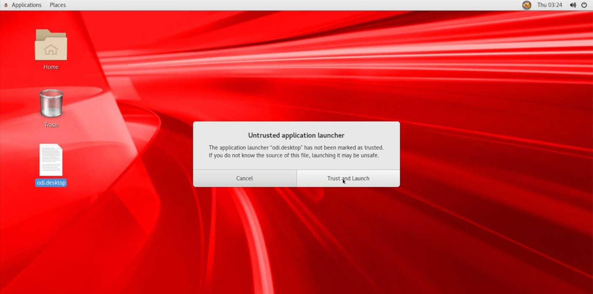

11. Click **No** to *Import from a previous ODI installation*  

    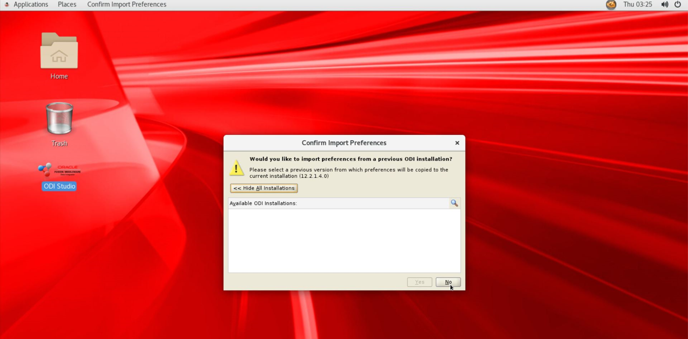

12. Click the radio button to *store passwords without secure wallet*

    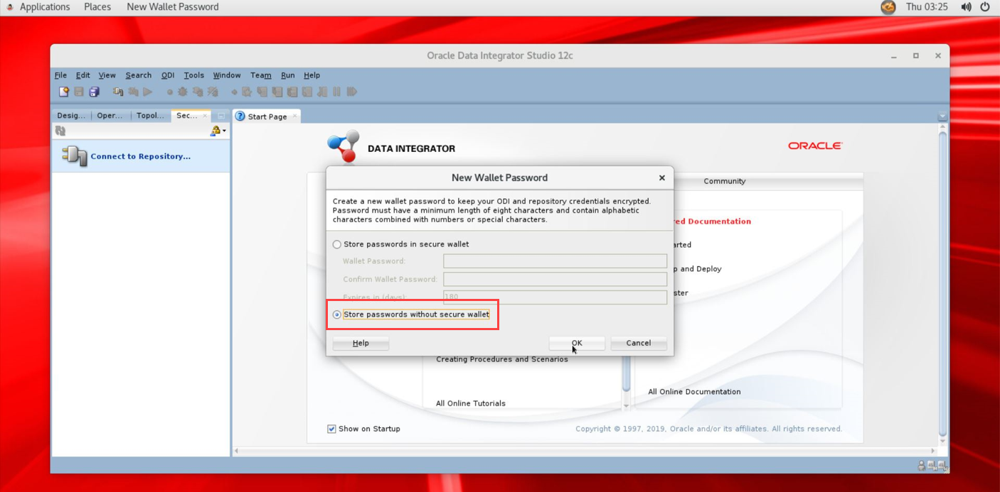

13. Connect to the ODI repository (it will be empty)
    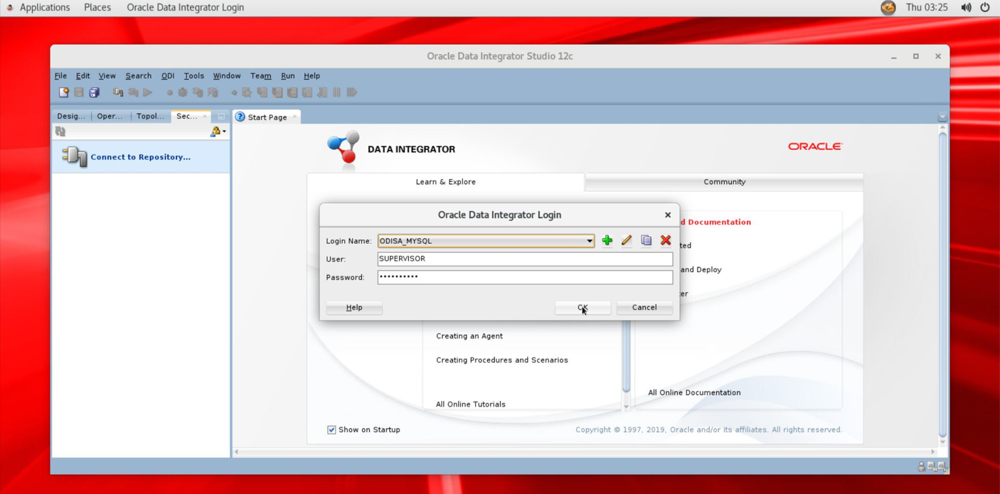     

**Note** The first time you connect to the ODI repository, it may take up to 5 minutes    

14. Select Import to open the Import Wizard

    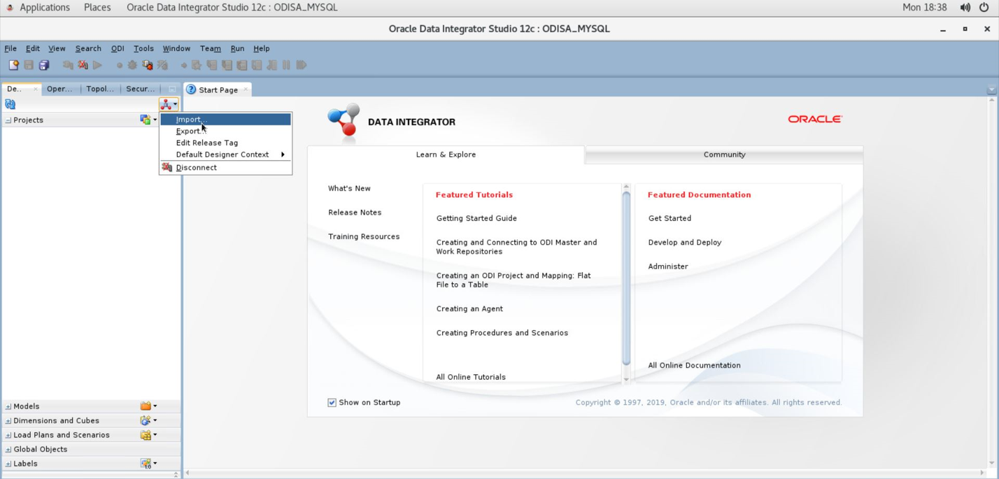

15. Select *Import the Master Repository*    

    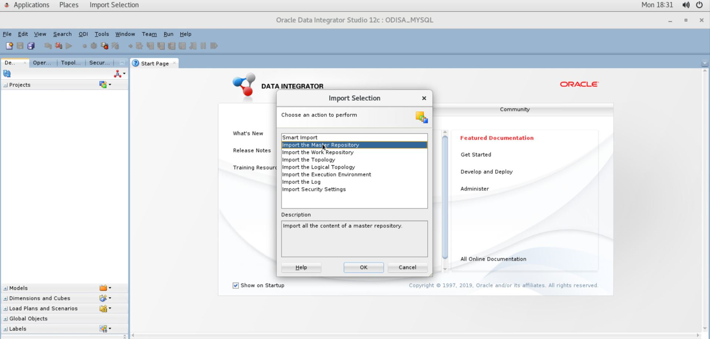

16. Select the radio button *import from a zip file* and then enter the path to the **ODI12c\_training\_master\_repo.zip** file (/home/oracle/Downloads/ODI12c\_training\_master\_repo.zip if you followed the suggestions)

    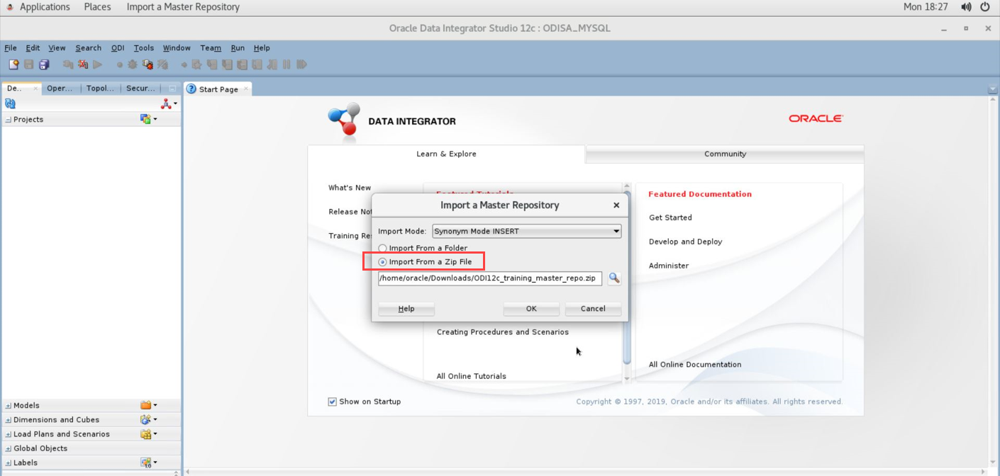  

The import will take approximately 5 minutes

17. Click **Close** after import completes successfully
    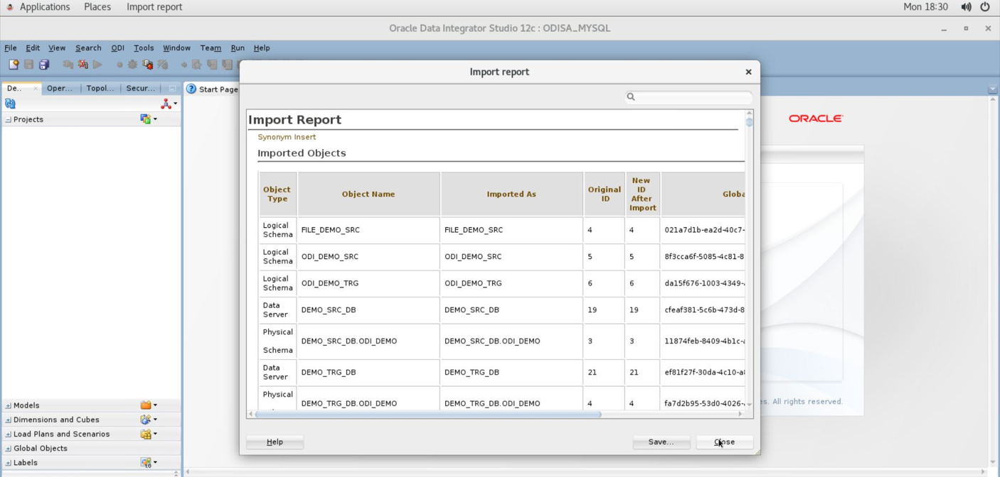      

## Task 3: Configure connections

1. Open the **Topology** Tab and expand **Physical Architecture \-\> Technologies \-\> Oracle**

    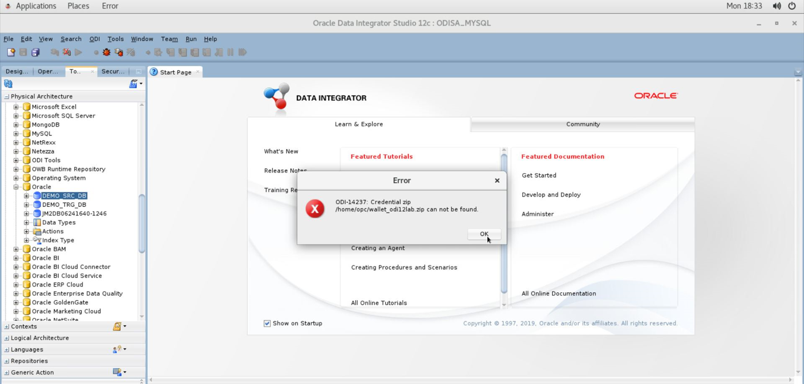  

You will see connections for all available ADW databases. These could be used in a data integration project. For this exercise we will focus on the **DEMO\_SRC\_DB** and **DEMO\_TRG\_DB** which you have imported from the training master repository.

2. Open **DEMO\_SRC\_DB** and test connection. You will get an **ERROR** stating *wallet can not be found*. This occurs because the wallet file we are using is either stored in a different location to that expected or the wallet file is not yet downloaded.

3. Click **OK** to close the error window

4. Click **Discover ADB** and select your ADW created earlier

  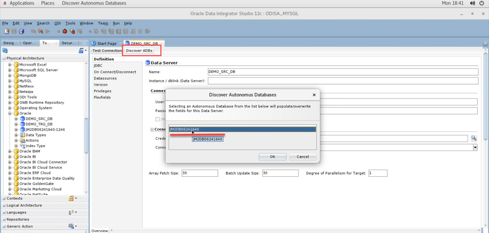

Click **OK** and associate your data server to the correct wallet file for connection

5. Enter the connection details for the ADW database you created:
  * User - **ADMIN**
  * Password - what you entered when creating the Autonomous database
  * Credentials - Downloaded by the *Discover ADB* action
  * Select the **low** service - **yourDBname\_low**

  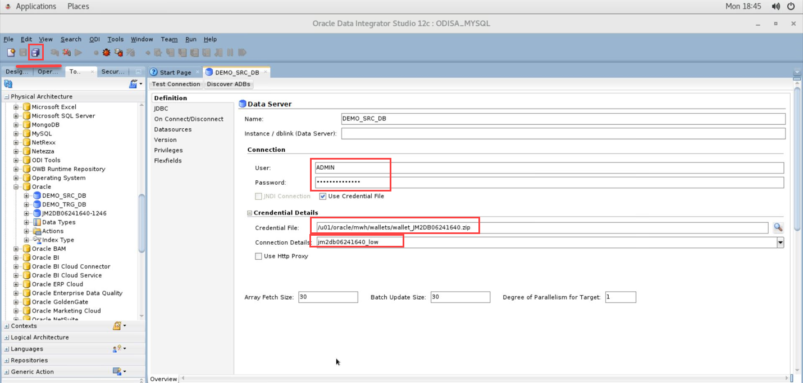

and then select **Save**

6. Test the connection

  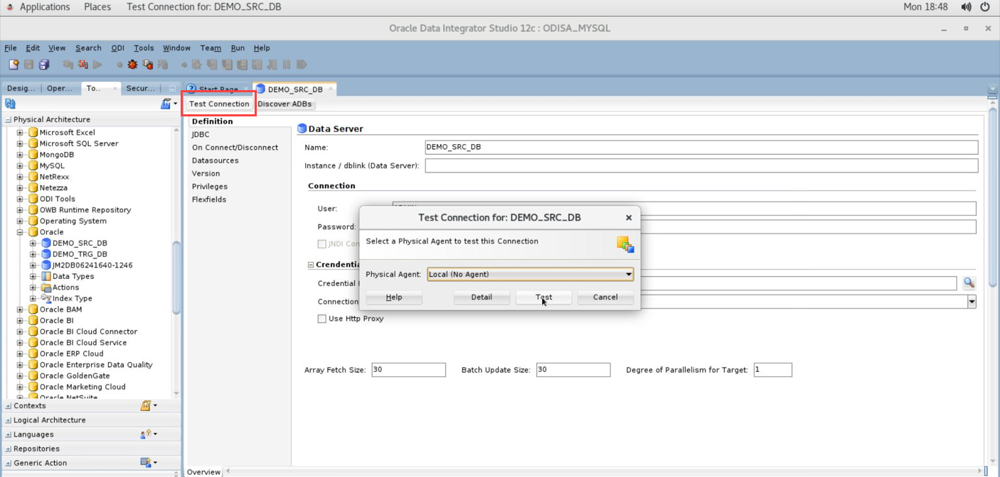

7. Repeat Step 5 and Step 6 for the database **DEMO\_TRG\_DB**

Use the same connection parameters as used in Step 5. These are defined as two different data servers but point to the same DB schema for simplicity.

## Task 4: Import the work Repository

1. Open the **Designer** tab and select **Import**

  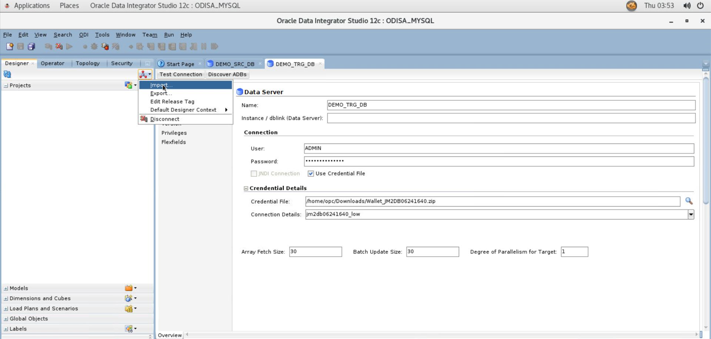

2. Select **Import the Work Repository**
  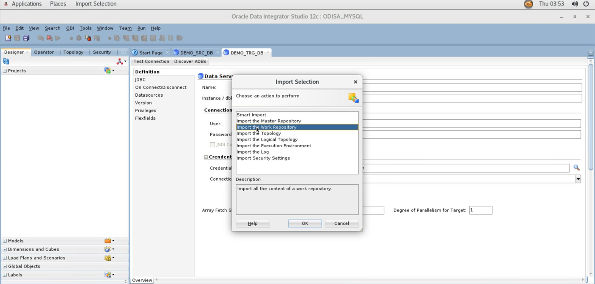

3. Select the radio button *import from a zip file* and then enter the path to the **ODI12c\_training\_work\_repo.zip** file (/home/oracle/Downloads/ODI12c\_training\_work\_repo.zip if you followed the suggestions)

    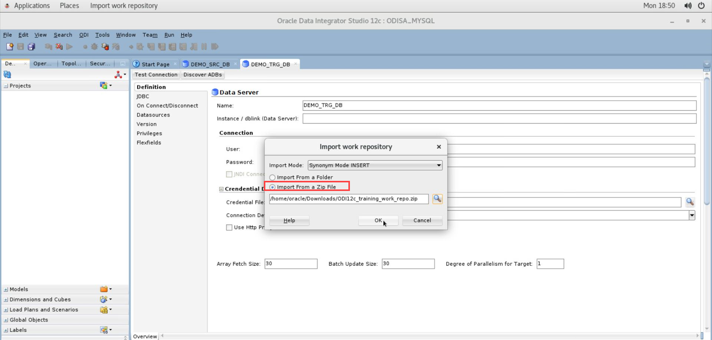  

The import will take approximately 5 minutes  

4. Click **Close** when import completes successfully

    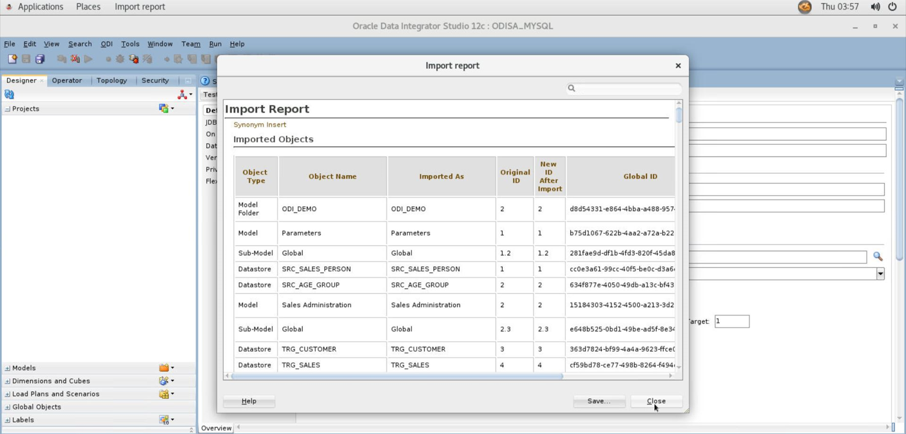

## Task 5: Test the environment

1. Expand **Model** and right-click on **SRC\_AGE\_GROUP** and select **View Data**

    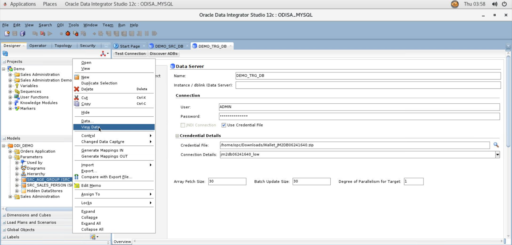   

2. If you see data your environment is ready to use

    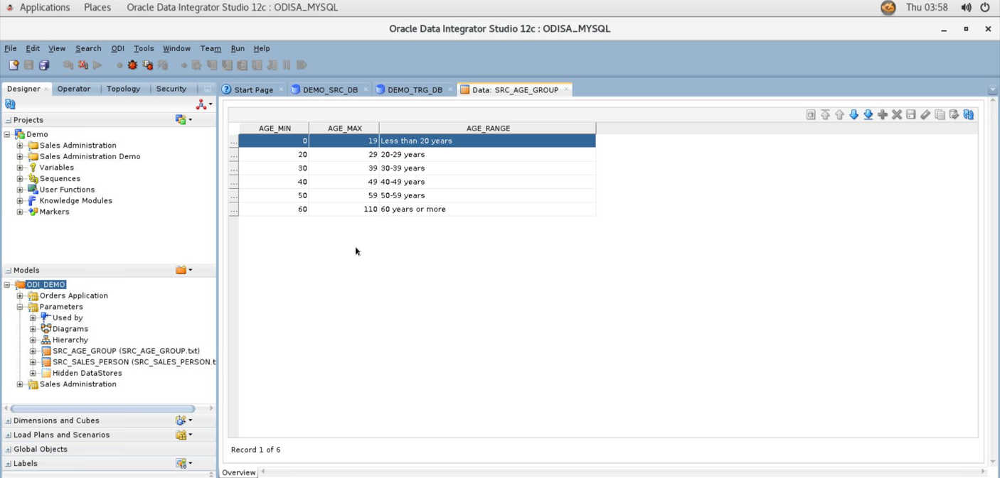      

Congratulations!  Now you have the environment to run the ODI labs.   

## Acknowledgements

- **Author** - Jayant Mahto, July 2020
- **Last Updated By/Date** - Kamryn Vinson, September 2020

