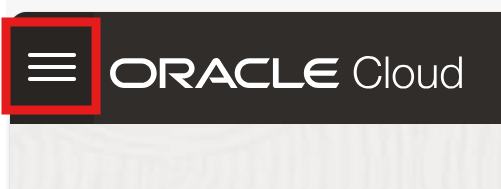
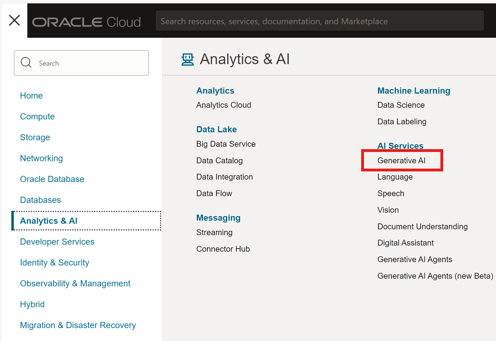
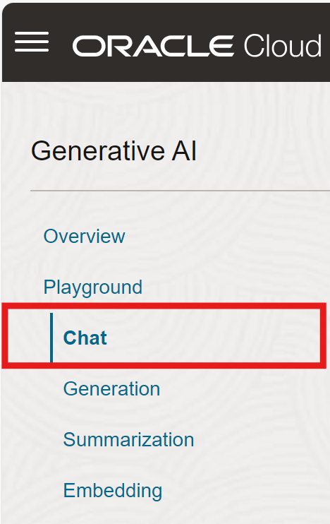
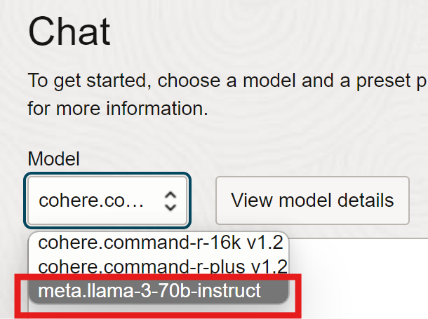
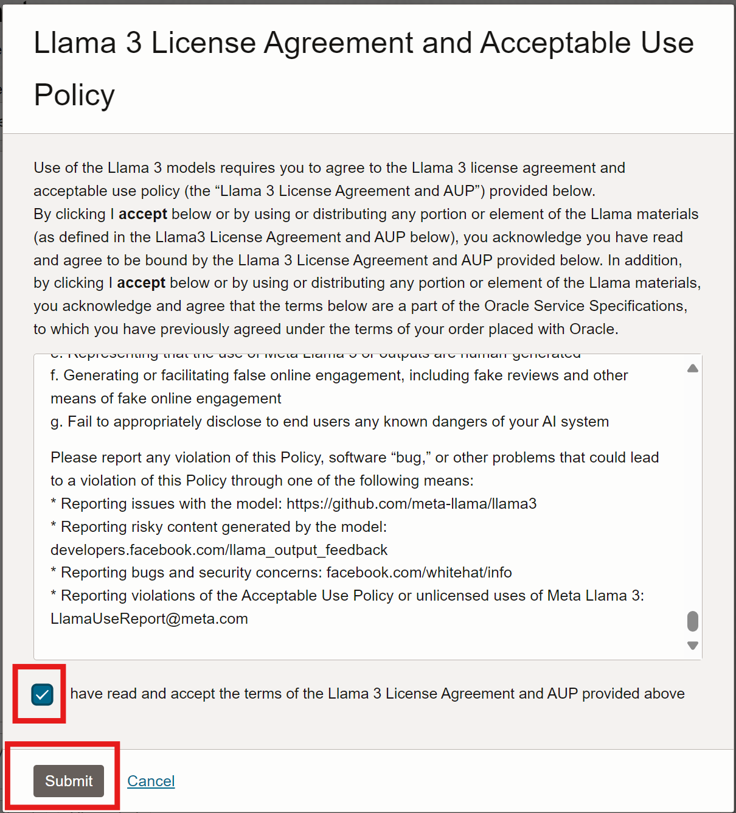
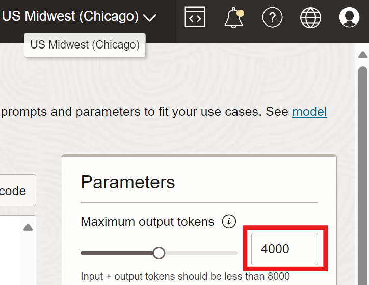

# Setup

## Introduction

In this lab we are going to take the actions needed to access the Chat capabilities of several large language models. 

Estimated Time: 20 minutes

### Objectives

In this lab, you will:

* Make sure that our tenancy is subscribed to the Chicago region.
* Navigate to the chat interface.

### Prerequisites

This lab assumes you have:

* An Oracle Cloud account

## Task 1: Ensure Chicago region subscription

The OCI Generative AI Agents service operates in multiple but not all regions in the world.  To ensure access to the appropriate large language models, ensure your tenancy is subscribed to the Chicago region.

1. On the top right, click the Regions drop down menu.

  

1. Review the list of regions your tenancy is subscribed in. If you find the **US Midwest (Chicago)** region in the list, please skip to the next task.

1. Click the Manage Regions link at the bottom of the list.

1. In the **Infrastructure Regions** list, locate the **US Midwest (Chicago)** region and click the subscribe button to it's right.

  > **Note:** When you subscribe to a region, you cannot unsubscribe from it.

  

1. Click the **Subscribe** button at the bottom of the **Subscribe to New Region** dialog.

  

The operation might take a few minutes to complete. When complete, the new region will appear on the **US Midwest (Chicago)** will appear in the **Regions** drop down menu on the main screen.

## Task 2: Navigate to the Chat interface

In the navigation bar

First, we are going to create a dynamic group which will allow us to grant access to the OCI Generative AI Agent service to the dataset uploaded to Object Storage.

1. In the navigation bar of the Console, select the **US Midwest(Chicago)** region.
  

1. Open the navigation menu.

1. Click **Analytics & AI**. Under AI Services, click **Generative AI**.

1. Click **Chat** from the Generative AI menu.

1. Under Model, select the **meta.llama-3-70b-instruct** model.

1. Click the checkbox indicating you have read the agreement and then click **Submit** to accept.

1. In **Parameters**, adjust the Maximum output tokens to 5000.  This will help ensure the model can generate a response of sufficient length.

## Learn More

* [Region subscription](https://docs.oracle.com/en-us/iaas/Content/Identity/Tasks/managingregions.htm#ariaid-title7)

## Acknowledgements

* **Author** - David Miller, Senior Principal Product Manager, Yanir Shahak, Senior Principal Software Engineer
