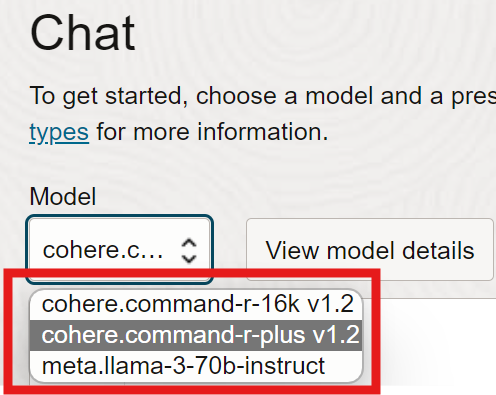

# Perform the mapping

## Introduction

This lab will walk you through the process of leveraging the generative AI model to perform mapping of radiology protocol names to a standardized lexicon.

Estimated Time: 25 minutes

### Objectives

In this lab, you will:

* Create the necessary prompt that includes instructions for the model, the lexicon terms, and term to be mapped to the lexicon.
* Receive and evaluate a response from the model.
* Provide your own variant to be mapped or evaluated.
* Further test the model using variants that are in another language.
* Explore the performance of other models.

### Prerequisites

This lab assumes you have:

* An Oracle Cloud account
* All previous labs successfully completed

## Task 1: Perform your first mapping

1. Copy and paste the following prompt into the chat message window, then press **Submit** .  Notice the components of the prompt we are providing:  instructions, standard data terms, and terms to be mapped.
    >**//INSTRUCTIONS//**
    >
    >For these radiology procedure names, Return a table of row #,STUDY_DESCRIPTION, best semantically matching LONG_COMMON_NAME (blank if no match), and CONFIDENCE (low, medium, high) of the match, CODE, RAND_ID,  whether RAND_ID equals CODE.  Also give the # of processed STUDY_DESCRIPTIONs and # of LONG_COMMON_NAMEs, and # of matches.
    >
    >**//LEXICON//**
    >
    >"CODE","LONG_COMMON_NAME","13","CT cervical and thoracic spine with IV contrast","30","CT cystography with bladder contrast","44","CT thoracic spine with IV contrast","12","CT cervical and thoracic spine without IV contrast","43","CT thoracic spine without IV contrast","49","CT low dose lung cancer screening without IV contrast","41","CT whole body","4","CT chest and abdomen and pelvis without IV contrast","1","CT abdomen and pelvis with IV contrast","34","CT maxillofacial without IV contrast","42","CT cardiac for calcium scoring","10","CT cervical spine without IV contrast","3","CT abdomen without and with contrast","19","CTA head and neck with IV contrast","37","CT virtual bronchoscopy","18","CT lumbosacral spine without and with IV contrast.","24","CT colonography","16","CT lumbar spine with IV contrast","9","CT chest without IV contrast","32","CT sacrum without IV contrast","21","CTA head with IV contrast","28","CT paransal sinuses with IV contrast","11","CT cervical spine with IV contrast","35","CT upper extremity with IV contrast","22","CTA lower extremity with IV contrast","23","CT abdomen with IV contrast multiphase","6","CT head","39","CTA renal arteries with IV contrast","15","CT lumbar spine without and with IV contrast","8","CT chest with IV contrast","46","CT pelvis with IV contrast","14","CT lumbar spine without IV contrast","17","CT lumbosacral spine with IV contrast","25","CT high resolution chest without IV contrast","48","CT wrist without IV contrast","40","CTA abdominal aorta","50","CT kidneys ureter bladder without IV contrast","45","CT pelvis without IV contrast","20","CTA coronary arteries with IV contrast","5","CT chest and abdomen and pelvis with IV contrast","33","CT maxillofacial with IV contrast","26","CT orbits without IV contrast","47","CT soft tissue neck without IV contrast","7","CT head with IV contrast","29","CT paransal sinuses without IV contrast","31","CT sacrum with IV contrast","2","CT abdomen without IV contrast","38","CTA brain with IV contrast","36","CT upper extremity without IV contrast","27","CT orbits without and with IV contrast"
    >
    >**//STUDIES TO MAP//**
    >
    >"RAND_ID","STUDY_DESCRIPTION_1","20","CTA Coronaries w/ IV contrast","5","CT Thorax Abd Pelvis w/ IV contrast","34","CT Maxfac wo IV contrast","23","CT Abd w/ IV contrast multiphase","25","CT HR Chest wo contrast","11","CT C-spine w/ IV contrast","12","CT C/T-spine wo contrast","16","CT L-spine w/ IV contrast","30","CT Cystogram w/ bladder contrast","14","CT L-spine wo contrast","19","CTA Head/Neck w/ IV contrast","36","CT left arm w/o","10","CT C-spine wo contrast","18","CT LS-spine w/wo IV contrast","21","CTA Head w/ IV contrast","43","Thoracic Spine CT -C","45","Pelvis CT -C","8","CT Thorax w/ contrast","48","Wrist CT -C","32","CT Sacrum wo IV contrast","39","Renal CTA +C","27","CT Orbits w/wo IV contrast","2","CT Abd w/o contrast","26","CT Orbits wo contrast","35","CT right arm w/con","22","CTA LE w/ IV contrast","33","CT Maxfac w/ IV contrast","49","Low Dose Lung CT -C","41","Total Body CT","7","CT Head w/ IV contrast","37","Virtual Bronch","31","CT Sacrum w/ IV contrast","6","CT Head wo contrast","1","CT Abd/Pelvis w/ contrast","47","Neck CT -C","15","CT L-spine w/wo IV contrast","4","CT Thorax/Abd/Pelvis wo contrast","50","KUB CT -C","46","Pelvis CT +C","29","CT Sinuses wo IV contrast","24","CT Colongraphy","9","CT Thorax wo contrast","40","Abd Aorta CTA","13","CT C/T-spine w/ IV contrast","28","CT Sinuses w/ IV contrast","38","Brain CTA +C","42","Cardiac CT Calcium Score","3","CT Abd w/wo contrast","44","Thoracic Spine CT +C","17","CT LS-spine w/ IV contrast"

## Task 2: Analyze the results

1. Verify from response of the model that 50 STUDY_DESCRIPTIONS were processed.
1. Review the matches and see if the matches make sense.  RAND_ID and CODE must be equal for a successful match.
1. Identify if any STUDY_DESCRIPTIONS had medium or low confidence matches to a standard term.
1. Ask the model why a particular match was more difficult.  For example, in the message area enter "Why was CT left arm w/o more difficult to match?" and hit **Submit**.  Does the response seem reasonable?

## Task 3: Test the model further

1. Ask the model to match a new study description by entering into the Chat message area: "Map MRI of the brain - Alzheimers research".  Click on **Submit**.  Does the response seem reasonable?
1. Click on **Clear Chat** in the Chat area to restart the interaction with the model.  Any former prompt information we've provided will be removed.
1. Test the model on another set of radiology procedure names with different types of variants (mispellings, abbreviations, alternative anatomy names).  Copy the following prompt into the Chat message area and press **Submit**.  Then evaluate the response.
>**//INSTRUCTIONS//**
    >
    >For these radiology procedure names, Return a table of row #,STUDY_DESCRIPTION, best semantically matching LONG_COMMON_NAME (blank if no match), and CONFIDENCE (low, medium, high) of the match, CODE, RAND_ID,  whether RAND_ID equals CODE.  Also give the # of processed STUDY_DESCRIPTIONs and # of LONG_COMMON_NAMEs, and # of matches.
    >
    >**//LEXICON//**
    >
    >"CODE","LONG_COMMON_NAME","13","CT cervical and thoracic spine with IV contrast","30","CT cystography with bladder contrast","44","CT thoracic spine with IV contrast","12","CT cervical and thoracic spine without IV contrast","43","CT thoracic spine without IV contrast","49","CT low dose lung cancer screening without IV contrast","41","CT whole body","4","CT chest and abdomen and pelvis without IV contrast","1","CT abdomen and pelvis with IV contrast","34","CT maxillofacial without IV contrast","42","CT cardiac for calcium scoring","10","CT cervical spine without IV contrast","3","CT abdomen without and with contrast","19","CTA head and neck with IV contrast","37","CT virtual bronchoscopy","18","CT lumbosacral spine without and with IV contrast.","24","CT colonography","16","CT lumbar spine with IV contrast","9","CT chest without IV contrast","32","CT sacrum without IV contrast","21","CTA head with IV contrast","28","CT paransal sinuses with IV contrast","11","CT cervical spine with IV contrast","35","CT upper extremity with IV contrast","22","CTA lower extremity with IV contrast","23","CT abdomen with IV contrast multiphase","6","CT head","39","CTA renal arteries with IV contrast","15","CT lumbar spine without and with IV contrast","8","CT chest with IV contrast","46","CT pelvis with IV contrast","14","CT lumbar spine without IV contrast","17","CT lumbosacral spine with IV contrast","25","CT high resolution chest without IV contrast","48","CT wrist without IV contrast","40","CTA abdominal aorta","50","CT kidneys ureter bladder without IV contrast","45","CT pelvis without IV contrast","20","CTA coronary arteries with IV contrast","5","CT chest and abdomen and pelvis with IV contrast","33","CT maxillofacial with IV contrast","26","CT orbits without IV contrast","47","CT soft tissue neck without IV contrast","7","CT head with IV contrast","29","CT paransal sinuses without IV contrast","31","CT sacrum with IV contrast","2","CT abdomen without IV contrast","38","CTA brain with IV contrast","36","CT upper extremity without IV contrast","27","CT orbits without and with IV contrast"
    >
    >**//STUDIES TO MAP//**
    >
    >"RAND_ID",STUDY_DESCRIPTION_3","15","CT^LUMBA^SPINE^W/WO","8","CT Chest +C","1","CT AP +C","3","CT Abdomen -+con ***25Apr2023","48","Ct rist w/o IV contast","46","Ct pelvis wi IV contast","30","CT Cystogram +C","41","Ct hole body","37","Ct virtuel bronchoscopy","43","Ct thoracick spine w/o IV contast","47","Ct soft tissue nek w/o IV contast","19","CTA Head and Neck +C","39","Cta renel arteries wi IV contast","14","CT Lumbar Spine -C","33","CT Maxillofacial +C","36","CT upper arm -C","10","CT Cervical Spine -C","34","CT Maxillofacial -C","2","CT Abdomen -C","40","Cta abdominel aorta","38","Cta brian wi IV contast","42","Ct cardic for calciem scoring","9","CT Chest **Jul24","25","CT High Res Chest -C","7","CT Head +C","5","CT CAP +C","13","CT Cspine Tspine + con","50","Ct kidneys ureter blader w/o IV contast","44","Ct thoracick spine wi IV contast","11","CT Cervical Spine +c","17","CT LSspine +C","32","CT Sacrum -C","27","CT Orbits low dose","35","arm fracture +C","49","Ct lo dose lung cancer screning w/o IV contast","4","CT CAP w/o contrast","22","CTA Lower Extremity +C","28","CT^PARASINUS^W/","23","Liver multiphase","18","CT LSspine *Dr Lofland Preop","21","CTA Head +C","31","CT Sacrum +C","45","Ct pelvis w/o IV contast","26","Orbits -C","16","CT Lumbar Spine +C","12","CT Cspine/Tspine -c","24","CT Colon","29","CT^PARASINUS^W/O","6","CT Head ^","20","CTA Coronary Arteries +C"
1. Ensure the model is not *cheating* by using RAND_ID and CODE to link to the appropriate LONG_COMMON_NAME.  To do that we will not supply RAND_ID in the dataset.  First, click **Clear chat** in the Chat message window.  Then paste the following prompt, click **Submit** and evaluate the response.
    >**//INSTRUCTIONS//**
    >
    >For these radiology procedure names, Return a table of row #,STUDY_DESCRIPTION, best semantically matching LONG_COMMON_NAME (blank if no match), and CONFIDENCE (low, medium, high) of the match.  Also give the # of processed STUDY_DESCRIPTIONs and # of LONG_COMMON_NAMEs.
    >
    >**//LEXICON//**
    >
    >"CODE","LONG_COMMON_NAME","13","CT cervical and thoracic spine with IV contrast","30","CT cystography with bladder contrast","44","CT thoracic spine with IV contrast","12","CT cervical and thoracic spine without IV contrast","43","CT thoracic spine without IV contrast","49","CT low dose lung cancer screening without IV contrast","41","CT whole body","4","CT chest and abdomen and pelvis without IV contrast","1","CT abdomen and pelvis with IV contrast","34","CT maxillofacial without IV contrast","42","CT cardiac for calcium scoring","10","CT cervical spine without IV contrast","3","CT abdomen without and with contrast","19","CTA head and neck with IV contrast","37","CT virtual bronchoscopy","18","CT lumbosacral spine without and with IV contrast.","24","CT colonography","16","CT lumbar spine with IV contrast","9","CT chest without IV contrast","32","CT sacrum without IV contrast","21","CTA head with IV contrast","28","CT paransal sinuses with IV contrast","11","CT cervical spine with IV contrast","35","CT upper extremity with IV contrast","22","CTA lower extremity with IV contrast","23","CT abdomen with IV contrast multiphase","6","CT head","39","CTA renal arteries with IV contrast","15","CT lumbar spine without and with IV contrast","8","CT chest with IV contrast","46","CT pelvis with IV contrast","14","CT lumbar spine without IV contrast","17","CT lumbosacral spine with IV contrast","25","CT high resolution chest without IV contrast","48","CT wrist without IV contrast","40","CTA abdominal aorta","50","CT kidneys ureter bladder without IV contrast","45","CT pelvis without IV contrast","20","CTA coronary arteries with IV contrast","5","CT chest and abdomen and pelvis with IV contrast","33","CT maxillofacial with IV contrast","26","CT orbits without IV contrast","47","CT soft tissue neck without IV contrast","7","CT head with IV contrast","29","CT paransal sinuses without IV contrast","31","CT sacrum with IV contrast","2","CT abdomen without IV contrast","38","CTA brain with IV contrast","36","CT upper extremity without IV contrast","27","CT orbits without and with IV contrast"
    >
    >**//STUDIES TO MAP//**
    >
    >"STUDY_DESCRIPTION","Chest -C","CT Cerv Thoracic Spine w/o IV Contrast","CT Angio Abdominal Aorta","CT Cystogrphy w/","CT Cspine w/o IV Contrast","CT Heart Calcium","CT Chest/Abdomen/Pelvis with contrast","CT Lumbosacral Spine w & w/o contrast","CT Abdomen w & w/o IV Contrast","CT brain","CT Lumbosacral Spine with contrast","CT Angio Head w contrast","CT Neck Soft Tissue wo contrast","CT Lspine w/o IV Contrast","CT Carpal wo contrast","CT Pelvic w contrast","CT Eyes w & w/o contrast","CT left arm with contrast","CT Chest Abdomen Pelvis -C","CT Hi-Res Thorax w/o IV Contrast","CT Airway","CTA Head Neck with contrast","CT Lspine with contrast","CT Cervicl Thoracic Spine with contrast","CT rt arm","CT Cspine with contrast","CTA Cor Art with contrast","CT Sacral Spine w/o contrast","CT Abdomen wo IV Contrast","CT Facial Bones with contrast","CT Eyes w/o IV Contrast","CT Head to Toe","CT Kidneys Ureters Bladder wo contrast","CT Angio Kidneys w contrast","CT PNS with contrast","CT Brain with contrast","CT Abdomen with contrast multiphas","CTA Brain with contrast","CT Pelvic wo contrast","CT Lspine w & w/o contrast","CT Chest with IV Contrast","CT T-Spine wo contrast","CT Abdomen Pelvis with IV Contrast","CT Sacral Spine with contrast","CT Chest Low Dose wo contrast","CT T-Spine w contrast","CT PNS w/o contrast","CT Virtual Colonoscopy","CT Facial Bones w/o contrast","CTA Lower Ext with contrast"

1. To make things harder, we will use Spanish radiology names and test how successful the mapping is. Press **Clear chat** in the Chat message window. Then paste the following prompt into the Chat message and click **Submit**.  Evaluate the model's response.
    >**//INSTRUCTIONS//**
    >
    >For these radiology procedure names, Return a table of row #,STUDY_DESCRIPTION, best semantically matching LONG_COMMON_NAME (blank if no match), and CONFIDENCE (low, medium, high) of the match, CODE, RAND_ID,  whether RAND_ID equals CODE.  Also give the # of processed STUDY_DESCRIPTIONs and # of LONG_COMMON_NAMEs, and # of matches.
    >
    >**//LEXICON//**
    >
    >"CODE","LONG_COMMON_NAME","13","CT cervical and thoracic spine with IV contrast","30","CT cystography with bladder contrast","44","CT thoracic spine with IV contrast","12","CT cervical and thoracic spine without IV contrast","43","CT thoracic spine without IV contrast","49","CT low dose lung cancer screening without IV contrast","41","CT whole body","4","CT chest and abdomen and pelvis without IV contrast","1","CT abdomen and pelvis with IV contrast","34","CT maxillofacial without IV contrast","42","CT cardiac for calcium scoring","10","CT cervical spine without IV contrast","3","CT abdomen without and with contrast","19","CTA head and neck with IV contrast","37","CT virtual bronchoscopy","18","CT lumbosacral spine without and with IV contrast.","24","CT colonography","16","CT lumbar spine with IV contrast","9","CT chest without IV contrast","32","CT sacrum without IV contrast","21","CTA head with IV contrast","28","CT paransal sinuses with IV contrast","11","CT cervical spine with IV contrast","35","CT upper extremity with IV contrast","22","CTA lower extremity with IV contrast","23","CT abdomen with IV contrast multiphase","6","CT head","39","CTA renal arteries with IV contrast","15","CT lumbar spine without and with IV contrast","8","CT chest with IV contrast","46","CT pelvis with IV contrast","14","CT lumbar spine without IV contrast","17","CT lumbosacral spine with IV contrast","25","CT high resolution chest without IV contrast","48","CT wrist without IV contrast","40","CTA abdominal aorta","50","CT kidneys ureter bladder without IV contrast","45","CT pelvis without IV contrast","20","CTA coronary arteries with IV contrast","5","CT chest and abdomen and pelvis with IV contrast","33","CT maxillofacial with IV contrast","26","CT orbits without IV contrast","47","CT soft tissue neck without IV contrast","7","CT head with IV contrast","29","CT paransal sinuses without IV contrast","31","CT sacrum with IV contrast","2","CT abdomen without IV contrast","38","CTA brain with IV contrast","36","CT upper extremity without IV contrast","27","CT orbits without and with IV contrast"
    >
    >**//STUDIES TO MAP//**
    >
    >"RAND_ID",STUDY_DESCRIPTION_7","14","TC Columna Lumbar -C","13","TC Ccervical Ctoracica +C","37","Tac virtuel de bronquios","17","TC CLSacra +C","23","TC Abdomen +C multifase","24","TC Colon","46","Tac de pelvis c/c IV","28","TC Senos Paranasales +C","18","TC CLSacra *25Abr2024","27","TC Orbitas *dosis baja","5","TC TAP +C","32","TC Sacro -C","11","TC Columna Cervical +C","4","TC TAP s/c","42","Tac cardiaco para puntuacion de calcio","30","TC Cistograma +C","38","Angiotac cerebrel c contraste IV","3","TC Abdomen *25Abr2023","29","TC Senos Paranasales -C","31","TC Sacro +C","36","TC Extremidad Superior -C","7","TC Craneo +C","35","TC Extremidad Superior +C","19","Angio TC Cabeza y Cuello +C","12","TC Ccervical/Ctoracica -C","8","TC Torax +C","9","TC Torax ***25Abr2024","34","TC Maxilofacial -C","22","Angio TC Extremidad Inferior +C","44","Tac de columna toracica c/c IV","33","TC Maxilofacial +C","50","Tac de rinones, ureteres y vejiga s/c IV","21","Angio TC Cabeza +C","39","Angiotac de arterias renales c contraste IV","1","TC AP +C","16","TC Columna Lumbar +C","2","TC Abdomen -C","41","Tac de cuerpo completo","49","Tac de baja dosis para deteccion de cancer de pulmon s/c IV","10","TC Columna Cervical -C","45","Tac de pelvis s/c IV","6","TC Craneo ^","48","Tac de muneca s/c IV","26","TC Orbitas -C","20","Angio TC Arterias Coronarias +C","47","Tac de tejidos blandos del cuello s/c IV","40","Angiotac de aorta abdominel","15","TC^Columna^Lumbar s/c c/c","43","Tac de columna toracica s/c IV","25","TC Torax Alta Resolucion -C"

## Task 3: Evaluate an alternative model

1. To select a new model, choose the *cohere.command-r-plus v1.2* model in the **Model** dropdownlist in Chat.  
    
1. In **Parameters**, adjust the Maximum output tokens to 4000.  This will help ensure the model can generate a response of sufficient length.  The total context length (input + output tokens) is 16k tokens.
1. Copy the following prompt into the Chat message area and press **Submit**.  Then evaluate the response.  Notice speed, output formatting, and any performance differences.
    >**//INSTRUCTIONS//**
    >
    >For these radiology procedure names, Return a table of row #,STUDY_DESCRIPTION, best semantically matching LONG_COMMON_NAME (blank if no match), and CONFIDENCE (low, medium, high) of the match, CODE, RAND_ID,  whether RAND_ID equals CODE.  Also give the # of processed STUDY_DESCRIPTIONs and # of LONG_COMMON_NAMEs, and # of matches.
    >
    >**//LEXICON//**
    >
    >"CODE","LONG_COMMON_NAME","13","CT cervical and thoracic spine with IV contrast","30","CT cystography with bladder contrast","44","CT thoracic spine with IV contrast","12","CT cervical and thoracic spine without IV contrast","43","CT thoracic spine without IV contrast","49","CT low dose lung cancer screening without IV contrast","41","CT whole body","4","CT chest and abdomen and pelvis without IV contrast","1","CT abdomen and pelvis with IV contrast","34","CT maxillofacial without IV contrast","42","CT cardiac for calcium scoring","10","CT cervical spine without IV contrast","3","CT abdomen without and with contrast","19","CTA head and neck with IV contrast","37","CT virtual bronchoscopy","18","CT lumbosacral spine without and with IV contrast.","24","CT colonography","16","CT lumbar spine with IV contrast","9","CT chest without IV contrast","32","CT sacrum without IV contrast","21","CTA head with IV contrast","28","CT paransal sinuses with IV contrast","11","CT cervical spine with IV contrast","35","CT upper extremity with IV contrast","22","CTA lower extremity with IV contrast","23","CT abdomen with IV contrast multiphase","6","CT head","39","CTA renal arteries with IV contrast","15","CT lumbar spine without and with IV contrast","8","CT chest with IV contrast","46","CT pelvis with IV contrast","14","CT lumbar spine without IV contrast","17","CT lumbosacral spine with IV contrast","25","CT high resolution chest without IV contrast","48","CT wrist without IV contrast","40","CTA abdominal aorta","50","CT kidneys ureter bladder without IV contrast","45","CT pelvis without IV contrast","20","CTA coronary arteries with IV contrast","5","CT chest and abdomen and pelvis with IV contrast","33","CT maxillofacial with IV contrast","26","CT orbits without IV contrast","47","CT soft tissue neck without IV contrast","7","CT head with IV contrast","29","CT paransal sinuses without IV contrast","31","CT sacrum with IV contrast","2","CT abdomen without IV contrast","38","CTA brain with IV contrast","36","CT upper extremity without IV contrast","27","CT orbits without and with IV contrast"
    >
    >**//STUDIES TO MAP//**
    >
    >"RAND_ID",STUDY_DESCRIPTION_3","15","CT^LUMBA^SPINE^W/WO","8","CT Chest +C","1","CT AP +C","3","CT Abdomen -+con ***25Apr2023","48","Ct rist w/o IV contast","46","Ct pelvis wi IV contast","30","CT Cystogram +C","41","Ct hole body","37","Ct virtuel bronchoscopy","43","Ct thoracick spine w/o IV contast","47","Ct soft tissue nek w/o IV contast","19","CTA Head and Neck +C","39","Cta renel arteries wi IV contast","14","CT Lumbar Spine -C","33","CT Maxillofacial +C","36","CT upper arm -C","10","CT Cervical Spine -C","34","CT Maxillofacial -C","2","CT Abdomen -C","40","Cta abdominel aorta","38","Cta brian wi IV contast","42","Ct cardic for calciem scoring","9","CT Chest **Jul24","25","CT High Res Chest -C","7","CT Head +C","5","CT CAP +C","13","CT Cspine Tspine + con","50","Ct kidneys ureter blader w/o IV contast","44","Ct thoracick spine wi IV contast","11","CT Cervical Spine +c","17","CT LSspine +C","32","CT Sacrum -C","27","CT Orbits low dose","35","arm fracture +C","49","Ct lo dose lung cancer screning w/o IV contast","4","CT CAP w/o contrast","22","CTA Lower Extremity +C","28","CT^PARASINUS^W/","23","Liver multiphase","18","CT LSspine *Dr Lofland Preop","21","CTA Head +C","31","CT Sacrum +C","45","Ct pelvis w/o IV contast","26","Orbits -C","16","CT Lumbar Spine +C","12","CT Cspine/Tspine -c","24","CT Colon","29","CT^PARASINUS^W/O","6","CT Head ^","20","CTA Coronary Arteries +C"
## Acknowledgements

* **Author** - David Miller, Senior Principal Product Manager, Yanir Shahak, Senior Principal Software Engineer
